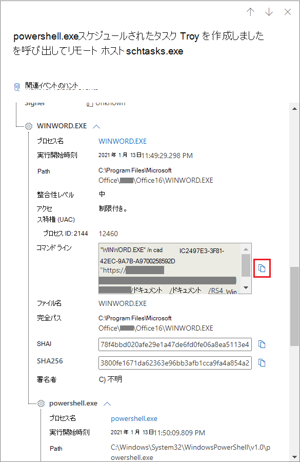
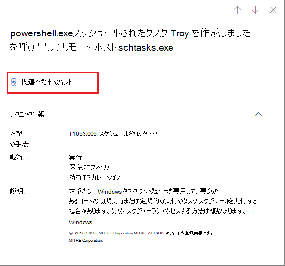
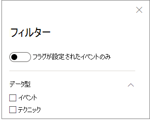

# デバイスタイムラインのテクニック

**適用対象:**
- [Microsoft Defender for Endpoint](https://go.microsoft.com/fwlink/p/?linkid=2154037)

特定のデバイスで発生したイベントを分析することで、調査に関するより多くの洞察を得られる可能性があります。 まず、[デバイス] リストから目的のデバイス [を選択します](machines-view-overview.md)。 デバイス ページで、[タイムライン] タブを **選択** して、デバイスで発生したイベントを表示できます。

## タイムラインのテクニックを理解する

> [!IMPORTANT]
> 一部の情報は、パブリック プレビューで事前リリースされた製品機能に関連します。これは、商用リリース前に大幅に変更される可能性があります。 Microsoft は、ここに記載された情報に関して、明示または黙示を問わず、いかなる保証も行いません。

Microsoft Defender for Endpoint では **、Techniques は** イベント タイムラインの追加データ型です。 技術は [、MITRE ATT](https://attack.mitre.org/) および CK の手法またはサブ&関連するアクティビティに関するより多くの洞察を提供します。

この機能は、分析者がデバイスで観察されたアクティビティを理解するのを支援することで、調査エクスペリエンスを簡素化します。 アナリストは、さらに調査を行う場合があります。

パブリック プレビューの場合、テクニックは既定で使用できます。デバイスのタイムラインを表示するときにイベントと共に表示されます。

テクニックは太字で強調表示され、左側に青いアイコンが表示されます。 対応する MITRE ATT&CK ID とテクニック名は、[追加情報] の下にタグとして表示されます。

検索オプションとエクスポート オプションは、[テクニック] でも使用できます。

## サイド ウィンドウを使用して調査する

[テクニック] を選択して、対応するサイド ウィンドウを開きます。 ここでは、関連する ATT や CK の手法、&説明など、追加情報と分析情報を確認できます。

特定の *攻撃手法を選択* して、関連する ATT&CK テクニック ページを開き、詳細を確認できます。

右側に青いアイコンが表示されている場合は、エンティティの詳細をコピーできます。 たとえば、関連ファイルの SHA1 をコピーするには、青いページ アイコンを選択します。

コマンド ラインでも同じ操作を実行できます。

## 関連イベントの調査

高度な [検索を使用して](advanced-hunting-overview.md) 、選択したテクニックに関連するイベントを検索するには、[関連イベントのハント **] を選択します**。 これにより、テクニックに関連するイベントを検索するクエリを含む高度な検索ページが表示されます。

> [!NOTE]
> [テクニック] **サイド** ウィンドウから [関連イベントのハント] ボタンを使用してクエリを実行すると、特定された手法に関連するイベントはすべて表示されますが、クエリ結果にはテクニック自体は含めされません。

## デバイスのタイムラインをカスタマイズする

デバイスタイムラインの右上で、タイムライン内のイベントとテクニックの数を制限する日付範囲を選択できます。

公開する列をカスタマイズできます。 データ型またはイベント グループ別にフラグが設定されたイベントをフィルター処理することもできます。

### 公開する列を選択する

[列の選択] ボタンを選択すると、タイムラインで公開する列 **を選択** できます。

そこから、含める情報セットを選択できます。

### フィルターを使用して、手法またはイベントのみを表示する

イベントまたは手法のみを表示するには、デバイスタイムラインから [ **フィルター** ] を選択し、表示するデータ型を選択します。

## 関連項目

- [デバイスの一覧を表示および整理する](machines-view-overview.md)
- [Microsoft Defender for Endpoint デバイスのタイムライン イベント フラグ](device-timeline-event-flag.md)
