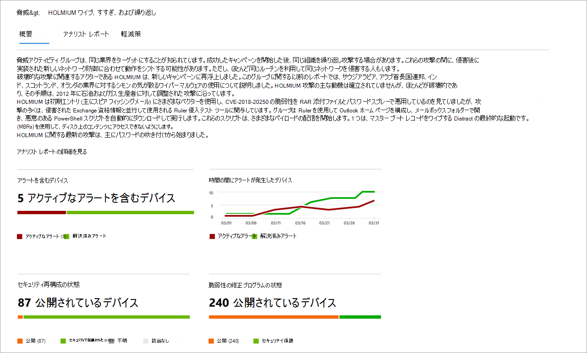

# 脅威分析による新たな脅威の追跡と対応

[!INCLUDE [Microsoft 365 Defender rebranding](../../includes/microsoft-defender.md)]

**適用対象:**
- [Microsoft Defender for Endpoint](https://go.microsoft.com/fwlink/?linkid=2154037)
- [Microsoft 365 Defender](https://go.microsoft.com/fwlink/?linkid=2118804)

> Microsoft Defender ATP を試してみたいですか? [無料試用版にサインアップしてください。](https://signup.microsoft.com/create-account/signup?products=7f379fee-c4f9-4278-b0a1-e4c8c2fcdf7e&ru=https://aka.ms/MDEp2OpenTrial?ocid=docs-wdatp-exposedapis-abovefoldlink)

より高度な敵対者と新しい脅威が頻繁かつ一般に出現する中で、以下を迅速に実行できる必要があります。

- 新しい脅威の影響を評価する
- 脅威に対する回復力または暴露を確認する
- 脅威を停止または格納するために実行できるアクションを特定する

脅威分析は、以下を含む、最も関連性の高い脅威をカバーする Microsoft の専門家のセキュリティ研究者からの一連のレポートです。

- アクティブな脅威アクターとそのキャンペーン
- 人気のある新しい攻撃手法
- 重大な脆弱性
- 一般的な攻撃対象領域
- 流行しているマルウェア

各レポートは、脅威の詳細な分析と、その脅威から防御する方法に関する広範なガイダンスを提供します。 また、ネットワークからのデータも組み込まれており、脅威がアクティブかどうか、適切な保護が適用されているかどうかを示します。

この短いビデオでは、脅威分析が最新の脅威の追跡と停止に役立つ方法について説明します。

> [!VIDEO https://www.microsoft.com/videoplayer/embed/RE4bw1f]

## 脅威分析ダッシュボードの表示

脅威分析ダッシュボードは、組織に最も関連性の高いレポートにアクセスする場合に役立ちます。 次のセクションの脅威の概要を示します。

- **最新の脅威**: 最近公開された脅威レポートと、アクティブなアラートと解決済みアラートを含むデバイスの数を一覧表示します。
- **影響の大きな脅威**: 組織に最も大きな影響を与えた脅威を一覧表示します。 このセクションでは、アクティブなアラートを持つデバイスの数によって脅威をランク付けします。
- **脅威の概要**: アクティブなアラートと解決済みアラートを含む脅威の数を表示することで、追跡された脅威の全体的な影響を示します。

ダッシュボードから脅威を選択して、その脅威のレポートを表示します。

## 脅威分析レポートの表示

各脅威分析レポートには、概要、**アナリスト** レポート、および軽減策の 3 つの **セクションで情報****が提供されます**。

### 概要: 脅威をすばやく理解し、影響を評価し、防御を確認する

[ **概要]** セクションには、詳細なアナリスト レポートのプレビューが表示されます。 また、組織に対する脅威の影響と、構成が正しく設定されていないデバイスや未パッチのデバイスによる露出を強調するグラフも提供されます。

 _概要セクションのイメージ_

#### 組織への影響を評価する

各レポートには、脅威の組織への影響に関する情報を提供するように設計されたグラフが含まれています。

- **通知付きデバイス**: 脅威の影響を受け、個別のデバイスの現在の数を示します。 デバイスは、その脅威に関連付けられているアラートが少なくとも 1 つある場合はアクティブに分類され、デバイス上の脅威に関連付けられているすべてのアラートが解決されている場合は解決されます。 
- **時間の間にアラートが発生した** デバイス: アクティブなアラートと解決済みアラートが設定されている個別のデバイスの数 **を** 示します。 解決済みアラートの数は、組織が脅威に関連付けられたアラートに応答する時間を示します。 理想的には、グラフは数日以内に解決されたアラートを表示する必要があります。

#### セキュリティの回復力と姿勢を確認する

各レポートには、組織が特定の脅威に対する回復力の概要を示すグラフが含まれています。

- **セキュリティ構成の状態**: 脅威の軽減に役立つ推奨セキュリティ設定を適用したデバイスの数を示します。 デバイスがすべての追跡 **設定を** 適用している _場合、_ デバイスは Secure と見なされます。
- **脆弱性の修正プログラムの状態**: 脅威によって悪用される脆弱性に対処するセキュリティ更新プログラムまたはパッチを適用したデバイスの数を示します。

### アナリスト レポート: Microsoft セキュリティ研究者から専門家の分析情報を取得する

[アナリスト レポート **] セクションに移動** して、詳細なエキスパートの書き込みを確認します。 ほとんどのレポートには、MITRE ATT&CK フレームワークにマップされた戦術や手法、推奨事項の網羅的なリスト、強力な脅威検出ガイダンスなど、攻撃チェーンの詳細な説明が記載されています。

[アナリスト レポートの詳細](threat-analytics-analyst-reports.md)

### 軽減策: 軽減策の一覧とデバイスの状態を確認する

[軽減 **策] セクション** で、脅威に対する組織の回復力を高めるのに役立つ具体的なアクション可能な推奨事項の一覧を確認します。 追跡される軽減策の一覧には、次の項目が含まれます。

- **セキュリティ更新** プログラム : 脆弱性に対するセキュリティ更新プログラムまたはパッチの展開
- **Microsoft Defender ウイルス対策設定**
  - セキュリティ インテリジェンスのバージョン
  - クラウドによる保護
  - 望ましくない可能性のあるアプリケーション (PUA) 保護
  - リアルタイム保護

このセクションの軽減情報には、脅威と脆弱性の管理からのデータが組み込まれており、レポート内のさまざまなリンクからの詳細なドリルダウン情報も提供します。

![脅威分析レポートの [軽減策] セクションのイメージ](images/ta-mitigations.png)

_脅威分析レポートの [軽減策] セクション_

## その他のレポートの詳細と制限事項

レポートを使用する場合は、次の注意が必要です。

- データの範囲は、役割ベースのアクセス制御 (RBAC) スコープに基づいて行います。 アクセスできるグループ内のデバイスの [状態が表示されます](machine-groups.md)。
- グラフには、追跡される軽減策だけが反映されます。 グラフに表示されない追加の軽減策については、レポートの概要を確認してください。
- 軽減策は、完全な復元を保証するものではありません。 提供される軽減策は、回復性を向上させるために必要な最善のアクションを反映しています。
- デバイスは、サービスにデータを送信していない場合は、"使用不可" としてカウントされます。
- ウイルス対策関連の統計情報は、ユーザー設定Microsoft Defender ウイルス対策されます。 サードパーティのウイルス対策ソリューションを使用するデバイスは、"公開" として表示されます。

## 関連項目

- [高度な検索で脅威を事前に検出する](advanced-hunting-overview.md)
- [[アナリスト レポート] セクションについて](threat-analytics-analyst-reports.md)
- [セキュリティの弱点と露出を評価して解決する](next-gen-threat-and-vuln-mgt.md)
