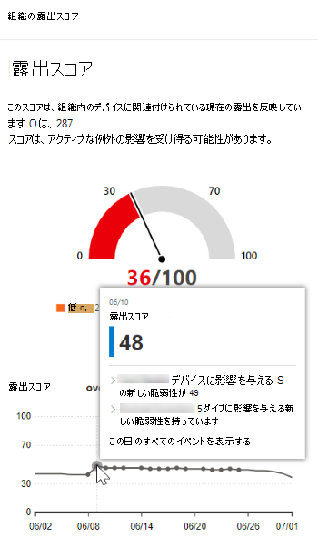
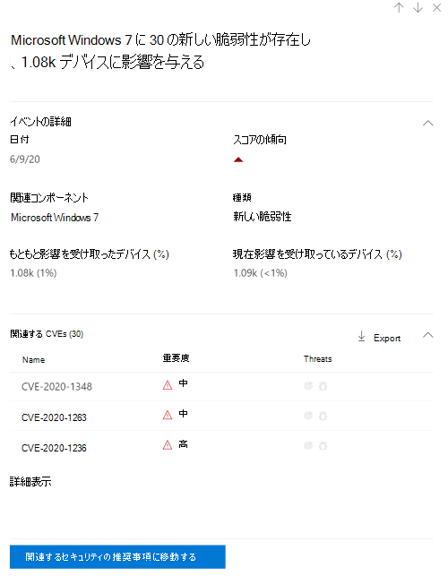

# イベントタイムライン - 脅威と脆弱性の管理

[!INCLUDE [Microsoft 365 Defender rebranding](../../includes/microsoft-defender.md)]

**適用対象:**
- [Microsoft Defender for Endpoint](https://go.microsoft.com/fwlink/?linkid=2154037)
- [Microsoft 365 Defender](https://go.microsoft.com/fwlink/?linkid=2118804)

> Microsoft Defender ATP を試してみたいですか? [無料試用版にサインアップしてください。](https://signup.microsoft.com/create-account/signup?products=7f379fee-c4f9-4278-b0a1-e4c8c2fcdf7e&ru=https://aka.ms/MDEp2OpenTrial?ocid=docs-wdatp-portaloverview-abovefoldlink)

イベントタイムラインは、新しい脆弱性や悪用を通じて組織にリスクがどのように導入されるのかを解釈するのに役立つリスクニュースフィードです。 組織のリスクに影響を与える可能性があるイベントを表示できます。 たとえば、導入された新しい脆弱性、悪用可能になった脆弱性、エクスプロイト キットに追加された悪用などがあります。

イベント タイムラインには、露出スコアとMicrosoft [Secure Score for Devices](tvm-microsoft-secure-score-devices.md)のストーリーも示され、大きな変更の原因を特定できます。 イベントは、デバイスまたはデバイスのスコアに影響を与える可能性があります。 優先順位付けされたセキュリティ推奨事項に基づいて修復する必要があるものに対処することで、露出 [を減らします](tvm-security-recommendation.md)。

> [!TIP]
> 新しい脆弱性イベントに関する電子メールを取得するには [、「Configure vulnerability email notifications in Microsoft Defender for Endpoint」を参照してください。](configure-vulnerability-email-notifications.md)

## [イベント タイムライン] ページに移動する

また、ダッシュボードから 3 つの[脅威と脆弱性の管理があります](tvm-dashboard-insights.md)。

- **組織の露出スコア カード**: [時間の間の露出スコア] グラフのイベント ドットにカーソルを合わせると、[この日のすべてのイベントを表示する] を選択します。 このイベントは、ソフトウェアの脆弱性を表します。
- **デバイスの Microsoft Secure Score**: [デバイスの時間のスコア] グラフのイベント ドットにカーソルを合わせると、[この日のすべてのイベントを表示する] を選択します。 イベントは、新しい構成評価を表します。
- **トップ イベント カード**: トップ イベント テーブルの下部にある [詳細を表示] を選択します。 カードには、過去 7 日間の 3 つの最も影響の大きなイベントが表示されます。 影響を受けるイベントには、イベントが多数のデバイスに影響を与える場合、または重大な脆弱性が含まれる場合があります。

### デバイスの露出スコアと Microsoft Secure Score のグラフ

このダッシュボード脅威と脆弱性の管理[露出スコア] グラフにカーソルを合わせると、デバイスに影響を与えたその日のソフトウェアの脆弱性の上位イベントが表示されます。 Microsoft Secure Score for Devices グラフにカーソルを合わせると、スコアに影響する新しいセキュリティ構成評価が表示されます。

デバイスやデバイスのスコアに影響するイベントがない場合は、何も表示されません。

 
 

### その日のイベントにドリルダウンする

[この **日のすべてのイベントを表示** する] を選択すると、その日のカスタム日付範囲を持つ [イベント タイムライン] ページに移動します。

[ **カスタム範囲] を** 選択して、日付範囲を別のカスタム範囲または事前設定された時間範囲に変更します。

## イベント タイムラインの概要

[イベント タイムライン] ページで、イベントに関連する必要なすべての情報を表示できます。

機能: 

- 列のカスタマイズ
- イベントの種類または影響を受け取ったデバイスの割合でフィルター処理する
- ページごとに 30、50、または 100 アイテムを表示する

ページの上部にある 2 つの大きな数字は、イベントではなく、新しい脆弱性と悪用可能な脆弱性の数を示しています。 一部のイベントには複数の脆弱性が存在する可能性があります。また、一部の脆弱性には複数のイベントが存在する可能性があります。

### 列

- **日付**: 月、日、年
- **イベント**: 影響を受けのあるイベント (コンポーネント、種類、影響を受け取ったデバイスの数を含む)
- **関連コンポーネント**: ソフトウェア
- **もともと影響を受け取** ったデバイス : このイベントが最初に発生した場合の、影響を受け取ったデバイスの数と割合です。 また、最初に影響を受け取ったデバイスの割合を、デバイスの総数からフィルター処理することもできます。
- **現在影響を受けるデバイス**: このイベントが現在影響しているデバイスの現在の数と割合。 [列のカスタマイズ] を選択すると、このフィールド **を検索できます**。
- **種類**: スコアに影響を与えるタイムスタンプ付きイベントを反映します。 フィルター処理できます。
  - エクスプロイト キットに追加されたエクスプロイト
  - エクスプロイトが検証されました
  - 新しいパブリックエクスプロイト
  - 新しい脆弱性
  - 新しい構成評価
- **スコアの傾向**: 露出スコアの傾向

### アイコン

イベントの横に次のアイコンが表示されます。

-  新しいパブリックエクスプロイト
-  新しい脆弱性が公開されました
-  エクスプロイト キットで見つかったエクスプロイト
-  エクスプロイトの検証

### 特定のイベントにドリルダウンする

イベントを選択すると、デバイスに影響を与える詳細と現在の CVEs の一覧が表示されます。 より多くの CVEs を表示するか、関連する推奨事項を表示できます。

[スコアの傾向] の下の矢印は、このイベントが組織の露出スコアを上げたり下げたりする可能性があるかどうかを判断するのに役立ちます。 露出スコアが高いほど、デバイスは悪用に対してより脆弱になります。

そこから、[関連する **セキュリティの推奨事項** に移動] を選択し、[セキュリティの推奨事項] ページで、新しいソフトウェアの脆弱性に関する推奨事項 [を表示します](tvm-security-recommendation.md)。 セキュリティ推奨事項の説明と脆弱性の詳細を確認した後、修復要求を送信し、修復ページで要求を [追跡できます](tvm-remediation.md)。

## ソフトウェア ページでイベントのタイムラインを表示する

ソフトウェア ページを開く場合は、イベント > を選択し、フライアウトの 「関連コンポーネント」というセクションでハイパーリンクされたソフトウェア名 (Visual Studio 2017 など) を選択します。 [ソフトウェア ページの詳細](tvm-software-inventory.md#software-pages)

特定のソフトウェアのすべての詳細が表示された完全なページが表示されます。 グラフの上にマウスを移動すると、その特定のソフトウェアのイベントのタイムラインが表示されます。

![[イベント タイムライン] グラフを含むソフトウェア ページ。](images/tvm-event-timeline-software2.png)

[イベント タイムライン] タブに移動して、そのソフトウェアに関連付けられたすべてのイベントを表示します。 セキュリティに関する推奨事項、検出された脆弱性、インストールされているデバイス、バージョンの配布も確認できます。

![[イベント タイムライン] タブを含むソフトウェア ページ。](images/tvm-event-timeline-software-pages.png)

## 関連項目

- [脅威と脆弱性の管理概要](next-gen-threat-and-vuln-mgt.md)
- [ダッシュボード](tvm-dashboard-insights.md)
- [暴露スコア](tvm-exposure-score.md)
- [セキュリティ上の推奨事項](tvm-security-recommendation.md)
- [脆弱性を修復する](tvm-remediation.md)
- [ソフトウェア インベントリ](tvm-software-inventory.md)
