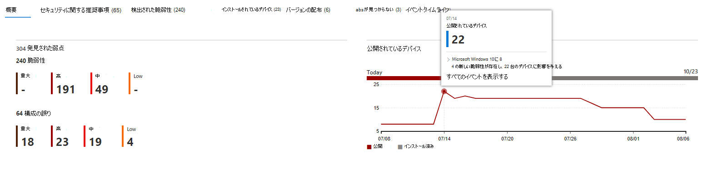

# イベントタイムライン - 脅威と脆弱性の管理Event timeline - threat and vulnerability management

[!INCLUDE [Microsoft 365 Defender rebranding](../../includes/microsoft-defender.md)]

**適用対象:****Applies to:**
- [Microsoft Defender for EndpointMicrosoft Defender for Endpoint](https://go.microsoft.com/fwlink/?linkid=2154037)
- [Microsoft 365 DefenderMicrosoft 365 Defender](https://go.microsoft.com/fwlink/?linkid=2118804)

>Microsoft Defender ATP を試してみたいですか?Want to experience Microsoft Defender for Endpoint? [無料試用版にサインアップしてください。Sign up for a free trial.](https://www.microsoft.com/microsoft-365/windows/microsoft-defender-atp?ocid=docs-wdatp-portaloverview-abovefoldlink)

イベントタイムラインは、新しい脆弱性や悪用を通じて組織にリスクがどのように導入されるのかを解釈するのに役立つリスクニュースフィードです。Event timeline is a risk news feed that helps you interpret how risk is introduced into the organization through new vulnerabilities or exploits. 組織のリスクに影響を与える可能性があるイベントを表示できます。You can view events that may impact your organization's risk. たとえば、導入された新しい脆弱性、悪用可能になった脆弱性、エクスプロイト キットに追加された悪用などがあります。For example, you can find new vulnerabilities that were introduced, vulnerabilities that became exploitable, exploit that was added to an exploit kit, and more.

イベント タイムラインには、露出スコアとMicrosoft [Secure Score for Devices](tvm-microsoft-secure-score-devices.md)のストーリーも示され、大きな変更の原因を特定できます。Event timeline also tells the story of your [exposure score](tvm-exposure-score.md) and [Microsoft Secure Score for Devices](tvm-microsoft-secure-score-devices.md) so you can determine the cause of large changes. イベントは、デバイスまたはデバイスのスコアに影響を与える可能性があります。Events can impact your devices or your score for devices. 優先順位付けされたセキュリティ推奨事項に基づいて修復する必要があるものに対処することで、露出 [を減らします](tvm-security-recommendation.md)。Reduce you exposure by addressing what needs to be remediated based on the prioritized [security recommendations](tvm-security-recommendation.md).

>[!TIP]
>新しい脆弱性イベントに関する電子メールを取得するには [、「Configure vulnerability email notifications in Microsoft Defender for Endpoint」を参照してください。](configure-vulnerability-email-notifications.md)To get emails about new vulnerability events, see [Configure vulnerability email notifications in Microsoft Defender for Endpoint](configure-vulnerability-email-notifications.md)

## [イベント タイムライン] ページに移動するNavigate to the Event timeline page

また、ダッシュボードから 3 つの[脅威と脆弱性の管理があります](tvm-dashboard-insights.md)。There are also three entry points from the [threat and vulnerability management dashboard](tvm-dashboard-insights.md):

- **組織の露出スコア カード**: [時間の間の露出スコア] グラフのイベント ドットにカーソルを合わせると、[この日のすべてのイベントを表示する] を選択します。**Organization exposure score card**: Hover over the event dots in the "Exposure Score over time" graph and select "See all events from this day." このイベントは、ソフトウェアの脆弱性を表します。The events represent software vulnerabilities.
- **デバイスの Microsoft Secure Score**: [デバイスの時間のスコア] グラフのイベント ドットにカーソルを合わせると、[この日のすべてのイベントを表示する] を選択します。**Microsoft Secure Score for Devices**: Hover over the event dots in the "Your score for devices over time" graph and select "See all events from this day." イベントは、新しい構成評価を表します。The events represent new configuration assessments.
- **トップ イベント カード**: トップ イベント テーブルの下部にある [詳細を表示] を選択します。**Top events card**: Select "Show more" at the bottom of the top events table. カードには、過去 7 日間の 3 つの最も影響の大きなイベントが表示されます。The card displays the three most impactful events in the last 7 days. 影響を受けるイベントには、イベントが多数のデバイスに影響を与える場合、または重大な脆弱性が含まれる場合があります。Impactful events can include if the event affects a large number of devices, or if it is a critical vulnerability.

### デバイスの露出スコアと Microsoft Secure Score のグラフExposure score and Microsoft Secure Score for Devices graphs

このダッシュボード脅威と脆弱性の管理[露出スコア] グラフにカーソルを合わせると、デバイスに影響を与えたその日のソフトウェアの脆弱性の上位イベントが表示されます。In the threat and vulnerability management dashboard, hover over the Exposure score graph to view top software vulnerability events from that day that impacted your devices. Microsoft Secure Score for Devices グラフにカーソルを合わせると、スコアに影響する新しいセキュリティ構成評価が表示されます。Hover over the Microsoft Secure Score for Devices graph to view new security configuration assessments that affect your score.

デバイスやデバイスのスコアに影響するイベントがない場合は、何も表示されません。If there are no events that affect your devices or your score for devices, then none will be shown.

 
  

### その日のイベントにドリルダウンするDrill down to events from that day

[この **日のすべてのイベントを表示** する] を選択すると、その日のカスタム日付範囲を持つ [イベント タイムライン] ページに移動します。Selecting **Show all events from this day** takes you to the Event timeline page with a custom date range for that day.

[ **カスタム範囲] を** 選択して、日付範囲を別のカスタム範囲または事前設定された時間範囲に変更します。Select **Custom range** to change the date range to another custom one, or a pre-set time range.

## イベント タイムラインの概要Event timeline overview

[イベント タイムライン] ページで、イベントに関連する必要なすべての情報を表示できます。On the Event timeline page, you can view the all the necessary info related to an event. 

機能: Features:

- 列のカスタマイズCustomize columns
- イベントの種類または影響を受け取ったデバイスの割合でフィルター処理するFilter by event type or percent of impacted devices
- ページごとに 30、50、または 100 アイテムを表示するView 30, 50, or 100 items per page

ページの上部にある 2 つの大きな数字は、イベントではなく、新しい脆弱性と悪用可能な脆弱性の数を示しています。The two large numbers at the top of the page show the number of new vulnerabilities and exploitable vulnerabilities, not events. 一部のイベントには複数の脆弱性が存在する可能性があります。また、一部の脆弱性には複数のイベントが存在する可能性があります。Some events can have multiple vulnerabilities, and some vulnerabilities can have multiple events.

### ColumnsColumns

- **日付**: 月、日、年**Date**: month, day, year
- **イベント**: 影響を受けのあるイベント (コンポーネント、種類、影響を受け取ったデバイスの数を含む)**Event**: impactful event, including component, type, and number of impacted devices
- **関連コンポーネント**: ソフトウェア**Related component**: software
- **もともと影響を受け取** ったデバイス : このイベントが最初に発生した場合の、影響を受け取ったデバイスの数と割合です。**Originally impacted devices**: the number, and percentage, of impacted devices when this event originally occurred. また、最初に影響を受け取ったデバイスの割合を、デバイスの総数からフィルター処理することもできます。You can also filter by the percent of originally impacted devices, out of your total number of devices.
- **現在影響を受けるデバイス**: このイベントが現在影響しているデバイスの現在の数と割合。**Currently impacted devices**: the current number, and percentage, of devices that this event currently impacts. [列のカスタマイズ] を選択すると、このフィールド **を検索できます**。You can find this field by selecting **Customize columns**.
- **種類**: スコアに影響を与えるタイムスタンプ付きイベントを反映します。**Types**: reflect time-stamped events that impact the score. フィルター処理できます。They can be filtered.
    - エクスプロイト キットに追加されたエクスプロイトExploit added to an exploit kit
    - エクスプロイトが検証されましたExploit was verified
    - 新しいパブリックエクスプロイトNew public exploit
    - 新しい脆弱性New vulnerability
    - 新しい構成評価New configuration assessment
- **スコアの傾向**: 露出スコアの傾向**Score trend**: exposure score trend

### アイコンIcons

イベントの横に次のアイコンが表示されます。The following icons show up next to events:

-  新しいパブリックエクスプロイトNew public exploit
-  新しい脆弱性が公開されましたNew vulnerability was published
-  エクスプロイト キットで見つかったエクスプロイトExploit found in exploit kit
-  エクスプロイトの検証Exploit verified

### 特定のイベントにドリルダウンするDrill down to a specific event

イベントを選択すると、デバイスに影響を与える詳細と現在の CVEs の一覧が表示されます。Once you select an event, a flyout will appear with a list of the details and current CVEs that affect your devices. より多くの CVEs を表示するか、関連する推奨事項を表示できます。You can show more CVEs or view the related recommendation.

[スコアの傾向] の下の矢印は、このイベントが組織の露出スコアを上げたり下げたりする可能性があるかどうかを判断するのに役立ちます。The arrow below "score trend" helps you determine whether this event potentially raised or lowered your organizational exposure score. 露出スコアが高いほど、デバイスは悪用に対してより脆弱になります。Higher exposure score means devices are more vulnerable to exploitation.

そこから、[関連する **セキュリティの推奨事項** に移動] を選択し、[セキュリティの推奨事項] ページで、新しいソフトウェアの脆弱性に関する推奨事項 [を表示します](tvm-security-recommendation.md)。From there, select **Go to related security recommendation** view the recommendation that addresses the new software vulnerability in the [security recommendations page](tvm-security-recommendation.md). セキュリティ推奨事項の説明と脆弱性の詳細を確認した後、修復要求を送信し、修復ページで要求を [追跡できます](tvm-remediation.md)。After reading the description and vulnerability details in the security recommendation, you can submit a remediation request, and track the request in the [remediation page](tvm-remediation.md).  

## ソフトウェア ページでイベントのタイムラインを表示するView Event timelines in software pages

ソフトウェア ページを開く場合は、イベント > を選択し、フライアウトの 「関連コンポーネント」というセクションでハイパーリンクされたソフトウェア名 (Visual Studio 2017 など) を選択します。To open a software page, select an event > select the hyperlinked software name (like Visual Studio 2017) in the section called "Related component" in the flyout. [ソフトウェア ページの詳細Learn more about software pages](tvm-software-inventory.md#software-pages)

特定のソフトウェアのすべての詳細が表示された完全なページが表示されます。A full page will appear with all the details of a specific software. グラフの上にマウスを移動すると、その特定のソフトウェアのイベントのタイムラインが表示されます。Mouse over the graph to see the timeline of events for that specific software.

[イベント タイムライン] タブに移動して、そのソフトウェアに関連付けられたすべてのイベントを表示します。Navigate to the event timeline tab to view all the events related to that software. セキュリティに関する推奨事項、検出された脆弱性、インストールされているデバイス、バージョンの配布も確認できます。You can also see security recommendations, discovered vulnerabilities, installed devices, and version distribution.

![[イベント タイムライン] タブを含むソフトウェア ページ](images/tvm-event-timeline-software-pages.png)

## 関連項目Related topics

- [脅威と脆弱性の管理概要Threat and vulnerability management overview](next-gen-threat-and-vuln-mgt.md)
- [ダッシュボードDashboard](tvm-dashboard-insights.md)
- [暴露スコアExposure score](tvm-exposure-score.md)
- [セキュリティ上の推奨事項Security recommendations](tvm-security-recommendation.md)
- [脆弱性を修復するRemediate vulnerabilities](tvm-remediation.md)
- [ソフトウェア インベントリSoftware inventory](tvm-software-inventory.md)

