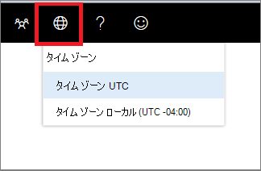

# Microsoft 365 Defenderの設定

[!INCLUDE [Microsoft 365 Defender rebranding](../../includes/microsoft-defender.md)]

**適用対象:**
- [Microsoft Defender for Endpoint](https://go.microsoft.com/fwlink/p/?linkid=2154037)

> Microsoft Defender ATP を試してみたいですか? [無料試用版にサインアップしてください。](https://signup.microsoft.com/create-account/signup?products=7f379fee-c4f9-4278-b0a1-e4c8c2fcdf7e&ru=https://aka.ms/MDEp2OpenTrial?ocid=docs-wdatp-settings-abovefoldlink)

[タイム ゾーン **] メニューの** ![ [タイム ゾーン設定] アイコン 1 を使用します。](images/atp-time-zone.png) をクリックして、タイム ゾーンを構成し、ライセンス情報を表示します。

## タイム ゾーンの設定

時間の側面は、知覚されたサイバー攻撃と実際のサイバー攻撃の評価と分析において重要です。

Cyberforensic の調査では、多くの場合、タイム スタンプを使用して一連のイベントをまとめます。 システムが正しいタイム ゾーン設定を反映することが重要です。

Microsoft Defender for Endpoint では、協定世界時 (UTC) または現地時間を表示できます。

現在のタイム ゾーン設定は、[エンドポイント用 Microsoft Defender] メニューに表示されます。 表示されるタイム ゾーンは、[タイム ゾーン] メニュー **で変更** できます。

.

### UTC タイム ゾーン

Microsoft Defender for Endpoint では、既定で UTC 時間が使用されます。

Microsoft Defender for Endpoint タイム ゾーンを UTC に設定すると、すべてのユーザーのシステム タイムスタンプ (アラート、イベントなど) が UTC で表示されます。 これにより、世界中の異なる場所で作業しているセキュリティ アナリストが、イベントの調査中に同じタイム スタンプを使用するのに役立ちます。

### ローカル タイム ゾーン

Microsoft Defender for Endpoint でローカル タイム ゾーン設定を使用することもできます。 すべてのアラートとイベントは、ローカル タイム ゾーンを使用して表示されます。

ローカル タイム ゾーンは、デバイスの地域設定から取られます。 地域設定を変更すると、Microsoft Defender for Endpoint タイム ゾーンも変更されます。 この設定を選択すると、Microsoft Defender for Endpoint に表示されるタイムスタンプは、すべての Microsoft Defender for Endpoint ユーザーの現地時間に合わせて配置されます。 さまざまなグローバルな場所にあるアナリストに、地域の設定に従って Microsoft Defender for Endpoint アラートが表示されます。

アナリストが 1 つの場所にある場合は、現地時間の使用を選択すると便利です。 この場合、ローカル ユーザーが不審なメール リンクをクリックした場合など、イベントを現地時間に関連付ける方が簡単な場合があります。

### タイム ゾーンの設定

Microsoft Defender for Endpoint タイム ゾーンは、既定では UTC に設定されています。 タイム ゾーンを設定すると、すべての Microsoft Defender for Endpoint ビューの時間も変更されます。

タイム ゾーンを設定するには、次の方法を実行します。

1. [タイム ゾーン **] メニューの** ![ [タイム ゾーン設定] アイコン 3 をクリックします ](images/atp-time-zone.png) 。
2. タイム ゾーン **UTC インジケーターを選択** します。
3. [ **タイム ゾーン UTC]** またはローカル タイム ゾーン (-7:00 など) を選択します。

### 地域の設定

Microsoft Defender for Endpoint に異なる日付形式を適用するには、MICROSOFT Defender (IE) と Internet Explorer (Edge) の地域Microsoft Edge使用します。 Google Chrome などの別のブラウザーを使用している場合は、必要な手順に従って、そのブラウザーの時刻と日付の設定を変更します。 

#### Internet Explorer (IE) と Microsoft Edge

IE とMicrosoft Edgeコントロール パネルの[時計、言語、地域] オプションで構成された地域設定を使用します。 

#### 地域の形式に関する既知の問題

##### 日付と時刻の形式

時刻と日付の形式にはいくつかの既知の問題があります。 サポートされている形式以外の地域設定を構成すると、ポータルが設定を正しく反映しない場合があります。

次の日付と時刻の形式がサポートされています。

- 日付形式 MM/dd/yyyy
- 日付形式 dd/MM/yyyyy
- 時間形式 hh:mm:ss (12 時間形式)

現在、次の日付と時刻の形式はサポートされていません。

- 日付形式 yyyy-MM-dd
- 日付形式 dd-MMM-yyy
- 日付形式 dd/MM/yyy
- 日付形式 MM/dd/yy
- yy の日付形式。 yyyy のみを表示します。
- 時間形式 HH:mm:ss (24 時間形式)

##### 数値で使用される 10 進記号

使用される 10 進記号は、地域設定の Numbers形式設定でコンマが選択されている場合でも、常に **ドット** です。 たとえば、15,5K は 15.5K と表示されます。
