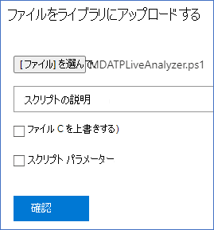

# <a name="collect-support-logs-in-microsoft-defender-for-endpoint-using-live-response"></a>ライブ応答を使用して Microsoft Defender for Endpoint のサポート ログを収集する


**適用対象:**
- [Microsoft Defender for Endpoint](https://go.microsoft.com/fwlink/p/?linkid=2154037)
- [Microsoft 365 Defender](https://go.microsoft.com/fwlink/?linkid=2118804)

> Defender for Endpoint を試す場合は、 [無料試用版にサインアップしてください。](https://signup.microsoft.com/create-account/signup?products=7f379fee-c4f9-4278-b0a1-e4c8c2fcdf7e&ru=https://aka.ms/MDEp2OpenTrial?ocid=docs-wdatp-pullalerts-abovefoldlink)


サポートに連絡する場合は、Microsoft Defender for Endpoint Client Analyzer ツールの出力パッケージを提供する必要があります。

このトピックでは、Live Response を使用してツールを実行する方法について説明します。

1. 適切なスクリプトをダウンロードする
   - Microsoft Defender for Endpoint クライアント センサー ログのみ:LiveAnalyzer.ps1 [ スクリプト](https://aka.ms/MDELiveAnalyzer)です。
      - 結果パッケージの概算サイズ: ~100Kb
   - Microsoft Defender for Endpoint クライアント センサーとウイルス対策ログ: [LiveAnalyzer+MDAV.ps1 スクリプト](https://aka.ms/MDELiveAnalyzerAV)です。
       - 結果パッケージの概算サイズ: ~10 Mb

2. 調査する [必要があるコンピューターで](live-response.md#initiate-a-live-response-session-on-a-device) ライブ応答セッションを開始します。

3. [ライブラリ **アップロードファイルを選択します**。

    

4. [ファイル **の選択] を選択します**。

    ![[ファイルの選択] ボタン 1 のイメージ。](images/choose-file.png)

5. [ファイル] という名前のダウンロードしたMDELiveAnalyzer.ps1を選択し、[確認] を **クリックします。**

   

6. LiveResponse セッション中は、次のコマンドを使用してアナライザーを実行し、結果ファイルを収集します。

    ```console
    Run MDELiveAnalyzer.ps1
    GetFile "C:\ProgramData\Microsoft\Windows Defender Advanced Threat Protection\Downloads\MDEClientAnalyzerResult.zip"
    ```

    [](images/analyzer-commands.png#lightbox)

> [!NOTE]
>
> - MDEClientAnalyzer の最新のプレビュー バージョンは、次の場所からダウンロードできます [https://aka.ms/Betamdeanalyzer](https://aka.ms/Betamdeanalyzer) 。
>
> - LiveAnalyzer スクリプトは、次のファイルからトラブルシューティング パッケージをダウンロードします https://mdatpclientanalyzer.blob.core.windows.net 。
>
>   コンピューターが上記の URL に到達できない場合は、LiveAnalyzer スクリプトを実行する前にMDEClientAnalyzerPreview.zipファイルをライブラリにアップロードします。
>
>   ```console
>   PutFile MDEClientAnalyzerPreview.zip -overwrite
>   Run MDELiveAnalyzer.ps1
>   GetFile "C:\ProgramData\Microsoft\Windows Defender Advanced Threat Protection\Downloads\MDEClientAnalyzerResult.zip"
>   ```
>
> - コンピューターが Microsoft Defender for Endpoint クラウド サービスと通信していない場合、または Microsoft Defender for Endpoint ポータルに予期した通り表示されない場合に、コンピューターでローカルにデータを収集する方法の詳細については、「Verify client [connectivity to Microsoft Defender for Endpoint](configure-proxy-internet.md#verify-client-connectivity-to-microsoft-defender-for-endpoint-service-urls)service URL」を参照してください。
> 
> - 「Live [response command examples」](live-response-command-examples.md)で説明したように、コマンドの最後に '&' 記号を使用して、ログをバックグラウンド アクションとして収集することができます。
>   ```console
>   Run MDELiveAnalyzer.ps1&
>   ```


## <a name="see-also"></a>関連項目
- [クライアント アナライザーの概要](overview-client-analyzer.md)
- [クライアント アナライザーのダウンロードと実行](download-client-analyzer.md)
- [Windows でのクライアント アナライザーの実行](run-analyzer-windows.md)
- [macOS または Linux でのクライアント アナライザーの実行](run-analyzer-macos-linux.md)
- [Windows で高度なトラブルシューティングを行うためのデータ収集](data-collection-analyzer.md)
- [アナライザー HTML レポートの理解](analyzer-report.md)

