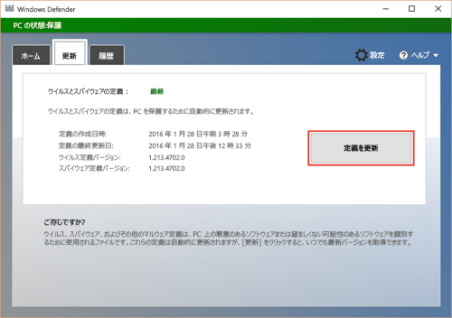

# Microsoft Defender ウイルス対策ソフトウェアの問題をトラブルシューティングするため、イベント ログとエラー コードをレビューする

[!INCLUDE [Microsoft 365 Defender rebranding](../../includes/microsoft-defender.md)]

**適用対象:**
- [Microsoft Defender for Endpoint Plan 2](https://go.microsoft.com/fwlink/p/?linkid=2154037)

問題が発生した場合Microsoft Defender ウイルス対策、このトピックの表を検索して、一致する問題と潜在的な解決策を見つける可能性があります。

テーブルの一覧:

- [Microsoft Defender ウイルス対策イベントの ID](#windows-defender-av-ids) (これらは、Windows 10、Windows 11、および Windows Server 2016)
- [Microsoft Defender ウイルス対策エラー コード](#error-codes)
- [内部Microsoft Defender ウイルス対策クライアント エラー コード (開発およびテスト中に Microsoft が使用)](#internal-error-codes)

> [!TIP]
> Microsoft Defender for Endpoint のデモ Web サイトにアクセス [して、demo.wd.microsoft.com](https://demo.wd.microsoft.com?ocid=cx-wddocs-testground) 機能が動作しているのを確認できます。
>
> - クラウドによる保護
> - 高速学習 (一目でブロックを含む)
> - 望ましくない可能性があるアプリケーションのブロック

## Microsoft Defender ウイルス対策イベントの ID

Microsoft Defender ウイルス対策ログにイベントのWINDOWSを記録します。

イベント ログを直接表示するか、サードパーティのセキュリティ情報とイベント管理 (SIEM) ツールがある場合は[、Microsoft Defender ウイルス対策](troubleshoot-microsoft-defender-antivirus.md#windows-defender-av-ids)クライアント イベント ID を使用してエンドポイントから特定のイベントやエラーを確認することもできます。

このセクションの表に、メイン イベント MICROSOFT DEFENDER ウイルス対策の一覧を示し、可能な場合は、エラーを修正または解決するための推奨される解決策を示します。

## イベントをMicrosoft Defender ウイルス対策するには

1. イベント **ビューアーを開きます**。
2. コンソール ツリーで、[アプリケーションとサービス ログ] **、[Microsoft]** の順に展開し、[Windows] を **Windows Defender。**
3. [操作] を **ダブルクリックします**。
4. 詳細ウィンドウで、個々のイベントの一覧を表示して、イベントを検索します。
5. イベントをクリックすると、[全般] タブと [詳細] タブの下の下部ウィンドウにイベントに関する特定の **詳細が****表示** されます。

<table>
<tr>
<th colspan="2" >イベント ID: 1000</th>
</tr>
<tr>
<td>
記号名:
</td>
<td>
<b>MALWAREPROTECTION_SCAN_STARTED</b>
</td>
</tr>
<tr>
<td>
メッセージ:
</td>
<td >
<b>マルウェア対策スキャンが開始されました。 </b>
</td>
</tr>
<tr>
<td >
説明:
</td>
<td >
<dl>
<dt>スキャン ID: &lt;関連するスキャンの ID &gt; 番号。</dt> 
<dt>スキャンの種類: &lt; スキャンの種類 &gt; (たとえば、<ul>
<li>ウイルス対策</li>
<li>スパイウェア対策</li>
<li>マルウェア対策</li>
</ul>
</dt>
<dt>スキャン パラメーター: &lt; スキャン パラメーター &gt; (たとえば、<ul>
<li>フル スキャン</li>
<li>クイック スキャン</li>
<li>顧客スキャン</li>
</ul>
</dt>
<dt>スキャン リソース: &lt;スキャンされたリソース (ファイル/ディレクトリ/BHO など)。 &gt; </dt>
<dt>ユーザー: &lt;ドメイン &gt; \& lt;ユーザー &gt; </dt>
</dl>
</td>
</tr>
<tr>
<th colspan="2">イベント ID: 1001</th>
</tr>
<tr><td>
記号名:
</td>
<td >
<b>MALWAREPROTECTION_SCAN_COMPLETED</b>
</td>
</tr>
<tr>
<td>
メッセージ:
</td>
<td >
<b>マルウェア対策スキャンが完了しました。</b>
</td>
</tr>
<tr>
<td>
説明:
</td>
<td >
<dl>
<dt>スキャン ID: &lt;関連するスキャンの ID &gt; 番号。</dt> 
<dt>スキャンの種類: &lt; スキャンの種類 &gt; (たとえば、<ul>
<li>ウイルス対策</li>
<li>スパイウェア対策</li>
<li>マルウェア対策</li>
</ul>
</dt>
<dt>スキャン パラメーター: &lt; スキャン パラメーター &gt; (たとえば、<ul>
<li>フル スキャン</li>
<li>クイック スキャン</li>
<li>顧客スキャン</li>
</ul>
</dt>
<dt>ユーザー: &lt;ドメイン &gt; \& lt;ユーザー &gt; </dt>
<dt>スキャン時間: &lt; スキャンの期間。 &gt; </dt>
</dl>
</td>
</tr>
<tr>
<th colspan="2">イベント ID: 1002</th>
</tr>
<tr><td>
記号名:
</td>
<td >
<b>MALWAREPROTECTION_SCAN_CANCELLED </b>
</td>
</tr>
<tr>
<td>
メッセージ:
</td>
<td >
<b>マルウェア対策スキャンは終了する前に停止しました。 </b>
</td>
</tr>
<tr>
<td>
説明:
</td>
<td >
<dl>
<dt>スキャン ID: &lt;関連するスキャンの ID &gt; 番号。</dt> 
<dt>スキャンの種類: &lt; スキャンの種類 &gt; (たとえば、<ul>
<li>ウイルス対策</li>
<li>スパイウェア対策</li>
<li>マルウェア対策</li>
</ul>
</dt>
<dt>スキャン パラメーター: &lt; スキャン パラメーター &gt; (たとえば、<ul>
<li>フル スキャン</li>
<li>クイック スキャン</li>
<li>顧客スキャン</li>
</ul>
</dt>
<dt>ユーザー: &lt;ドメイン &gt; &amp; lt;ユーザー &gt; </dt>
<dt>スキャン時間: &lt; スキャンの期間。 &gt; </dt>
</dl>
</td>
</tr>
<tr>
<th colspan="2">イベント ID: 1003</th>
</tr>
<tr><td>
記号名:
</td>
<td >
<b>MALWAREPROTECTION_SCAN_PAUSED </b>
</td>
</tr>
<tr>
<td>
メッセージ:
</td>
<td >
<b>マルウェア対策スキャンが一時停止されました。 </b>
</td>
</tr>
<tr>
<td>
説明:
</td>
<td >
<dl>
<dt>スキャン ID: &lt;関連するスキャンの ID &gt; 番号。</dt> 
<dt>スキャンの種類: &lt; スキャンの種類 &gt; (たとえば、<ul>
<li>ウイルス対策</li>
<li>スパイウェア対策</li>
<li>マルウェア対策</li>
</ul>
</dt>
<dt>スキャン パラメーター: &lt; スキャン パラメーター &gt; (たとえば、<ul>
<li>フル スキャン</li>
<li>クイック スキャン</li>
<li>顧客スキャン</li>
</ul>
</dt>
<dt>ユーザー: &lt; ドメイン &gt; \& lt;ユーザー&gt;</dt>
</dl>
</td>
</tr>
<tr>
<th colspan="2">イベント ID: 1004</th>
</tr>
<tr><td>
記号名:
</td>
<td >
<b>MALWAREPROTECTION_SCAN_RESUMED </b>
</td>
</tr>
<tr>
<td>
メッセージ:
</td>
<td >
<b>マルウェア対策スキャンが再開されました。 </b>
</td>
</tr>
<tr>
<td>
説明:
</td>
<td >
<dl>
<dt>スキャン ID: &lt;関連するスキャンの ID &gt; 番号。</dt> 
<dt>スキャンの種類: &lt; スキャンの種類 &gt; (たとえば、<ul>
<li>ウイルス対策</li>
<li>スパイウェア対策</li>
<li>マルウェア対策</li>
</ul>
</dt>
<dt>スキャン パラメーター: &lt; スキャン パラメーター &gt; (たとえば、<ul>
<li>フル スキャン</li>
<li>クイック スキャン</li>
<li>顧客スキャン</li>
</ul>
</dt>
<dt>ユーザー: &lt; ドメイン &gt; \& lt;ユーザー&gt;</dt>
</dl>
</td>
</tr>
<tr>
<th colspan="2">イベント ID: 1005</th>
</tr>
<tr><td>
記号名:
</td>
<td >
<b>MALWAREPROTECTION_SCAN_FAILED </b>
</td>
</tr>
<tr>
<td>
メッセージ:
</td>
<td >
<b>マルウェア対策スキャンに失敗しました。 </b>
</td>
</tr>
<tr>
<td>
説明:
</td>
<td >
<dl>
<dt>スキャン ID: &lt;関連するスキャンの ID &gt; 番号。</dt> 
<dt>スキャンの種類: &lt; スキャンの種類 &gt; (たとえば、<ul>
<li>ウイルス対策</li>
<li>スパイウェア対策</li>
<li>マルウェア対策</li>
</ul>
</dt>
<dt>スキャン パラメーター: &lt; スキャン パラメーター &gt; (たとえば、<ul>
<li>フル スキャン</li>
<li>クイック スキャン</li>
<li>顧客スキャン</li>
</ul>
</dt>
<dt>ユーザー: &lt;ドメイン &gt; \& lt;ユーザー &gt; </dt>
<dt>エラー コード: &lt; エラー コード &gt; 脅威の状態に関連付けられた結果コード。標準の HRESULT 値。</dt>
<dt>エラーの説明: &lt;エラーの &gt; 説明 エラーの説明。</dt>
</dl>
</td>
</tr>
<tr>
<td>
ユーザー アクション:
</td>
<td >
ウイルス対策クライアントでエラーが発生し、現在のスキャンが停止しました。 クライアント側の問題が原因でスキャンが失敗する可能性があります。 このイベント レコードには、スキャン ID、スキャンの種類 (Microsoft Defender ウイルス対策、スパイウェア対策、マルウェア対策)、スキャン パラメーター、スキャンを開始したユーザー、エラー コード、エラーの説明が含まれます。
このイベントをトラブルシューティングするには、次の手順を実行します。
<ol>
<li>スキャンを再度実行します。</li>
<li>同じ方法で失敗した場合は<a href="https://go.microsoft.com/fwlink/?LinkId=215163">、Microsoft サポート</a>サイトに移動し、[検索]<b></b>ボックスにエラー番号を入力してエラー コードを探します。</li>
<li><a href="https://go.microsoft.com/fwlink/?LinkId=215491">Microsoft テクニカル サポート</a>にお問い合わせください。
</li>
</ol>
</td>
</tr>
<tr>
<th colspan="2">イベント ID: 1006</th>
</tr>
<tr><td>
記号名:
</td>
<td >
<b>MALWAREPROTECTION_MALWARE_DETECTED </b>
</td>
</tr>
<tr>
<td>
メッセージ:
</td>
<td >
<b>マルウェア対策エンジンは、マルウェアや望ましくない可能性のある他のソフトウェアを検出しました。 </b>
</td>
</tr>
<tr>
<td>
説明:
</td>
<td >
詳細については、次のトピックを参照してください。
<dl>
<dt>名前: &lt;脅威名 &gt; </dt>
<dt>ID: &lt; 脅威 ID &gt; </dt> 
<dt> の重大度: &lt; 重大度 &gt; (たとえば、<ul>
<li>低い</li>
<li>中</li>
<li>高い</li>
<li>重大</li>
</ul>
</dt>
<dt>カテゴリ: &lt;カテゴリの &gt; 説明 (脅威やマルウェアの種類など)。</dt>
<dt>パス: &lt;ファイル &gt; パスの</dt> 
<dt> 検出元: &lt; 検出元 &gt; :次に例を示します。<ul>
<li>不明</li>
<li>ローカル コンピューター</li>
<li>ネットワーク共有</li>
<li>インターネット</li>
<li>受信トラフィック</li>
<li>送信トラフィック</li>
</ul>
</dt>
<dt>検出の種類: &lt; 次に示 &gt; す検出の種類を指定します。<ul>
<li>ヒューリスティック</li>
<li>Generic</li>
<li>コンクリート</li>
<li>動的署名</li>
</ul>
</dt>
<dt>検出ソース: &lt; 次に示す &gt; 検出ソースを指定します。<ul>
<li>ユーザー: 開始されたユーザー</li>
<li>システム: システムが開始されました</li>
<li>リアルタイム: リアルタイム コンポーネントの開始</li>
<li>IOAV: IE の高速添付ファイルのOutlookと設定が開始されました</li>
<li>NIS: ネットワーク検査システム</li>
<li>IEPROTECT: IE - IExtensionValidation;これにより、悪意のある Web ページ コントロールから保護されます。</li>
<li>早期起動マルウェア対策 (ELAM)。 これには、ブート シーケンスによって検出されたマルウェアが含まれます。</li>
<li>リモート構成証明</li>
</ul>マルウェア対策スキャン インターフェイス (AMSI)。 主にスクリプト (PowerShell、VBS) を保護するために使用しますが、サード パーティでも呼び出すことができます。
UAC </dt> 
<dt>状態: &lt; 状態 &gt; </dt>
<dt>ユーザー: &lt; ドメイン &gt; \& lt;ユーザー &gt; </dt>
<dt>プロセス名: &lt; PID &gt; </dt>署名バージョンの
<dt>プロセス: &lt; 定義バージョン &gt; </dt>エンジンのバージョン: マルウェア対策エンジン
<dt> &lt; バージョン &gt; </dt>
</dl>
</td>
</tr>
<tr>
<th colspan="2">イベント ID : 1007</th>
</tr>
<tr><td>
記号名:
</td>
<td >
<b>MALWAREPROTECTION_MALWARE_ACTION_TAKEN </b>
</td>
</tr>
<tr>
<td>
メッセージ:
</td>
<td >
<b>マルウェア対策プラットフォームは、マルウェアなどの望ましくない可能性のあるソフトウェアからシステムを保護するためのアクションを実行しました。 </b>
</td>
</tr>
<tr>
<td>
説明:
</td>
<td >
Microsoft Defender ウイルス対策、マルウェアなどの望ましくない可能性のあるソフトウェアからこのコンピューターを保護するための措置を取っています。 詳細については、次のトピックを参照してください。
<dl>
<dt>ユーザー: &lt;ドメイン &gt; \& lt;ユーザー &gt; </dt>
<dt>名: &lt; 脅威 &gt; 名</dt>
<dt>ID: &lt; Threat ID &gt; </dt> 
<dt> Severity: &lt; Severity (次 &gt; に示す場合)<ul>
<li>低い</li>
<li>中</li>
<li>高い</li>
<li>重大</li>
</ul>
</dt>
<dt>カテゴリ: &lt;カテゴリの &gt; 説明 (脅威やマルウェアの種類など)。</dt> 
<dt>Action: &lt; Action &gt; (アクション): たとえば、次の操作を実行します。<ul>
<li>クリーン: リソースがクリーンアップされました</li>
<li>検疫: リソースが検疫されました</li>
<li>削除: リソースが削除されました</li>
<li>許可: リソースの実行/存在が許可されました</li>
<li>ユーザー定義: ユーザーが指定したアクションのこのリストから通常 1 つであるユーザー定義のアクション</li>
<li>アクションなし: アクションなし</li>
<li>ブロック: リソースの実行がブロックされました</li>
</ul>
</dt>
<dt>状態: &lt;Status &gt; </dt>
<dt>Signature Version: &lt; Definition version &gt; </dt>Engine
<dt>Version: マルウェア対策エンジン &lt; バージョン &gt; </dt>
</dl>
</td>
</tr>
<tr>
<th colspan="2">イベント ID : 1008</th>
</tr>
<tr><td>
記号名:
</td>
<td >
<b>MALWAREPROTECTION_MALWARE_ACTION_FAILED</b>
</td>
</tr>
<tr>
<td>
メッセージ:
</td>
<td >
<b>マルウェア対策プラットフォームは、マルウェアなどの望ましくない可能性があるソフトウェアからシステムを保護するためのアクションを実行しようとしたが、アクションは失敗した。</b>
</td>
</tr>
<tr>
<td>
説明:
</td>
<td >
Microsoft Defender ウイルス対策その他の望ましくない可能性のあるソフトウェアに対してアクションを実行するときにエラーが発生しました。 詳細については、次のトピックを参照してください。
<dl>
<dt>ユーザー: &lt;ドメイン &gt; \& lt;ユーザー &gt; </dt>
<dt>名: &lt; 脅威 &gt; 名</dt>
<dt>ID: &lt; Threat ID &gt; </dt> 
<dt> Severity: &lt; Severity (次 &gt; に示す場合)<ul>
<li>低い</li>
<li>中</li>
<li>高い</li>
<li>重大</li>
</ul>
</dt>
<dt>カテゴリ: &lt;カテゴリの &gt; 説明 (脅威やマルウェアの種類など)。</dt>
<dt>パス: &lt;ファイル &gt; パス</dt> 
<dt> アクション: &lt; アクション &gt; (たとえば、次の操作)<ul>
<li>クリーン: リソースがクリーンアップされました</li>
<li>検疫: リソースが検疫されました</li>
<li>削除: リソースが削除されました</li>
<li>許可: リソースの実行/存在が許可されました</li>
<li>ユーザー定義: ユーザーが指定したアクションのこのリストから通常 1 つであるユーザー定義のアクション</li>
<li>アクションなし: アクションなし</li>
<li>ブロック: リソースの実行がブロックされました</li>
</ul>
</dt>
<dt>エラー コード: &lt;エラー コード &gt; 脅威の状態に関連付けられた結果コード。標準の HRESULT 値。</dt>
<dt>エラーの説明: &lt; エラー &gt; の説明 エラーの説明。</dt>
<dt>状態: &lt;Status &gt; </dt>
<dt>Signature Version: &lt; Definition version &gt; </dt>Engine
<dt>Version: マルウェア対策エンジン &lt; バージョン &gt; </dt>
</dl>
</td>
</tr>
<tr>
<th colspan="2">イベント ID : 1009</th>
</tr>
<tr><td>
記号名:
</td>
<td >
<b>MALWAREPROTECTION_QUARANTINE_RESTORE </b>
</td>
</tr>
<tr>
<td>
メッセージ:
</td>
<td >
<b>マルウェア対策プラットフォームは、検疫からアイテムを復元しました。 </b>
</td>
</tr>
<tr>
<td>
説明:
</td>
<td >
Microsoft Defender ウイルス対策アイテムを検疫から復元しました。 詳細については、次のトピックを参照してください。
<dl>
<dt>名前: &lt;脅威名 &gt; </dt>
<dt>ID: &lt; 脅威 ID &gt; </dt> 
<dt> の重大度: &lt; 重大度 &gt; (たとえば、<ul>
<li>低い</li>
<li>中</li>
<li>高い</li>
<li>重大</li>
</ul>
</dt>
<dt>カテゴリ: &lt;カテゴリの &gt; 説明 (脅威やマルウェアの種類など)。</dt>
<dt>パス: &lt;ファイル &gt; パス</dt>
<dt>User: &lt; Domain &gt; \& lt;ユーザー &gt; </dt>
<dt>署名のバージョン: &lt; &gt; 定義バージョン</dt>
<dt>エンジンのバージョン: &lt; マルウェア対策エンジン バージョン &gt; </dt>
</dl>
</td>
</tr>
<tr>
<th colspan="2">イベント ID : 1010</th>
</tr>
<tr><td>
記号名:
</td>
<td >
<b>MALWAREPROTECTION_QUARANTINE_RESTORE_FAILED </b>
</td>
</tr>
<tr>
<td>
メッセージ:
</td>
<td >
<b>マルウェア対策プラットフォームでは、検疫からアイテムを復元する必要があります。 </b>
</td>
</tr>
<tr>
<td>
説明:
</td>
<td >
Microsoft Defender ウイルス対策アイテムを検疫から復元しようとしてエラーが発生しました。 詳細については、次のトピックを参照してください。
<dl>
<dt>名前: &lt;脅威名 &gt; </dt>
<dt>ID: &lt; 脅威 ID &gt; </dt> 
<dt> の重大度: &lt; 重大度 &gt; (たとえば、<ul>
<li>低い</li>
<li>中</li>
<li>高い</li>
<li>重大</li>
</ul>
</dt>
<dt>カテゴリ: &lt;カテゴリの &gt; 説明 (脅威やマルウェアの種類など)。</dt>
<dt>パス: &lt;ファイル &gt; パス</dt>
<dt>User: &lt; Domain &gt; \& lt;ユーザー &gt; </dt>
<dt>エラー コード: &lt; エラー コード &gt; 脅威の状態に関連付けられた結果コード。標準の HRESULT 値。</dt>
<dt>エラーの説明: &lt; エラー &gt; の説明 エラーの説明。</dt>
<dt>署名バージョン: &lt;定義バージョン &gt; </dt>
<dt>エンジンのバージョン: &lt; マルウェア対策エンジン &gt; バージョン</dt>
</dl>
</td>
</tr>
<tr>
<th colspan="2">イベント ID: 1011</th>
</tr>
<tr><td>
記号名:
</td>
<td >
<b>MALWAREPROTECTION_QUARANTINE_DELETE</b>
</td>
</tr>
<tr>
<td>
メッセージ:
</td>
<td >
<b>マルウェア対策プラットフォームが検疫からアイテムを削除しました。 </b>
</td>
</tr>
<tr>
<td>
説明:
</td>
<td >
Microsoft Defender ウイルス対策アイテムを検疫から削除しました。 詳細については、次のトピックを参照してください。
<dl>
<dt>名前: &lt;脅威名 &gt; </dt>
<dt>ID: &lt; 脅威 ID &gt; </dt> 
<dt> の重大度: &lt; 重大度 &gt; (たとえば、<ul>
<li>低い</li>
<li>中</li>
<li>高い</li>
<li>重大</li>
</ul>
</dt>
<dt>カテゴリ: &lt;カテゴリの &gt; 説明 (脅威やマルウェアの種類など)。</dt>
<dt>パス: &lt;ファイル &gt; パス</dt>
<dt>User: &lt; Domain &gt; \& lt;ユーザー &gt; </dt>
<dt>署名のバージョン: &lt; &gt; 定義バージョン</dt>
<dt>エンジンのバージョン: &lt; マルウェア対策エンジン バージョン &gt; </dt>
</dl>
</td>
</tr>
<tr>
<th colspan="2">イベント ID : 1012</th>
</tr>
<tr><td>
記号名:
</td>
<td >
<b>MALWAREPROTECTION_QUARANTINE_DELETE_FAILED </b>
</td>
</tr>
<tr>
<td>
メッセージ:
</td>
<td >
<b>マルウェア対策プラットフォームは、検疫からアイテムを削除する必要があります。</b>
</td>
</tr>
<tr>
<td>
説明:
</td>
<td >
Microsoft Defender ウイルス対策アイテムを検疫から削除しようとしてエラーが発生しました。
詳細については、次のトピックを参照してください。
<dl>
<dt>名前: &lt;脅威名 &gt; </dt>
<dt>ID: &lt; 脅威 ID &gt; </dt> 
<dt> の重大度: &lt; 重大度 &gt; (たとえば、<ul>
<li>低い</li>
<li>中</li>
<li>高い</li>
<li>重大</li>
</ul>
</dt>
<dt>カテゴリ: &lt;カテゴリの &gt; 説明 (脅威やマルウェアの種類など)。</dt>
<dt>パス: &lt;ファイル &gt; パス</dt>
<dt>User: &lt; Domain &gt; \& lt;ユーザー &gt; </dt>
<dt>エラー コード: &lt; エラー コード &gt; 脅威の状態に関連付けられた結果コード。標準の HRESULT 値。</dt>
<dt>エラーの説明: &lt; エラー &gt; の説明 エラーの説明。</dt>
<dt>署名バージョン: &lt;定義バージョン &gt; </dt>
<dt>エンジンのバージョン: &lt; マルウェア対策エンジン &gt; バージョン</dt>
</dl>
</td>
</tr>
<tr>
<th colspan="2">イベント ID: 1013</th>
</tr>
<tr><td>
記号名:
</td>
<td >
<b>MALWAREPROTECTION_MALWARE_HISTORY_DELETE </b>
</td>
</tr>
<tr>
<td>
メッセージ:
</td>
<td >
<b>マルウェア対策プラットフォームは、マルウェアなどの望ましくない可能性のあるソフトウェアの履歴を削除しました。</b>
</td>
</tr>
<tr>
<td>
説明:
</td>
<td >
Microsoft Defender ウイルス対策、マルウェアなどの望ましくない可能性のあるソフトウェアの履歴が削除されました。
<dl>
<dt>時間: イベントが発生した時刻 (たとえば、履歴が削除された時刻)。このパラメーターは脅威イベントでは使用されないので、修復時間と感染時間の違いはありません。具体的には、アクション時間または検出時間と呼ぶ必要があります。</dt>
<dt>ユーザー: &lt;ドメイン &gt; \& lt;ユーザー &gt; </dt>
</dl>
</td>
</tr>
<tr>
<th colspan="2">イベント ID: 1014</th>
</tr>
<tr><td>
記号名:
</td>
<td >
<b>MALWAREPROTECTION_MALWARE_HISTORY_DELETE_FAILED </b>
</td>
</tr>
<tr>
<td>
メッセージ:
</td>
<td >
マルウェア対策プラットフォームでは、マルウェアなどの望ましくない可能性があるソフトウェアの履歴を削除する必要がありました。
</td>
</tr>
<tr>
<td>
説明:
</td>
<td >
Microsoft Defender ウイルス対策、マルウェアなどの望ましくない可能性のあるソフトウェアの履歴を削除しようとしてエラーが発生しました。
<dl>
<dt>時間: イベントが発生した時刻 (たとえば、履歴が削除された時刻)。このパラメーターは脅威イベントでは使用されないので、修復時間と感染時間の違いはありません。具体的には、アクション時間または検出時間と呼ぶ必要があります。</dt>
<dt>ユーザー: &lt;ドメイン &gt; \& lt;ユーザー &gt; </dt>
<dt>エラー コード: &lt; エラー コード &gt; 脅威の状態に関連付けられた結果コード。標準の HRESULT 値。</dt>
<dt>エラーの説明: &lt; エラー &gt; の説明 エラーの説明。</dt>
</dl>
</td>
</tr>
<tr>
<th colspan="2">イベント ID: 1015</th>
</tr>
<tr><td>
記号名:
</td>
<td >
<b>MALWAREPROTECTION_BEHAVIOR_DETECTED </b>
</td>
</tr>
<tr>
<td>
メッセージ:
</td>
<td >
<b>マルウェア対策プラットフォームが疑わしい動作を検出しました。</b>
</td>
</tr>
<tr>
<td>
説明:
</td>
<td >
Microsoft Defender ウイルス対策疑わしい動作が検出されました。 詳細については、次のトピックを参照してください。
<dl>
<dt>名前: &lt;脅威名 &gt; </dt>
<dt>ID: &lt; 脅威 ID &gt; </dt> 
<dt> の重大度: &lt; 重大度 &gt; (たとえば、<ul>
<li>低い</li>
<li>中</li>
<li>高い</li>
<li>重大</li>
</ul>
</dt>
<dt>カテゴリ: &lt;カテゴリの &gt; 説明 (脅威やマルウェアの種類など)。</dt>
<dt>パス: &lt;ファイル &gt; パスの</dt> 
<dt> 検出元: &lt; 検出元 &gt; :次に例を示します。
<ul>
<li>不明</li>
<li>ローカル コンピューター</li>
<li>ネットワーク共有</li>
<li>インターネット</li>
<li>受信トラフィック</li>
<li>送信トラフィック</li>
</ul>
</dt>
<dt>検出の種類: &lt; 次に示 &gt; す検出の種類を指定します。<ul>
<li>ヒューリスティック</li>
<li>Generic</li>
<li>コンクリート</li>
<li>動的署名</li>
</ul>
</dt>
<dt>検出ソース: &lt; 次に示す &gt; 検出ソースを指定します。<ul>
<li>ユーザー: 開始されたユーザー</li>
<li>システム: システムが開始されました</li>
<li>リアルタイム: リアルタイム コンポーネントの開始</li>
<li>IOAV: IE の高速添付ファイルのOutlookと設定が開始されました</li>
<li>NIS: ネットワーク検査システム</li>
<li>IEPROTECT: IE - IExtensionValidation;これにより、悪意のある Web ページ コントロールから保護されます。</li>
<li>早期起動マルウェア対策 (ELAM)。 これには、ブート シーケンスによって検出されたマルウェアが含まれます。</li>
<li>リモート構成証明</li>
</ul>マルウェア対策スキャン インターフェイス (AMSI)。 主にスクリプト (PowerShell、VBS) を保護するために使用しますが、サード パーティでも呼び出すことができます。
UAC </dt> 
<dt>状態: &lt; 状態 &gt; </dt>
<dt>ユーザー: &lt; ドメイン &gt; \& lt;ユーザー &gt; </dt>
<dt>プロセス名: &lt; PID &gt; </dt>署名
<dt>ID のプロセス: 重大度に一致する列挙。</dt>
<dt>署名バージョン: &lt;定義バージョン &gt; </dt>
<dt>エンジンのバージョン: &lt; マルウェア対策エンジン &gt; </dt>
<dt>バージョンの [フィ</dt>デリティ ラベル: ターゲット ファイル名
<dt>: ファイル名] &lt; &gt; ファイルの名前。</dt>
</dl>
</td>
</tr>
<tr>
<th colspan="2">イベント ID: 1116</th>
</tr>
<tr><td>
記号名:
</td>
<td >
<b>MALWAREPROTECTION_STATE_MALWARE_DETECTED</b>
</td>
</tr>
<tr>
<td>
メッセージ:
</td>
<td >
<b>マルウェア対策プラットフォームがマルウェアなどの望ましくない可能性のあるソフトウェアを検出しました。 </b>
</td>
</tr>
<tr>
<td>
説明:
</td>
<td >
Microsoft Defender ウイルス対策または他の望ましくない可能性のあるソフトウェアが検出されました。 詳細については、次のトピックを参照してください。
<dl>
<dt>名前: &lt;脅威名 &gt; </dt>
<dt>ID: &lt; 脅威 ID &gt; </dt> 
<dt> の重大度: &lt; 重大度 &gt; (たとえば、<ul>
<li>低い</li>
<li>中</li>
<li>高い</li>
<li>重大</li>
</ul>
</dt>
<dt>カテゴリ: &lt;カテゴリの &gt; 説明 (脅威やマルウェアの種類など)。</dt>
<dt>パス: &lt;ファイル &gt; パスの</dt> 
<dt> 検出元: &lt; 検出元 &gt; :次に例を示します。
<ul>
<li>不明</li>
<li>ローカル コンピューター</li>
<li>ネットワーク共有</li>
<li>インターネット</li>
<li>受信トラフィック</li>
<li>送信トラフィック</li>
</ul>
</dt>
<dt>検出の種類: &lt; 次に示 &gt; す検出の種類を指定します。<ul>
<li>ヒューリスティック</li>
<li>Generic</li>
<li>コンクリート</li>
<li>動的署名</li>
</ul>
</dt>
<dt>検出ソース: &lt; 次に示す &gt; 検出ソースを指定します。<ul>
<li>ユーザー: 開始されたユーザー</li>
<li>システム: システムが開始されました</li>
<li>リアルタイム: リアルタイム コンポーネントの開始</li>
<li>IOAV: IE の高速添付ファイルのOutlookと設定が開始されました</li>
<li>NIS: ネットワーク検査システム</li>
<li>IEPROTECT: IE - IExtensionValidation;これにより、悪意のある Web ページ コントロールから保護されます。</li>
<li>早期起動マルウェア対策 (ELAM)。 これには、ブート シーケンスによって検出されたマルウェアが含まれます。</li>
<li>リモート構成証明</li>
</ul>マルウェア対策スキャン インターフェイス (AMSI)。 主にスクリプト (PowerShell、VBS) を保護するために使用しますが、サード パーティでも呼び出すことができます。
UAC </dt> 
<dt>ユーザー: &lt; ドメイン &gt; \& lt;ユーザー &gt; </dt>
<dt>プロセス名: &lt; PID &gt; </dt>署名バージョンの
<dt>プロセス: &lt; 定義バージョン &gt; </dt>エンジンのバージョン: マルウェア対策エンジン
<dt> &lt; バージョン &gt; </dt>
</dl>
</td>
</tr>
<tr>
<td>
ユーザー アクション:
</td>
<td >
何もする必要はありません。 Microsoft Defender ウイルス対策、この脅威に対して定期的なアクションを中断して実行できます。 脅威を手動で削除する場合は、Microsoft Defender ウイルス対策をクリック<b>します</b>。
</td>
</tr>
<tr>
<th colspan="2">イベント ID: 1117</th>
</tr>
<tr><td>
記号名:
</td>
<td >
<b>MALWAREPROTECTION_STATE_MALWARE_ACTION_TAKEN </b>
</td>
</tr>
<tr>
<td>
メッセージ:
</td>
<td >
<b>マルウェア対策プラットフォームは、マルウェアなどの望ましくない可能性のあるソフトウェアからシステムを保護するためのアクションを実行しました。 </b>
</td>
</tr>
<tr>
<td>
説明:
</td>
<td >
Microsoft Defender ウイルス対策、マルウェアなどの望ましくない可能性のあるソフトウェアからこのコンピューターを保護するための措置を取っています。 詳細については、次のトピックを参照してください。
<dl>
<dt>名前: &lt;脅威名 &gt; </dt>
<dt>ID: &lt; 脅威 ID &gt; </dt> 
<dt> の重大度: &lt; 重大度 &gt; (たとえば、<ul>
<li>低い</li>
<li>中</li>
<li>高い</li>
<li>重大</li>
</ul>
</dt>
<dt>カテゴリ: &lt;カテゴリの &gt; 説明 (脅威やマルウェアの種類など)。</dt>
<dt>パス: &lt;ファイル &gt; パスの</dt> 
<dt> 検出元: &lt; 検出元 &gt; :次に例を示します。
<ul>
<li>不明</li>
<li>ローカル コンピューター</li>
<li>ネットワーク共有</li>
<li>インターネット</li>
<li>受信トラフィック</li>
<li>送信トラフィック</li>
</ul>
</dt>
<dt>検出の種類: &lt; 次に示 &gt; す検出の種類を指定します。<ul>
<li>ヒューリスティック</li>
<li>Generic</li>
<li>コンクリート</li>
<li>動的署名</li>
</ul>
</dt>
<dt>検出ソース: &lt; 次に示す &gt; 検出ソースを指定します。<ul>
<li>ユーザー: 開始されたユーザー</li>
<li>システム: システムが開始されました</li>
<li>リアルタイム: リアルタイム コンポーネントの開始</li>
<li>IOAV: IE の高速添付ファイルのOutlookと設定が開始されました</li>
<li>NIS: ネットワーク検査システム</li>
<li>IEPROTECT: IE - IExtensionValidation;これにより、悪意のある Web ページ コントロールから保護されます。</li>
<li>早期起動マルウェア対策 (ELAM)。 これには、ブート シーケンスによって検出されたマルウェアが含まれます。</li>
<li>リモート構成証明</li>
</ul>マルウェア対策スキャン インターフェイス (AMSI)。 主にスクリプト (PowerShell、VBS) を保護するために使用しますが、サード パーティでも呼び出すことができます。
UAC </dt> 
<dt>ユーザー: &lt; ドメイン &gt; \& lt;ユーザー &gt; </dt>
<dt>プロセス名: &lt; PID &gt; アクション</dt> 
<dt> のプロセス: &lt; アクション (例 &gt; :<ul>
<li>クリーン: リソースがクリーンアップされました</li>
<li>検疫: リソースが検疫されました</li>
<li>削除: リソースが削除されました</li>
<li>許可: リソースの実行/存在が許可されました</li>
<li>ユーザー定義: ユーザーが指定したアクションのこのリストから通常 1 つであるユーザー定義のアクション</li>
<li>アクションなし: アクションなし</li>
<li>ブロック: リソースの実行がブロックされました</li>
</ul>
</dt>
<dt>アクションの状態: &lt;追加のアクションの &gt; 説明</dt>
<dt>エラー コード: &lt; エラー コード &gt; 脅威の状態に関連付けられた結果コード。標準の HRESULT 値。</dt>
<dt>エラーの説明: &lt;エラーの &gt; 説明 エラーの説明。</dt>
<dt>署名バージョン: &lt;定義バージョン &gt; </dt>
<dt>エンジンのバージョン: &lt; マルウェア対策エンジン &gt; </dt>バージョン NOTE: Microsoft Defender ウイルス対策、Microsoft Security Essentials、悪意のあるソフトウェアの削除ツール、またはSystem Center Endpoint Protection検出されると、マルウェアが変更した可能性のある次のシステム設定とサービスが復元されます。<ul>
<li>既定Internet ExplorerまたはMicrosoft Edge設定</li>
<li>ユーザー アクセス制御の設定</li>
<li>Chrome の設定</li>
<li>ブート コントロール データ</li>
<li>Regedit と Task Manager のレジストリ設定</li>
<li>Windows、バックグラウンド インテリジェント転送サービス、およびリモート プロシージャ 通話サービス</li>
<li>Windows オペレーティング システム ファイル</li></ul>
上記のコンテキストは、次のクライアントとサーバーのバージョンに適用されます。
<table>
<tr>
<th>オペレーティング システム</th>
<th>オペレーティング システムのバージョン</th>
</tr>
<tr>
<td>
クライアント オペレーティング システム
</td>
<td>
Windows Vista (Service Pack 1、または Service Pack 2)、Windows 7 以降
</td>
</tr>
<tr>
<td>
サーバー オペレーティング システム
</td>
<td>
Windows Server 2008、Windows Server 2008 R2、Windows Server 2012、およびWindows Server 2016
</td>
</tr>
</table>
</dl>
</td>
</tr>
<tr>
<td>
ユーザー アクション:
</td>
<td >
アクションは必要ありません。 Microsoft Defender ウイルス対策を削除または検疫した場合。
</td>
</tr>
<tr>
<th colspan="2">イベント ID: 1118</th>
</tr>
<tr><td>
記号名:
</td>
<td >
<b>MALWAREPROTECTION_STATE_MALWARE_ACTION_FAILED</b>
</td>
</tr>
<tr>
<td>
メッセージ:
</td>
<td >
<b>マルウェア対策プラットフォームは、マルウェアなどの望ましくない可能性があるソフトウェアからシステムを保護するためのアクションを実行しようとしたが、アクションは失敗した。 </b>
</td>
</tr>
<tr>
<td>
説明:
</td>
<td >
Microsoft Defender ウイルス対策その他の望ましくない可能性のあるソフトウェアに対してアクションを実行するときに重大でないエラーが発生しました。 詳細については、次のトピックを参照してください。
<dl>
<dt>名前: &lt;脅威名 &gt; </dt>
<dt>ID: &lt; 脅威 ID &gt; </dt> 
<dt> の重大度: &lt; 重大度 &gt; (たとえば、<ul>
<li>低い</li>
<li>中</li>
<li>高い</li>
<li>重大</li>
</ul>
</dt>
<dt>カテゴリ: &lt;カテゴリの &gt; 説明 (脅威やマルウェアの種類など)。</dt>
<dt>パス: &lt;ファイル &gt; パスの</dt> 
<dt> 検出元: &lt; 検出元 &gt; :次に例を示します。
<ul>
<li>不明</li>
<li>ローカル コンピューター</li>
<li>ネットワーク共有</li>
<li>インターネット</li>
<li>受信トラフィック</li>
<li>送信トラフィック</li>
</ul>
</dt>
<dt>検出の種類: &lt; 次に示 &gt; す検出の種類を指定します。<ul>
<li>ヒューリスティック</li>
<li>Generic</li>
<li>コンクリート</li>
<li>動的署名</li>
</ul>
</dt>
<dt>検出ソース: &lt; 次に示す &gt; 検出ソースを指定します。<ul>
<li>ユーザー: 開始されたユーザー</li>
<li>システム: システムが開始されました</li>
<li>リアルタイム: リアルタイム コンポーネントの開始</li>
<li>IOAV: IE の高速添付ファイルのOutlookと設定が開始されました</li>
<li>NIS: ネットワーク検査システム</li>
<li>IEPROTECT: IE - IExtensionValidation;これにより、悪意のある Web ページ コントロールから保護されます。</li>
<li>早期起動マルウェア対策 (ELAM)。 これには、ブート シーケンスによって検出されたマルウェアが含まれます。</li>
<li>リモート構成証明</li>
</ul>マルウェア対策スキャン インターフェイス (AMSI)。 主にスクリプト (PowerShell、VBS) を保護するために使用しますが、サード パーティでも呼び出すことができます。
UAC </dt> 
<dt>ユーザー: &lt; ドメイン &gt; \& lt;ユーザー &gt; </dt>
<dt>プロセス名: &lt; PID &gt; アクション</dt> 
<dt> のプロセス: &lt; アクション (例 &gt; :<ul>
<li>クリーン: リソースがクリーンアップされました</li>
<li>検疫: リソースが検疫されました</li>
<li>削除: リソースが削除されました</li>
<li>許可: リソースの実行/存在が許可されました</li>
<li>ユーザー定義: ユーザーが指定したアクションのこのリストから通常 1 つであるユーザー定義のアクション</li>
<li>アクションなし: アクションなし</li>
<li>ブロック: リソースの実行がブロックされました</li>
</ul>
</dt>
<dt>アクションの状態: &lt;追加のアクションの &gt; 説明</dt>
<dt>エラー コード: &lt; エラー コード &gt; 脅威の状態に関連付けられた結果コード。標準の HRESULT 値。</dt>
<dt>エラーの説明: &lt;エラーの &gt; 説明 エラーの説明。</dt>
<dt>署名バージョン: &lt;定義バージョン &gt; </dt>
<dt>エンジンのバージョン: &lt; マルウェア対策エンジン &gt; バージョン</dt>
</dl>
</td>
</tr>
<tr>
<td>
ユーザー アクション:
</td>
<td >
アクションは必要ありません。 Microsoft Defender ウイルス対策修復に関連するタスクを完了できなかった場合。 これは重大なエラーではありません。
</td>
</tr>
<tr>
<th colspan="2">イベント ID: 1119</th>
</tr>
<tr><td>
記号名:
</td>
<td >
<b>MALWAREPROTECTION_STATE_MALWARE_ACTION_CRITICALLY_FAILED </b>
</td>
</tr>
<tr>
<td>
メッセージ:
</td>
<td >
<b>マルウェア対策プラットフォームでは、マルウェアなどの望ましくない可能性のあるソフトウェアに対してアクションを実行しようとするときに重大なエラーが発生しました。イベント メッセージには詳細があります。</b>
</td>
</tr>
<tr>
<td>
説明:
</td>
<td >
Microsoft Defender ウイルス対策その他の望ましくない可能性のあるソフトウェアに対してアクションを実行するときに重大なエラーが発生しました。 詳細については、次のトピックを参照してください。
<dl>
<dt>名前: &lt;脅威名 &gt; </dt>
<dt>ID: &lt; 脅威 ID &gt; </dt> 
<dt> の重大度: &lt; 重大度 &gt; (たとえば、<ul>
<li>低い</li>
<li>中</li>
<li>高い</li>
<li>重大</li>
</ul>
</dt>
<dt>カテゴリ: &lt;カテゴリの &gt; 説明 (脅威やマルウェアの種類など)。</dt>
<dt>パス: &lt;ファイル &gt; パスの</dt> 
<dt> 検出元: &lt; 検出元 &gt; :次に例を示します。
<ul>
<li>不明</li>
<li>ローカル コンピューター</li>
<li>ネットワーク共有</li>
<li>インターネット</li>
<li>受信トラフィック</li>
<li>送信トラフィック</li>
</ul>
</dt>
<dt>検出の種類: &lt; 次に示 &gt; す検出の種類を指定します。<ul>
<li>ヒューリスティック</li>
<li>Generic</li>
<li>コンクリート</li>
<li>動的署名</li>
</ul>
</dt>
<dt>検出ソース: &lt; 次に示す &gt; 検出ソースを指定します。<ul>
<li>ユーザー: 開始されたユーザー</li>
<li>システム: システムが開始されました</li>
<li>リアルタイム: リアルタイム コンポーネントの開始</li>
<li>IOAV: IE の高速添付ファイルのOutlookと設定が開始されました</li>
<li>NIS: ネットワーク検査システム</li>
<li>IEPROTECT: IE - IExtensionValidation;これにより、悪意のある Web ページ コントロールから保護されます。</li>
<li>早期起動マルウェア対策 (ELAM)。 これには、ブート シーケンスによって検出されたマルウェアが含まれます。</li>
<li>リモート構成証明</li>
</ul>マルウェア対策スキャン インターフェイス (AMSI)。 主にスクリプト (PowerShell、VBS) を保護するために使用しますが、サード パーティでも呼び出すことができます。
UAC </dt> 
<dt>ユーザー: &lt; ドメイン &gt; \& lt;ユーザー &gt; </dt>
<dt>プロセス名: &lt; PID &gt; アクション</dt> 
<dt> のプロセス: &lt; アクション (例 &gt; :<ul>
<li>クリーン: リソースがクリーンアップされました</li>
<li>検疫: リソースが検疫されました</li>
<li>削除: リソースが削除されました</li>
<li>許可: リソースの実行/存在が許可されました</li>
<li>ユーザー定義: ユーザーが指定したアクションのこのリストから通常 1 つであるユーザー定義のアクション</li>
<li>アクションなし: アクションなし</li>
<li>ブロック: リソースの実行がブロックされました</li>
</ul>
</dt>
<dt>アクションの状態: &lt;追加のアクションの &gt; 説明</dt>
<dt>エラー コード: &lt; エラー コード &gt; 脅威の状態に関連付けられた結果コード。標準の HRESULT 値。</dt>
<dt>エラーの説明: &lt;エラーの &gt; 説明 エラーの説明。</dt>
<dt>署名バージョン: &lt;定義バージョン &gt; </dt>
<dt>エンジンのバージョン: &lt; マルウェア対策エンジン &gt; バージョン</dt>
</dl>
</td>
</tr>
<tr>
<td>
ユーザー アクション:
</td>
<td >
クライアントMicrosoft Defender ウイルス対策、重大な問題が原因でこのエラーが発生しました。 エンドポイントが保護されていない可能性があります。 エラーの説明を確認し、以下の関連する <b>ユーザー アクションの手順に</b> 従います。
<table>
<tr>
<th>アクション</th>
<th>ユーザー操作</th>
</tr>
<tr>
<td>
<b>削除</b>
</td>
<td>
定義を更新し、削除が成功したと確認します。
</td>
</tr>
<tr>
<td>
<b>クリーン</b>
</td>
<td>
定義を更新し、修復が成功したと確認します。
</td>
</tr>
<tr>
<td>
<b>検疫</b>
</td>
<td>
定義を更新し、ユーザーが必要なリソースにアクセスするためのアクセス許可を持っている必要があります。
</td>
</tr>
<tr>
<td>
<b>許可する</b>
</td>
<td>
ユーザーが必要なリソースにアクセスするためのアクセス許可を持っている必要があります。
</td>
</tr>
</table>

このイベントが続く場合は、次の処理を行います。<ol>
<li>スキャンを再度実行します。</li>
<li>同じ方法で失敗した場合は<a href="https://go.microsoft.com/fwlink/?LinkId=215163">、Microsoft サポート</a>サイトに移動し、[検索]<b></b>ボックスにエラー番号を入力してエラー コードを探します。</li>
<li><a href="https://go.microsoft.com/fwlink/?LinkId=215491">Microsoft テクニカル サポート</a>にお問い合わせください。
</li>
</ol>
</td>
</tr>
<tr>
<th colspan="2">イベント ID: 1120</th>
</tr>
<tr><td>
記号名:
</td>
<td >
<b>MALWAREPROTECTION_THREAT_HASH</b>
</td>
</tr>
<tr>
<td>
メッセージ:
</td>
<td >
<b>Microsoft Defender ウイルス対策リソースのハッシュを誘導しました。</b>
</td>
</tr>
<tr>
<td>
説明:
</td>
<td >
Microsoft Defender ウイルス対策は正常な状態で稼働しています。
<dl>
<dt>現在のプラットフォームのバージョン: &lt;現在のプラットフォーム &gt; バージョン</dt>
<dt>の脅威リソース パス: &lt; パス &gt; </dt>
<dt>ハッシュ: &lt; ハッシュ &gt; </dt>
</dl>
</td>
</tr>
<tr>
<td></td>
<td >

<b>注: このイベントは、次のポリシーが設定されている場合にのみログに <b>記録されます。ThreatFileHashLogging は署名なしです</b>。

 

</td>
</tr>
<tr>
<th colspan="2">イベント ID: 1150</th>
</tr>
<tr><td>
記号名:
</td>
<td >
<b>MALWAREPROTECTION_SERVICE_HEALTHY</b>
</td>
</tr>
<tr>
<td>
メッセージ:
</td>
<td >
<b>マルウェア対策プラットフォームが監視プラットフォームに状態を報告する場合、このイベントは、マルウェア対策プラットフォームが実行され、正常な状態にあるかどうかを示します。 </b>
</td>
</tr>
<tr>
<td>
説明:
</td>
<td >
Microsoft Defender ウイルス対策は正常な状態で稼働しています。
<dl>
<dt>プラットフォームのバージョン: &lt;現在のプラットフォーム &gt; バージョン</dt>
<dt>の署名バージョン: &lt; 定義バージョン &gt; </dt>
<dt>エンジンのバージョン: &lt; マルウェア対策エンジン バージョン &gt; </dt>
</dl>
</td>
</tr>
<tr>
<td>
ユーザー アクション:
</td>
<td >
アクションは必要ありません。 クライアントMicrosoft Defender ウイルス対策正常な状態です。 このイベントは、1 時間単位で報告されます。
</td>
</tr>

<tr>
<th colspan="2">イベント ID: 1151</th>
</tr>
<tr><td>
記号名:
</td>
<td >
<b>MALWAREPROTECTION_SERVICE_HEALTH_REPORT</b>
</td>
</tr>
<tr>
<td>
メッセージ:
</td>
<td >
<b>Endpoint Protection正常性レポート (UTC の時刻)</b>
</td>
</tr>
<tr>
<td>
説明:
</td>
<td >
ウイルス対策クライアントの正常性レポート。
<dl>
<dt>プラットフォームのバージョン: &lt;&gt;</dt>
<dt> &lt; 現在 &gt; </dt>のプラットフォームバージョン エンジンバージョン: マルウェア対策エンジン バージョン ネットワークリアルタイム検査エンジンバージョン
<dt>: &lt; &gt; </dt>ネットワークリアルタイム検査エンジンバージョン ウイルス対策署名バージョン
<dt>: &lt; &gt; </dt>ウイルス対策署名バージョン
<dt> &lt; &gt; Antispyware</dt>署名バージョン: スパイウェア対策署名バージョン ネットワークリアルタイム検査署名
<dt>バージョン: &lt;ネットワークリアルタイム &gt; </dt>検査署名バージョン RTP 状態: リアルタイム保護状態 (有効または無効
<dt> &lt; &gt; )</dt>OA 状態: On Access 状態 (有効または無効
<dt> &lt; &gt; )</dt>IOAV 状態: IE のダウンロードと Outlook Express Attachments 状態 (有効または無効
<dt> &lt; &gt; )</dt>BM 状態: 動作監視状態
<dt> &lt; &gt; (有効</dt>または無効)
<dt> &lt; &gt; ウイルス対策署名の年齢: ウイルス対策署名の年齢 (日数)</dt>
<dt>スパイウェア対策の署名の年齢: &lt;&gt;Antispyware</dt>署名の年齢 (日) 最後のクイック スキャンの時間: 最後のクイック スキャンの時間
<dt>(日 &lt; &gt; )</dt>最後のフル スキャンの時間: 最後のフル スキャンの年齢
<dt>(日 &lt; &gt; )</dt>ウイルス対策署名の作成
<dt>時間: ? &lt;ウイルス対策署名の &gt; 作成時間</dt>
<dt>Antispyware 署名の作成時間: ? &lt;スパイウェア対策署名の作成時間 &gt; 最後</dt>
<dt>のクイック スキャンの開始時刻: ? &lt;最後のクイック スキャン &gt; の開始時刻</dt>
<dt>最後のクイック スキャンの終了時刻: ? &lt;最終クイック スキャン終了 &gt; </dt>時刻 最後のクイック スキャン ソース: 最後のクイック スキャン ソース (0 = スキャンが実行されなかった、1 = ユーザーが開始
<dt> &lt; &gt; 、2 =</dt>システムが開始) 最後のフル スキャン開始時刻:
<dt>? &lt;最後のフル スキャン &gt; の開始時刻</dt>
<dt>最後のフル スキャンの終了時刻: ? &lt;最後のフル &gt; </dt>スキャン終了時刻 最後のフル スキャン ソース: 最後のフル スキャン ソース (0 = スキャンが実行されなかった、1 = ユーザーが開始
<dt> &lt; &gt; 、2 =</dt>システムが開始) 製品の状態: 内部トラブルシューティングの 
<dt> 場合
</dl>
</td>
</tr>

<tr>
<th colspan="2">イベント ID: 2000</th>
</tr>
<tr><td>
記号名:
</td>
<td >
<b>MALWAREPROTECTION_SIGNATURE_UPDATED </b>
</td>
</tr>
<tr>
<td>
メッセージ:
</td>
<td >
<b>マルウェア対策の定義が正常に更新されました。 </b>
</td>
</tr>
<tr>
<td>
説明:
</td>
<td >
ウイルス対策署名のバージョンが更新されました。
<dl>
<dt>現在の署名バージョン: &lt;現在の署名 &gt; バージョン</dt>
<dt>以前の署名バージョン: &lt; &gt; 以前の</dt>署名バージョン 
<dt> の署名の種類: &lt; 署名の &gt; 種類 、たとえば、 <ul>
<li>ウイルス対策</li>
<li>スパイウェア対策</li>
<li>マルウェア対策</li>
<li>ネットワーク検査システム</li>
</ul>
</dt>
<dt>更新プログラムの種類: &lt;更新の種類 &gt; (Full または Delta)。</dt>
<dt>ユーザー: &lt;ドメイン &gt; \& lt;ユーザー &gt; </dt>
<dt>現在のエンジンのバージョン: &lt; 現在のエンジンバージョン &gt; </dt>
<dt>以前のエンジンバージョン: &lt; 以前のエンジンバージョン &gt; </dt>
</dl>
</td>
</tr>
<tr>
<td>
ユーザー アクション:
</td>
<td >
アクションは必要ありません。 クライアントMicrosoft Defender ウイルス対策正常な状態です。 このイベントは、署名が正常に更新されると報告されます。
</td>
</tr>
<tr>
<th colspan="2">イベント ID: 2001</th>
</tr>
<tr><td>
記号名:
</td>
<td >
<b>MALWAREPROTECTION_SIGNATURE_UPDATE_FAILED</b>
</td>
</tr>
<tr>
<td>
メッセージ:
</td>
<td >
<b>セキュリティ インテリジェンスの更新に失敗しました。 </b>
</td>
</tr>
<tr>
<td>
説明:
</td>
<td >
Microsoft Defender ウイルス対策更新中にエラーが発生しました。
<dl>
<dt>新しいセキュリティ インテリジェンスのバージョン: &lt;新しいバージョン &gt; 番号</dt>
<dt>以前のセキュリティ インテリジェンス のバージョン: &lt; 以前のバージョン &gt; </dt>の更新元: 
<dt> &lt; 更新プログラム &gt; のソースは、次のようになります。
<ul>
<li>セキュリティ インテリジェンス更新フォルダー</li>
<li>内部セキュリティ インテリジェンス更新サーバー</li>
<li>Microsoft Update Server</li>
<li>ファイル共有</li>
<li>Microsoft マルウェア プロテクション センター (MMPC)</li>
</ul>
</dt>
<dt>更新ステージ: &lt; 更新ステージ &gt; (例:
<ul>
<li>検索</li>
<li>ダウンロード</li>
<li>インストール</li>
</ul>
</dt>ソース パス: ユニバーサル名前付け規則 (UNC) のファイル共有名、Windows Server Update Services 
<dt>(WSUS)/Microsoft Update/ADL のサーバー名。</dt> 
<dt>署名の種類: &lt; 次に示す &gt; 署名の種類を指定します。 <ul>
<li>ウイルス対策</li>
<li>スパイウェア対策</li>
<li>マルウェア対策</li>
<li>ネットワーク検査システム</li>
</ul>
</dt>
<dt>更新プログラムの種類: &lt;更新の種類 &gt; (Full または Delta)。</dt>
<dt>ユーザー: &lt;ドメイン &gt; \& lt;ユーザー &gt; </dt>
<dt>現在のエンジンのバージョン: &lt; &gt; 現在</dt>のエンジンバージョン 以前のエンジンバージョン
<dt> &lt; &gt; :</dt>以前のエンジンバージョン エラー コード: エラー コード 脅威の状態
<dt> &lt; &gt; に関連付けられた結果コード。標準の HRESULT 値。</dt>
<dt>エラーの説明: &lt;エラーの &gt; 説明 エラーの説明。</dt>
</dl>
</td>
</tr>
<tr>
<td>
ユーザー アクション:
</td>
<td >
このエラーは、定義の更新に問題がある場合に発生します。
このイベントをトラブルシューティングするには、次の手順を実行します。
<ol>
<li><a href="manage-updates-baselines-microsoft-defender-antivirus.md" data-raw-source="[Update definitions](manage-updates-baselines-microsoft-defender-antivirus.md)">定義を更新し</a> 、エンドポイントで直接再スキャンを強制します。</li>
<li>このエラーの詳細については、%Windir%\WindowsUpdate.log ファイルのエントリを確認します。</li>
<li><a href="https://go.microsoft.com/fwlink/?LinkId=215491">Microsoft テクニカル サポート</a>にお問い合わせください。
</li>
</ol>
</td>
</tr>
<tr>
<th colspan="2">イベント ID: 2002</th>
</tr>
<tr><td>
記号名:
</td>
<td >
<b>MALWAREPROTECTION_ENGINE_UPDATED</b>
</td>
</tr>
<tr>
<td>
メッセージ:
</td>
<td >
<b>マルウェア対策エンジンが正常に更新されました。 </b>
</td>
</tr>
<tr>
<td>
説明:
</td>
<td >
Microsoft Defender ウイルス対策エンジンのバージョンが更新されました。
<dl>
<dt>現在のエンジンのバージョン: &lt;現在のエンジン &gt; バージョン</dt>
<dt>以前の &lt; &gt; エンジン バージョン:</dt>以前のエンジン バージョン エンジンの種類: エンジンの種類 、マルウェア対策
<dt>エンジンまたはネットワーク検査システム &lt; &gt; エンジンのいずれか。</dt>
<dt>ユーザー: &lt;ドメイン &gt; \& lt;ユーザー &gt; </dt>
</dl>
</td>
</tr>
<tr>
<td>
ユーザー アクション:
</td>
<td >
アクションは必要ありません。 クライアントMicrosoft Defender ウイルス対策正常な状態です。 このイベントは、マルウェア対策エンジンが正常に更新されると報告されます。
</td>
</tr>
<tr>
<th colspan="2">イベント ID: 2003</th>
</tr>
<tr><td>
記号名:
</td>
<td >
<b>MALWAREPROTECTION_ENGINE_UPDATE_FAILED</b>
</td>
</tr>
<tr>
<td>
メッセージ:
</td>
<td >
<b>マルウェア対策エンジンの更新に失敗しました。 </b>
</td>
</tr>
<tr>
<td>
説明:
</td>
<td >
Microsoft Defender ウイルス対策更新中にエラーが発生しました。
<dl>
<dt>新しいエンジンバージョン:</dt>
<dt>以前のエンジン バージョン: &lt; &gt; </dt>以前のエンジン バージョン エンジンの種類: エンジンの種類 、マルウェア対策
<dt>エンジンまたはネットワーク検査システム &lt; &gt; エンジンのいずれか。</dt>
<dt>ユーザー: &lt;ドメイン &gt; \& lt;ユーザー &gt; </dt>
<dt>エラー コード: &lt; エラー コード &gt; 脅威の状態に関連付けられた結果コード。標準の HRESULT 値。</dt>
<dt>エラーの説明: &lt;エラーの &gt; 説明 エラーの説明。</dt>
</dl>
</td>
</tr>
<tr>
<td>
ユーザー アクション:
</td>
<td >
クライアントMicrosoft Defender ウイルス対策が失敗しました。 このイベントは、クライアントが更新自体に失敗した場合に発生します。 このイベントは、通常、更新中にネットワーク接続が中断された場合に発生します。
このイベントをトラブルシューティングするには、次の手順を実行します。
<ol>
<li><a href="manage-updates-baselines-microsoft-defender-antivirus.md" data-raw-source="[Update definitions](manage-updates-baselines-microsoft-defender-antivirus.md)">定義を更新し</a> 、エンドポイントで直接再スキャンを強制します。</li>
<li><a href="https://go.microsoft.com/fwlink/?LinkId=215491">Microsoft テクニカル サポート</a>にお問い合わせください。
</li>
</ol>
</td>
</tr>
<tr>
<th colspan="2">イベント ID: 2004</th>
</tr>
<tr><td>
記号名:
</td>
<td >
<b>MALWAREPROTECTION_SIGNATURE_REVERSION</b>
</td>
</tr>
<tr>
<td>
メッセージ:
</td>
<td >
<b>マルウェア対策定義の読み込み中に問題が発生しました。マルウェア対策エンジンは、最後に知られている一連の定義の読み込みを試みます。</b>
</td>
</tr>
<tr>
<td>
説明:
</td>
<td >
Microsoft Defender ウイルス対策を読み込もうとするとエラーが発生し、既知の良い一連の署名に戻そうとします。
<dl>
<dt>署名の試行: エラー</dt>
<dt>コード: エラー コード &lt; &gt; 脅威の状態に関連付けられた結果コード。標準の HRESULT 値。</dt>
<dt>エラーの説明: &lt;エラーの &gt; 説明 エラーの説明。</dt>
<dt>署名バージョン: &lt;定義バージョン &gt; </dt>
<dt>エンジンのバージョン: &lt; マルウェア対策 &gt; エンジンのバージョン</dt>
</dl>
</td>
</tr>
<tr>
<td>
ユーザー アクション:
</td>
<td >
クライアントMicrosoft Defender ウイルス対策最新の定義ファイルのダウンロードとインストールを試み、失敗しました。 このエラーは、定義の読み込み中にクライアントがエラーを検出した場合、またはファイルが破損している場合に発生する可能性があります。 Microsoft Defender ウイルス対策は、既知の良い定義セットに戻す試みです。
このイベントをトラブルシューティングするには、次の手順を実行します。
<ol>
<li>コンピューターを再起動し、もう一度やり直してください。</li>
<li>サイトから最新の定義<a href="https://aka.ms/wdsi">をMicrosoft セキュリティ インテリジェンスします</a>。
注: サイトからダウンロードされる定義ファイルのサイズは 60 MB を超える場合があります。定義を更新するための長期的なソリューションとして使用する必要があります。
</li>
<li><a href="https://go.microsoft.com/fwlink/?LinkId=215491">Microsoft テクニカル サポート</a>にお問い合わせください。
</li>
</ol>
</td>
</tr>
<tr>
<th colspan="2">イベント ID: 2005</th>
</tr>
<tr><td>
記号名:
</td>
<td >
<b>MALWAREPROTECTION_ENGINE_UPDATE_PLATFORMOUTOFDATE</b>
</td>
</tr>
<tr>
<td>
メッセージ:
</td>
<td >
<b>マルウェア対策プラットフォームが最新ではないので、マルウェア対策エンジンの読み込みに失敗しました。マルウェア対策プラットフォームは、最後に知られている優れたマルウェア対策エンジンを読み込み、更新を試みる。</b>
</td>
</tr>
<tr>
<td>
説明:
</td>
<td >
Microsoft Defender ウイルス対策プラットフォームのバージョンがサポートされていないため、マルウェア対策エンジンを読み込めない場合があります。 Microsoft Defender ウイルス対策既知のエンジンに戻り、プラットフォームの更新が試行されます。
<dl>
<dt>現在のプラットフォームのバージョン: &lt; 現在のプラットフォームのバージョン&gt;</dt>
</dl>
</td>
</tr>
<tr>
<th colspan="2">イベント ID: 2006</th>
</tr>
<tr><td>
記号名:
</td>
<td >
<b>MALWAREPROTECTION_PLATFORM_UPDATE_FAILED </b>
</td>
</tr>
<tr>
<td>
メッセージ:
</td>
<td >
<b>プラットフォームの更新に失敗しました。 </b>
</td>
</tr>
<tr>
<td>
説明:
</td>
<td >
Microsoft Defender ウイルス対策を更新しようとしてエラーが発生しました。
<dl>
<dt>現在のプラットフォームのバージョン: &lt;現在のプラットフォーム &gt; バージョン</dt>
<dt>のエラー コード: &lt; エラー コード &gt; 脅威の状態に関連付けられた結果コード。標準の HRESULT 値。</dt>
<dt>エラーの説明: &lt;エラーの &gt; 説明 エラーの説明。</dt>
</dl>
</td>
</tr>
<tr>
<th colspan="2">イベント ID: 2007</th>
</tr>
<tr><td>
記号名:
</td>
<td >
<b>MALWAREPROTECTION_PLATFORM_ALMOSTOUTOFDATE</b>
</td>
</tr>
<tr>
<td>
メッセージ:
</td>
<td >
<b>プラットフォームは間もなく更新されます。最新の保護を維持するために最新のプラットフォームをダウンロードします。</b>
</td>
</tr>
<tr>
<td>
説明:
</td>
<td >
Microsoft Defender ウイルス対策、マルウェア対策エンジンの将来のバージョンをサポートするために、新しいプラットフォーム バージョンがすぐに必要になります。 最新のセキュリティ Microsoft Defender ウイルス対策をダウンロードして、利用可能な最高レベルの保護を維持します。
<dl>
<dt>現在のプラットフォームのバージョン: &lt; 現在のプラットフォームのバージョン&gt;</dt>
</dl>
</td>
</tr>
<tr>
<th colspan="2">イベント ID: 2010</th>
</tr>
<tr><td>
記号名:
</td>
<td >
<b>MALWAREPROTECTION_SIGNATURE_FASTPATH_UPDATED </b>
</td>
</tr>
<tr>
<td>
メッセージ:
</td>
<td >
<b>マルウェア対策エンジンは、動的署名サービスを使用して追加の定義を取得しました。 </b>
</td>
</tr>
<tr>
<td>
説明:
</td>
<td >
Microsoft Defender ウイルス対策動的<i>署名サービスを使用して</i>、コンピューターの保護に役立つ追加の署名を取得しました。
<dl>
<dt>現在の署名バージョン: &lt;現在の署名 &gt; バージョン</dt> 
<dt> の署名の種類: &lt; 次に示す署名 &gt; の種類を指定します。 <ul>
<li>ウイルス対策</li>
<li>スパイウェア対策</li>
<li>マルウェア対策</li>
<li>ネットワーク検査システム</li>
</ul>
</dt>
<dt>現在のエンジンのバージョン: &lt;現在のエンジン &gt; バージョン</dt> 
<dt> の動的署名の種類: &lt; 動的署名の &gt; 種類は、次のようになります。
<ul>
<li>バージョン</li>
<li>Timestamp</li>
<li>無制限</li>
<li>期間</li>
</ul>
</dt>
<dt>永続パス: &lt;Path &gt; </dt>
<dt>Dynamic Signature Version: &lt; Version number &gt; </dt>Dynamic Signature Compilation
<dt>Timestamp: &lt; Timestamp &gt; </dt> 
<dt> Persistence Limit Type: &lt; Persistence limit type , &gt; example:
<ul>
<li>VDM バージョン</li>
<li>Timestamp</li>
<li>無制限</li>
</ul>
</dt>
<dt>永続性の制限: 高速パス署名の永続性の制限。</dt>
</dl>
</td>
</tr>
<tr>
<th colspan="2">イベント ID : 2011</th>
</tr>
<tr><td>
記号名:
</td>
<td >
<b>MALWAREPROTECTION_SIGNATURE_FASTPATH_DELETED </b>
</td>
</tr>
<tr>
<td>
メッセージ:
</td>
<td >
<b>動的署名サービスは、古い動的定義を削除しました。 </b>
</td>
</tr>
<tr>
<td>
説明:
</td>
<td >
Microsoft Defender ウイルス対策使用<i>して、古い</i>署名を破棄しました。
<dl>
<dt>現在の署名バージョン: &lt;現在の署名 &gt; バージョン</dt> 
<dt> の署名の種類: &lt; 次に示す署名 &gt; の種類を指定します。 <ul>
<li>ウイルス対策</li>
<li>スパイウェア対策</li>
<li>マルウェア対策</li>
<li>ネットワーク検査システム</li>
</ul>
</dt>
<dt>現在のエンジンのバージョン: &lt;現在のエンジン &gt; バージョン</dt> 
<dt> の動的署名の種類: &lt; 動的署名の &gt; 種類は、次のようになります。
<ul>
<li>バージョン</li>
<li>Timestamp</li>
<li>無制限</li>
<li>期間</li>
</ul>
</dt>
<dt>永続パス: &lt;Path &gt; </dt>
<dt>Dynamic Signature Version: &lt; Version number &gt; </dt>
<dt> &lt; &gt; Dynamic Signature Compilation Timestamp:</dt>Timestamp Removal
<dt>Reason:</dt> 
<dt> Persistence Limit Type: &lt; Persistence limit type , &gt; example:
<ul>
<li>VDM バージョン</li>
<li>Timestamp</li>
<li>無制限</li>
</ul>
</dt>
<dt>永続性の制限: 高速パス署名の永続性の制限。</dt>
</dl>
</td>
</tr>
<tr>
<td>
ユーザー アクション:
</td>
<td >
アクションは必要ありません。 クライアントMicrosoft Defender ウイルス対策正常な状態です。 このイベントは、動的署名サービスが古い動的定義を正常に削除すると報告されます。
</td>
</tr>
<tr>
<th colspan="2">イベント ID: 2012</th>
</tr>
<tr><td>
記号名:
</td>
<td >
<b>MALWAREPROTECTION_SIGNATURE_FASTPATH_UPDATE_FAILED </b>
</td>
</tr>
<tr>
<td>
メッセージ:
</td>
<td >
<b>動的署名サービスを使用しようとするときに、マルウェア対策エンジンでエラーが発生しました。 </b>
</td>
</tr>
<tr>
<td>
説明:
</td>
<td >
Microsoft Defender ウイルス対策署名サービスを使用しようとしてエラー<i>が発生しました</i>。
<dl>
<dt>現在の署名バージョン: &lt;現在の署名 &gt; バージョン</dt> 
<dt> の署名の種類: &lt; 次に示す署名 &gt; の種類を指定します。 <ul>
<li>ウイルス対策</li>
<li>スパイウェア対策</li>
<li>マルウェア対策</li>
<li>ネットワーク検査システム</li>
</ul>
</dt>
<dt>現在のエンジンのバージョン: &lt;現在のエンジン &gt; バージョン</dt>
<dt>のエラー コード: &lt; エラー コード &gt; 脅威の状態に関連付けられた結果コード。標準の HRESULT 値。</dt>
<dt>エラーの説明: &lt;エラーの &gt; 説明 エラーの説明。</dt> 
<dt>動的署名の種類: &lt; 動的署名の種類 &gt; は、次のようになります。
<ul>
<li>バージョン</li>
<li>Timestamp</li>
<li>無制限</li>
<li>期間</li>
</ul>
</dt>
<dt>永続パス: &lt;Path &gt; </dt>
<dt>Dynamic Signature Version: &lt; Version number &gt; </dt>Dynamic Signature Compilation
<dt>Timestamp: &lt; Timestamp &gt; </dt> 
<dt> Persistence Limit Type: &lt; Persistence limit type , &gt; example:
<ul>
<li>VDM バージョン</li>
<li>Timestamp</li>
<li>無制限</li>
</ul>
</dt>
<dt>永続性の制限: 高速パス署名の永続性の制限。</dt>
</dl>
</td>
</tr>
<tr>
<td>
ユーザー アクション:
</td>
<td >
インターネット接続の設定を確認します。
</td>
</tr>
<tr>
<th colspan="2">イベント ID: 2013</th>
</tr>
<tr><td>
記号名:
</td>
<td >
<b>MALWAREPROTECTION_SIGNATURE_FASTPATH_DELETED_ALL </b>
</td>
</tr>
<tr>
<td>
メッセージ:
</td>
<td >
<b>動的署名サービスは、すべての動的定義を削除しました。 </b>
</td>
</tr>
<tr>
<td>
説明:
</td>
<td >
Microsoft Defender ウイルス対策、<i>すべての動的署名サービスの署名を</i>破棄しました。
<dl>
<dt>現在の署名バージョン: &lt; 現在の署名バージョン&gt;</dt>
</dl>
</td>
</tr>
<tr>
<th colspan="2">イベント ID: 2020</th>
</tr>
<tr><td>
記号名:
</td>
<td >
<b>MALWAREPROTECTION_CLOUD_CLEAN_RESTORE_FILE_DOWNLOADED </b>
</td>
</tr>
<tr>
<td>
メッセージ:
</td>
<td >
<b>マルウェア対策エンジンがクリーン ファイルをダウンロードしました。 </b>
</td>
</tr>
<tr>
<td>
説明:
</td>
<td >
Microsoft Defender ウイルス対策ファイルをダウンロードしました。
<dl>
<dt>ファイル名: &lt;ファイル名 &gt; ファイルの名前。</dt>
<dt>現在の署名バージョン: &lt;現在の署名 &gt; バージョン</dt>
<dt>現在のエンジンのバージョン: &lt; 現在のエンジンのバージョン &gt; </dt>
</dl>
</td>
</tr>
<tr>
<th colspan="2">イベント ID: 2021</th>
</tr>
<tr><td>
記号名:
</td>
<td >
<b>MALWAREPROTECTION_CLOUD_CLEAN_RESTORE_FILE_DOWNLOAD_FAILED</b>
</td>
</tr>
<tr>
<td>
メッセージ:
</td>
<td >
<b>マルウェア対策エンジンがクリーン ファイルのダウンロードに失敗しました。 </b>
</td>
</tr>
<tr>
<td>
説明:
</td>
<td >
Microsoft Defender ウイルス対策ファイルをダウンロードしようとしてエラーが発生しました。
<dl>
<dt>ファイル名: &lt;ファイル名 &gt; ファイルの名前。</dt>
<dt>現在の署名バージョン: &lt;現在の署名 &gt; バージョン</dt>
<dt>現在のエンジンバージョン: 現在の &lt; エンジンバージョン &gt; </dt>エラー コード: エラー コード 脅威の状態
<dt> &lt; &gt; に関連付けられている結果コード。標準の HRESULT 値。</dt>
<dt>エラーの説明: &lt;エラーの &gt; 説明 エラーの説明。</dt>
</dl>
</td>
</tr>
<tr>
<td>
ユーザー アクション:
</td>
<td >
インターネット接続の設定を確認します。
動的Microsoft Defender ウイルス対策サービスを使用して特定の脅威に最新の定義をダウンロードするときに、クライアントでエラーが発生しました。 このエラーは、ネットワーク接続の問題が原因である可能性があります。
</td>
</tr>
<tr>
<th colspan="2">イベント ID: 2030</th>
</tr>
<tr><td>
記号名:
</td>
<td >
<b>MALWAREPROTECTION_OFFLINE_SCAN_INSTALLED</b>
</td>
</tr>
<tr>
<td>
メッセージ:
</td>
<td >
<b>マルウェア対策エンジンがダウンロードされ、次のシステム再起動時にオフラインで実行するように構成されています。</b>
</td>
</tr>
<tr>
<td>
説明:
</td>
<td >
Microsoft Defender ウイルス対策再起動時に実行するようにオフライン ウイルス対策をダウンロードして構成します。
</td>
</tr>
<tr>
<th colspan="2">イベント ID: 2031</th>
</tr>
<tr><td>
記号名:
</td>
<td >
<b>MALWAREPROTECTION_OFFLINE_SCAN_INSTALL_FAILED </b>
</td>
</tr>
<tr>
<td>
メッセージ:
</td>
<td >
<b>マルウェア対策エンジンがオフライン スキャンをダウンロードして構成できなかった。</b>
</td>
</tr>
<tr>
<td>
説明:
</td>
<td >
Microsoft Defender ウイルス対策ウイルス対策をダウンロードして構成しようとしてエラーが発生しました。
<dl>
<dt>エラー コード: &lt;エラー コード &gt; 脅威の状態に関連付けられた結果コード。標準の HRESULT 値。</dt>
<dt>エラーの説明: &lt;エラーの &gt; 説明 エラーの説明。 </dt>
</dl>
</td>
</tr>
<tr>
<th colspan="2">イベント ID: 2040</th>
</tr>
<tr><td>
記号名:
</td>
<td >
<b>MALWAREPROTECTION_OS_EXPIRING </b>
</td>
</tr>
<tr>
<td>
メッセージ:
</td>
<td >
<b>このオペレーティング システムバージョンのマルウェア対策のサポートは間もなく終了します。 </b>
</td>
</tr>
<tr>
<td>
説明:
</td>
<td >
オペレーティング システムのサポートはまもなく期限切れになります。 サポートMicrosoft Defender ウイルス対策を実行する方法は、脅威から保護するための適切なソリューションではありません。
</td>
</tr>
<tr>
<th colspan="2">イベント ID : 2041</th>
</tr>
<tr><td>
記号名:
</td>
<td >
<b>MALWAREPROTECTION_OS_EOL </b>
</td>
</tr>
<tr>
<td>
メッセージ:
</td>
<td >
<b>このオペレーティング システムのマルウェア対策のサポートは終了しました。継続的なサポートのためにオペレーティング システムをアップグレードする必要があります。 </b>
</td>
</tr>
<tr>
<td>
説明:
</td>
<td >
オペレーティング システムのサポートが期限切れです。 サポートMicrosoft Defender ウイルス対策を実行する方法は、脅威から保護するための適切なソリューションではありません。
</td>
</tr>
<tr>
<th colspan="2">イベント ID: 2042</th>
</tr>
<tr><td>
記号名:
</td>
<td >
<b>MALWAREPROTECTION_PROTECTION_EOL </b>
</td>
</tr>
<tr>
<td>
メッセージ:
</td>
<td >
<b>マルウェア対策エンジンは、このオペレーティング システムをサポートしなくなったので、システムをマルウェアから保護しなくなりました。 </b>
</td>
</tr>
<tr>
<td>
説明:
</td>
<td >
オペレーティング システムのサポートが期限切れです。 Microsoft Defender ウイルス対策システムではサポートされなくなったり、機能が停止し、マルウェアの脅威から保護されていません。
</td>
</tr>
<tr>
<th colspan="2">イベント ID: 3002</th>
</tr>
<tr><td>
記号名:
</td>
<td >
<b>MALWAREPROTECTION_RTP_FEATURE_FAILURE </b>
</td>
</tr>
<tr>
<td>
メッセージ:
</td>
<td >
<b>リアルタイム保護でエラーが発生し、失敗しました。</b>
</td>
</tr>
<tr>
<td>
説明:
</td>
<td >
Microsoft Defender ウイルス対策 Real-Time保護機能でエラーが発生し、失敗しました。
<dl>
<dt>フィーチャー: &lt; フィーチャー &gt; (例:
<ul>
<li>On Access</li>
<li>Internet Explorerダウンロードと Microsoft Outlook Express 添付ファイル</li>
<li>動作の監視</li>
<li>ネットワーク検査システム</li>
</ul>
</dt>
<dt>エラー コード: &lt;エラー コード &gt; 脅威の状態に関連付けられた結果コード。標準の HRESULT 値。</dt>
<dt>エラーの説明: &lt;エラーの &gt; 説明 エラーの説明。</dt>
<dt>理由: リアルタイムMicrosoft Defender ウイルス対策機能が再起動された理由。</dt>
</dl>
</td>
</tr>
<tr>
<td>
ユーザー アクション:
</td>
<td >
システムが一時保護されていない可能性がある場合は、システムを再起動してからフル スキャンを実行する必要があります。
クライアントMicrosoft Defender ウイルス対策のリアルタイム保護機能は、サービスの 1 つが開始できなかったため、エラーが発生しました。
その後に 3007 イベント ID が続く場合、エラーは一時的なもので、マルウェア対策クライアントはエラーから回復しました。
</td>
</tr>
<tr>
<th colspan="2">イベント ID: 3007</th>
</tr>
<tr><td>
記号名:
</td>
<td >
<b>MALWAREPROTECTION_RTP_FEATURE_RECOVERED</b>
</td>
</tr>
<tr>
<td>
メッセージ:
</td>
<td >
<b>障害から回復されたリアルタイム保護。このエラーが表示された場合は、完全なシステム スキャンを実行することをお勧めします。 </b>
</td>
</tr>
<tr>
<td>
説明:
</td>
<td >
Microsoft Defender ウイルス対策保護が機能を再起動しました。 完全なシステム スキャンを実行して、このエージェントがダウンしている間に見つからない可能性があるアイテムを検出してください。
<dl>
<dt>フィーチャー: &lt; フィーチャー &gt; (例:
<ul>
<li>On Access</li>
<li>IE のダウンロードとOutlook Express の添付ファイル</li>
<li>動作の監視</li>
<li>ネットワーク検査システム</li>
</ul>
</dt>
<dt>理由: リアルタイムMicrosoft Defender ウイルス対策機能が再起動された理由。</dt>
</dl>
</td>
</tr>
<tr>
<td>
ユーザー アクション:
</td>
<td >
リアルタイム保護機能が再起動されました。 このイベントが再度発生した場合は <a href="https://go.microsoft.com/fwlink/?LinkId=215491">、Microsoft テクニカル サポートにお問い合わせください</a>。
</td>
</tr>
<tr>
<th colspan="2">イベント ID: 5000</th>
</tr>
<tr><td>
記号名:
</td>
<td >
<b>MALWAREPROTECTION_RTP_ENABLED </b>
</td>
</tr>
<tr>
<td>
メッセージ:
</td>
<td >
<b>リアルタイム保護が有効になっています。 </b>
</td>
</tr>
<tr>
<td>
説明:
</td>
<td >
Microsoft Defender ウイルス対策、マルウェアなどの望ましくない可能性のあるソフトウェアのリアルタイム保護スキャンが有効になっています。
</td>
</tr>
<tr>
<th colspan="2">イベント ID: 5001</th>
</tr>
<tr><td>
記号名:
</td>
<td >
<b>MALWAREPROTECTION_RTP_DISABLED</b>
</td>
</tr>
<tr>
<td>
メッセージ:
</td>
<td >
<b>リアルタイム保護は無効になっています。 </b>
</td>
</tr>
<tr>
<td>
説明:
</td>
<td >
Microsoft Defender ウイルス対策、マルウェアなどの望ましくない可能性があるソフトウェアのリアルタイム保護スキャンが無効になりました。
</td>
</tr>
<tr>
<th colspan="2">イベント ID: 5004</th>
</tr>
<tr><td>
記号名:
</td>
<td >
<b>MALWAREPROTECTION_RTP_FEATURE_CONFIGURED </b>
</td>
</tr>
<tr>
<td>
メッセージ:
</td>
<td >
<b>リアルタイムの保護構成が変更されました。 </b>
</td>
</tr>
<tr>
<td>
説明:
</td>
<td >
Microsoft Defender ウイルス対策保護機能の構成が変更されました。
<dl>
<dt>フィーチャー: &lt; フィーチャー &gt; (例:
<ul>
<li>On Access</li>
<li>IE のダウンロードとOutlook Express の添付ファイル</li>
<li>動作の監視</li>
<li>ネットワーク検査システム</li>
</ul>
</dt>
<dt>構成: </dt>
</dl>
</td>
</tr>
<tr>
<th colspan="2">イベント ID: 5007</th>
</tr>
<tr><td>
記号名:
</td>
<td >
<b>MALWAREPROTECTION_CONFIG_CHANGED </b>
</td>
</tr>
<tr>
<td>
メッセージ:
</td>
<td >
<b>マルウェア対策プラットフォームの構成が変更されました。</b>
</td>
</tr>
<tr>
<td>
説明:
</td>
<td >
Microsoft Defender ウイルス対策が変更されました。 予期しないイベントの場合は、マルウェアの結果である可能性がある設定を確認する必要があります。
<dl>
<dt>古い値: &lt;古い値番号 &gt; 古いウイルス対策構成の値。</dt>
<dt>新しい値: &lt;新しい値の番号 &gt; 新しいウイルス対策構成の値。</dt>
</dl>
</td>
</tr>
<tr>
<th colspan="2">イベント ID: 5008</th>
</tr>
<tr><td>
記号名:
</td>
<td >
<b>MALWAREPROTECTION_ENGINE_FAILURE</b>
</td>
</tr>
<tr>
<td>
メッセージ:
</td>
<td >
<b>マルウェア対策エンジンでエラーが発生し、失敗しました。</b>
</td>
</tr>
<tr>
<td>
説明:
</td>
<td >
Microsoft Defender ウイルス対策エラーが原因でエンジンが終了しました。
<dl>
<dt>エラーの種類: &lt;エラーの &gt; 種類 、たとえば:クラッシュまたは</dt>ハング例外
<dt>コード: &lt; エラー コード &gt; </dt>
<dt>Resource: &lt; Resource &gt; </dt>
</dl>
</td>
</tr>
<tr>
<td>
ユーザー アクション:
</td>
<td >
このイベントをトラブルシューティングするには、次の手順を実行します。<ol>
<li>サービスを再起動してみてください。<ul>
<li>マルウェア対策、ウイルス対策、スパイウェアの場合は、管理者特権でコマンド プロンプトに <b>「net stop msmpsvc」</b>と入力し <b>、「net start msmpsvc」</b> と入力してマルウェア対策エンジンを再起動します。</li>
<li>ネットワーク検査<i></i>システムの場合は、管理者特権でコマンド プロンプトに<b>「net start nissrv」</b>と入力し、「net start <i></i> <b>nissrv」</b>と入力して、NiSSRV.exe ファイルを使用してネットワーク検査システム エンジンを再起動します。
</li>
</ul>
</li>
<li>同じ方法でエラーが発生した場合は<a href="https://go.microsoft.com/fwlink/?LinkId=215163">、Microsoft</a>サポート サイトにアクセスし、[検索] ボックスにエラー番号<b></b>を入力してエラー コードを検索し、Microsoft テクニカル サポートにお<a href="https://go.microsoft.com/fwlink/?LinkId=215491">問い合わせください</a>。</li>
</ol>
</td>
</tr>
<tr>
<td>
ユーザー アクション:
</td>
<td >
予期Microsoft Defender ウイルス対策により、クライアント エンジンが停止しました。
このイベントをトラブルシューティングするには、次の手順を実行します。
<ol>
<li>スキャンを再度実行します。</li>
<li>同じ方法で失敗した場合は<a href="https://go.microsoft.com/fwlink/?LinkId=215163">、Microsoft サポート</a>サイトに移動し、[検索]<b></b>ボックスにエラー番号を入力してエラー コードを探します。</li>
<li><a href="https://go.microsoft.com/fwlink/?LinkId=215491">Microsoft テクニカル サポート</a>にお問い合わせください。
</li>
</ol>
</td>
</tr>
<tr>
<th colspan="2">イベント ID: 5009</th>
</tr>
<tr><td>
記号名:
</td>
<td >
<b>MALWAREPROTECTION_ANTISPYWARE_ENABLED </b>
</td>
</tr>
<tr>
<td>
メッセージ:
</td>
<td >
<b>マルウェアなどの望ましくない可能性があるソフトウェアのスキャンが有効になります。 </b>
</td>
</tr>
<tr>
<td>
説明:
</td>
<td >
Microsoft Defender ウイルス対策その他の望ましくない可能性のあるソフトウェアのスキャンが有効になっています。
</td>
</tr>
<tr>
<th colspan="2">イベント ID: 5010</th>
</tr>
<tr><td>
記号名:
</td>
<td >
<b>MALWAREPROTECTION_ANTISPYWARE_DISABLED </b>
</td>
</tr>
<tr>
<td>
メッセージ:
</td>
<td >
<b>マルウェアなどの望ましくない可能性があるソフトウェアのスキャンが無効になります。</b>
</td>
</tr>
<tr>
<td>
説明:
</td>
<td >
Microsoft Defender ウイルス対策その他の望ましくない可能性のあるソフトウェアのスキャンが無効になります。
</td>
</tr>
<tr>
<th colspan="2">イベント ID: 5011</th>
</tr>
<tr><td>
記号名:
</td>
<td >
<b>MALWAREPROTECTION_ANTIVIRUS_ENABLED</b>
</td>
</tr>
<tr>
<td>
メッセージ:
</td>
<td >
<b>ウイルスのスキャンが有効になっています。</b>
</td>
</tr>
<tr>
<td>
説明:
</td>
<td >
Microsoft Defender ウイルス対策スキャンが有効になっています。
</td>
</tr>
<tr>
<th colspan="2">イベント ID: 5012</th>
</tr>
<tr><td>
記号名:
</td>
<td >
<b>MALWAREPROTECTION_ANTIVIRUS_DISABLED </b>
</td>
</tr>
<tr>
<td>
メッセージ:
</td>
<td >
<b>ウイルスのスキャンは無効になっています。 </b>
</td>
</tr>
<tr>
<td>
説明:
</td>
<td >
Microsoft Defender ウイルス対策スキャンが無効になっています。
</td>
</tr>
<tr>
<th colspan="2">イベント ID: 5100</th>
</tr>
<tr><td>
記号名:
</td>
<td >
<b>MALWAREPROTECTION_EXPIRATION_WARNING_STATE </b>
</td>
</tr>
<tr>
<td>
メッセージ:
</td>
<td >
<b>マルウェア対策プラットフォームは間もなく期限切れになります。 </b>
</td>
</tr>
<tr>
<td>
説明:
</td>
<td >
Microsoft Defender ウイルス対策猶予期間に入り、間もなく期限切れになります。 有効期限が切れ、このプログラムはウイルス、スパイウェア、その他の望ましくない可能性のあるソフトウェアに対する保護を無効にします。
<dl>
<dt>有効期限の理由: 有効期限が切れるMicrosoft Defender ウイルス対策理由。</dt>
<dt>有効期限: 有効期限が切れるMicrosoft Defender ウイルス対策日付。</dt>
</dl>
</td>
</tr>
<tr>
<th colspan="2">イベント ID: 5101</th>
</tr>
<tr><td>
記号名:
</td>
<td >
<b>MALWAREPROTECTION_DISABLED_EXPIRED_STATE </b>
</td>
</tr>
<tr>
<td>
メッセージ:
</td>
<td >
<b>マルウェア対策プラットフォームの有効期限が切れています。 </b>
</td>
</tr>
<tr>
<td>
説明:
</td>
<td >
Microsoft Defender ウイルス対策期限が切れています。 ウイルス、スパイウェア、その他の望ましくない可能性のあるソフトウェアに対する保護が無効になります。
<dl>
<dt>有効期限の理由:</dt>
<dt>有効期限: </dt>
<dt>エラー コード: エラー コード &lt; &gt; 脅威の状態に関連付けられている結果コード。標準の HRESULT 値。</dt>
<dt>エラーの説明: &lt;エラーの &gt; 説明 エラーの説明。 </dt>
</dl>
</td>
</tr>
</table>

##Microsoft Defender ウイルス対策 クライアント エラー コード Microsoft Defender ウイルス対策問題が発生した場合は、通常、問題のトラブルシューティングに役立つエラー コードが表示されます。 ほとんどの場合、エラーは更新プログラムのインストールに問題が発生したという意味です。
このセクションでは、クライアント エラーに関する以下Microsoft Defender ウイルス対策説明します。
- エラー コード - エラーの考えられる理由 - 今すぐ実行する操作に関するアドバイス

これらの表の情報を使用して、エラー コードのトラブルシューティングMicrosoft Defender ウイルス対策役立ちます。

<table>
<tr>
<th colspan="2">エラー コード: 0x80508007</th>
</tr>
<tr>
<td>メッセージ</td>
<td>
<b>ERR_MP_NO_MEMORY </b>
</td>
</tr>
<tr>
<td>
考えられる理由
</td>
<td>
このエラーは、メモリが使い切れている可能性を示します。
</td>
</tr>
<tr>
<td>解決方法</td>
<td>
<ol>
<li>デバイスで使用可能なメモリを確認します。</li>
<li>実行中の未使用のアプリケーションを閉じて、デバイス上のメモリを解放します。</li>
<li>デバイスを再起動し、スキャンを再度実行します。
</li>
</ol>
</td>
</tr>
<tr>
<th colspan="2">エラー コード: 0x8050800C</th>
</tr><tr><td>メッセージ</td>
<td><b>ERR_MP_BAD_INPUT_DATA</b>
</td></tr><tr><td>考えられる理由</td>
<td>
このエラーは、セキュリティ製品に問題がある可能性を示します。
</td>
</tr><tr><td>解決方法</td><td>
<ol>
<li>定義を更新します。 いずれも：<ol>
<li>[更新]<b>タブの</b>[定義の更新]<b>ボタンをクリック</b>Microsoft Defender ウイルス対策。 または、
</li>
<li>サイトから最新の定義<a href="https://aka.ms/wdsi">をMicrosoft セキュリティ インテリジェンスします</a>。
注: サイトからダウンロードされる定義ファイルのサイズは 60 MB を超える場合があります。定義を更新するための長期的なソリューションとして使用する必要があります。
</li>
</ol>
</li>
<li>フル スキャンを実行します。
</li>
<li>デバイスを再起動し、もう一度やり直してください。</li>
</ol>
</td>
</tr>
<tr>
<th colspan="2">エラー コード: 0x80508020</th>
</tr><tr><td>メッセージ</td>
<td><b>ERR_MP_BAD_CONFIGURATION </b>
</td></tr><tr><td>考えられる理由</td>
<td>
このエラーは、エンジン構成エラーが発生している可能性を示します。一般に、これはエンジンが正しく機能しない入力データに関連しています。
</td>
</tr>
<tr>
<th colspan="2">エラー コード: 0x805080211
</th>
</tr><tr><td>メッセージ</td>
<td><b>ERR_MP_QUARANTINE_FAILED </b>
</td></tr><tr><td>考えられる理由</td>
<td>
このエラーは、脅威Microsoft Defender ウイルス対策検疫に失敗した可能性を示します。
</td>
</tr>
<tr>
<th colspan="2">エラー コード: 0x80508022
</th>
</tr><tr><td>メッセージ</td>
<td><b>ERR_MP_REBOOT_REQUIRED </b>
</td></tr><tr><td>考えられる理由</td>
<td>
このエラーは、脅威の削除を完了するために再起動が必要な場合を示します。
</td>
</tr>
<tr>
<th colspan="2">
0x80508023
</th>
</tr><tr><td>メッセージ</td>
<td><b>ERR_MP_THREAT_NOT_FOUND </b>
</td></tr><tr><td>考えられる理由</td>
<td>
このエラーは、脅威がメディアに存在しなくなったか、マルウェアがデバイスのスキャンを停止している可能性を示します。
</tr><tr><td>解決方法
</td>
<td>
セキュリティ ソフトウェアを<a href="https://www.microsoft.com/security/scanner/default.aspx">Microsoft Safety Scanner</a>し、もう一度やり直してください。
</td>
</tr>
<tr>
<th colspan="2">エラー コード: 0x80508024 </th></tr>
<tr>
<td>メッセージ</td>
<td><b>ERR_MP_FULL_SCAN_REQUIRED </b>
</td></tr><tr><td>考えられる理由</td>
<td>
このエラーは、システム全体のスキャンが必要な可能性を示します。
</td></tr>
<tr>
<td>解決方法</td><td>
完全なシステム スキャンを実行します。
</td>
</tr>
<tr>
<th colspan="2">エラー コード: 0x80508025
</th>
</tr><tr><td>メッセージ</td>
<td><b>ERR_MP_MANUAL_STEPS_REQUIRED </b>
</td></tr><tr><td>考えられる理由</td>
<td>
このエラーは、脅威の削除を完了するために手動の手順が必要です。
</td></tr><tr><td>解決方法</td><td>
Microsoft マルウェア保護百科事典で説明されている手動 <a href="https://www.microsoft.com/security/portal/threat/Threats.aspx">修復手順に従います</a>。 イベント履歴には、脅威固有のリンクがあります。 </td>
</tr>
<tr>
<th colspan="2">エラー コード: 0x80508026
</th>
</tr><tr><td>メッセージ</td>
<td><b>ERR_MP_REMOVE_NOT_SUPPORTED </b>
</td></tr><tr><td>考えられる理由</td>
<td>
このエラーは、コンテナーの種類内の削除がサポートされていない可能性があることを示します。
</td></tr><tr><td>解決方法</td><td>
Microsoft Defender ウイルス対策内で検出された脅威を修復できない場合。 検出されたリソースを手動で削除する方法を検討してください。
</td>
</tr>
<tr>
<th colspan="2">エラー コード: 0x80508027
</th>
</tr><tr><td>メッセージ</td>
<td><b>ERR_MP_REMOVE_LOW_MEDIUM_DISABLED </b>
</td></tr><tr><td>考えられる理由</td>
<td>
このエラーは、低および中規模の脅威の削除が無効になる可能性を示します。
</td></tr><tr><td>解決方法</td><td>
検出された脅威を確認し、必要に応じて解決します。
</td>
</tr>
<tr>
<th colspan="2">エラー コード: 0x80508029
</th>
</tr><tr><td>メッセージ</td>
<td><b>ERROR_MP_RESCAN_REQUIRED </b>
</td></tr><tr><td>考えられる理由</td>
<td>
このエラーは、脅威が必要な再スキャンを示します。
</td></tr><tr><td>解決方法</td><td>
完全なシステム スキャンを実行します。
</td>
</tr>
<tr>
<th colspan="2">エラー コード: 0x80508030
</th>
</tr><tr><td>メッセージ</td>
<td><b>ERROR_MP_CALLISTO_REQUIRED </b>
</td></tr><tr><td>考えられる理由</td>
<td>
このエラーは、オフライン スキャンが必要な場合に発生します。
</td></tr><tr><td>解決方法</td><td>
オフライン で実行Microsoft Defender ウイルス対策。 これを行う方法については、オフラインの記事Microsoft Defender ウイルス対策<a href="https://windows.microsoft.com/windows/what-is-windows-defender-offline">できます</a>。
</td>
</tr>
<tr>
<th colspan="2">エラー コード: 0x80508031
</th>
</tr><tr><td>メッセージ</td>
<td><b>ERROR_MP_PLATFORM_OUTDATED </b>
</td></tr><tr><td>考えられる理由</td>
<td>
このエラーは、Microsoft Defender ウイルス対策が現在のバージョンのプラットフォームをサポートしていないので、新しいバージョンのプラットフォームが必要です。
</td></tr><tr><td>解決方法</td><td>
11 では、Microsoft Defender ウイルス対策および Windows 10でのみWindowsできます。 Vista Windows 8、Windows 7、Windows Vista の場合は、 を使用<a href="https://www.microsoft.com/server-cloud/system-center/endpoint-protection-2012.aspx">System Center Endpoint Protection。</a> </td>
</tr>
</table>

次のエラー コードは、内部テストのテスト中に使用Microsoft Defender ウイルス対策。

これらのエラーが表示された場合は、定義を更新し、エンドポイントで直接再スキャンを実行できます。

<table>
<tr>
<th colspan="3">内部エラー コード</th>
</tr>
<tr>
<th><b>エラー コード</b></th>
<th>表示されるメッセージ</th>
<th>エラーと解決の考えられる理由</th>
</tr>
<tr>
<td>
0x80501004
</td>
<td>
<b>ERROR_MP_NO_INTERNET_CONN </b>
</td>
<td>
インターネット接続を確認してから、もう一度スキャンを実行します。
</td>
</tr>
<tr>
<td>
0x80501000
</td>
<td>
<b>ERROR_MP_UI_CONSOLIDATION_BAS</b>E
</td>
<td rowspan="34">
これは内部エラーです。 原因が明確に定義されていません。
</td>
<td rowspan="36">

</td>
</tr>
<tr>
<td>
0x80501001
</td>
<td>
<b>ERROR_MP_ACTIONS_FAILED</b>
</td>
</tr>
<tr>
<td>
0x80501002
</td>
<td>
<b>ERROR_MP_NOENGINE</b>
</td>
</tr>
<tr>
<td>
0x80501003
</td>
<td>
<b>ERROR_MP_ACTIVE_THREATS</b>
</td>
</tr>
<tr>
<td>
0x805011011
</td>
<td>
<b>MP_ERROR_CODE_LUA_CANCELLED </b>
</td>
</tr>
<tr>
<td>
0x80501101
</td>
<td>
<b>ERROR_LUA_CANCELLATION </b>
</td>
</tr>
<tr>
<td>
0x80501102
</td>
<td>
<b>MP_ERROR_CODE_ALREADY_SHUTDOWN</b>
</td>
</tr>
<tr>
<td>
0x80501103
</td>
<td>
<b>MP_ERROR_CODE_RDEVICE_S_ASYNC_CALL_PENDING </b>
</td>
</tr>
<tr>
<td>
0x80501104
</td>
<td>
<b>MP_ERROR_CODE_CANCELLED</b>
</td>
</tr>
<tr>
<td>
0x80501105
</td>
<td>
<b>MP_ERROR_CODE_NO_TARGETOS</b>
</td>
</tr>
<tr>
<td>
0x80501106
</td>
<td>
<b>MP_ERROR_CODE_BAD_REGEXP</b>
</td>
</tr>
<tr>
<td>
0x80501107
</td>
<td>
<b>MP_ERROR_TEST_INDUCED_ERROR</b>
</td>
</tr>
<tr>
<td>
0x80501108
</td>
<td>
<b>MP_ERROR_SIG_BACKUP_DISABLED</b>
</td>
</tr>
<tr>
<td>
0x80508001
</td>
<td>
<b>ERR_MP_BAD_INIT_MODULES</b>
</td>
</tr>
<tr>
<td>
0x80508002
</td>
<td>
<b>ERR_MP_BAD_DATABASE</b>
</td>
</tr>
<tr>
<td>
0x80508004
</td>
<td>
<b>ERR_MP_BAD_UFS </b>
</td>
</tr>
<tr>
<td>
0x8050800C
</td>
<td>
<b>ERR_MP_BAD_INPUT_DATA</b>
</td>
</tr>
<tr>
<td>
0x8050800D
</td>
<td>
<b>ERR_MP_BAD_GLOBAL_STORAGE</b>
</td>
</tr>
<tr>
<td>
0x8050800E
</td>
<td>
<b>ERR_MP_OBSOLETE</b>
</td>
</tr>
<tr>
<td>
0x8050800F
</td>
<td>
<b>ERR_MP_NOT_SUPPORTED</b>
</td>
</tr>
<tr>
<td>
0x8050800F 0x80508010
</td>
<td>
<b>ERR_MP_NO_MORE_ITEMS </b>
</td>
</tr>
<tr>
<td>
0x80508011
</td>
<td>
<b>ERR_MP_DUPLICATE_SCANID</b>
</td>
</tr>
<tr>
<td>
0x80508012
</td>
<td>
<b>ERR_MP_BAD_SCANID</b>
</td>
</tr>
<tr>
<td>
0x80508013
</td>
<td>
<b>ERR_MP_BAD_USERDB_VERSION</b>
</td>
</tr>
<tr>
<td>
0x80508014
</td>
<td>
<b>ERR_MP_RESTORE_FAILED</b>
</td>
</tr>
<tr>
<td>
0x80508016
</td>
<td>
<b>ERR_MP_BAD_ACTION</b>
</td>
</tr>
<tr>
<td>
0x80508019
</td>
<td>
<b>ERR_MP_NOT_FOUND</b>
</td>
</tr>
<tr>
<td>
0x80509001
</td>
<td>
<b>ERR_RELO_BAD_EHANDLE</b>
</td>
</tr>
<tr>
<td>
0x80509003
</td>
<td>
<b>ERR_RELO_KERNEL_NOT_LOADED</b>
</td>
</tr>
<tr>
<td>
0x8050A001
</td>
<td>
<b>ERR_MP_BADDB_OPEN</b>
</td>
</tr>
<tr>
<td>
0x8050A002
</td>
<td>
<b>ERR_MP_BADDB_HEADER</b>
</td>
</tr>
<tr>
<td>
0x8050A003
</td>
<td>
<b>ERR_MP_BADDB_OLDENGINE</b>
</td>
</tr>
<tr>
<td>
0x8050A004
</td>
<td>
<b>ERR_MP_BADDB_CONTENT </b>
</td>
</tr>
<tr>
<td>
0x8050A005
</td>
<td>
<b>ERR_MP_BADDB_NOTSIGNED</b>
</td>
</tr>
<tr>
<td>
0x8050801
</td>
<td>
<b>ERR_MP_REMOVE_FAILED</b>
</td>
<td>
これは内部エラーです。 マルウェアの削除が成功しなかった場合にトリガーされる可能性があります。
</td>
</tr>
<tr>
<td>
0x80508018
</td>
<td>
<b>ERR_MP_SCAN_ABORTED </b>
</td>
<td>
これは内部エラーです。 スキャンが完了しないときにトリガーされた可能性があります。
</td>
</tr>
</table>

## 関連トピック

- [保護に関するMicrosoft Defender ウイルス対策レポート](report-monitor-microsoft-defender-antivirus.md)
- [Microsoft Defender ウイルス対策 (Windows 10)](microsoft-defender-antivirus-in-windows-10.md)
