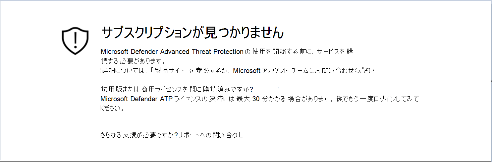
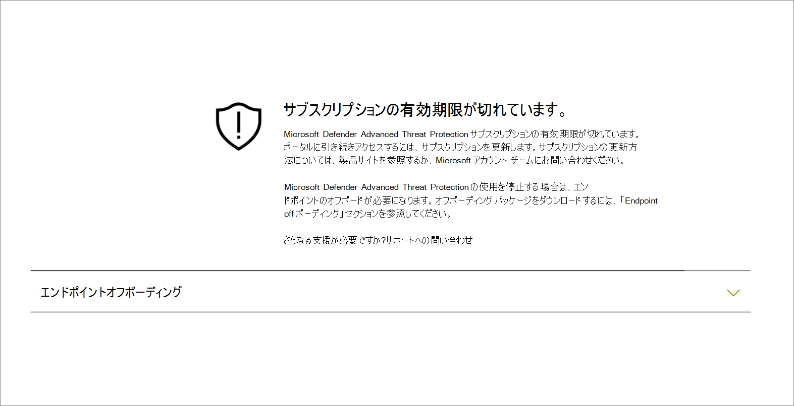
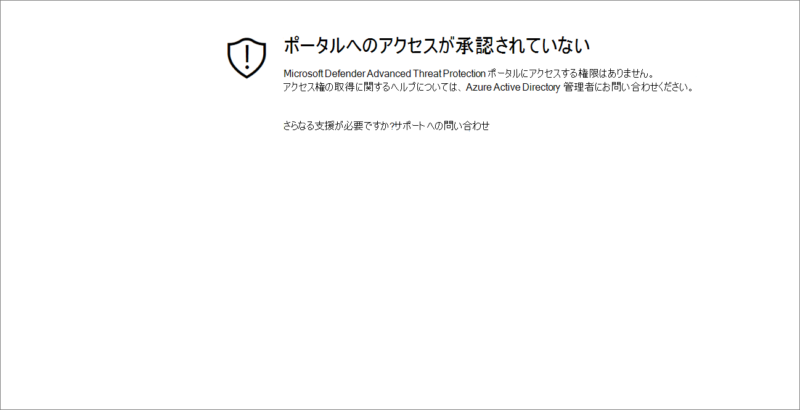
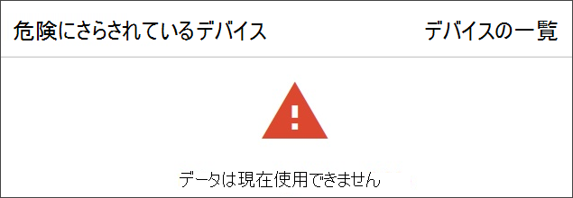

# サブスクリプションとポータル アクセスの問題のトラブルシューティング

[!INCLUDE [Microsoft 365 Defender rebranding](../../includes/microsoft-defender.md)]

**適用対象:**
- [Microsoft Defender for Endpoint](https://go.microsoft.com/fwlink/p/?linkid=2154037)
- [Microsoft 365 Defender](https://go.microsoft.com/fwlink/?linkid=2118804)

> Microsoft Defender ATP を試してみたいですか? [無料試用版にサインアップしてください。](https://signup.microsoft.com/create-account/signup?products=7f379fee-c4f9-4278-b0a1-e4c8c2fcdf7e&ru=https://aka.ms/MDEp2OpenTrial?ocid=docs-wdatp-troublshootonboarding-abovefoldlink)

このページでは、Microsoft Defender for Endpoint サービスのセットアップ時に発生する可能性がある問題をトラブルシューティングするための詳細な手順について説明します。

エラー メッセージが表示された場合、Microsoft 365 Defenderの内容と関連するリンクが提供される詳細な説明が表示されます。

## サブスクリプションが見つかりません

Microsoft 365 Defender にアクセス中にサブスクリプションが見つからないというメッセージが表示される場合は、ユーザーのポータルへのログインに使用される Azure Active Directory (Azure AD) が Microsoft Defender for Endpoint ライセンスを持っていないという意味です。

潜在的な理由:

- Windows E5 ライセンスと Office E5 ライセンスは、別のライセンスです。
- ライセンスは購入されましたが、この Azure サーバー インスタンスADされません。
  - ライセンス プロビジョニングの問題である可能性があります。
  - サービスへの認証に使用されるライセンスとは異なるMicrosoft Azure ADにライセンスをプロビジョニングした可能性があります。

どちらの場合も、Microsoft Defender for [Endpoint Support](https://support.microsoft.com/getsupport?wf=0&tenant=ClassicCommercial&oaspworkflow=start_1.0.0.0&locale=en-us&supportregion=en-us&pesid=16055&ccsid=636419533611396913) または Volume ライセンス のサポートで Microsoft サポートに問い [合わせるべきです](https://www.microsoft.com/licensing/servicecenter/Help/Contact.aspx)。

## サブスクリプションの有効期限が切れています

サブスクリプションへのアクセス中Microsoft 365 Defenderサブスクリプションの有効期限が切れているメッセージが表示される場合、オンライン サービスサブスクリプションの有効期限が切れています。 Microsoft Defender for Endpoint サブスクリプションは、他のオンライン サービス サブスクリプションと同様に有効期限があります。

ライセンスの更新または延長は、任意の時点で選択できます。 有効期限が切れた後にポータルにアクセスすると、サブスクリプションの有効期限が切れたメッセージが表示され、ライセンスを更新しない場合は、デバイスのオフボード パッケージをダウンロードするオプションが表示されます。

> [!NOTE]
> セキュリティ上の理由から、Offboard デバイスに使用されるパッケージは、ダウンロード日から 30 日後に期限切れになります。 デバイスに送信された期限切れのオフボード パッケージは拒否されます。 オフボード パッケージをダウンロードすると、パッケージの有効期限が通知され、パッケージ名にも含まれます。

## ポータルへのアクセスが承認されていない

ポータルへのアクセスが承認されていない場合、Microsoft Defender for Endpoint はセキュリティ監視、インシデント調査、応答製品であり、アクセスはユーザーによって制限および制御されます。
詳細については、「ユーザー アクセスをポータルに [**割り当てる」を参照してください**](/windows/threat-protection/windows-defender-atp/assign-portal-access-windows-defender-advanced-threat-protection)。

## 現在、ポータルの一部のセクションでデータを使用できない

ポータル ダッシュボードや他のセクションに「現在データが使用できない」などのエラー メッセージが表示される場合は、次の手順を実行します。

Web ブラウザーで、その下のすべてのサブドメインを許可 `security.windows.com` する必要があります。 たとえば、`*.security.windows.com` などです。

## ポータル通信の問題

ポータルへのアクセス、不足しているデータ、またはポータルの一部へのアクセス制限に関する問題が発生した場合は、次の URL が許可され、通信のために開いているか確認する必要があります。

- `*.blob.core.windows.net`
- `crl.microsoft.com`
- `https://*.microsoftonline-p.com`
- `https://*.securitycenter.windows.com`
- `https://automatediracs-eus-prd.securitycenter.windows.com`
- `https://login.microsoftonline.com`
- `https://login.windows.net`
- `https://onboardingpackagescusprd.blob.core.windows.net`
- `https://secure.aadcdn.microsoftonline-p.com`
- `https://securitycenter.windows.com`
- `https://static2.sharepointonline.com`
