# <a name="troubleshoot-microsoft-defender-for-endpoint-onboarding-issues"></a><span data-ttu-id="c4e26-104">Microsoft Defender for Endpoint オンボーディングの問題のトラブルシューティング</span><span class="sxs-lookup"><span data-stu-id="c4e26-104">Troubleshoot Microsoft Defender for Endpoint onboarding issues</span></span>

[!INCLUDE [Microsoft 365 Defender rebranding](../../includes/microsoft-defender.md)]


<span data-ttu-id="c4e26-105">**適用対象:**</span><span class="sxs-lookup"><span data-stu-id="c4e26-105">**Applies to:**</span></span>

- [<span data-ttu-id="c4e26-106">Microsoft Defender for Endpoint</span><span class="sxs-lookup"><span data-stu-id="c4e26-106">Microsoft Defender for Endpoint</span></span>](https://go.microsoft.com/fwlink/?linkid=2154037)
- <span data-ttu-id="c4e26-107">Windows Server 2012 R2</span><span class="sxs-lookup"><span data-stu-id="c4e26-107">Windows Server 2012 R2</span></span>
- <span data-ttu-id="c4e26-108">Windows Server 2016</span><span class="sxs-lookup"><span data-stu-id="c4e26-108">Windows Server 2016</span></span>
- [<span data-ttu-id="c4e26-109">Microsoft 365 Defender</span><span class="sxs-lookup"><span data-stu-id="c4e26-109">Microsoft 365 Defender</span></span>](https://go.microsoft.com/fwlink/?linkid=2118804)

> <span data-ttu-id="c4e26-110">Defender for Endpoint を体験してみませんか?</span><span class="sxs-lookup"><span data-stu-id="c4e26-110">Want to experience Defender for Endpoint?</span></span> [<span data-ttu-id="c4e26-111">無料試用版にサインアップしてください。</span><span class="sxs-lookup"><span data-stu-id="c4e26-111">Sign up for a free trial.</span></span>](https://www.microsoft.com/microsoft-365/windows/microsoft-defender-atp?ocid=docs-wdatp-pullalerts-abovefoldlink) 

<span data-ttu-id="c4e26-112">問題が発生した場合は、Microsoft Defender for Endpoint オンボーディング プロセスのトラブルシューティングが必要になる場合があります。</span><span class="sxs-lookup"><span data-stu-id="c4e26-112">You might need to troubleshoot the Microsoft Defender for Endpoint onboarding process if you encounter issues.</span></span>
<span data-ttu-id="c4e26-113">このページでは、展開ツールのいずれかを使用して展開するときに発生する可能性のあるオンボーディングの問題と、デバイスで発生する可能性のある一般的なエラーをトラブルシューティングするための詳細な手順を示します。</span><span class="sxs-lookup"><span data-stu-id="c4e26-113">This page provides detailed steps to troubleshoot onboarding issues that might occur when deploying with one of the deployment tools and common errors that might occur on the devices.</span></span>

## <a name="troubleshoot-issues-with-onboarding-tools"></a><span data-ttu-id="c4e26-114">オンボーディング ツールに関する問題のトラブルシューティング</span><span class="sxs-lookup"><span data-stu-id="c4e26-114">Troubleshoot issues with onboarding tools</span></span>

<span data-ttu-id="c4e26-115">オンボーディング プロセスを完了し、1 時間後に [デバイス[](investigate-machines.md)] リストにデバイスが表示されない場合は、オンボーディングまたは接続の問題を示している可能性があります。</span><span class="sxs-lookup"><span data-stu-id="c4e26-115">If you have completed the onboarding process and don't see devices in the [Devices list](investigate-machines.md) after an hour, it might indicate an onboarding or connectivity problem.</span></span>

### <a name="troubleshoot-onboarding-when-deploying-with-group-policy"></a><span data-ttu-id="c4e26-116">グループ ポリシーを使用して展開する場合のオンボーディングのトラブルシューティング</span><span class="sxs-lookup"><span data-stu-id="c4e26-116">Troubleshoot onboarding when deploying with Group Policy</span></span>

<span data-ttu-id="c4e26-117">グループ ポリシーによる展開は、デバイスでオンボーディング スクリプトを実行して行います。</span><span class="sxs-lookup"><span data-stu-id="c4e26-117">Deployment with Group Policy is done by running the onboarding script on the devices.</span></span> <span data-ttu-id="c4e26-118">グループ ポリシー コンソールは、展開が成功したかどうかを示しません。</span><span class="sxs-lookup"><span data-stu-id="c4e26-118">The Group Policy console does not indicate if the deployment has succeeded or not.</span></span>

<span data-ttu-id="c4e26-119">オンボーディング プロセスが完了し、1 時間後に [デバイス[](investigate-machines.md)] リストにデバイスが表示されない場合は、デバイス上のスクリプトの出力を確認できます。</span><span class="sxs-lookup"><span data-stu-id="c4e26-119">If you have completed the onboarding process and don't see devices in the [Devices list](investigate-machines.md) after an hour, you can check the output of the script on the devices.</span></span> <span data-ttu-id="c4e26-120">詳細については、「スクリプトを使用 [して展開する場合のオンボードのトラブルシューティング」を参照してください](#troubleshoot-onboarding-when-deploying-with-a-script)。</span><span class="sxs-lookup"><span data-stu-id="c4e26-120">For more information, see [Troubleshoot onboarding when deploying with a script](#troubleshoot-onboarding-when-deploying-with-a-script).</span></span>

<span data-ttu-id="c4e26-121">スクリプトが正常に完了した場合は、「[](#troubleshoot-onboarding-issues-on-the-device)デバイスのオンボードの問題のトラブルシューティング」を参照して、発生する可能性がある追加のエラーについて説明します。</span><span class="sxs-lookup"><span data-stu-id="c4e26-121">If the script completes successfully, see [Troubleshoot onboarding issues on the devices](#troubleshoot-onboarding-issues-on-the-device) for additional errors that might occur.</span></span>

### <a name="troubleshoot-onboarding-issues-when-deploying-with-microsoft-endpoint-configuration-manager"></a><span data-ttu-id="c4e26-122">アプリケーションを使用して展開する際のオンボーディングの問題のトラブルシューティングMicrosoft Endpoint Configuration Manager</span><span class="sxs-lookup"><span data-stu-id="c4e26-122">Troubleshoot onboarding issues when deploying with Microsoft Endpoint Configuration Manager</span></span>

<span data-ttu-id="c4e26-123">Configuration Manager の次のバージョンを使用してデバイスをオンボーディングする場合:</span><span class="sxs-lookup"><span data-stu-id="c4e26-123">When onboarding devices using the following versions of Configuration Manager:</span></span>

- <span data-ttu-id="c4e26-124">Microsoft Endpoint Configuration Manager</span><span class="sxs-lookup"><span data-stu-id="c4e26-124">Microsoft Endpoint Configuration Manager</span></span>
- <span data-ttu-id="c4e26-125">System Center 2012 Configuration Manager</span><span class="sxs-lookup"><span data-stu-id="c4e26-125">System Center 2012 Configuration Manager</span></span>
- <span data-ttu-id="c4e26-126">System Center 2012 R2 構成マネージャー</span><span class="sxs-lookup"><span data-stu-id="c4e26-126">System Center 2012 R2 Configuration Manager</span></span>

<span data-ttu-id="c4e26-127">上記のバージョンの Configuration Manager を使用した展開は、デバイスでオンボーディング スクリプトを実行して行います。</span><span class="sxs-lookup"><span data-stu-id="c4e26-127">Deployment with the above-mentioned versions of Configuration Manager is done by running the onboarding script on the devices.</span></span> <span data-ttu-id="c4e26-128">Configuration Manager コンソールで展開を追跡できます。</span><span class="sxs-lookup"><span data-stu-id="c4e26-128">You can track the deployment in the Configuration Manager Console.</span></span>

<span data-ttu-id="c4e26-129">展開が失敗した場合は、デバイス上のスクリプトの出力を確認できます。</span><span class="sxs-lookup"><span data-stu-id="c4e26-129">If the deployment fails, you can check the output of the script on the devices.</span></span>

<span data-ttu-id="c4e26-130">オンボーディングが正常に完了したが、デバイスが 1 時間後に [デバイス] リスト[](#troubleshoot-onboarding-issues-on-the-device)に表示されない場合は、「発生する可能性がある追加のエラーについては、デバイスのオンボードの問題のトラブルシューティング」を参照してください。</span><span class="sxs-lookup"><span data-stu-id="c4e26-130">If the onboarding completed successfully but the devices are not showing up in the **Devices list** after an hour, see [Troubleshoot onboarding issues on the device](#troubleshoot-onboarding-issues-on-the-device) for additional errors that might occur.</span></span>

### <a name="troubleshoot-onboarding-when-deploying-with-a-script"></a><span data-ttu-id="c4e26-131">スクリプトを使用して展開する場合のオンボーディングのトラブルシューティング</span><span class="sxs-lookup"><span data-stu-id="c4e26-131">Troubleshoot onboarding when deploying with a script</span></span>

<span data-ttu-id="c4e26-132">**デバイス上のスクリプトの結果を確認します。**</span><span class="sxs-lookup"><span data-stu-id="c4e26-132">**Check the result of the script on the device:**</span></span>

1. <span data-ttu-id="c4e26-133">[スタート **] ボタンを** クリックし、「 **イベント ビューアー」と入力** し、Enter キーを **押します**。</span><span class="sxs-lookup"><span data-stu-id="c4e26-133">Click **Start**, type **Event Viewer**, and press **Enter**.</span></span>

2. <span data-ttu-id="c4e26-134">[ログ アプリケーション **Windows] に**  >  **移動します**。</span><span class="sxs-lookup"><span data-stu-id="c4e26-134">Go to **Windows Logs** > **Application**.</span></span>

3. <span data-ttu-id="c4e26-135">**WDATPOnboarding イベント ソースからイベントを** 探します。</span><span class="sxs-lookup"><span data-stu-id="c4e26-135">Look for an event from **WDATPOnboarding** event source.</span></span>

<span data-ttu-id="c4e26-136">スクリプトが失敗し、イベントがエラーである場合は、次の表のイベント ID を確認して、問題のトラブルシューティングに役立ちます。</span><span class="sxs-lookup"><span data-stu-id="c4e26-136">If the script fails and the event is an error, you can check the event ID in the following table to help you troubleshoot the issue.</span></span>

> [!NOTE]
> <span data-ttu-id="c4e26-137">次のイベントの ID は、オンボーディング スクリプトにのみ固有のイベントです。</span><span class="sxs-lookup"><span data-stu-id="c4e26-137">The following event IDs are specific to the onboarding script only.</span></span>

<span data-ttu-id="c4e26-138">イベント ID</span><span class="sxs-lookup"><span data-stu-id="c4e26-138">Event ID</span></span> | <span data-ttu-id="c4e26-139">エラーの種類</span><span class="sxs-lookup"><span data-stu-id="c4e26-139">Error Type</span></span> | <span data-ttu-id="c4e26-140">解決手順</span><span class="sxs-lookup"><span data-stu-id="c4e26-140">Resolution steps</span></span>
:---:|:---|:---
 `5` | <span data-ttu-id="c4e26-141">オフボード データが見つかりましたが、削除できなかった</span><span class="sxs-lookup"><span data-stu-id="c4e26-141">Offboarding data was found but couldn't be deleted</span></span> | <span data-ttu-id="c4e26-142">レジストリのアクセス許可を確認する (具体的には)</span><span class="sxs-lookup"><span data-stu-id="c4e26-142">Check the permissions on the registry, specifically</span></span><br> <span data-ttu-id="c4e26-143">`HKLM\SOFTWARE\Policies\Microsoft\Windows Advanced Threat Protection`.</span><span class="sxs-lookup"><span data-stu-id="c4e26-143">`HKLM\SOFTWARE\Policies\Microsoft\Windows Advanced Threat Protection`.</span></span>
`10` | <span data-ttu-id="c4e26-144">オンボード データをレジストリに書き込めなかった</span><span class="sxs-lookup"><span data-stu-id="c4e26-144">Onboarding data couldn't be written to registry</span></span> |  <span data-ttu-id="c4e26-145">レジストリのアクセス許可を確認する (具体的には)</span><span class="sxs-lookup"><span data-stu-id="c4e26-145">Check the permissions on the registry, specifically</span></span><br> <span data-ttu-id="c4e26-146">`HKLM\SOFTWARE\Policies\Microsoft\Windows Advanced Threat Protection`.</span><span class="sxs-lookup"><span data-stu-id="c4e26-146">`HKLM\SOFTWARE\Policies\Microsoft\Windows Advanced Threat Protection`.</span></span><br><span data-ttu-id="c4e26-147">スクリプトが管理者として実行されたと確認します。</span><span class="sxs-lookup"><span data-stu-id="c4e26-147">Verify that the script has been run as an administrator.</span></span>
`15` |  <span data-ttu-id="c4e26-148">SENSE サービスの開始に失敗しました</span><span class="sxs-lookup"><span data-stu-id="c4e26-148">Failed to start SENSE service</span></span> |<span data-ttu-id="c4e26-149">サービスの正常性 (コマンド) を `sc query sense` 確認します。</span><span class="sxs-lookup"><span data-stu-id="c4e26-149">Check the service health (`sc query sense` command).</span></span> <span data-ttu-id="c4e26-150">中間の状態 *('Pending_Stopped'*、 *'Pending_Running'*) に含めず、(管理者権限を持つ) スクリプトを再度実行してください。</span><span class="sxs-lookup"><span data-stu-id="c4e26-150">Make sure it's not in an intermediate state (*'Pending_Stopped'*, *'Pending_Running'*) and try to run the script again (with administrator rights).</span></span> <br> <br> <span data-ttu-id="c4e26-151">デバイスがバージョン 1607 Windows 10実行してコマンドを実行している場合は、 `sc query sense` `START_PENDING` デバイスを再起動します。</span><span class="sxs-lookup"><span data-stu-id="c4e26-151">If the device is running Windows 10, version 1607 and running the command `sc query sense` returns `START_PENDING`, reboot the device.</span></span> <span data-ttu-id="c4e26-152">デバイスを再起動しても問題が解決しない場合は、KB4015217 にアップグレードして、もう一度オンボーディングを試してください。</span><span class="sxs-lookup"><span data-stu-id="c4e26-152">If rebooting the device doesn't address the issue, upgrade to KB4015217 and try onboarding again.</span></span>
`15` | <span data-ttu-id="c4e26-153">SENSE サービスの開始に失敗しました</span><span class="sxs-lookup"><span data-stu-id="c4e26-153">Failed to start SENSE service</span></span> | <span data-ttu-id="c4e26-154">エラーのメッセージが次の場合:システム エラー 577 またはエラー 1058 が発生した場合は、Microsoft Defender ウイルス対策 ELAM ドライバーを有効にする必要があります。手順については[、「Microsoft Defender ウイルス対策](#ensure-that-microsoft-defender-antivirus-is-not-disabled-by-a-policy)がポリシーによって無効にされていないか確認する」を参照してください。</span><span class="sxs-lookup"><span data-stu-id="c4e26-154">If the message of the error is: System error 577  or error 1058 has occurred, you need to enable the Microsoft Defender Antivirus ELAM driver, see [Ensure that Microsoft Defender Antivirus is not disabled by a policy](#ensure-that-microsoft-defender-antivirus-is-not-disabled-by-a-policy) for instructions.</span></span>
`30` |  <span data-ttu-id="c4e26-155">スクリプトがサービスの実行を待機できなかった</span><span class="sxs-lookup"><span data-stu-id="c4e26-155">The script failed to wait for the service to start running</span></span> | <span data-ttu-id="c4e26-156">サービスの開始に時間がかかったか、開始しようとしている間にエラーが発生している可能性があります。</span><span class="sxs-lookup"><span data-stu-id="c4e26-156">The service could have taken more time to start or has encountered errors while trying to start.</span></span> <span data-ttu-id="c4e26-157">SENSE に関連するイベントとエラーの詳細については、「イベント ビューアーを使用してイベント [とエラーを確認する」を参照してください](event-error-codes.md)。</span><span class="sxs-lookup"><span data-stu-id="c4e26-157">For more information on events and errors related to SENSE, see [Review events and errors using Event viewer](event-error-codes.md).</span></span>
`35` |  <span data-ttu-id="c4e26-158">スクリプトが必要なオンボーディング状態レジストリ値を見つけ出すに失敗しました</span><span class="sxs-lookup"><span data-stu-id="c4e26-158">The script failed to find needed onboarding status registry value</span></span> | <span data-ttu-id="c4e26-159">SENSE サービスが初めて開始されると、オンボード状態がレジストリの場所に書き込み</span><span class="sxs-lookup"><span data-stu-id="c4e26-159">When the SENSE service starts for the first time, it writes onboarding status to the registry location</span></span><br><span data-ttu-id="c4e26-160">`HKLM\SOFTWARE\Microsoft\Windows Advanced Threat Protection\Status`.</span><span class="sxs-lookup"><span data-stu-id="c4e26-160">`HKLM\SOFTWARE\Microsoft\Windows Advanced Threat Protection\Status`.</span></span><br> <span data-ttu-id="c4e26-161">スクリプトは数秒後に検索に失敗しました。</span><span class="sxs-lookup"><span data-stu-id="c4e26-161">The script failed to find it after several seconds.</span></span> <span data-ttu-id="c4e26-162">手動でテストし、それがそこにあるか確認できます。</span><span class="sxs-lookup"><span data-stu-id="c4e26-162">You can manually test it and check if it's there.</span></span> <span data-ttu-id="c4e26-163">SENSE に関連するイベントとエラーの詳細については、「イベント ビューアーを使用してイベント [とエラーを確認する」を参照してください](event-error-codes.md)。</span><span class="sxs-lookup"><span data-stu-id="c4e26-163">For more information on events and errors related to SENSE, see [Review events and errors using Event viewer](event-error-codes.md).</span></span>
`40` | <span data-ttu-id="c4e26-164">SENSE サービスオンボーディングの状態が **1 に設定されていない**</span><span class="sxs-lookup"><span data-stu-id="c4e26-164">SENSE service onboarding status is not set to **1**</span></span> | <span data-ttu-id="c4e26-165">SENSE サービスが正しくオンボードに失敗しました。</span><span class="sxs-lookup"><span data-stu-id="c4e26-165">The SENSE service has failed to onboard properly.</span></span> <span data-ttu-id="c4e26-166">SENSE に関連するイベントとエラーの詳細については、「イベント ビューアーを使用してイベント [とエラーを確認する」を参照してください](event-error-codes.md)。</span><span class="sxs-lookup"><span data-stu-id="c4e26-166">For more information on events and errors related to SENSE, see [Review events and errors using Event viewer](event-error-codes.md).</span></span>
`65` | <span data-ttu-id="c4e26-167">不十分な特権</span><span class="sxs-lookup"><span data-stu-id="c4e26-167">Insufficient privileges</span></span>| <span data-ttu-id="c4e26-168">管理者特権でスクリプトを再度実行します。</span><span class="sxs-lookup"><span data-stu-id="c4e26-168">Run the script again with administrator privileges.</span></span>

### <a name="troubleshoot-onboarding-issues-using-microsoft-intune"></a><span data-ttu-id="c4e26-169">ユーザー設定を使用してオンボーディングの問題をトラブルシューティングMicrosoft Intune</span><span class="sxs-lookup"><span data-stu-id="c4e26-169">Troubleshoot onboarding issues using Microsoft Intune</span></span>

<span data-ttu-id="c4e26-170">エラー コードをMicrosoft Intune、問題の原因のトラブルシューティングを試みる場合は、このエラー コードを使用します。</span><span class="sxs-lookup"><span data-stu-id="c4e26-170">You can use Microsoft Intune to check error codes and attempt to troubleshoot the cause of the issue.</span></span>

<span data-ttu-id="c4e26-171">Intune でポリシーを構成し、デバイスに反映されない場合は、MDM の自動登録を構成する必要があります。</span><span class="sxs-lookup"><span data-stu-id="c4e26-171">If you have configured policies in Intune and they are not propagated on devices, you might need to configure automatic MDM enrollment.</span></span>

<span data-ttu-id="c4e26-172">オンボーディング中に発生する可能性がある問題の原因を理解するには、次の表を使用します。</span><span class="sxs-lookup"><span data-stu-id="c4e26-172">Use the following tables to understand the possible causes of issues while onboarding:</span></span>

- <span data-ttu-id="c4e26-173">Microsoft Intune コードとエラー OMA-URIs表</span><span class="sxs-lookup"><span data-stu-id="c4e26-173">Microsoft Intune error codes and OMA-URIs table</span></span>
- <span data-ttu-id="c4e26-174">コンプライアンス以外のテーブルに関する既知の問題</span><span class="sxs-lookup"><span data-stu-id="c4e26-174">Known issues with non-compliance table</span></span>
- <span data-ttu-id="c4e26-175">モバイル デバイス管理 (MDM) イベント ログ テーブル</span><span class="sxs-lookup"><span data-stu-id="c4e26-175">Mobile Device Management (MDM) event logs table</span></span>

<span data-ttu-id="c4e26-176">イベント ログとトラブルシューティング手順が機能しない場合は、ポータルの [デバイス管理] セクションからローカル スクリプトをダウンロードし、管理者特権でコマンド プロンプトで実行します。</span><span class="sxs-lookup"><span data-stu-id="c4e26-176">If none of the event logs and troubleshooting steps work, download the Local script from the **Device management** section of the portal, and run it in an elevated command prompt.</span></span>

#### <a name="microsoft-intune-error-codes-and-oma-uris"></a><span data-ttu-id="c4e26-177">Microsoft Intuneコードとエラー コードOMA-URIs</span><span class="sxs-lookup"><span data-stu-id="c4e26-177">Microsoft Intune error codes and OMA-URIs</span></span>

<span data-ttu-id="c4e26-178">エラー コード 16 進数</span><span class="sxs-lookup"><span data-stu-id="c4e26-178">Error Code Hex</span></span> | <span data-ttu-id="c4e26-179">エラー コード 12 月</span><span class="sxs-lookup"><span data-stu-id="c4e26-179">Error Code Dec</span></span> | <span data-ttu-id="c4e26-180">エラーの説明</span><span class="sxs-lookup"><span data-stu-id="c4e26-180">Error Description</span></span> | <span data-ttu-id="c4e26-181">OMA-URI</span><span class="sxs-lookup"><span data-stu-id="c4e26-181">OMA-URI</span></span> | <span data-ttu-id="c4e26-182">考えられる原因とトラブルシューティングの手順</span><span class="sxs-lookup"><span data-stu-id="c4e26-182">Possible cause and troubleshooting steps</span></span>
:---:|:---|:---|:---|:---
<span data-ttu-id="c4e26-183">0x87D1FDE8</span><span class="sxs-lookup"><span data-stu-id="c4e26-183">0x87D1FDE8</span></span> | <span data-ttu-id="c4e26-184">-2016281112</span><span class="sxs-lookup"><span data-stu-id="c4e26-184">-2016281112</span></span> | <span data-ttu-id="c4e26-185">修復に失敗しました</span><span class="sxs-lookup"><span data-stu-id="c4e26-185">Remediation failed</span></span> | <span data-ttu-id="c4e26-186">オンボード</span><span class="sxs-lookup"><span data-stu-id="c4e26-186">Onboarding</span></span> <br> <span data-ttu-id="c4e26-187">オフボード</span><span class="sxs-lookup"><span data-stu-id="c4e26-187">Offboarding</span></span> | <span data-ttu-id="c4e26-188">**考えられる原因:** 誤った BLOB でオンボーディングまたはオフボードが失敗しました。署名が間違っていたり、PreviousOrgIds フィールドが見つからない場合。</span><span class="sxs-lookup"><span data-stu-id="c4e26-188">**Possible cause:** Onboarding or offboarding failed on a wrong blob: wrong signature or missing PreviousOrgIds fields.</span></span> <br><br> <span data-ttu-id="c4e26-189">**トラブルシューティングの手順:**</span><span class="sxs-lookup"><span data-stu-id="c4e26-189">**Troubleshooting steps:**</span></span> <br> <span data-ttu-id="c4e26-190">[デバイス イベント ログのエージェントオンボーディング エラーの表示] セクション [でイベントの ID を確認](#view-agent-onboarding-errors-in-the-device-event-log) します。</span><span class="sxs-lookup"><span data-stu-id="c4e26-190">Check the event IDs in the [View agent onboarding errors in the device event log](#view-agent-onboarding-errors-in-the-device-event-log) section.</span></span> <br><br> <span data-ttu-id="c4e26-191">次の表の MDM イベント ログを確認するか、「MDM エラーの診断」の手順に従[Windows 10。](/windows/client-management/mdm/diagnose-mdm-failures-in-windows-10)</span><span class="sxs-lookup"><span data-stu-id="c4e26-191">Check the MDM event logs in the following table or follow the instructions in [Diagnose MDM failures in Windows 10](/windows/client-management/mdm/diagnose-mdm-failures-in-windows-10).</span></span>
 | | | | <span data-ttu-id="c4e26-192">オンボード</span><span class="sxs-lookup"><span data-stu-id="c4e26-192">Onboarding</span></span> <br> <span data-ttu-id="c4e26-193">オフボード</span><span class="sxs-lookup"><span data-stu-id="c4e26-193">Offboarding</span></span> <br> <span data-ttu-id="c4e26-194">SampleSharing</span><span class="sxs-lookup"><span data-stu-id="c4e26-194">SampleSharing</span></span> | <span data-ttu-id="c4e26-195">**考えられる原因:** Microsoft Defender for Endpoint Policy レジストリ キーが存在しないか、OMA DM クライアントに書き込み権限が付与されていない。</span><span class="sxs-lookup"><span data-stu-id="c4e26-195">**Possible cause:** Microsoft Defender for Endpoint Policy registry key does not exist or the OMA DM client doesn't have permissions to write to it.</span></span> <br><br> <span data-ttu-id="c4e26-196">**トラブルシューティングの手順:** 次のレジストリ キーが存在することを確認します。 `HKEY_LOCAL_MACHINE\SOFTWARE\Policies\Microsoft\Windows Advanced Threat Protection`</span><span class="sxs-lookup"><span data-stu-id="c4e26-196">**Troubleshooting steps:** Ensure that the following registry key exists: `HKEY_LOCAL_MACHINE\SOFTWARE\Policies\Microsoft\Windows Advanced Threat Protection`</span></span> <br> <br> <span data-ttu-id="c4e26-197">存在しない場合は、管理者特権でコマンドを開き、キーを追加します。</span><span class="sxs-lookup"><span data-stu-id="c4e26-197">If it doesn't exist, open an elevated command and add the key.</span></span>
 | | | | <span data-ttu-id="c4e26-198">SenseIsRunning</span><span class="sxs-lookup"><span data-stu-id="c4e26-198">SenseIsRunning</span></span> <br> <span data-ttu-id="c4e26-199">OnboardingState</span><span class="sxs-lookup"><span data-stu-id="c4e26-199">OnboardingState</span></span> <br> <span data-ttu-id="c4e26-200">OrgId</span><span class="sxs-lookup"><span data-stu-id="c4e26-200">OrgId</span></span> |  <span data-ttu-id="c4e26-201">**考えられる原因:** 読み取り専用プロパティによる修復の試行。</span><span class="sxs-lookup"><span data-stu-id="c4e26-201">**Possible cause:** An attempt to remediate by read-only property.</span></span> <span data-ttu-id="c4e26-202">オンボーディングに失敗しました。</span><span class="sxs-lookup"><span data-stu-id="c4e26-202">Onboarding has failed.</span></span> <br><br> <span data-ttu-id="c4e26-203">**トラブルシューティングの手順:** 「デバイスでのオンボードの問題の [トラブルシューティング」のトラブルシューティング手順を確認します](#troubleshoot-onboarding-issues-on-the-device)。</span><span class="sxs-lookup"><span data-stu-id="c4e26-203">**Troubleshooting steps:** Check the troubleshooting steps in [Troubleshoot onboarding issues on the device](#troubleshoot-onboarding-issues-on-the-device).</span></span> <br><br> <span data-ttu-id="c4e26-204">次の表の MDM イベント ログを確認するか、「MDM エラーの診断」の手順に従[Windows 10。](/windows/client-management/mdm/diagnose-mdm-failures-in-windows-10)</span><span class="sxs-lookup"><span data-stu-id="c4e26-204">Check the MDM event logs in the following table or follow the instructions in [Diagnose MDM failures in Windows 10](/windows/client-management/mdm/diagnose-mdm-failures-in-windows-10).</span></span>
 | | | | <span data-ttu-id="c4e26-205">すべて</span><span class="sxs-lookup"><span data-stu-id="c4e26-205">All</span></span> | <span data-ttu-id="c4e26-206">**考えられる原因:** Microsoft Defender for Endpoint をサポートされていない SKU/プラットフォーム (特に Holographic SKU) に展開します。</span><span class="sxs-lookup"><span data-stu-id="c4e26-206">**Possible cause:** Attempt to deploy Microsoft Defender for Endpoint on non-supported SKU/Platform, particularly Holographic SKU.</span></span> <br><br> <span data-ttu-id="c4e26-207">現在サポートされているプラットフォーム:</span><span class="sxs-lookup"><span data-stu-id="c4e26-207">Currently supported platforms:</span></span><br> <span data-ttu-id="c4e26-208">Enterprise、教育、およびProfessional。</span><span class="sxs-lookup"><span data-stu-id="c4e26-208">Enterprise, Education, and Professional.</span></span><br> <span data-ttu-id="c4e26-209">サーバーはサポートされていません。</span><span class="sxs-lookup"><span data-stu-id="c4e26-209">Server is not supported.</span></span>
 <span data-ttu-id="c4e26-210">0x87D101A9</span><span class="sxs-lookup"><span data-stu-id="c4e26-210">0x87D101A9</span></span> | <span data-ttu-id="c4e26-211">-2016345687</span><span class="sxs-lookup"><span data-stu-id="c4e26-211">-2016345687</span></span> |<span data-ttu-id="c4e26-212">SyncML(425): 要求されたコマンドは、送信者が受信者に適切なアクセス制御アクセス許可 (ACL) を持たないので失敗しました。</span><span class="sxs-lookup"><span data-stu-id="c4e26-212">SyncML(425): The requested command failed because the sender does not have adequate access control permissions (ACL) on the recipient.</span></span> | <span data-ttu-id="c4e26-213">すべて</span><span class="sxs-lookup"><span data-stu-id="c4e26-213">All</span></span> |  <span data-ttu-id="c4e26-214">**考えられる原因:** Microsoft Defender for Endpoint をサポートされていない SKU/プラットフォーム (特に Holographic SKU) に展開します。</span><span class="sxs-lookup"><span data-stu-id="c4e26-214">**Possible cause:** Attempt to deploy Microsoft Defender for Endpoint on non-supported SKU/Platform, particularly Holographic SKU.</span></span><br><br> <span data-ttu-id="c4e26-215">現在サポートされているプラットフォーム:</span><span class="sxs-lookup"><span data-stu-id="c4e26-215">Currently supported platforms:</span></span><br>  <span data-ttu-id="c4e26-216">Enterprise、教育、およびProfessional。</span><span class="sxs-lookup"><span data-stu-id="c4e26-216">Enterprise, Education, and Professional.</span></span>

#### <a name="known-issues-with-non-compliance"></a><span data-ttu-id="c4e26-217">コンプライアンスに関する既知の問題</span><span class="sxs-lookup"><span data-stu-id="c4e26-217">Known issues with non-compliance</span></span>

<span data-ttu-id="c4e26-218">次の表に、コンプライアンス以外の問題に関する情報と、問題に対処する方法を示します。</span><span class="sxs-lookup"><span data-stu-id="c4e26-218">The following table provides information on issues with non-compliance and how you can address the issues.</span></span>

<span data-ttu-id="c4e26-219">ケース</span><span class="sxs-lookup"><span data-stu-id="c4e26-219">Case</span></span> | <span data-ttu-id="c4e26-220">現象</span><span class="sxs-lookup"><span data-stu-id="c4e26-220">Symptoms</span></span> | <span data-ttu-id="c4e26-221">考えられる原因とトラブルシューティングの手順</span><span class="sxs-lookup"><span data-stu-id="c4e26-221">Possible cause and troubleshooting steps</span></span>
:---:|:---|:---
 `1` | <span data-ttu-id="c4e26-222">デバイスは SenseIsRunning OMA-URI に準拠しています。</span><span class="sxs-lookup"><span data-stu-id="c4e26-222">Device is compliant by SenseIsRunning OMA-URI.</span></span> <span data-ttu-id="c4e26-223">ただし、OrgId、Onboarding、OnboardingState OMA-URI では非準拠です。</span><span class="sxs-lookup"><span data-stu-id="c4e26-223">But is non-compliant by OrgId, Onboarding and OnboardingState OMA-URIs.</span></span> | <span data-ttu-id="c4e26-224">**考えられる原因:** インストールまたはアップグレード後にユーザーが OOBE をWindows確認します。</span><span class="sxs-lookup"><span data-stu-id="c4e26-224">**Possible cause:** Check that user passed OOBE after Windows installation or upgrade.</span></span> <span data-ttu-id="c4e26-225">OOBE オンボーディングを完了できなかったが、SENSE が既に実行されている。</span><span class="sxs-lookup"><span data-stu-id="c4e26-225">During OOBE onboarding couldn't be completed but SENSE is running already.</span></span><br><br> <span data-ttu-id="c4e26-226">**トラブルシューティングの手順:** OOBE が完了するのを待ちます。</span><span class="sxs-lookup"><span data-stu-id="c4e26-226">**Troubleshooting steps:** Wait for OOBE to complete.</span></span>
 `2` |  <span data-ttu-id="c4e26-227">デバイスは OrgId、Onboarding、および OnboardingState OMA-URI に準拠していますが、SenseIsRunning OMA-URI では非準拠です。</span><span class="sxs-lookup"><span data-stu-id="c4e26-227">Device is compliant by OrgId, Onboarding, and OnboardingState OMA-URIs, but is non-compliant by SenseIsRunning OMA-URI.</span></span> |  <span data-ttu-id="c4e26-228">**考えられる原因:** センス サービスのスタートアップの種類は、"遅延開始" に設定されます。</span><span class="sxs-lookup"><span data-stu-id="c4e26-228">**Possible cause:** Sense service's startup type is set as "Delayed Start".</span></span> <span data-ttu-id="c4e26-229">これにより、システムのMicrosoft Intune DM セッションが発生すると、サーバーは SenseIsRunning によってデバイスが非準拠として報告される場合があります。</span><span class="sxs-lookup"><span data-stu-id="c4e26-229">Sometimes this causes the Microsoft Intune server to report the device as non-compliant by SenseIsRunning when DM session occurs on system start.</span></span> <br><br> <span data-ttu-id="c4e26-230">**トラブルシューティングの手順:** この問題は、24 時間以内に自動的に修正されるはずです。</span><span class="sxs-lookup"><span data-stu-id="c4e26-230">**Troubleshooting steps:** The issue should automatically be fixed within 24 hours.</span></span>
 `3` | <span data-ttu-id="c4e26-231">デバイスが非準拠</span><span class="sxs-lookup"><span data-stu-id="c4e26-231">Device is non-compliant</span></span> | <span data-ttu-id="c4e26-232">**トラブルシューティングの手順:** オンボーディング ポリシーとオフボード ポリシーが同じデバイスに同時に展開されないことを確認します。</span><span class="sxs-lookup"><span data-stu-id="c4e26-232">**Troubleshooting steps:** Ensure that Onboarding and Offboarding policies are not deployed on the same device at same time.</span></span>

#### <a name="mobile-device-management-mdm-event-logs"></a><span data-ttu-id="c4e26-233">モバイル デバイス管理 (MDM) イベント ログ</span><span class="sxs-lookup"><span data-stu-id="c4e26-233">Mobile Device Management (MDM) event logs</span></span>

<span data-ttu-id="c4e26-234">MDM イベント ログを表示して、オンボーディング中に発生する可能性のある問題のトラブルシューティングを行います。</span><span class="sxs-lookup"><span data-stu-id="c4e26-234">View the MDM event logs to troubleshoot issues that might arise during onboarding:</span></span>

<span data-ttu-id="c4e26-235">ログ名: Microsoft\Windows\DeviceManagement-EnterpriseDiagnostics-Provider</span><span class="sxs-lookup"><span data-stu-id="c4e26-235">Log name: Microsoft\Windows\DeviceManagement-EnterpriseDiagnostics-Provider</span></span>

<span data-ttu-id="c4e26-236">チャネル名: 管理者</span><span class="sxs-lookup"><span data-stu-id="c4e26-236">Channel name: Admin</span></span>

<span data-ttu-id="c4e26-237">ID</span><span class="sxs-lookup"><span data-stu-id="c4e26-237">ID</span></span> | <span data-ttu-id="c4e26-238">重要度</span><span class="sxs-lookup"><span data-stu-id="c4e26-238">Severity</span></span> | <span data-ttu-id="c4e26-239">イベントの説明</span><span class="sxs-lookup"><span data-stu-id="c4e26-239">Event description</span></span> | <span data-ttu-id="c4e26-240">トラブルシューティングの手順</span><span class="sxs-lookup"><span data-stu-id="c4e26-240">Troubleshooting steps</span></span>
:---|:---|:---|:---
<span data-ttu-id="c4e26-241">1819</span><span class="sxs-lookup"><span data-stu-id="c4e26-241">1819</span></span> | <span data-ttu-id="c4e26-242">Error</span><span class="sxs-lookup"><span data-stu-id="c4e26-242">Error</span></span> | <span data-ttu-id="c4e26-243">エンドポイント CSP 用 Microsoft Defender: ノードの値の設定に失敗しました。</span><span class="sxs-lookup"><span data-stu-id="c4e26-243">Microsoft Defender for Endpoint CSP: Failed to Set Node's Value.</span></span> <span data-ttu-id="c4e26-244">NodeId: (%1), TokenName: (%2), Result: (%3)。</span><span class="sxs-lookup"><span data-stu-id="c4e26-244">NodeId: (%1), TokenName: (%2), Result: (%3).</span></span> | <span data-ttu-id="c4e26-245">[1607 年 1607 年Windows 10累積的な更新プログラムをダウンロードします](https://go.microsoft.com/fwlink/?linkid=829760)。</span><span class="sxs-lookup"><span data-stu-id="c4e26-245">Download the [Cumulative Update for Windows 10, 1607](https://go.microsoft.com/fwlink/?linkid=829760).</span></span>

## <a name="troubleshoot-onboarding-issues-on-the-device"></a><span data-ttu-id="c4e26-246">デバイスでのオンボーディングの問題のトラブルシューティング</span><span class="sxs-lookup"><span data-stu-id="c4e26-246">Troubleshoot onboarding issues on the device</span></span>

<span data-ttu-id="c4e26-247">使用する展開ツールがオンボーディング プロセスでエラーを示していないが、デバイスが 1 時間以内にデバイスリストに表示されない場合は、次の検証トピックを参照して、Microsoft Defender for Endpoint エージェントでエラーが発生したかどうかを確認します。</span><span class="sxs-lookup"><span data-stu-id="c4e26-247">If the deployment tools used does not indicate an error in the onboarding process, but devices are still not appearing in the devices list in an hour, go through the following verification topics to check if an error occurred with the Microsoft Defender for Endpoint agent.</span></span>

- [<span data-ttu-id="c4e26-248">デバイス イベント ログでエージェントオンボーディング エラーを表示する</span><span class="sxs-lookup"><span data-stu-id="c4e26-248">View agent onboarding errors in the device event log</span></span>](#view-agent-onboarding-errors-in-the-device-event-log)
- [<span data-ttu-id="c4e26-249">診断データ サービスが有効になっているか確認する</span><span class="sxs-lookup"><span data-stu-id="c4e26-249">Ensure the diagnostic data service is enabled</span></span>](#ensure-the-diagnostics-service-is-enabled)
- [<span data-ttu-id="c4e26-250">サービスが開始に設定されているのを確認する</span><span class="sxs-lookup"><span data-stu-id="c4e26-250">Ensure the service is set to start</span></span>](#ensure-the-service-is-set-to-start)
- [<span data-ttu-id="c4e26-251">デバイスにインターネット接続が接続されている必要があります。</span><span class="sxs-lookup"><span data-stu-id="c4e26-251">Ensure the device has an Internet connection</span></span>](#ensure-the-device-has-an-internet-connection)
- [<span data-ttu-id="c4e26-252">ポリシーによってMicrosoft Defender ウイルス対策が無効にされていないか確認する</span><span class="sxs-lookup"><span data-stu-id="c4e26-252">Ensure that Microsoft Defender Antivirus is not disabled by a policy</span></span>](#ensure-that-microsoft-defender-antivirus-is-not-disabled-by-a-policy)

### <a name="view-agent-onboarding-errors-in-the-device-event-log"></a><span data-ttu-id="c4e26-253">デバイス イベント ログでエージェントオンボーディング エラーを表示する</span><span class="sxs-lookup"><span data-stu-id="c4e26-253">View agent onboarding errors in the device event log</span></span>

1. <span data-ttu-id="c4e26-254">[スタート **] ボタンを** クリックし、「 **イベント ビューアー」と入力** し、Enter キーを **押します**。</span><span class="sxs-lookup"><span data-stu-id="c4e26-254">Click **Start**, type **Event Viewer**, and press **Enter**.</span></span>

2. <span data-ttu-id="c4e26-255">[イベント **ビューアー (ローカル)] ウィンドウ** で、[**アプリケーション** とサービス ログ]  >  **を展開します。Microsoft** Windows SENSE  >    >  **です**。</span><span class="sxs-lookup"><span data-stu-id="c4e26-255">In the **Event Viewer (Local)** pane, expand **Applications and Services Logs** > **Microsoft** > **Windows** > **SENSE**.</span></span>

   > [!NOTE]
   > <span data-ttu-id="c4e26-256">SENSE は、Microsoft Defender for Endpoint をサポートする動作センサーを参照するために使用される内部名です。</span><span class="sxs-lookup"><span data-stu-id="c4e26-256">SENSE is the internal name used to refer to the behavioral sensor that powers Microsoft Defender for Endpoint.</span></span>

3. <span data-ttu-id="c4e26-257">[操作 **] を** 選択してログを読み込む。</span><span class="sxs-lookup"><span data-stu-id="c4e26-257">Select **Operational** to load the log.</span></span>

4. <span data-ttu-id="c4e26-258">[操作] **ウィンドウで** 、[現在のログの **フィルター] をクリックします**。</span><span class="sxs-lookup"><span data-stu-id="c4e26-258">In the **Action** pane, click **Filter Current log**.</span></span>

5. <span data-ttu-id="c4e26-259">[フィルター **] タブの**[イベント レベル] **で、[重大**] 、[警告] **、および**[**エラー**] を選択し **、[OK] をクリックします**。</span><span class="sxs-lookup"><span data-stu-id="c4e26-259">On the **Filter** tab, under **Event level:** select **Critical**, **Warning**, and **Error**, and click **OK**.</span></span>

   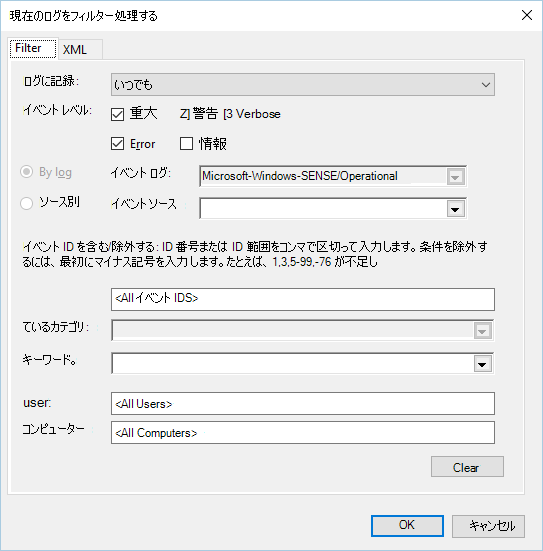

6. <span data-ttu-id="c4e26-261">[操作] ウィンドウに問題を示すイベント **が表示** されます。</span><span class="sxs-lookup"><span data-stu-id="c4e26-261">Events which can indicate issues will appear in the **Operational** pane.</span></span> <span data-ttu-id="c4e26-262">次の表のソリューションに基づいて、トラブルシューティングを試みできます。</span><span class="sxs-lookup"><span data-stu-id="c4e26-262">You can attempt to troubleshoot them based on the solutions in the following table:</span></span>

<span data-ttu-id="c4e26-263">イベント ID</span><span class="sxs-lookup"><span data-stu-id="c4e26-263">Event ID</span></span> | <span data-ttu-id="c4e26-264">メッセージ</span><span class="sxs-lookup"><span data-stu-id="c4e26-264">Message</span></span> | <span data-ttu-id="c4e26-265">解決手順</span><span class="sxs-lookup"><span data-stu-id="c4e26-265">Resolution steps</span></span>
:---:|:---|:---
 `5` | <span data-ttu-id="c4e26-266">Microsoft Defender for Endpoint service が変数でサーバーに接続 _できなかった_</span><span class="sxs-lookup"><span data-stu-id="c4e26-266">Microsoft Defender for Endpoint service failed to connect to the server at _variable_</span></span> | <span data-ttu-id="c4e26-267">[デバイスにインターネット アクセス権が設定されている必要があります](#ensure-the-device-has-an-internet-connection)。</span><span class="sxs-lookup"><span data-stu-id="c4e26-267">[Ensure the device has Internet access](#ensure-the-device-has-an-internet-connection).</span></span>
 `6` | <span data-ttu-id="c4e26-268">Microsoft Defender for Endpoint Service はオンボードされていないので、オンボーディング パラメーターが見つかりませんでした。</span><span class="sxs-lookup"><span data-stu-id="c4e26-268">Microsoft Defender for Endpoint service is not onboarded and no onboarding parameters were found.</span></span> <span data-ttu-id="c4e26-269">エラー コード: _変数_</span><span class="sxs-lookup"><span data-stu-id="c4e26-269">Failure code: _variable_</span></span> | <span data-ttu-id="c4e26-270">[オンボーディング スクリプトを再度実行します](configure-endpoints-script.md)。</span><span class="sxs-lookup"><span data-stu-id="c4e26-270">[Run the onboarding script again](configure-endpoints-script.md).</span></span>
 `7` | <span data-ttu-id="c4e26-271">Microsoft Defender for Endpoint service では、オンボーディング パラメーターの読み取りが失敗しました。</span><span class="sxs-lookup"><span data-stu-id="c4e26-271">Microsoft Defender for Endpoint service failed to read the onboarding parameters.</span></span> <span data-ttu-id="c4e26-272">エラー コード: _変数_</span><span class="sxs-lookup"><span data-stu-id="c4e26-272">Failure code: _variable_</span></span> | <span data-ttu-id="c4e26-273">[デバイスにインターネット アクセス権が設定されているのを](#ensure-the-device-has-an-internet-connection)確認し、オンボーディング プロセス全体を再度実行します。</span><span class="sxs-lookup"><span data-stu-id="c4e26-273">[Ensure the device has Internet access](#ensure-the-device-has-an-internet-connection), then run the entire onboarding process again.</span></span>
 `9` | <span data-ttu-id="c4e26-274">Microsoft Defender for Endpoint service は、開始の種類を変更できなかった。</span><span class="sxs-lookup"><span data-stu-id="c4e26-274">Microsoft Defender for Endpoint service failed to change its start type.</span></span> <span data-ttu-id="c4e26-275">エラー コード: 変数</span><span class="sxs-lookup"><span data-stu-id="c4e26-275">Failure code: variable</span></span> | <span data-ttu-id="c4e26-276">オンボーディング中にイベントが発生した場合は、再起動し、オンボーディング スクリプトの実行を再試みします。</span><span class="sxs-lookup"><span data-stu-id="c4e26-276">If the event happened during onboarding, reboot and re-attempt running the onboarding script.</span></span> <span data-ttu-id="c4e26-277">詳細については、「オンボード スクリプトを [再度実行する」を参照してください](configure-endpoints-script.md)。</span><span class="sxs-lookup"><span data-stu-id="c4e26-277">For more information, see [Run the onboarding script again](configure-endpoints-script.md).</span></span> <br><br><span data-ttu-id="c4e26-278">オフボード中にイベントが発生した場合は、サポートにお問い合わせください。</span><span class="sxs-lookup"><span data-stu-id="c4e26-278">If the event happened during offboarding, contact support.</span></span>
`10` | <span data-ttu-id="c4e26-279">Microsoft Defender for Endpoint Service は、オンボーディング情報を保持できなかった。</span><span class="sxs-lookup"><span data-stu-id="c4e26-279">Microsoft Defender for Endpoint service failed to persist the onboarding information.</span></span> <span data-ttu-id="c4e26-280">エラー コード: 変数</span><span class="sxs-lookup"><span data-stu-id="c4e26-280">Failure code: variable</span></span> | <span data-ttu-id="c4e26-281">オンボーディング中にイベントが発生した場合は、オンボーディング スクリプトの実行を再試みします。</span><span class="sxs-lookup"><span data-stu-id="c4e26-281">If the event happened during onboarding, re-attempt running the onboarding script.</span></span> <span data-ttu-id="c4e26-282">詳細については、「オンボード スクリプトを [再度実行する」を参照してください](configure-endpoints-script.md)。</span><span class="sxs-lookup"><span data-stu-id="c4e26-282">For more information, see [Run the onboarding script again](configure-endpoints-script.md).</span></span> <br><br><span data-ttu-id="c4e26-283">問題が解決しない場合は、サポートにお問い合わせください。</span><span class="sxs-lookup"><span data-stu-id="c4e26-283">If the problem persists, contact support.</span></span>
`15` | <span data-ttu-id="c4e26-284">Microsoft Defender for Endpoint では、URL 変数を使用してコマンド チャネルを開始 _できません。_</span><span class="sxs-lookup"><span data-stu-id="c4e26-284">Microsoft Defender for Endpoint cannot start command channel with URL: _variable_</span></span> | <span data-ttu-id="c4e26-285">[デバイスにインターネット アクセス権が設定されている必要があります](#ensure-the-device-has-an-internet-connection)。</span><span class="sxs-lookup"><span data-stu-id="c4e26-285">[Ensure the device has Internet access](#ensure-the-device-has-an-internet-connection).</span></span>
`17` | <span data-ttu-id="c4e26-286">Microsoft Defender for Endpoint service は、接続されたユーザー エクスペリエンスとテレメトリ サービスの場所を変更できなかった。</span><span class="sxs-lookup"><span data-stu-id="c4e26-286">Microsoft Defender for Endpoint service failed to change the Connected User Experiences and Telemetry service location.</span></span> <span data-ttu-id="c4e26-287">エラー コード: 変数</span><span class="sxs-lookup"><span data-stu-id="c4e26-287">Failure code: variable</span></span> | <span data-ttu-id="c4e26-288">[オンボーディング スクリプトを再度実行します](configure-endpoints-script.md)。</span><span class="sxs-lookup"><span data-stu-id="c4e26-288">[Run the onboarding script again](configure-endpoints-script.md).</span></span> <span data-ttu-id="c4e26-289">問題が解決しない場合は、サポートにお問い合わせください。</span><span class="sxs-lookup"><span data-stu-id="c4e26-289">If the problem persists, contact support.</span></span>
`25` | <span data-ttu-id="c4e26-290">Microsoft Defender for Endpoint service は、レジストリの正常性状態をリセットできなかった。</span><span class="sxs-lookup"><span data-stu-id="c4e26-290">Microsoft Defender for Endpoint service failed to reset health status in the registry.</span></span> <span data-ttu-id="c4e26-291">エラー コード: _変数_</span><span class="sxs-lookup"><span data-stu-id="c4e26-291">Failure code: _variable_</span></span> | <span data-ttu-id="c4e26-292">サポートに問い合わせてください。</span><span class="sxs-lookup"><span data-stu-id="c4e26-292">Contact support.</span></span>
`27` | <span data-ttu-id="c4e26-293">Microsoft Defender for Endpoint モードを有効にWindows Defender。</span><span class="sxs-lookup"><span data-stu-id="c4e26-293">Failed to enable Microsoft Defender for Endpoint mode in Windows Defender.</span></span> <span data-ttu-id="c4e26-294">オンボーディング プロセスに失敗しました。</span><span class="sxs-lookup"><span data-stu-id="c4e26-294">Onboarding process failed.</span></span> <span data-ttu-id="c4e26-295">エラー コード: 変数</span><span class="sxs-lookup"><span data-stu-id="c4e26-295">Failure code: variable</span></span> | <span data-ttu-id="c4e26-296">サポートに問い合わせてください。</span><span class="sxs-lookup"><span data-stu-id="c4e26-296">Contact support.</span></span>
`29` | <span data-ttu-id="c4e26-297">オフボード パラメーターの読み取りに失敗しました。</span><span class="sxs-lookup"><span data-stu-id="c4e26-297">Failed to read the offboarding parameters.</span></span> <span data-ttu-id="c4e26-298">エラーの種類: %1、エラー コード: %2、説明: %3</span><span class="sxs-lookup"><span data-stu-id="c4e26-298">Error type: %1, Error code: %2, Description: %3</span></span> | <span data-ttu-id="c4e26-299">デバイスにインターネット アクセス権が設定されているのを確認し、オフボード プロセス全体を再度実行します。</span><span class="sxs-lookup"><span data-stu-id="c4e26-299">Ensure the device has Internet access, then run the entire offboarding process again.</span></span>
`30` | <span data-ttu-id="c4e26-300">Microsoft Defender for Endpoint で $(build.sense.productDisplayName) モードを無効にしました。</span><span class="sxs-lookup"><span data-stu-id="c4e26-300">Failed to disable $(build.sense.productDisplayName) mode in Microsoft Defender for Endpoint.</span></span> <span data-ttu-id="c4e26-301">エラー コード: %1</span><span class="sxs-lookup"><span data-stu-id="c4e26-301">Failure code: %1</span></span> | <span data-ttu-id="c4e26-302">サポートに問い合わせてください。</span><span class="sxs-lookup"><span data-stu-id="c4e26-302">Contact support.</span></span>
`32` | <span data-ttu-id="c4e26-303">$(build.sense.productDisplayName) サービスは、オフボード プロセスの後に自分自身を停止する要求に失敗しました。</span><span class="sxs-lookup"><span data-stu-id="c4e26-303">$(build.sense.productDisplayName) service failed to request to stop itself after offboarding process.</span></span> <span data-ttu-id="c4e26-304">エラー コード: %1</span><span class="sxs-lookup"><span data-stu-id="c4e26-304">Failure code: %1</span></span> | <span data-ttu-id="c4e26-305">サービスの開始の種類が手動で行い、デバイスを再起動します。</span><span class="sxs-lookup"><span data-stu-id="c4e26-305">Verify that the service start type is manual and reboot the device.</span></span>
`55` | <span data-ttu-id="c4e26-306">Secure ETW 自動ロガーの作成に失敗しました。</span><span class="sxs-lookup"><span data-stu-id="c4e26-306">Failed to create the Secure ETW autologger.</span></span> <span data-ttu-id="c4e26-307">エラー コード: %1</span><span class="sxs-lookup"><span data-stu-id="c4e26-307">Failure code: %1</span></span> | <span data-ttu-id="c4e26-308">デバイスを再起動します。</span><span class="sxs-lookup"><span data-stu-id="c4e26-308">Reboot the device.</span></span>
`63` | <span data-ttu-id="c4e26-309">外部サービスの開始の種類を更新します。</span><span class="sxs-lookup"><span data-stu-id="c4e26-309">Updating the start type of external service.</span></span> <span data-ttu-id="c4e26-310">名前: %1、実際の開始の種類: %2、予期される開始の種類: %3、終了コード: %4</span><span class="sxs-lookup"><span data-stu-id="c4e26-310">Name: %1, actual start type: %2, expected start type: %3, exit code: %4</span></span> | <span data-ttu-id="c4e26-311">前述のサービスの開始の種類の変更の原因を特定します。</span><span class="sxs-lookup"><span data-stu-id="c4e26-311">Identify what is causing changes in start type of mentioned service.</span></span> <span data-ttu-id="c4e26-312">終了コードが 0 ではない場合は、開始の種類を手動で予期される開始の種類に修正します。</span><span class="sxs-lookup"><span data-stu-id="c4e26-312">If the exit code is not 0, fix the start type manually to expected start type.</span></span>
`64` | <span data-ttu-id="c4e26-313">停止した外部サービスの開始。</span><span class="sxs-lookup"><span data-stu-id="c4e26-313">Starting stopped external service.</span></span> <span data-ttu-id="c4e26-314">名前: %1、終了コード: %2</span><span class="sxs-lookup"><span data-stu-id="c4e26-314">Name: %1, exit code: %2</span></span> | <span data-ttu-id="c4e26-315">イベントが再表示され続ける場合は、サポートにお問い合わせください。</span><span class="sxs-lookup"><span data-stu-id="c4e26-315">Contact support if the event keeps re-appearing.</span></span>
`68` | <span data-ttu-id="c4e26-316">サービスの開始の種類が予期しない。</span><span class="sxs-lookup"><span data-stu-id="c4e26-316">The start type of the service is unexpected.</span></span> <span data-ttu-id="c4e26-317">サービス名: %1、実際の開始の種類: %2、予期される開始の種類: %3</span><span class="sxs-lookup"><span data-stu-id="c4e26-317">Service name: %1, actual start type: %2, expected start type: %3</span></span> | <span data-ttu-id="c4e26-318">開始の種類の変更の原因を特定します。</span><span class="sxs-lookup"><span data-stu-id="c4e26-318">Identify what is causing changes in start type.</span></span> <span data-ttu-id="c4e26-319">前述のサービス開始の種類を修正しました。</span><span class="sxs-lookup"><span data-stu-id="c4e26-319">Fix mentioned service start type.</span></span>
`69` | <span data-ttu-id="c4e26-320">サービスが停止します。</span><span class="sxs-lookup"><span data-stu-id="c4e26-320">The service is stopped.</span></span> <span data-ttu-id="c4e26-321">サービス名: %1</span><span class="sxs-lookup"><span data-stu-id="c4e26-321">Service name: %1</span></span> | <span data-ttu-id="c4e26-322">前述のサービスを開始します。</span><span class="sxs-lookup"><span data-stu-id="c4e26-322">Start the mentioned service.</span></span> <span data-ttu-id="c4e26-323">継続する場合はサポートにお問い合わせください。</span><span class="sxs-lookup"><span data-stu-id="c4e26-323">Contact support if persists.</span></span>

<br />

<span data-ttu-id="c4e26-324">デバイスには、Microsoft Defender for Endpoint エージェントが適切に機能するために依存しているその他のコンポーネントがあります。</span><span class="sxs-lookup"><span data-stu-id="c4e26-324">There are additional components on the device that the Microsoft Defender for Endpoint agent depends on to function properly.</span></span> <span data-ttu-id="c4e26-325">Microsoft Defender for Endpoint エージェント イベント ログにオンボード関連のエラーがない場合は、次の手順に進み、追加のコンポーネントが正しく構成されていることを確認します。</span><span class="sxs-lookup"><span data-stu-id="c4e26-325">If there are no onboarding related errors in the Microsoft Defender for Endpoint agent event log, proceed with the following steps to ensure that the additional components are configured correctly.</span></span>

<span id="ensure-the-diagnostics-service-is-enabled" />

### <a name="ensure-the-diagnostic-data-service-is-enabled"></a><span data-ttu-id="c4e26-326">診断データ サービスが有効になっているか確認する</span><span class="sxs-lookup"><span data-stu-id="c4e26-326">Ensure the diagnostic data service is enabled</span></span>

<span data-ttu-id="c4e26-327">デバイスが正しく報告されていない場合は、Windows 10 診断データ サービスが自動的に開始するように設定され、デバイスで実行されていることを確認する必要があります。</span><span class="sxs-lookup"><span data-stu-id="c4e26-327">If the devices aren't reporting correctly, you might need to check that the Windows 10 diagnostic data service is set to automatically start and is running on the device.</span></span> <span data-ttu-id="c4e26-328">このサービスは、他のプログラムやユーザー構成の変更によって無効になっている可能性があります。</span><span class="sxs-lookup"><span data-stu-id="c4e26-328">The service might have been disabled by other programs or user configuration changes.</span></span>

<span data-ttu-id="c4e26-329">最初に、Windows の開始時にサービスが自動的に開始されるのを確認してから、サービスが現在実行されている (実行されていない場合は開始する) 必要があります。</span><span class="sxs-lookup"><span data-stu-id="c4e26-329">First, you should check that the service is set to start automatically when Windows starts, then you should check that the service is currently running (and start it if it isn't).</span></span>

### <a name="ensure-the-service-is-set-to-start"></a><span data-ttu-id="c4e26-330">サービスが開始に設定されているのを確認する</span><span class="sxs-lookup"><span data-stu-id="c4e26-330">Ensure the service is set to start</span></span>

<span data-ttu-id="c4e26-331">**コマンド ラインを使用して、診断データ サービスWindows 10の種類を確認します**。</span><span class="sxs-lookup"><span data-stu-id="c4e26-331">**Use the command line to check the Windows 10 diagnostic data service startup type**:</span></span>

1. <span data-ttu-id="c4e26-332">デバイスで管理者特権のコマンド ライン プロンプトを開きます。</span><span class="sxs-lookup"><span data-stu-id="c4e26-332">Open an elevated command-line prompt on the device:</span></span>

   <span data-ttu-id="c4e26-333">a. </span><span class="sxs-lookup"><span data-stu-id="c4e26-333">a.</span></span> <span data-ttu-id="c4e26-334">[スタート **] ボタンを** クリックし **、「cmd」** と入力し、Enter キーを **押します**。</span><span class="sxs-lookup"><span data-stu-id="c4e26-334">Click **Start**, type **cmd**, and press **Enter**.</span></span>

   <span data-ttu-id="c4e26-335">b. </span><span class="sxs-lookup"><span data-stu-id="c4e26-335">b.</span></span> <span data-ttu-id="c4e26-336">**[コマンド プロンプト]** を右クリックして **[管理者として実行]** を選択します。</span><span class="sxs-lookup"><span data-stu-id="c4e26-336">Right-click **Command prompt** and select **Run as administrator**.</span></span>

2. <span data-ttu-id="c4e26-337">次のコマンドを入力し、Enter キーを **押します**。</span><span class="sxs-lookup"><span data-stu-id="c4e26-337">Enter the following command, and press **Enter**:</span></span>

   ```text
   sc qc diagtrack
   ```

   <span data-ttu-id="c4e26-338">サービスが有効になっている場合、結果は次のスクリーンショットのようになります。</span><span class="sxs-lookup"><span data-stu-id="c4e26-338">If the service is enabled, then the result should look like the following screenshot:</span></span>

   

   <span data-ttu-id="c4e26-340">に設定されていない場合は、自動的に開始するサービス `START_TYPE` `AUTO_START` を設定する必要があります。</span><span class="sxs-lookup"><span data-stu-id="c4e26-340">If the `START_TYPE` is not set to `AUTO_START`, then you'll need to set the service to automatically start.</span></span>

<span data-ttu-id="c4e26-341">**コマンド ラインを使用して、診断データ Windows 10を自動的に開始する設定を行います。**</span><span class="sxs-lookup"><span data-stu-id="c4e26-341">**Use the command line to set the Windows 10 diagnostic data service to automatically start:**</span></span>

1. <span data-ttu-id="c4e26-342">デバイスで管理者特権のコマンド ライン プロンプトを開きます。</span><span class="sxs-lookup"><span data-stu-id="c4e26-342">Open an elevated command-line prompt on the device:</span></span>

   <span data-ttu-id="c4e26-343">a. </span><span class="sxs-lookup"><span data-stu-id="c4e26-343">a.</span></span> <span data-ttu-id="c4e26-344">[スタート **] ボタンを** クリックし **、「cmd」** と入力し、Enter キーを **押します**。</span><span class="sxs-lookup"><span data-stu-id="c4e26-344">Click **Start**, type **cmd**, and press **Enter**.</span></span>

   <span data-ttu-id="c4e26-345">b. </span><span class="sxs-lookup"><span data-stu-id="c4e26-345">b.</span></span> <span data-ttu-id="c4e26-346">**[コマンド プロンプト]** を右クリックして **[管理者として実行]** を選択します。</span><span class="sxs-lookup"><span data-stu-id="c4e26-346">Right-click **Command prompt** and select **Run as administrator**.</span></span>

2. <span data-ttu-id="c4e26-347">次のコマンドを入力し、Enter キーを **押します**。</span><span class="sxs-lookup"><span data-stu-id="c4e26-347">Enter the following command, and press **Enter**:</span></span>

   ```text
   sc config diagtrack start=auto
   ```

3. <span data-ttu-id="c4e26-348">成功メッセージが表示されます。</span><span class="sxs-lookup"><span data-stu-id="c4e26-348">A success message is displayed.</span></span> <span data-ttu-id="c4e26-349">次のコマンドを入力して変更を確認し、Enter キーを **押します**。</span><span class="sxs-lookup"><span data-stu-id="c4e26-349">Verify the change by entering the following command, and press **Enter**:</span></span>

   ```text
   sc qc diagtrack
   ```

4. <span data-ttu-id="c4e26-350">サービスを開始します。</span><span class="sxs-lookup"><span data-stu-id="c4e26-350">Start the service.</span></span>

   <span data-ttu-id="c4e26-351">a. </span><span class="sxs-lookup"><span data-stu-id="c4e26-351">a.</span></span> <span data-ttu-id="c4e26-352">コマンド プロンプトで、次のコマンドを入力し **、Enter** キーを押します。</span><span class="sxs-lookup"><span data-stu-id="c4e26-352">In the command prompt, type the following command and press **Enter**:</span></span>

   ```text
   sc start diagtrack
   ```

### <a name="ensure-the-device-has-an-internet-connection"></a><span data-ttu-id="c4e26-353">デバイスにインターネット接続が接続されている必要があります。</span><span class="sxs-lookup"><span data-stu-id="c4e26-353">Ensure the device has an Internet connection</span></span>

<span data-ttu-id="c4e26-354">Microsoft Defender ATP センサーでは、センサー データをレポートし、Microsoft Defender for Endpoint service サービスと通信するために、Microsoft Windows HTTP (WinHTTP) が必要になります。</span><span class="sxs-lookup"><span data-stu-id="c4e26-354">The Microsoft Defender for Endpoint sensor requires Microsoft Windows HTTP (WinHTTP) to report sensor data and communicate with the Microsoft Defender for Endpoint service.</span></span>

<span data-ttu-id="c4e26-355">WinHTTP は、インターネット閲覧プロキシ設定や他のユーザー コンテキスト アプリケーションとは独立しています。特定の環境で使用できるプロキシ サーバーを検出できる必要があります。</span><span class="sxs-lookup"><span data-stu-id="c4e26-355">WinHTTP is independent of the Internet browsing proxy settings and other user context applications and must be able to detect the proxy servers that are available in your particular environment.</span></span>

<span data-ttu-id="c4e26-356">センサーがサービス接続を確立するには [、「Microsoft Defender for Endpoint](configure-proxy-internet.md#verify-client-connectivity-to-microsoft-defender-for-endpoint-service-urls) Service URL へのクライアント接続を確認する」のトピックで説明されている手順に従います。</span><span class="sxs-lookup"><span data-stu-id="c4e26-356">To ensure that sensor has service connectivity, follow the steps described in the [Verify client connectivity to Microsoft Defender for Endpoint service URLs](configure-proxy-internet.md#verify-client-connectivity-to-microsoft-defender-for-endpoint-service-urls) topic.</span></span>

<span data-ttu-id="c4e26-357">検証が失敗し、環境でプロキシを使用してインターネットに接続している場合は、「プロキシとインターネット接続の設定の構成」のトピックで説明されている手順 [に従](configure-proxy-internet.md) います。</span><span class="sxs-lookup"><span data-stu-id="c4e26-357">If the verification fails and your environment is using a proxy to connect to the Internet, then follow the steps described in [Configure proxy and Internet connectivity settings](configure-proxy-internet.md) topic.</span></span>

### <a name="ensure-that-microsoft-defender-antivirus-is-not-disabled-by-a-policy"></a><span data-ttu-id="c4e26-358">ポリシーによってMicrosoft Defender ウイルス対策が無効にされていないか確認する</span><span class="sxs-lookup"><span data-stu-id="c4e26-358">Ensure that Microsoft Defender Antivirus is not disabled by a policy</span></span>

> [!IMPORTANT]
> <span data-ttu-id="c4e26-359">以下は、2020年 8 月 (バージョン 4.18.2007.8) 更新プログラムを Microsoft Defender ウイルス対策 にまだ受信していないデバイスにのみ適用されます。</span><span class="sxs-lookup"><span data-stu-id="c4e26-359">The following only applies to devices that have **not** yet received the August 2020 (version 4.18.2007.8) update to Microsoft Defender Antivirus.</span></span>
>
> <span data-ttu-id="c4e26-360">この更新プログラムは、システム Microsoft Defender ウイルス対策経由でクライアント デバイスで無効にできないことを確認します。</span><span class="sxs-lookup"><span data-stu-id="c4e26-360">The update ensures that Microsoft Defender Antivirus cannot be turned off on client devices via system policy.</span></span>

<span data-ttu-id="c4e26-361">**問題**: Microsoft Defender for Endpoint サービスは、オンボーディング後に開始されない。</span><span class="sxs-lookup"><span data-stu-id="c4e26-361">**Problem**: The Microsoft Defender for Endpoint service does not start after onboarding.</span></span>

<span data-ttu-id="c4e26-362">**現象**: オンボードは正常に完了しますが、サービスを開始しようとするときにエラー 577 またはエラー 1058 が表示されます。</span><span class="sxs-lookup"><span data-stu-id="c4e26-362">**Symptom**: Onboarding successfully completes, but you see error 577 or error 1058 when trying to start the service.</span></span>

<span data-ttu-id="c4e26-363">**解決策**: デバイスがサードパーティのマルウェア対策クライアントを実行している場合、Microsoft Defender for Endpoint エージェントでは、早期起動マルウェア対策 (ELAM) ドライバーを有効にする必要があります。</span><span class="sxs-lookup"><span data-stu-id="c4e26-363">**Solution**: If your devices are running a third-party antimalware client, the Microsoft Defender for Endpoint agent needs the Early Launch Antimalware (ELAM) driver to be enabled.</span></span> <span data-ttu-id="c4e26-364">システム ポリシーによってオフにされていない必要があります。</span><span class="sxs-lookup"><span data-stu-id="c4e26-364">You must ensure that it's not turned off by a system policy.</span></span>

- <span data-ttu-id="c4e26-365">ポリシーの実装に使用するツールによっては、次のポリシーがクリアWindows Defender必要があります。</span><span class="sxs-lookup"><span data-stu-id="c4e26-365">Depending on the tool that you use to implement policies, you'll need to verify that the following Windows Defender policies are cleared:</span></span>

  - <span data-ttu-id="c4e26-366">DisableAntiSpyware</span><span class="sxs-lookup"><span data-stu-id="c4e26-366">DisableAntiSpyware</span></span>
  - <span data-ttu-id="c4e26-367">DisableAntiVirus</span><span class="sxs-lookup"><span data-stu-id="c4e26-367">DisableAntiVirus</span></span>

  <span data-ttu-id="c4e26-368">たとえば、グループ ポリシーには、次の値などのエントリはありません。</span><span class="sxs-lookup"><span data-stu-id="c4e26-368">For example, in Group Policy there should be no entries such as the following values:</span></span>

  - `<Key Path="SOFTWARE\Policies\Microsoft\Windows Defender"><KeyValue Value="0" ValueKind="DWord" Name="DisableAntiSpyware"/></Key>`
  - `<Key Path="SOFTWARE\Policies\Microsoft\Windows Defender"><KeyValue Value="0" ValueKind="DWord" Name="DisableAntiVirus"/></Key>`

> [!IMPORTANT]
> <span data-ttu-id="c4e26-369">この `disableAntiSpyware` 設定は中止され、2020 年 8 月 (バージョン 4.18.2007.8) の Microsoft Defender ウイルス対策 への更新時に、すべてのクライアント デバイスで無視されます。</span><span class="sxs-lookup"><span data-stu-id="c4e26-369">The `disableAntiSpyware` setting is discontinued and will be ignored on all client devices, as of the August 2020 (version 4.18.2007.8) update to Microsoft Defender Antivirus.</span></span>

- <span data-ttu-id="c4e26-370">ポリシーをクリアした後、オンボーディング手順を再度実行します。</span><span class="sxs-lookup"><span data-stu-id="c4e26-370">After clearing the policy, run the onboarding steps again.</span></span>

- <span data-ttu-id="c4e26-371">以前のレジストリ キーの値を確認して、レジストリ キーを開いてポリシーが無効になっているか確認することもできます `HKEY_LOCAL_MACHINE\SOFTWARE\Policies\Microsoft\Windows Defender` 。</span><span class="sxs-lookup"><span data-stu-id="c4e26-371">You can also check the previous registry key values to verify that the policy is disabled, by opening the registry key `HKEY_LOCAL_MACHINE\SOFTWARE\Policies\Microsoft\Windows Defender`.</span></span>

    

   > [!NOTE]
   > <span data-ttu-id="c4e26-373">すべての Windows Defender (wdboot、wdfilter、wdnisdrv、wdnissvc、および windefend) は、既定の状態である必要があります。</span><span class="sxs-lookup"><span data-stu-id="c4e26-373">All Windows Defender services (wdboot, wdfilter, wdnisdrv, wdnissvc, and windefend) should be in their default state.</span></span> <span data-ttu-id="c4e26-374">これらのサービスの起動を変更する機能はサポートされていないため、システムのイメージを再作成する必要があります。</span><span class="sxs-lookup"><span data-stu-id="c4e26-374">Changing the startup of these services is unsupported and may force you to reimage your system.</span></span>
   >
   > <span data-ttu-id="c4e26-375">WdBoot と WdFilter の既定の構成の例:</span><span class="sxs-lookup"><span data-stu-id="c4e26-375">Example default configurations for WdBoot and WdFilter:</span></span>
   > - `<Key Path="SYSTEM\CurrentControlSet\Services\WdBoot"><KeyValue Value="0" ValueKind="DWord" Name="Start"/></Key>`
   > - `<Key Path="SYSTEM\CurrentControlSet\Services\WdFilter"><KeyValue Value="0" ValueKind="DWord" Name="Start"/></Key>`

## <a name="troubleshoot-onboarding-issues-on-a-server"></a><span data-ttu-id="c4e26-376">サーバーでのオンボーディングの問題のトラブルシューティング</span><span class="sxs-lookup"><span data-stu-id="c4e26-376">Troubleshoot onboarding issues on a server</span></span>

>[!NOTE]
><span data-ttu-id="c4e26-377">次のトラブルシューティング ガイダンスは、以下のユーザーにのみWindows Server 2016適用されます。</span><span class="sxs-lookup"><span data-stu-id="c4e26-377">The following troubleshooting guidance is only applicable for Windows Server 2016 and lower.</span></span>

<span data-ttu-id="c4e26-378">サーバーのオンボード中に問題が発生した場合は、次の検証手順を実行して、考えられる問題に対処します。</span><span class="sxs-lookup"><span data-stu-id="c4e26-378">If you encounter issues while onboarding a server, go through the following verification steps to address possible issues.</span></span>

- [<span data-ttu-id="c4e26-379">センサー Microsoft Monitoring Agentをサービスに報告するように、コンピューター (MMA) がインストールおよび構成されていることを確認する</span><span class="sxs-lookup"><span data-stu-id="c4e26-379">Ensure Microsoft Monitoring Agent (MMA) is installed and configured to report sensor data to the service</span></span>](configure-server-endpoints.md)
- [<span data-ttu-id="c4e26-380">サーバー プロキシとインターネット接続の設定が正しく構成されていることを確認する</span><span class="sxs-lookup"><span data-stu-id="c4e26-380">Ensure that the server proxy and Internet connectivity settings are configured properly</span></span>](configure-server-endpoints.md)

<span data-ttu-id="c4e26-381">また、次の情報を確認する必要があります。</span><span class="sxs-lookup"><span data-stu-id="c4e26-381">You might also need to check the following:</span></span>

- <span data-ttu-id="c4e26-382">タスク マネージャーの [プロセス] タブで Microsoft Defender for Endpoint Service が **実行されている\*\*\*\*のを確認します**。</span><span class="sxs-lookup"><span data-stu-id="c4e26-382">Check that there is a Microsoft Defender for Endpoint Service running in the **Processes** tab in **Task Manager**.</span></span> <span data-ttu-id="c4e26-383">次に例を示します。</span><span class="sxs-lookup"><span data-stu-id="c4e26-383">For example:</span></span>

    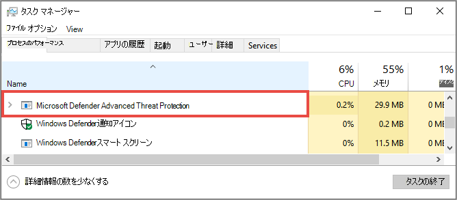

- <span data-ttu-id="c4e26-385">イベント **ビューアー アプリケーション**  >  **とサービス ログ操作** マネージャー  >  **をチェックして**、エラーが発生した場合を確認します。</span><span class="sxs-lookup"><span data-stu-id="c4e26-385">Check **Event Viewer** > **Applications and Services Logs** > **Operation Manager** to see if there are any errors.</span></span>

- <span data-ttu-id="c4e26-386">[**サービス]** で、**サーバー** Microsoft Monitoring Agent実行しているサーバーを確認します。</span><span class="sxs-lookup"><span data-stu-id="c4e26-386">In **Services**, check if the **Microsoft Monitoring Agent** is running on the server.</span></span> <span data-ttu-id="c4e26-387">例えば、</span><span class="sxs-lookup"><span data-stu-id="c4e26-387">For example,</span></span>

    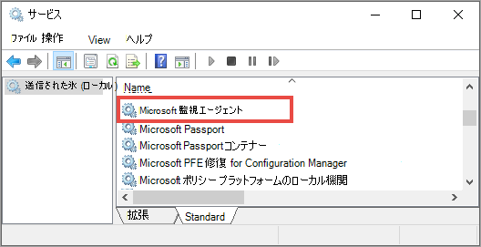

- <span data-ttu-id="c4e26-389">[Microsoft Monitoring Agent   >  **Azure Log Analytics (OMS) で**、ワークスペースを確認し、状態が実行されているのを確認します。</span><span class="sxs-lookup"><span data-stu-id="c4e26-389">In **Microsoft Monitoring Agent** > **Azure Log Analytics (OMS)**, check the Workspaces and verify that the status is running.</span></span>

    

- <span data-ttu-id="c4e26-391">デバイスがポータルの [デバイス] リスト **に反映されているのを** 確認します。</span><span class="sxs-lookup"><span data-stu-id="c4e26-391">Check to see that devices are reflected in the **Devices list** in the portal.</span></span>

## <a name="confirming-onboarding-of-newly-built-devices"></a><span data-ttu-id="c4e26-392">新しく構築されたデバイスのオンボーディングの確認</span><span class="sxs-lookup"><span data-stu-id="c4e26-392">Confirming onboarding of newly built devices</span></span>

<span data-ttu-id="c4e26-393">新しく構築されたデバイスにオンボーディングが展開されているが、完了していない場合は、インスタンスが発生する可能性があります。</span><span class="sxs-lookup"><span data-stu-id="c4e26-393">There may be instances when onboarding is deployed on a newly built device but not completed.</span></span>

<span data-ttu-id="c4e26-394">以下の手順では、次のシナリオのガイダンスを提供します。</span><span class="sxs-lookup"><span data-stu-id="c4e26-394">The steps below provide guidance for the following scenario:</span></span>

- <span data-ttu-id="c4e26-395">オンボード パッケージが新しく構築されたデバイスに展開される</span><span class="sxs-lookup"><span data-stu-id="c4e26-395">Onboarding package is deployed to newly built devices</span></span>
- <span data-ttu-id="c4e26-396">センサーが起動しないのは、アウトオブボックス エクスペリエンス (OOBE) または最初のユーザー ログオンが完了していないためです。</span><span class="sxs-lookup"><span data-stu-id="c4e26-396">Sensor does not start because the Out-of-box experience (OOBE) or first user logon has not been completed</span></span>
- <span data-ttu-id="c4e26-397">エンド ユーザーが最初のログオンを実行する前にデバイスがオフまたは再起動される</span><span class="sxs-lookup"><span data-stu-id="c4e26-397">Device is turned off or restarted before the end user performs a first logon</span></span>
- <span data-ttu-id="c4e26-398">このシナリオでは、オンボード パッケージが展開された場合でも、SENSE サービスは自動的に開始されません</span><span class="sxs-lookup"><span data-stu-id="c4e26-398">In this scenario, the SENSE service will not start automatically even though onboarding package was deployed</span></span>

<div class="alert"><span data-ttu-id="c4e26-399"><b>注:</b>SENSE サービスが[2021](https://support.microsoft.com/kb/5001384)年 4 月 22 日の更新プログラムのロールアップを使用して Windows 10 Version 1809 または Windows Server 2019 以降の Windows バージョンで開始するには、OOBE 後のユーザー ログオンが不要になります。 </span><span class="sxs-lookup"><span data-stu-id="c4e26-399"><b>NOTE:</b> User Logon after OOBE is no longer required for SENSE service to start on the following or more recent Windows versions: Windows 10, version 1809 or Windows Server 2019 with [April 22 2021 update rollup](https://support.microsoft.com/kb/5001384) </span></span></br> <span data-ttu-id="c4e26-400">Windows 10バージョン 1909 と[2021 年 4](https://support.microsoft.com/kb/5001396)月の更新プログラムのロールアップ </span><span class="sxs-lookup"><span data-stu-id="c4e26-400">Windows 10, version 1909 with [April 2021 update rollup](https://support.microsoft.com/kb/5001396) </span></span></br> <span data-ttu-id="c4e26-401">Windows 10 2021 年 4 月 28 日の更新プログラムのロールアップを含むバージョン[2004/20H2 のバージョン](https://support.microsoft.com/kb/5001391) </span><span class="sxs-lookup"><span data-stu-id="c4e26-401">Windows 10, version 2004/20H2 with [April 28 2021 update rollup](https://support.microsoft.com/kb/5001391) </span></span></div> 
<br></br>
> [!NOTE]
> <span data-ttu-id="c4e26-402">次の手順は、次の手順を使用する場合にのみMicrosoft Endpoint Configuration Manager。</span><span class="sxs-lookup"><span data-stu-id="c4e26-402">The following steps are only relevant when using Microsoft Endpoint Configuration Manager.</span></span> <span data-ttu-id="c4e26-403">アプリケーションを使用したオンボーディングの詳細については、「Microsoft Endpoint Configuration Manager [Microsoft Defender for Endpoint」を参照してください](/mem/configmgr/protect/deploy-use/windows-defender-advanced-threat-protection)。</span><span class="sxs-lookup"><span data-stu-id="c4e26-403">For more details about onboarding using Microsoft Endpoint Configuration Manager, see [Microsoft Defender for Endpoint](/mem/configmgr/protect/deploy-use/windows-defender-advanced-threat-protection).</span></span>

1. <span data-ttu-id="c4e26-404">アプリケーションを作成Microsoft Endpoint Configuration Manager。</span><span class="sxs-lookup"><span data-stu-id="c4e26-404">Create an application in Microsoft Endpoint Configuration Manager.</span></span>

    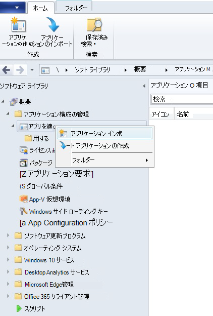

2. <span data-ttu-id="c4e26-406">[アプリケーション **情報を手動で指定する] を選択します**。</span><span class="sxs-lookup"><span data-stu-id="c4e26-406">Select **Manually specify the application information**.</span></span>

    

3. <span data-ttu-id="c4e26-408">アプリケーションに関する情報を指定し、[次へ] を **選択します**。</span><span class="sxs-lookup"><span data-stu-id="c4e26-408">Specify information about the application, then select **Next**.</span></span>

    

4. <span data-ttu-id="c4e26-410">ソフトウェア センターに関する情報を指定し、[次へ] を **選択します**。</span><span class="sxs-lookup"><span data-stu-id="c4e26-410">Specify information about the software center, then select **Next**.</span></span>

    

5. <span data-ttu-id="c4e26-412">[展開 **の種類] で、[** 追加] **を選択します**。</span><span class="sxs-lookup"><span data-stu-id="c4e26-412">In **Deployment types** select **Add**.</span></span>

    

6. <span data-ttu-id="c4e26-414">[展開 **の種類情報を手動で指定する] を選択し**、[次へ] を **選択します**。</span><span class="sxs-lookup"><span data-stu-id="c4e26-414">Select **Manually specify the deployment type information**, then select **Next**.</span></span>

    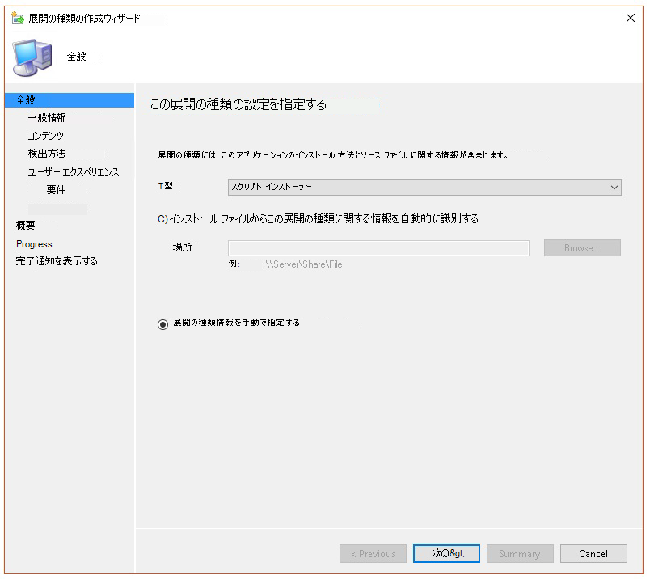

7. <span data-ttu-id="c4e26-416">展開の種類に関する情報を指定し、[次へ] を **選択します**。</span><span class="sxs-lookup"><span data-stu-id="c4e26-416">Specify information about the deployment type, then select **Next**.</span></span>

    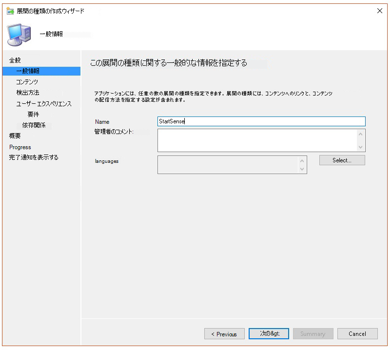

8. <span data-ttu-id="c4e26-418">[**コンテンツ インストール**  >  **プログラム] で、** 次のコマンドを指定します `net start sense` 。</span><span class="sxs-lookup"><span data-stu-id="c4e26-418">In **Content** > **Installation program** specify the command: `net start sense`.</span></span>

    

9. <span data-ttu-id="c4e26-420">[ **検出方法] で**、[ **ルールを構成してこの** 展開の種類の存在を検出する] を選択し、[句の追加] **を選択します**。</span><span class="sxs-lookup"><span data-stu-id="c4e26-420">In **Detection method**, select **Configure rules to detect the presence of this deployment type**, then select **Add Clause**.</span></span>

    

10. <span data-ttu-id="c4e26-422">次の検出ルールの詳細を指定し **、[OK] を選択します**。</span><span class="sxs-lookup"><span data-stu-id="c4e26-422">Specify the following detection rule details, then select **OK**:</span></span>

    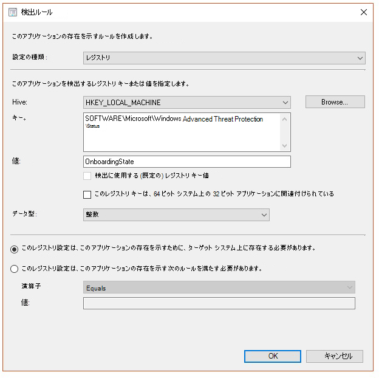

11. <span data-ttu-id="c4e26-424">[検出 **方法] で、[次** へ] **を選択します**。</span><span class="sxs-lookup"><span data-stu-id="c4e26-424">In **Detection method** select **Next**.</span></span>

    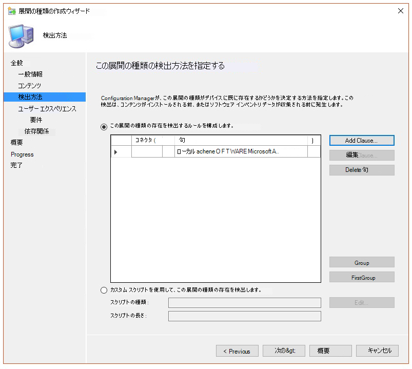

12. <span data-ttu-id="c4e26-426">[ **ユーザー エクスペリエンス] で**、次の情報を指定し、[次へ] を **選択します**。</span><span class="sxs-lookup"><span data-stu-id="c4e26-426">In **User Experience**, specify the following information, then select **Next**:</span></span>

    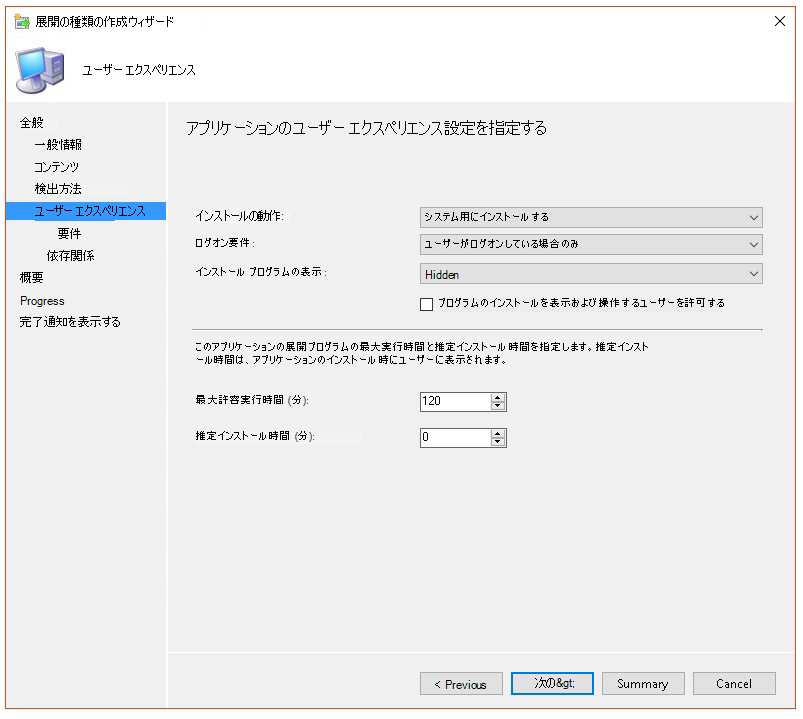

13. <span data-ttu-id="c4e26-428">[要件 **] で、[** 次へ] を **選択します**。</span><span class="sxs-lookup"><span data-stu-id="c4e26-428">In **Requirements**, select **Next**.</span></span>

    

14. <span data-ttu-id="c4e26-430">[ **依存関係] で、[** 次へ] を **選択します**。</span><span class="sxs-lookup"><span data-stu-id="c4e26-430">In **Dependencies**, select **Next**.</span></span>

    

15. <span data-ttu-id="c4e26-432">[概要 **] で、[** 次へ] を **選択します**。</span><span class="sxs-lookup"><span data-stu-id="c4e26-432">In **Summary**, select **Next**.</span></span>

    

16. <span data-ttu-id="c4e26-434">[ **完了] で**、[閉じる] **を選択します**。</span><span class="sxs-lookup"><span data-stu-id="c4e26-434">In **Completion**, select **Close**.</span></span>

    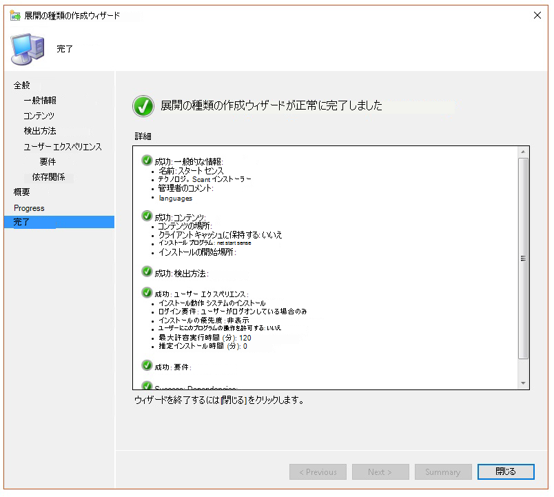

17. <span data-ttu-id="c4e26-436">[展開 **の種類] で**、[次へ] を **選択します**。</span><span class="sxs-lookup"><span data-stu-id="c4e26-436">In **Deployment types**, select **Next**.</span></span>

    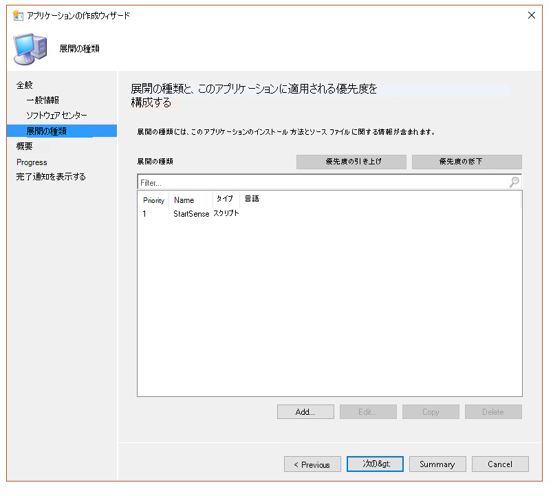

18. <span data-ttu-id="c4e26-438">[概要 **] で、[** 次へ] を **選択します**。</span><span class="sxs-lookup"><span data-stu-id="c4e26-438">In **Summary**, select **Next**.</span></span>

    

    <span data-ttu-id="c4e26-440">次に、状態が表示されます 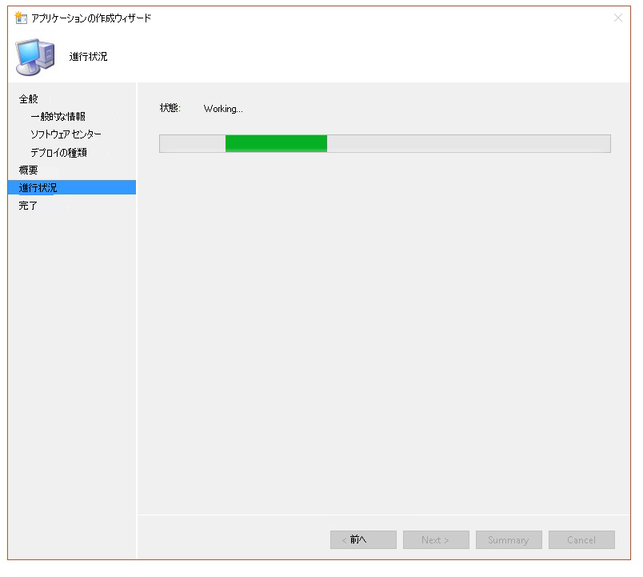</span><span class="sxs-lookup"><span data-stu-id="c4e26-440">The status is then displayed: </span></span>

19. <span data-ttu-id="c4e26-441">[ **完了] で**、[閉じる] **を選択します**。</span><span class="sxs-lookup"><span data-stu-id="c4e26-441">In **Completion**, select **Close**.</span></span>

    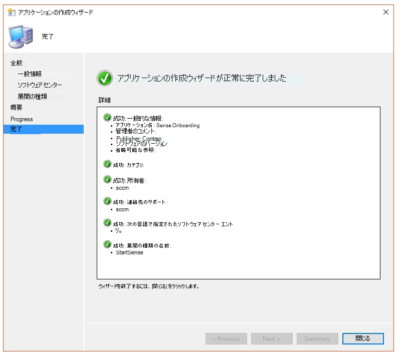

20. <span data-ttu-id="c4e26-443">これで、アプリを右クリックして [展開] を選択して、アプリケーションを **展開できます**。</span><span class="sxs-lookup"><span data-stu-id="c4e26-443">You can now deploy the application by right-clicking the app and selecting **Deploy**.</span></span>

    

21. <span data-ttu-id="c4e26-445">[全般 **] で** 、[ **依存関係のコンテンツを自動的に配布する] と [参照]** を **選択します**。</span><span class="sxs-lookup"><span data-stu-id="c4e26-445">In **General** select **Automatically distribute content for dependencies** and **Browse**.</span></span>

    

22. <span data-ttu-id="c4e26-447">[コンテンツ **] で [次** へ] **を選択します**。</span><span class="sxs-lookup"><span data-stu-id="c4e26-447">In **Content** select **Next**.</span></span>

    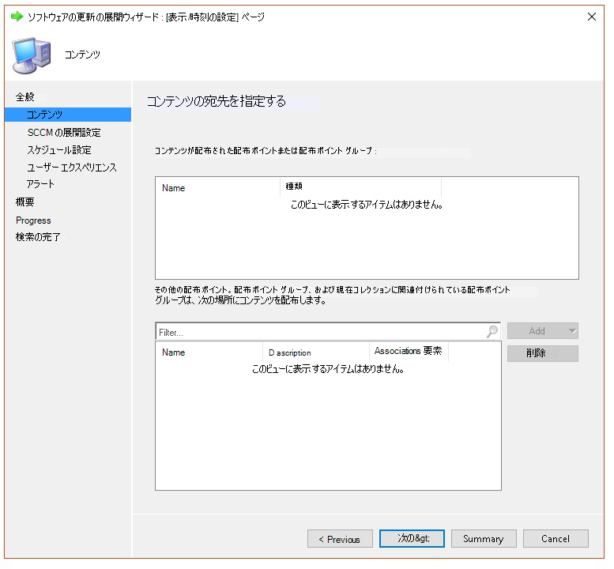

23. <span data-ttu-id="c4e26-449">[展開 **の設定] で**、[次へ] を **選択します**。</span><span class="sxs-lookup"><span data-stu-id="c4e26-449">In **Deployment settings**, select **Next**.</span></span>

    

24. <span data-ttu-id="c4e26-451">[**スケジュール] で\*\*\*\*、利用可能な時間の後にできるだけ早く** 選択し、[次へ] を **選択します**。</span><span class="sxs-lookup"><span data-stu-id="c4e26-451">In **Scheduling** select **As soon as possible after the available time**, then select **Next**.</span></span>

    

25. <span data-ttu-id="c4e26-453">[ **ユーザー エクスペリエンス] で**、[期限内またはメンテナンス 期間中に変更をコミットする **] (** 再起動が必要) を選択し、[次へ] を **選択します**。</span><span class="sxs-lookup"><span data-stu-id="c4e26-453">In **User experience**, select **Commit changes at deadline or during a maintenance window (requires restarts)**, then select **Next**.</span></span>

    

26. <span data-ttu-id="c4e26-455">[アラート **] で [** 次へ] **を選択します**。</span><span class="sxs-lookup"><span data-stu-id="c4e26-455">In **Alerts** select **Next**.</span></span>

    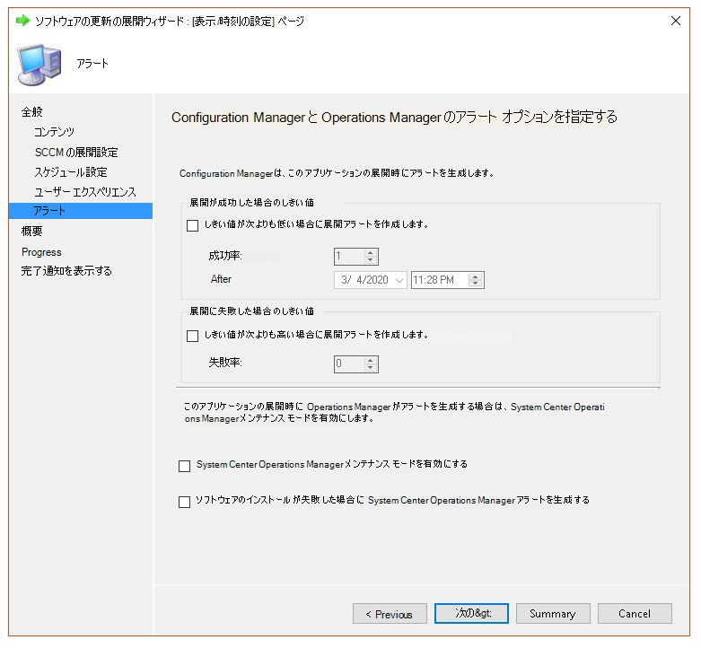

27. <span data-ttu-id="c4e26-457">[概要 **] で、[** 次へ] を **選択します**。</span><span class="sxs-lookup"><span data-stu-id="c4e26-457">In **Summary**, select **Next**.</span></span>

    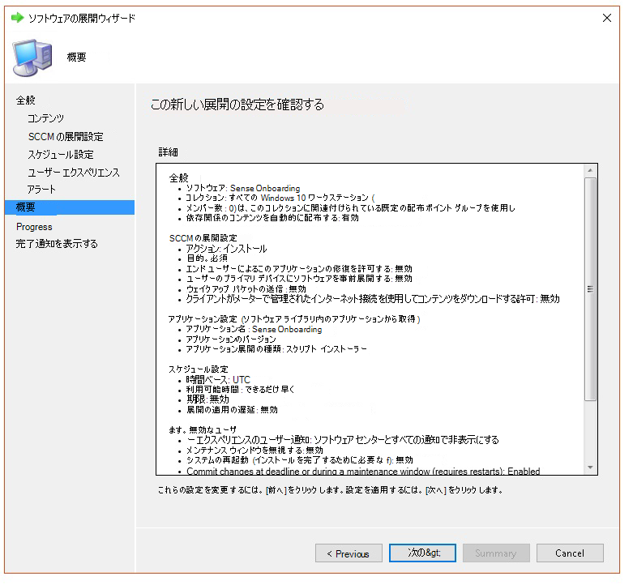

    <span data-ttu-id="c4e26-459">その後、状態が </span><span class="sxs-lookup"><span data-stu-id="c4e26-459">The status is then displayed </span></span>

28. <span data-ttu-id="c4e26-460">[ **完了] で**、[閉じる] **を選択します**。</span><span class="sxs-lookup"><span data-stu-id="c4e26-460">In **Completion**, select **Close**.</span></span>

    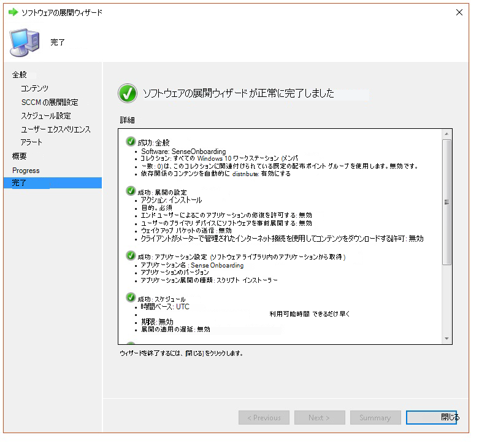


## <a name="related-topics"></a><span data-ttu-id="c4e26-462">関連項目</span><span class="sxs-lookup"><span data-stu-id="c4e26-462">Related topics</span></span>

- [<span data-ttu-id="c4e26-463">Microsoft Defender for Endpoint のトラブルシューティング</span><span class="sxs-lookup"><span data-stu-id="c4e26-463">Troubleshoot Microsoft Defender for Endpoint</span></span>](troubleshoot-mdatp.md)
- [<span data-ttu-id="c4e26-464">デバイスのオンボード</span><span class="sxs-lookup"><span data-stu-id="c4e26-464">Onboard devices</span></span>](onboard-configure.md)
- [<span data-ttu-id="c4e26-465">デバイス プロキシとインターネット接続の設定を構成する</span><span class="sxs-lookup"><span data-stu-id="c4e26-465">Configure device proxy and Internet connectivity settings</span></span>](configure-proxy-internet.md)
