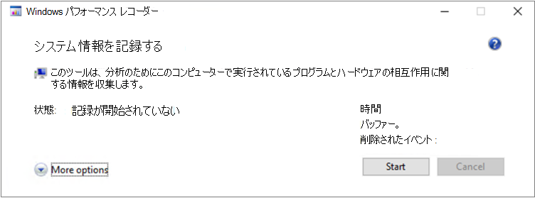

# <a name="troubleshoot-performance-issues-related-to-real-time-protection"></a><span data-ttu-id="d9dd0-104">リアルタイム保護に関連するパフォーマンスの問題のトラブルシューティング</span><span class="sxs-lookup"><span data-stu-id="d9dd0-104">Troubleshoot performance issues related to real-time protection</span></span>


[!INCLUDE [Microsoft 365 Defender rebranding](../../includes/microsoft-defender.md)]


<span data-ttu-id="d9dd0-105">**適用対象:**</span><span class="sxs-lookup"><span data-stu-id="d9dd0-105">**Applies to:**</span></span>

- [<span data-ttu-id="d9dd0-106">Microsoft Defender for Endpoint</span><span class="sxs-lookup"><span data-stu-id="d9dd0-106">Microsoft Defender for Endpoint</span></span>](https://go.microsoft.com/fwlink/p/?linkid=2146631)
 
<span data-ttu-id="d9dd0-107">Microsoft Defender for Endpoint のリアルタイム保護サービスに関連する CPU 使用率やパフォーマンスの問題がシステムで高い場合は、Microsoft サポートにチケットを提出できます。</span><span class="sxs-lookup"><span data-stu-id="d9dd0-107">If your system is having high CPU usage or performance issues related to the real-time protection service in Microsoft Defender for Endpoint, you can submit a ticket to Microsoft support.</span></span> <span data-ttu-id="d9dd0-108">「Microsoft Defender AV 診断 [データの収集」の手順に従います](/collect-diagnostic-data.md)。</span><span class="sxs-lookup"><span data-stu-id="d9dd0-108">Follow the steps in [Collect Microsoft Defender AV diagnostic data](/collect-diagnostic-data.md).</span></span>

<span data-ttu-id="d9dd0-109">管理者は、これらの問題を自分でトラブルシューティングできます。</span><span class="sxs-lookup"><span data-stu-id="d9dd0-109">As an admin, you can also troubleshoot these issues on your own.</span></span> 

<span data-ttu-id="d9dd0-110">最初に、問題が別のソフトウェアによって引き起こされているのを確認する必要があります。</span><span class="sxs-lookup"><span data-stu-id="d9dd0-110">First, you might want to check if the issue is being caused by another software.</span></span> <span data-ttu-id="d9dd0-111">「ウイルス [対策の除外をベンダーに確認する」を参照してください](#check-with-vendor-for-antivirus-exclusions)。</span><span class="sxs-lookup"><span data-stu-id="d9dd0-111">Read [Check with vendor for antivirus exclusions](#check-with-vendor-for-antivirus-exclusions).</span></span>

<span data-ttu-id="d9dd0-112">それ以外の場合は、「Microsoft Protection Log の分析」の手順に従って、特定されたパフォーマンスの問題に関連する [ソフトウェアを特定できます](#analyze-the-microsoft-protection-log)。</span><span class="sxs-lookup"><span data-stu-id="d9dd0-112">Otherwise, you can identify which software is related to the identified performance issue by following the steps in [Analyze the Microsoft Protection Log](#analyze-the-microsoft-protection-log).</span></span> 

<span data-ttu-id="d9dd0-113">次の手順に従って、Microsoft サポートへの申請に追加のログを提供することもできます。</span><span class="sxs-lookup"><span data-stu-id="d9dd0-113">You can also provide additional logs to your submission to Microsoft support by following the steps in:</span></span>
- [<span data-ttu-id="d9dd0-114">プロセス モニターを使用してプロセス ログをキャプチャする</span><span class="sxs-lookup"><span data-stu-id="d9dd0-114">Capture process logs using Process Monitor</span></span>](#capture-process-logs-using-process-monitor)
- [<span data-ttu-id="d9dd0-115">Windows Performance Recorder を使用してパフォーマンス ログをキャプチャする</span><span class="sxs-lookup"><span data-stu-id="d9dd0-115">Capture performance logs using Windows Performance Recorder</span></span>](#capture-performance-logs-using-windows-performance-recorder) 

## <a name="check-with-vendor-for-antivirus-exclusions"></a><span data-ttu-id="d9dd0-116">ウイルス対策の除外をベンダーに確認する</span><span class="sxs-lookup"><span data-stu-id="d9dd0-116">Check with vendor for antivirus exclusions</span></span>

<span data-ttu-id="d9dd0-117">システムのパフォーマンスに影響を与えるソフトウェアを簡単に特定できる場合は、ソフトウェア ベンダーのナレッジ ベースまたはサポート センターにアクセスします。</span><span class="sxs-lookup"><span data-stu-id="d9dd0-117">If you can readily identify the software affecting system performance, go to the software vendor's knowledge base or support center.</span></span> <span data-ttu-id="d9dd0-118">ウイルス対策の除外に関する推奨事項がある場合は検索します。</span><span class="sxs-lookup"><span data-stu-id="d9dd0-118">Search if they have recommendations about antivirus exclusions.</span></span> <span data-ttu-id="d9dd0-119">ベンダーの Web サイトにサポート チケットが存在しない場合は、サポート チケットを開いて発行を求めできます。</span><span class="sxs-lookup"><span data-stu-id="d9dd0-119">If the vendor's website does not have them, you can open a support ticket with them and ask them to publish one.</span></span> 

<span data-ttu-id="d9dd0-120">ソフトウェア ベンダーは、「業界とのパートナー」のさまざまなガイドラインに従って誤検知を最小限に [することをお勧めします](https://www.microsoft.com/security/blog/2018/08/16/partnering-with-the-industry-to-minimize-false-positives/)。</span><span class="sxs-lookup"><span data-stu-id="d9dd0-120">We recommend that software vendors follow the various guidelines in [Partnering with the industry to minimize false positives](https://www.microsoft.com/security/blog/2018/08/16/partnering-with-the-industry-to-minimize-false-positives/).</span></span> <span data-ttu-id="d9dd0-121">ベンダーは、Microsoft Defender セキュリティ インテリジェンス ポータル [(MDSI) を使用してソフトウェアを提出できます](https://www.microsoft.com/wdsi/filesubmission?persona=SoftwareDeveloper)。</span><span class="sxs-lookup"><span data-stu-id="d9dd0-121">The vendor can submit their software through the [Microsoft Defender Security Intelligence portal (MDSI)](https://www.microsoft.com/wdsi/filesubmission?persona=SoftwareDeveloper).</span></span>


## <a name="analyze-the-microsoft-protection-log"></a><span data-ttu-id="d9dd0-122">Microsoft Protection Log の分析</span><span class="sxs-lookup"><span data-stu-id="d9dd0-122">Analyze the Microsoft Protection Log</span></span>

<span data-ttu-id="d9dd0-123">**MPLog-xxxxxxxx-xxxxxx.log** では、実行中のソフトウェアの推定パフォーマンス影響情報を *EstimatedImpact として見つけることができます*。</span><span class="sxs-lookup"><span data-stu-id="d9dd0-123">In **MPLog-xxxxxxxx-xxxxxx.log**, you can find the estimated performance impact information of running software as *EstimatedImpact*:</span></span>
    
`Per-process counts:ProcessImageName: smsswd.exe, TotalTime: 6597, Count: 1406, MaxTime: 609, MaxTimeFile: \Device\HarddiskVolume3\_SMSTaskSequence\Packages\WQ1008E9\Files\FramePkg.exe, EstimatedImpact: 65%`

| <span data-ttu-id="d9dd0-124">フィールド名</span><span class="sxs-lookup"><span data-stu-id="d9dd0-124">Field name</span></span> | <span data-ttu-id="d9dd0-125">説明</span><span class="sxs-lookup"><span data-stu-id="d9dd0-125">Description</span></span> |
|---|---|
|<span data-ttu-id="d9dd0-126">ProcessImageName</span><span class="sxs-lookup"><span data-stu-id="d9dd0-126">ProcessImageName</span></span> | <span data-ttu-id="d9dd0-127">プロセス イメージ名</span><span class="sxs-lookup"><span data-stu-id="d9dd0-127">Process image name</span></span> |
| <span data-ttu-id="d9dd0-128">TotalTime</span><span class="sxs-lookup"><span data-stu-id="d9dd0-128">TotalTime</span></span> | <span data-ttu-id="d9dd0-129">このプロセスによってアクセスされたファイルのスキャンに費やされた累積時間 (ミリ秒単位)</span><span class="sxs-lookup"><span data-stu-id="d9dd0-129">The cumulative duration in milliseconds spent in scans of files accessed by this process</span></span> |
|<span data-ttu-id="d9dd0-130">カウント</span><span class="sxs-lookup"><span data-stu-id="d9dd0-130">Count</span></span> | <span data-ttu-id="d9dd0-131">このプロセスによってアクセスされるスキャンされたファイルの数</span><span class="sxs-lookup"><span data-stu-id="d9dd0-131">The number of scanned files accessed by this process</span></span> |
|<span data-ttu-id="d9dd0-132">MaxTime</span><span class="sxs-lookup"><span data-stu-id="d9dd0-132">MaxTime</span></span> |  <span data-ttu-id="d9dd0-133">このプロセスによってアクセスされるファイルの最長単一スキャンの時間 (ミリ秒単位)</span><span class="sxs-lookup"><span data-stu-id="d9dd0-133">The duration in milliseconds in the longest single scan of a file accessed by this process</span></span> |
| <span data-ttu-id="d9dd0-134">MaxTimeFile</span><span class="sxs-lookup"><span data-stu-id="d9dd0-134">MaxTimeFile</span></span> | <span data-ttu-id="d9dd0-135">期間の最長スキャンが記録されたこのプロセスによってアクセスされるファイル `MaxTime` のパス</span><span class="sxs-lookup"><span data-stu-id="d9dd0-135">The path of the file accessed by this process for which the longest scan of `MaxTime` duration was recorded</span></span> |
| <span data-ttu-id="d9dd0-136">EstimatedImpact</span><span class="sxs-lookup"><span data-stu-id="d9dd0-136">EstimatedImpact</span></span> | <span data-ttu-id="d9dd0-137">このプロセスでスキャンアクティビティが発生した期間からこのプロセスによってアクセスされたファイルのスキャンに費やされた時間の割合</span><span class="sxs-lookup"><span data-stu-id="d9dd0-137">The percentage of time spent in scans for files accessed by this process out of the period in which this process experienced scan activity</span></span> |

<span data-ttu-id="d9dd0-138">パフォーマンスへの影響が大きい場合は [、「Microsoft Defender ウイルス](collect-diagnostic-data.md)対策スキャンの除外の構成と検証」の手順に従って、パス/プロセスの除外にプロセスを追加してみてください。</span><span class="sxs-lookup"><span data-stu-id="d9dd0-138">If the performance impact is high, try adding the process to the Path/Process exclusions by following the steps in [Configure and validate exclusions for Microsoft Defender Antivirus scans](collect-diagnostic-data.md).</span></span>

<span data-ttu-id="d9dd0-139">前の手順で問題が解決しない場合は、次のセクションのプロセス モニター[](#capture-process-logs-using-process-monitor)または Windows[パフォーマンス](#capture-performance-logs-using-windows-performance-recorder)レコーダーを使用して詳細を収集できます。</span><span class="sxs-lookup"><span data-stu-id="d9dd0-139">If the previous step doesn't solve the problem, you can collect more information through the [Process Monitor](#capture-process-logs-using-process-monitor) or the [Windows Performance Recorder](#capture-performance-logs-using-windows-performance-recorder) in the following sections.</span></span>
     
## <a name="capture-process-logs-using-process-monitor"></a><span data-ttu-id="d9dd0-140">プロセス モニターを使用してプロセス ログをキャプチャする</span><span class="sxs-lookup"><span data-stu-id="d9dd0-140">Capture process logs using Process Monitor</span></span>

<span data-ttu-id="d9dd0-141">プロセス モニター (ProcMon) は、リアルタイム プロセスを表示できる高度な監視ツールです。</span><span class="sxs-lookup"><span data-stu-id="d9dd0-141">Process Monitor (ProcMon) is an advanced monitoring tool that can show real-time processes.</span></span> <span data-ttu-id="d9dd0-142">これを使用して、パフォーマンスの問題が発生している場合にキャプチャできます。</span><span class="sxs-lookup"><span data-stu-id="d9dd0-142">You can use this to capture the performance issue as it is occurring.</span></span>

1. <span data-ttu-id="d9dd0-143">プロセス [モニター v3.60 を](/sysinternals/downloads/procmon) 次のようなフォルダーにダウンロードします `C:\temp` 。</span><span class="sxs-lookup"><span data-stu-id="d9dd0-143">Download [Process Monitor v3.60](/sysinternals/downloads/procmon) to a folder like `C:\temp`.</span></span>

2. <span data-ttu-id="d9dd0-144">Web のファイルのマークを削除するには、次の方法を実行します。</span><span class="sxs-lookup"><span data-stu-id="d9dd0-144">To remove the file's mark of the web:</span></span>
    1. <span data-ttu-id="d9dd0-145">[プロパティ] を **右クリックProcessMonitor.zipし、[** プロパティ] を **選択します**。</span><span class="sxs-lookup"><span data-stu-id="d9dd0-145">Right-click **ProcessMonitor.zip** and select **Properties**.</span></span>
    1. <span data-ttu-id="d9dd0-146">[全般] *タブで* 、[セキュリティ] を *探します*。</span><span class="sxs-lookup"><span data-stu-id="d9dd0-146">Under the *General* tab, look for *Security*.</span></span>
    1. <span data-ttu-id="d9dd0-147">[ブロック解除] の横 **にあるチェック ボックスをオンにします**。</span><span class="sxs-lookup"><span data-stu-id="d9dd0-147">Check the box beside **Unblock**.</span></span>
    1. <span data-ttu-id="d9dd0-148">**[適用]** を選択します。</span><span class="sxs-lookup"><span data-stu-id="d9dd0-148">Select **Apply**.</span></span>
    
     

3. <span data-ttu-id="d9dd0-150">フォルダー のパスがに `C:\temp` なじむファイルを解凍します `C:\temp\ProcessMonitor` 。</span><span class="sxs-lookup"><span data-stu-id="d9dd0-150">Unzip the file in `C:\temp` so that the folder path will be `C:\temp\ProcessMonitor`.</span></span> 

4. <span data-ttu-id="d9dd0-151">トラブルシューティング **ProcMon.exe**  Windows クライアントまたは Windows サーバーにコピーします。</span><span class="sxs-lookup"><span data-stu-id="d9dd0-151">Copy **ProcMon.exe**  to the Windows client or Windows server you're troubleshooting.</span></span>  

5. <span data-ttu-id="d9dd0-152">ProcMon を実行する前に、CPU 使用率の高い問題に関連しない他のすべてのアプリケーションが閉じられます。</span><span class="sxs-lookup"><span data-stu-id="d9dd0-152">Before running ProcMon, make sure all other applications not related to the high CPU usage issue are closed.</span></span> <span data-ttu-id="d9dd0-153">これにより、チェックするプロセスの数が最小限になります。</span><span class="sxs-lookup"><span data-stu-id="d9dd0-153">Doing this will minimize the number of processes to check.</span></span>

6. <span data-ttu-id="d9dd0-154">ProcMon は 2 つの方法で起動できます。</span><span class="sxs-lookup"><span data-stu-id="d9dd0-154">You can launch ProcMon in two ways.</span></span>
    1. <span data-ttu-id="d9dd0-155">[管理者] を **右ProcMon.exe** し、[管理者として **実行] を選択します**。</span><span class="sxs-lookup"><span data-stu-id="d9dd0-155">Right-click **ProcMon.exe** and select **Run as administrator**.</span></span> 
    

        <span data-ttu-id="d9dd0-156">ログが自動的に開始されますので、虫眼鏡アイコンを選択して現在のキャプチャを停止するか、キーボード ショートカット **Ctrl + E を使用します**。</span><span class="sxs-lookup"><span data-stu-id="d9dd0-156">Since logging starts automatically, select the magnifying glass icon  to stop the current capture or use the keyboard shortcut **Ctrl+E**.</span></span>
 
        

        <span data-ttu-id="d9dd0-158">キャプチャが停止したと確認するには、虫眼鏡アイコンが赤い X で表示されるのを確認します。</span><span class="sxs-lookup"><span data-stu-id="d9dd0-158">To verify that you have stopped the capture, check if the magnifying glass icon now appears with a red X.</span></span>

                 

        <span data-ttu-id="d9dd0-160">次に、前のキャプチャをクリアするには、消しゴムアイコンを選択します。</span><span class="sxs-lookup"><span data-stu-id="d9dd0-160">Next, to clear the earlier capture, select the eraser icon.</span></span>

        

        <span data-ttu-id="d9dd0-162">または、キーボード ショートカット **Ctrl + X を使用します**。</span><span class="sxs-lookup"><span data-stu-id="d9dd0-162">Or use the keyboard shortcut **Ctrl+X**.</span></span>

    2. <span data-ttu-id="d9dd0-163">2 つ目の方法は、コマンド **ラインを管理者** として実行し、次にプロセス モニター パスから実行します。</span><span class="sxs-lookup"><span data-stu-id="d9dd0-163">The second way is to run the **command line** as admin, then from the Process Monitor path, run:</span></span>

        
 
        ```console
        Procmon.exe /AcceptEula /Noconnect /Profiling
        ```
        
        >[!TIP] 
        ><span data-ttu-id="d9dd0-165">データをキャプチャする場合は、ProcMon ウィンドウを可能な限り小さくして、トレースを簡単に開始および停止できます。</span><span class="sxs-lookup"><span data-stu-id="d9dd0-165">Make the ProcMon window as small as possible when capturing data so you can easily start and stop the trace.</span></span>
        > 
        >
    
7. <span data-ttu-id="d9dd0-167">手順 6 の手順の 1 つを実行すると、次にフィルターを設定するオプションが表示されます。</span><span class="sxs-lookup"><span data-stu-id="d9dd0-167">After following one of the procedures in step 6, you'll next see an option to set filters.</span></span> <span data-ttu-id="d9dd0-168">[**OK**] を選択します。</span><span class="sxs-lookup"><span data-stu-id="d9dd0-168">Select **OK**.</span></span> <span data-ttu-id="d9dd0-169">キャプチャが完了したら、いつでも結果をフィルター処理できます。</span><span class="sxs-lookup"><span data-stu-id="d9dd0-169">You can always filter the results after the capture is completed.</span></span>
 
    ![[フィルター処理名] は [システム除外]](images/procmon-filter-options.png) 

8. <span data-ttu-id="d9dd0-171">キャプチャを開始するには、虫眼鏡アイコンを再度選択します。</span><span class="sxs-lookup"><span data-stu-id="d9dd0-171">To start the capture, select the magnifying glass icon again.</span></span>
     
9. <span data-ttu-id="d9dd0-172">問題を再現します。</span><span class="sxs-lookup"><span data-stu-id="d9dd0-172">Reproduce the problem.</span></span>
 
    >[!TIP] 
    ><span data-ttu-id="d9dd0-173">問題が完全に再現されるのを待ち、トレースの開始時にタイムスタンプをメモします。</span><span class="sxs-lookup"><span data-stu-id="d9dd0-173">Wait for the problem to be fully reproduced, then take note of the timestamp when the trace started.</span></span>
    

10. <span data-ttu-id="d9dd0-174">CPU 使用率が高い状態の間に 2 ~ 4 分のプロセス アクティビティが発生したら、拡大鏡アイコンを選択してキャプチャを停止します。</span><span class="sxs-lookup"><span data-stu-id="d9dd0-174">Once you have two to four minutes of process activity during the high CPU usage condition, stop the capture by selecting the magnifying glass icon.</span></span>

11. <span data-ttu-id="d9dd0-175">一意の名前と .pml 形式でキャプチャを保存するには、[ファイル] を選択し、[**保存**]**を選択します**。ラジオ ボタンすべてのイベントとネイティブプロセス モニター形式 **(PML)** を選択してください。</span><span class="sxs-lookup"><span data-stu-id="d9dd0-175">To save the capture with a unique name and with the .pml format, select **File** then select **Save...**. Make sure to select the radio buttons **All events** and **Native Process Monitor Format (PML)**.</span></span>

    

12. <span data-ttu-id="d9dd0-177">追跡を向上するには、既定のパスを次の場所 `C:\temp\ProcessMonitor\LogFile.PML` に変更 `C:\temp\ProcessMonitor\%ComputerName%_LogFile_MMDDYEAR_Repro_of_issue.PML` します。</span><span class="sxs-lookup"><span data-stu-id="d9dd0-177">For better tracking, change the default path from `C:\temp\ProcessMonitor\LogFile.PML` to `C:\temp\ProcessMonitor\%ComputerName%_LogFile_MMDDYEAR_Repro_of_issue.PML` where:</span></span>
    - <span data-ttu-id="d9dd0-178">`%ComputerName%` はデバイス名です</span><span class="sxs-lookup"><span data-stu-id="d9dd0-178">`%ComputerName%` is the device name</span></span>
    - <span data-ttu-id="d9dd0-179">`MMDDYEAR` は月、日、および年です。</span><span class="sxs-lookup"><span data-stu-id="d9dd0-179">`MMDDYEAR` is the month, day, and year</span></span>
    -  <span data-ttu-id="d9dd0-180">`Repro_of_issue` は、再現しようとしている問題の名前です。</span><span class="sxs-lookup"><span data-stu-id="d9dd0-180">`Repro_of_issue` is the name of the issue you're trying to reproduce</span></span>

    >[!TIP] 
    > <span data-ttu-id="d9dd0-181">作業システムがある場合は、比較するサンプル ログを取得できます。</span><span class="sxs-lookup"><span data-stu-id="d9dd0-181">If you have a working system, you might want to get a sample log to compare.</span></span>

13. <span data-ttu-id="d9dd0-182">.pml ファイルを圧縮し、Microsoft サポートに提出します。</span><span class="sxs-lookup"><span data-stu-id="d9dd0-182">Zip the .pml file and submit it to Microsoft support.</span></span>


## <a name="capture-performance-logs-using-windows-performance-recorder"></a><span data-ttu-id="d9dd0-183">Windows Performance Recorder を使用してパフォーマンス ログをキャプチャする</span><span class="sxs-lookup"><span data-stu-id="d9dd0-183">Capture performance logs using Windows Performance Recorder</span></span>

<span data-ttu-id="d9dd0-184">Windows Performance Recorder (WPR) を使用して、Microsoft サポートへの申請に追加情報を含めさせることができます。</span><span class="sxs-lookup"><span data-stu-id="d9dd0-184">You can use Windows Performance Recorder (WPR) to include additional information in your submission to Microsoft support.</span></span> <span data-ttu-id="d9dd0-185">WPR は、Windows レコーディング用のイベント トレースを作成する強力なレコーディング ツールです。</span><span class="sxs-lookup"><span data-stu-id="d9dd0-185">WPR is a powerful recording tool that creates Event Tracing for Windows recordings.</span></span> 

<span data-ttu-id="d9dd0-186">WPR は Windows アセスメントと展開キット (Windows ADK) の一部であり、Windows ADK のダウンロードと [インストールからダウンロードできます](/windows-hardware/get-started/adk-install)。</span><span class="sxs-lookup"><span data-stu-id="d9dd0-186">WPR is part of the Windows Assessment and Deployment Kit (Windows ADK) and can be downloaded from [Download and install the Windows ADK](/windows-hardware/get-started/adk-install).</span></span> <span data-ttu-id="d9dd0-187">また [、Windows](https://developer.microsoft.com/windows/downloads/windows-10-sdk/)10 SDK で Windows 10 ソフトウェア開発キットの一部としてダウンロードすることもできます。</span><span class="sxs-lookup"><span data-stu-id="d9dd0-187">You can also download it as part of the Windows 10 Software Development Kit at [Windows 10 SDK](https://developer.microsoft.com/windows/downloads/windows-10-sdk/).</span></span>

<span data-ttu-id="d9dd0-188">WPR ユーザー インターフェイスを使用するには、「WPR UI を使用してパフォーマンス ログをキャプチャする」 [の手順に従います](#capture-performance-logs-using-the-wpr-ui)。</span><span class="sxs-lookup"><span data-stu-id="d9dd0-188">You can use the WPR user interface by following the steps in [Capture performance logs using the WPR UI](#capture-performance-logs-using-the-wpr-ui).</span></span> 

<span data-ttu-id="d9dd0-189">または [、「WPR CLI](#capture-performance-logs-using-the-wpr-cli)を使用してパフォーマンス ログをキャプチャする」の手順に従って、Windows 8 以降のバージョンで使用できるコマンド ライン ツール *wpr.exe* を使用することもできます。</span><span class="sxs-lookup"><span data-stu-id="d9dd0-189">Alternatively, you can also use the command-line tool *wpr.exe*, which is available in Windows 8 and later versions  by following the steps in [Capture performance logs using the WPR CLI](#capture-performance-logs-using-the-wpr-cli).</span></span>


### <a name="capture-performance-logs-using-the-wpr-ui"></a><span data-ttu-id="d9dd0-190">WPR UI を使用してパフォーマンス ログをキャプチャする</span><span class="sxs-lookup"><span data-stu-id="d9dd0-190">Capture performance logs using the WPR UI</span></span>

>[!TIP]
><span data-ttu-id="d9dd0-191">問題が発生している複数のデバイスがある場合は、RAM の量が最も多いデバイスを使用します。</span><span class="sxs-lookup"><span data-stu-id="d9dd0-191">If you have multiple devices where the issue is occurring, use the one which has the most amount of RAM.</span></span>

1. <span data-ttu-id="d9dd0-192">WPR をダウンロードしてインストールします。</span><span class="sxs-lookup"><span data-stu-id="d9dd0-192">Download and install WPR.</span></span>

2. <span data-ttu-id="d9dd0-193">*[Windows キット] で*、[Windows パフォーマンス レコーダー **] を右クリックします**。</span><span class="sxs-lookup"><span data-stu-id="d9dd0-193">Under *Windows Kits*, right-click **Windows Performance Recorder**.</span></span> 

    ![[スタート] メニュー](images/wpr-01.png)

    <span data-ttu-id="d9dd0-195">[詳細 **] を選択します**。</span><span class="sxs-lookup"><span data-stu-id="d9dd0-195">Select **More**.</span></span> <span data-ttu-id="d9dd0-196">[管理者 **として実行] を選択します**。</span><span class="sxs-lookup"><span data-stu-id="d9dd0-196">Select **Run as administrator**.</span></span>

3. <span data-ttu-id="d9dd0-197">[ユーザー アカウント制御] ダイアログ ボックスが表示されたら、[はい] を **選択します**。</span><span class="sxs-lookup"><span data-stu-id="d9dd0-197">When the User Account Control dialog box appears, select **Yes**.</span></span>

    

4. <span data-ttu-id="d9dd0-199">次に [、Microsoft Defender for Endpoint 分析プロファイルをダウンロード](https://github.com/YongRhee-MDE/Scripts/blob/master/MDAV.wprp) し、次のような `WD.wprp` フォルダーに保存します `C:\temp` 。</span><span class="sxs-lookup"><span data-stu-id="d9dd0-199">Next, download the [Microsoft Defender for Endpoint analysis](https://github.com/YongRhee-MDE/Scripts/blob/master/MDAV.wprp) profile and save as `WD.wprp` to a folder like `C:\temp`.</span></span> 
     
5. <span data-ttu-id="d9dd0-200">[WPR] ダイアログ ボックスで、[その他のオプション] **を選択します**。</span><span class="sxs-lookup"><span data-stu-id="d9dd0-200">On the WPR dialog box, select **More options**.</span></span>

    

6. <span data-ttu-id="d9dd0-202">[ **プロファイルの追加...] を選択し** 、ファイルのパスを参照 `WD.wprp` します。</span><span class="sxs-lookup"><span data-stu-id="d9dd0-202">Select **Add Profiles...** and browse to the path of the `WD.wprp` file.</span></span>

7. <span data-ttu-id="d9dd0-203">その後、その下に Microsoft Defender  *for Endpoint* Analysis という名前のカスタム測定値の下に新しいプロファイル セットが表示されます。</span><span class="sxs-lookup"><span data-stu-id="d9dd0-203">After that, you should see a new profile set under *Custom measurements* named *Microsoft Defender for Endpoint analysis* underneath it.</span></span>

    

    >[!WARNING]
    ><span data-ttu-id="d9dd0-205">Windows Server に 64 GB 以上の RAM がある場合は、代わりにカスタム測定値 `Microsoft Defender for Endpoint analysis for large servers` を使用します `Microsoft Defender for Endpoint analysis` 。</span><span class="sxs-lookup"><span data-stu-id="d9dd0-205">If your Windows Server has 64 GB of RAM or more, use the custom measurement `Microsoft Defender for Endpoint analysis for large servers` instead of `Microsoft Defender for Endpoint analysis`.</span></span> <span data-ttu-id="d9dd0-206">それ以外の場合、システムが大量の非ページ プール メモリまたはバッファーを消費し、システムが不安定な場合があります。</span><span class="sxs-lookup"><span data-stu-id="d9dd0-206">Otherwise, your system could consume a high amount of non-paged pool memory or buffers which can lead to system instability.</span></span> <span data-ttu-id="d9dd0-207">[リソース分析] を展開して、追加するプロファイル **を選択できます**。</span><span class="sxs-lookup"><span data-stu-id="d9dd0-207">You can choose which profiles to add by expanding **Resource Analysis**.</span></span> <span data-ttu-id="d9dd0-208">このカスタム プロファイルは、詳細なパフォーマンス分析に必要なコンテキストを提供します。</span><span class="sxs-lookup"><span data-stu-id="d9dd0-208">This custom profile provides the necessary context for in-depth performance analysis.</span></span>
 
8. <span data-ttu-id="d9dd0-209">WPR UI でカスタム測定 Microsoft Defender for Endpoint 詳細分析プロファイルを使用するには、次の操作を行います。</span><span class="sxs-lookup"><span data-stu-id="d9dd0-209">To use the custom measurement Microsoft Defender for Endpoint verbose analysis profile in the WPR UI:</span></span>

    1. <span data-ttu-id="d9dd0-210">[第 1 レベルのトリアージ]、[リソース分析]、および [シナリオ分析] グループの下で *プロファイルが\*\*選択されません*。</span><span class="sxs-lookup"><span data-stu-id="d9dd0-210">Ensure no profiles are selected under the *First-level triage*, *Resource Analysis* and *Scenario Analysis* groups.</span></span>
    2. <span data-ttu-id="d9dd0-211">[カスタム **測定値] を選択します**。</span><span class="sxs-lookup"><span data-stu-id="d9dd0-211">Select **Custom measurements**.</span></span>
    3. <span data-ttu-id="d9dd0-212">[ **エンドポイント分析用 Microsoft Defender] を選択します**。</span><span class="sxs-lookup"><span data-stu-id="d9dd0-212">Select **Microsoft Defender for Endpoint analysis**.</span></span>
    4. <span data-ttu-id="d9dd0-213">[詳細 **レベル] で** [ *詳細] を* 選択します。</span><span class="sxs-lookup"><span data-stu-id="d9dd0-213">Select **Verbose** under *Detail* level.</span></span>
    1. <span data-ttu-id="d9dd0-214">[ログ **モード] で** **[ファイル] または [メモリ** ] を選択します。</span><span class="sxs-lookup"><span data-stu-id="d9dd0-214">Select **File** or **Memory** under Logging mode.</span></span> 

    >[!important]
    ><span data-ttu-id="d9dd0-215">パフォーマンスの問題 *をユーザー* が直接再現できる場合は、[ファイル] を選択してファイル ログ モードを使用する必要があります。</span><span class="sxs-lookup"><span data-stu-id="d9dd0-215">You should select *File* to use the file logging mode if the performance issue can be reproduced directly by the user.</span></span> <span data-ttu-id="d9dd0-216">ほとんどの問題は、このカテゴリに該当します。</span><span class="sxs-lookup"><span data-stu-id="d9dd0-216">Most issues fall under this category.</span></span> <span data-ttu-id="d9dd0-217">ただし、ユーザーが問題を直接再現することはできませんが、問題が発生すると簡単に気付く場合は、[メモリ]を選択してメモリ ログ モードを使用する必要があります。</span><span class="sxs-lookup"><span data-stu-id="d9dd0-217">However, if the user cannot directly reproduce the issue but can easily notice it once the issue occurs, the user should select *Memory* to use the memory logging mode.</span></span> <span data-ttu-id="d9dd0-218">これにより、長い実行時間のためにトレース ログが過度に膨らむのを防ぎ、</span><span class="sxs-lookup"><span data-stu-id="d9dd0-218">This ensures that the trace log will not inflate excessively due to the long run time.</span></span>

9. <span data-ttu-id="d9dd0-219">これで、データを収集する準備ができました。</span><span class="sxs-lookup"><span data-stu-id="d9dd0-219">Now you're ready to collect data.</span></span> <span data-ttu-id="d9dd0-220">パフォーマンスの問題の再現に関係ないすべてのアプリケーションを終了します。</span><span class="sxs-lookup"><span data-stu-id="d9dd0-220">Exit all the applications that are not relevant to reproducing the performance issue.</span></span> <span data-ttu-id="d9dd0-221">[オプションを **非表示にする] を** 選択すると、WPR ウィンドウの領域を小さくすることができます。</span><span class="sxs-lookup"><span data-stu-id="d9dd0-221">You can select **Hide options** to keep the space occupied by the WPR window small.</span></span>

    

    >[!TIP]
    ><span data-ttu-id="d9dd0-223">トレースを 1 秒で開始してみてください。</span><span class="sxs-lookup"><span data-stu-id="d9dd0-223">Try starting the trace at whole number seconds.</span></span> <span data-ttu-id="d9dd0-224">たとえば、01:30:00 です。</span><span class="sxs-lookup"><span data-stu-id="d9dd0-224">For instance, 01:30:00.</span></span> <span data-ttu-id="d9dd0-225">これにより、データの分析が容易になります。</span><span class="sxs-lookup"><span data-stu-id="d9dd0-225">This will make it easier to analyze the data.</span></span> <span data-ttu-id="d9dd0-226">また、問題が再現された正確なタイムスタンプを追跡してみてください。</span><span class="sxs-lookup"><span data-stu-id="d9dd0-226">Also try to keep track of the timestamp of exactly when the issue is reproduced.</span></span>

10. <span data-ttu-id="d9dd0-227">[**スタート**] を選択します。</span><span class="sxs-lookup"><span data-stu-id="d9dd0-227">Select **Start**.</span></span>

    

11. <span data-ttu-id="d9dd0-229">問題を再現します。</span><span class="sxs-lookup"><span data-stu-id="d9dd0-229">Reproduce the issue.</span></span>

    >[!TIP]
    ><span data-ttu-id="d9dd0-230">データコレクションは 5 分以下にしてください。</span><span class="sxs-lookup"><span data-stu-id="d9dd0-230">Keep the data collection to no more than five minutes.</span></span> <span data-ttu-id="d9dd0-231">多くのデータが収集されているので、2 ~ 3 分は良好な範囲です。</span><span class="sxs-lookup"><span data-stu-id="d9dd0-231">Two to three minutes is a good range since a lot of data is being collected.</span></span>

12. <span data-ttu-id="d9dd0-232">**[保存]** を選択します。</span><span class="sxs-lookup"><span data-stu-id="d9dd0-232">Select **Save**.</span></span>

    ![[保存] を選択する](images/wpr-10.png)

13. <span data-ttu-id="d9dd0-234">問題の **詳細な説明で** Type を入力します。問題に関する情報と、問題の再現方法について説明します。</span><span class="sxs-lookup"><span data-stu-id="d9dd0-234">Fill up **Type in a detailed description of the problem:** with information about the problem and how you reproduced the issue.</span></span>

    

    1. <span data-ttu-id="d9dd0-236">[ **ファイル名:]** を選択して、トレース ファイルの保存場所を決定します。</span><span class="sxs-lookup"><span data-stu-id="d9dd0-236">Select **File Name:** to determine where your trace file will be saved.</span></span> <span data-ttu-id="d9dd0-237">既定では、1.is に保存されます `%user%\Documents\WPR Files\` 。</span><span class="sxs-lookup"><span data-stu-id="d9dd0-237">By default, it 1.is saved to `%user%\Documents\WPR Files\`.</span></span>
    1. <span data-ttu-id="d9dd0-238">**[保存]** を選択します。</span><span class="sxs-lookup"><span data-stu-id="d9dd0-238">Select **Save**.</span></span>

14. <span data-ttu-id="d9dd0-239">トレースが結合されている間待ちます。</span><span class="sxs-lookup"><span data-stu-id="d9dd0-239">Wait while the trace is being merged.</span></span>

    

15. <span data-ttu-id="d9dd0-241">トレースを保存したら、[フォルダーを開く] **を選択します**。</span><span class="sxs-lookup"><span data-stu-id="d9dd0-241">Once the trace is saved, select **Open folder**.</span></span>

    

    <span data-ttu-id="d9dd0-243">ファイルとフォルダーの両方を Microsoft サポートへの申請に含める。</span><span class="sxs-lookup"><span data-stu-id="d9dd0-243">Include both the file and the folder in your submission to Microsoft support.</span></span>

    

### <a name="capture-performance-logs-using-the-wpr-cli"></a><span data-ttu-id="d9dd0-245">WPR CLI を使用してパフォーマンス ログをキャプチャする</span><span class="sxs-lookup"><span data-stu-id="d9dd0-245">Capture performance logs using the WPR CLI</span></span>

<span data-ttu-id="d9dd0-246">コマンド ライン ツール *は* 、wpr.exeから始まるオペレーティング システムの一部Windows 8。</span><span class="sxs-lookup"><span data-stu-id="d9dd0-246">The command-line tool *wpr.exe* is part of the operating system starting with Windows 8.</span></span> <span data-ttu-id="d9dd0-247">コマンド ライン ツールを使用して WPR トレースを収集するには、次wpr.exe。</span><span class="sxs-lookup"><span data-stu-id="d9dd0-247">To collect a WPR trace using the command-line tool wpr.exe:</span></span>

1. <span data-ttu-id="d9dd0-248">Microsoft **[Defender for Endpoint analysis profile for performance](https://github.com/YongRhee-MDE/Scripts/blob/master/MDAV.wprp)** traces for a download a file named in a local directory ( `WD.wprp` `C:\traces` .</span><span class="sxs-lookup"><span data-stu-id="d9dd0-248">Download **[Microsoft Defender for Endpoint analysis](https://github.com/YongRhee-MDE/Scripts/blob/master/MDAV.wprp)** profile for performance traces to a file named `WD.wprp` in a local directory such as `C:\traces`.</span></span>

3. <span data-ttu-id="d9dd0-249">[スタート] メニュー **アイコンを右クリック** し **、[Windows Powershell ] (Admin)** または [コマンド プロンプト **(Admin)] を** 選択して、[管理] コマンド プロンプト ウィンドウを開きます。</span><span class="sxs-lookup"><span data-stu-id="d9dd0-249">Right-click the **Start Menu** icon and select **Windows Powershell (Admin)** or **Command Prompt (Admin)** to open an Admin command prompt window.</span></span>

4. <span data-ttu-id="d9dd0-250">[ユーザー アカウント制御] ダイアログ ボックスが表示されたら、[はい] を **選択します**。</span><span class="sxs-lookup"><span data-stu-id="d9dd0-250">When the User Account Control dialog box appears, select **Yes**.</span></span>

5. <span data-ttu-id="d9dd0-251">管理者特権のプロンプトで、次のコマンドを実行して Microsoft Defender for Endpoint のパフォーマンス トレースを開始します。</span><span class="sxs-lookup"><span data-stu-id="d9dd0-251">At the elevated prompt, run the following command to start a Microsoft Defender for Endpoint performance trace:</span></span>

    ```console
    wpr.exe -start C:\traces\WD.wprp!WD.Verbose -filemode
    ```
    
    >[!WARNING]
    ><span data-ttu-id="d9dd0-252">Windows Server に 64 GB 以上の RAM がある場合は、プロファイルと、それぞれプロファイルの代わりに `WDForLargeServers.Light` `WDForLargeServers.Verbose` `WD.Light` `WD.Verbose` プロファイルを使用します。</span><span class="sxs-lookup"><span data-stu-id="d9dd0-252">If your Windows Server has 64 GB or RAM or more, use profiles `WDForLargeServers.Light` and `WDForLargeServers.Verbose` instead of profiles `WD.Light` and `WD.Verbose`, respectively.</span></span> <span data-ttu-id="d9dd0-253">それ以外の場合、システムが大量の非ページ プール メモリまたはバッファーを消費し、システムが不安定な場合があります。</span><span class="sxs-lookup"><span data-stu-id="d9dd0-253">Otherwise, your system could consume a high amount of non-paged pool memory or buffers which can lead to system instability.</span></span>

6. <span data-ttu-id="d9dd0-254">問題を再現します。</span><span class="sxs-lookup"><span data-stu-id="d9dd0-254">Reproduce the issue.</span></span>

    >[!TIP]
    ><span data-ttu-id="d9dd0-255">データコレクションを 5 分以下にしてください。</span><span class="sxs-lookup"><span data-stu-id="d9dd0-255">Keep the data collection no to more than five minutes.</span></span>  <span data-ttu-id="d9dd0-256">シナリオによっては、多くのデータが収集されているので、2 ~ 3 分が良好な範囲です。</span><span class="sxs-lookup"><span data-stu-id="d9dd0-256">Depending on the scenario, two to three minutes is a good range since a lot of data is being collected.</span></span>

7. <span data-ttu-id="d9dd0-257">管理者特権のプロンプトで、次のコマンドを実行してパフォーマンス トレースを停止し、問題に関する情報と問題の再現方法を確認します。</span><span class="sxs-lookup"><span data-stu-id="d9dd0-257">At the elevated prompt, run the following command to stop the performance trace, making sure to provide information about the problem and how you reproduced the issue:</span></span>

    ```console
    wpr.exe -stop merged.etl "Timestamp when the issue was reproduced, in HH:MM:SS format" "Description of the issue" "Any error that popped up"
    ```

8. <span data-ttu-id="d9dd0-258">トレースが結合されるまで待ちます。</span><span class="sxs-lookup"><span data-stu-id="d9dd0-258">Wait until the trace is merged.</span></span> 

9. <span data-ttu-id="d9dd0-259">ファイルとフォルダーの両方を Microsoft サポートへの申請に含める。</span><span class="sxs-lookup"><span data-stu-id="d9dd0-259">Include both the file and the folder in your submission to Microsoft support.</span></span>

## <a name="see-also"></a><span data-ttu-id="d9dd0-260">関連項目</span><span class="sxs-lookup"><span data-stu-id="d9dd0-260">See also</span></span>

- [<span data-ttu-id="d9dd0-261">Microsoft Defender AV 診断データの収集</span><span class="sxs-lookup"><span data-stu-id="d9dd0-261">Collect Microsoft Defender AV diagnostic data</span></span>](collect-diagnostic-data.md)
- [<span data-ttu-id="d9dd0-262">Microsoft Defender ウイルス対策スキャンの除外を構成および検証する</span><span class="sxs-lookup"><span data-stu-id="d9dd0-262">Configure and validate exclusions for Microsoft Defender Antivirus scans</span></span>](configure-exclusions-microsoft-defender-antivirus.md)