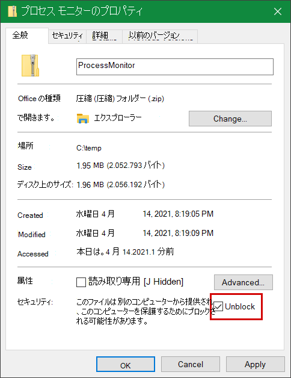
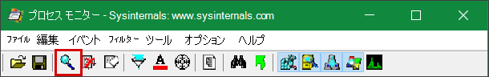
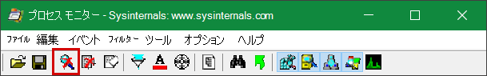
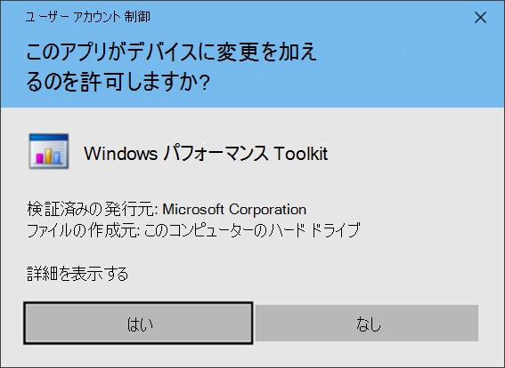
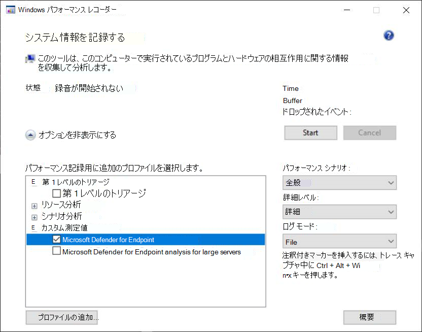
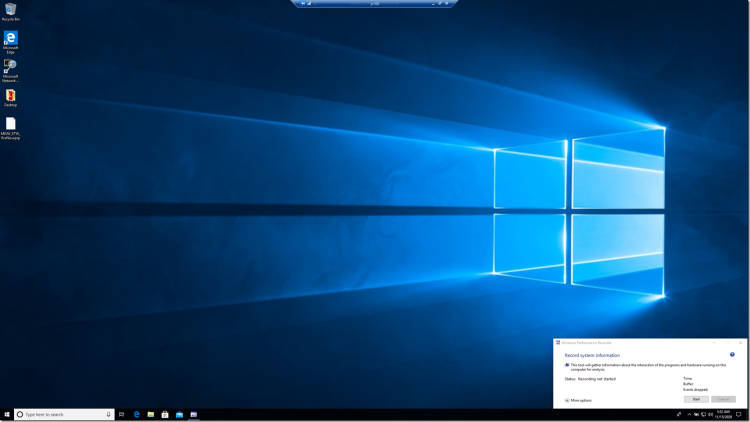
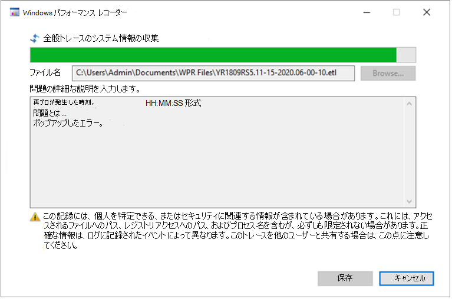
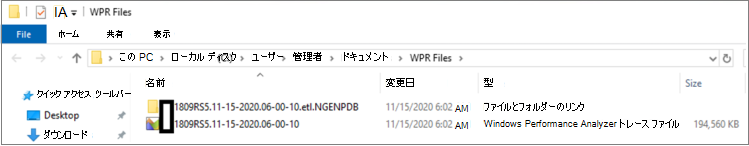

# <a name="troubleshoot-performance-issues-related-to-real-time-protection"></a>リアルタイム保護に関連するパフォーマンスの問題のトラブルシューティング


[!INCLUDE [Microsoft 365 Defender rebranding](../../includes/microsoft-defender.md)]


**適用対象:**

- [Microsoft Defender for Endpoint](https://go.microsoft.com/fwlink/p/?linkid=2146631)

Microsoft Defender for Endpoint のリアルタイム保護サービスに関連する CPU 使用率やパフォーマンスの問題がシステムで高い場合は、Microsoft サポートにチケットを提出できます。 「診断データの収集[」のMicrosoft Defender ウイルス対策に従います](collect-diagnostic-data.md)。

管理者は、これらの問題を自分でトラブルシューティングできます。

最初に、問題が別のソフトウェアによって引き起こされているのを確認する必要があります。 「ウイルス [対策の除外をベンダーに確認する」を参照してください](#check-with-vendor-for-antivirus-exclusions)。

それ以外の場合は、「Microsoft Protection Log の分析」の手順に従って、特定されたパフォーマンスの問題に関連する [ソフトウェアを特定できます](#analyze-the-microsoft-protection-log)。

次の手順に従って、Microsoft サポートへの申請に追加のログを提供することもできます。

- [プロセス モニターを使用してプロセス ログをキャプチャする](#capture-process-logs-using-process-monitor)
- [パフォーマンス レコーダーを使用してパフォーマンス ログWindowsキャプチャする](#capture-performance-logs-using-windows-performance-recorder)

## <a name="check-with-vendor-for-antivirus-exclusions"></a>ウイルス対策の除外をベンダーに確認する

システムのパフォーマンスに影響を与えるソフトウェアを簡単に特定できる場合は、ソフトウェア ベンダーのナレッジ ベースまたはサポート センターにアクセスします。 ウイルス対策の除外に関する推奨事項がある場合は検索します。 ベンダーの Web サイトにサポート チケットが存在しない場合は、サポート チケットを開いて発行を求めできます。

ソフトウェア ベンダーは、「業界とのパートナー」のさまざまなガイドラインに従って誤検知を最小限に [することをお勧めします](https://www.microsoft.com/security/blog/2018/08/16/partnering-with-the-industry-to-minimize-false-positives/)。 ベンダーは、Microsoft Defender セキュリティ インテリジェンス ポータル [(MDSI) を使用してソフトウェアを提出できます](https://www.microsoft.com/wdsi/filesubmission?persona=SoftwareDeveloper)。

## <a name="analyze-the-microsoft-protection-log"></a>Microsoft Protection Log の分析

**MPLog-xxxxxxxx-xxxxxx.log** では、実行中のソフトウェアの推定パフォーマンス影響情報を *EstimatedImpact として見つけることができます*。

`Per-process counts:ProcessImageName: smsswd.exe, TotalTime: 6597, Count: 1406, MaxTime: 609, MaxTimeFile: \Device\HarddiskVolume3\_SMSTaskSequence\Packages\WQ1008E9\Files\FramePkg.exe, EstimatedImpact: 65%`

|フィールド名|説明|
|---|---|
|ProcessImageName|プロセス イメージ名|
|TotalTime|このプロセスによってアクセスされたファイルのスキャンに費やされた累積時間 (ミリ秒単位)|
|カウント|このプロセスによってアクセスされるスキャンされたファイルの数|
|MaxTime|このプロセスによってアクセスされるファイルの最長単一スキャンの時間 (ミリ秒単位)|
|MaxTimeFile|期間の最長スキャンが記録されたこのプロセスによってアクセスされるファイル `MaxTime` のパス|
|EstimatedImpact|このプロセスでスキャンアクティビティが発生した期間からこのプロセスによってアクセスされたファイルのスキャンに費やされた時間の割合|

パフォーマンスへの影響が大きい場合は、「スキャンの除外を構成して検証する」の手順に従って、パス/プロセスの除外にプロセスを追加[Microsoft Defender ウイルス対策してみてください](collect-diagnostic-data.md)。

前の手順で問題が解決しない場合は、プロセス モニターまたは次のセクション[](#capture-process-logs-using-process-monitor)の Windows[パフォーマンス](#capture-performance-logs-using-windows-performance-recorder)レコーダーを使用して詳細を収集できます。

## <a name="capture-process-logs-using-process-monitor"></a>プロセス モニターを使用してプロセス ログをキャプチャする

プロセス モニター (ProcMon) は、リアルタイム プロセスを表示できる高度な監視ツールです。 これを使用して、パフォーマンスの問題が発生している場合にキャプチャできます。

1. プロセス [モニター v3.60 を](/sysinternals/downloads/procmon) 次のようなフォルダーにダウンロードします `C:\temp` 。

2. Web のファイルのマークを削除するには、次の方法を実行します。
    1. [プロパティ] を **右クリックProcessMonitor.zipし、[** プロパティ] を **選択します**。
    1. [全般] *タブで* 、[セキュリティ] を *探します*。
    1. [ブロック解除] の横 **にあるチェック ボックスをオンにします**。
    1. **[適用]** を選択します。

    

3. フォルダー のパスがに `C:\temp` なじむファイルを解凍します `C:\temp\ProcessMonitor` 。

4. トラブルシューティング **ProcMon.exe** クライアントまたはWindowsサーバー Windowsコピーします。

5. ProcMon を実行する前に、CPU 使用率の高い問題に関連しない他のすべてのアプリケーションが閉じられます。 これにより、チェックするプロセスの数が最小限になります。

6. ProcMon は 2 つの方法で起動できます。
    1. [管理者] を **右ProcMon.exe** し、[管理者として **実行] を選択します**。

        ログが自動的に開始されますので、虫眼鏡アイコンを選択して現在のキャプチャを停止するか、キーボード ショートカット **Ctrl + E を使用します**。

        

        キャプチャが停止したと確認するには、虫眼鏡アイコンが赤い X で表示されるのを確認します。

        

        次に、前のキャプチャをクリアするには、消しゴムアイコンを選択します。

        

        または、キーボード ショートカット **Ctrl + X を使用します**。

    2. 2 つ目の方法は、コマンド **ラインを管理者** として実行し、次にプロセス モニター パスから実行します。

        

        ```console
        Procmon.exe /AcceptEula /Noconnect /Profiling
        ```

        > [!TIP]
        > データをキャプチャする場合は、ProcMon ウィンドウを可能な限り小さくして、トレースを簡単に開始および停止できます。
        >
        > 

7. 手順 6 の手順の 1 つを実行すると、次にフィルターを設定するオプションが表示されます。 [**OK**] を選択します。 キャプチャが完了したら、いつでも結果をフィルター処理できます。

    ![[フィルター処理名] は [システム除外] です。](images/procmon-filter-options.png)

8. キャプチャを開始するには、虫眼鏡アイコンを再度選択します。

9. 問題を再現します。

    > [!TIP]
    > 問題が完全に再現されるのを待ち、トレースの開始時にタイムスタンプをメモします。

10. CPU 使用率が高い状態の間に 2 ~ 4 分のプロセス アクティビティが発生したら、拡大鏡アイコンを選択してキャプチャを停止します。

11. 一意の名前と .pml 形式でキャプチャを保存するには、[ファイル] を選択し、[**保存**]**を選択します**。ラジオ ボタンすべてのイベントとネイティブプロセス モニター形式 **(PML)** を選択してください。

    

12. 追跡を向上するには、既定のパスを次の場所 `C:\temp\ProcessMonitor\LogFile.PML` に変更 `C:\temp\ProcessMonitor\%ComputerName%_LogFile_MMDDYEAR_Repro_of_issue.PML` します。
    - `%ComputerName%` はデバイス名です
    - `MMDDYEAR` は月、日、および年です。
    - `Repro_of_issue` は、再現しようとしている問題の名前です。

    > [!TIP]
    > 作業システムがある場合は、比較するサンプル ログを取得できます。

13. .pml ファイルを圧縮し、Microsoft サポートに提出します。

## <a name="capture-performance-logs-using-windows-performance-recorder"></a>パフォーマンス レコーダーを使用してパフォーマンス ログWindowsキャプチャする

Microsoft サポートへのWindowsに追加情報を含めるには、パフォーマンス レコーダー (WPR) を使用できます。 WPR は、イベント トレースを作成する強力な記録ツールで、Windowsです。

WPR は、Windows 評価と展開キット (Windows ADK) の一部であり[、ADK](/windows-hardware/get-started/adk-install)からダウンロードしてインストールWindowsできます。 また、ソフトウェア開発キットの一部としてダウンロードWindows 10 SDK で[Windows 10できます](https://developer.microsoft.com/windows/downloads/windows-10-sdk/)。

WPR ユーザー インターフェイスを使用するには、「WPR UI を使用してパフォーマンス ログをキャプチャする」 [の手順に従います](#capture-performance-logs-using-the-wpr-ui)。

または [、「WPR CLI](#capture-performance-logs-using-the-wpr-cli)を使用してパフォーマンス ログをキャプチャする」の手順に従って、Windows 8 以降のバージョンで使用できるコマンド ライン ツール *wpr.exe* を使用することもできます。

### <a name="capture-performance-logs-using-the-wpr-ui"></a>WPR UI を使用してパフォーマンス ログをキャプチャする

> [!TIP]
> 問題が発生している複数のデバイスがある場合は、RAM の量が最も多いデバイスを使用します。

1. WPR をダウンロードしてインストールします。

2. *[Windows] で*、[パフォーマンス レコーダー] Windows **を右クリックします**。

    

    [詳細 **] を選択します**。 [管理者 **として実行] を選択します**。

3. [ユーザー アカウント制御] ダイアログ ボックスが表示されたら、[はい] を **選択します**。

    

4. 次に [、Microsoft Defender for Endpoint 分析プロファイルをダウンロード](https://github.com/YongRhee-MDE/Scripts/blob/master/MDAV.wprp) し、次のような `MDAV.wprp` フォルダーに保存します `C:\temp` 。

5. [WPR] ダイアログ ボックスで、[その他のオプション] **を選択します**。

    

6. [ **プロファイルの追加...] を選択し** 、ファイルのパスを参照 `MDAV.wprp` します。

7. その後、その下に Microsoft Defender  *for Endpoint* Analysis という名前のカスタム測定値の下に新しいプロファイル セットが表示されます。

    

    >[!WARNING]
    >サーバーにWindows RAM が 64 GB 以上の場合は、代わりにカスタム測定値 `Microsoft Defender for Endpoint analysis for large servers` を使用します `Microsoft Defender for Endpoint analysis` 。 それ以外の場合、システムが大量の非ページ プール メモリまたはバッファーを消費し、システムが不安定な場合があります。 [リソース分析] を展開して、追加するプロファイル **を選択できます**。
    このカスタム プロファイルは、詳細なパフォーマンス分析に必要なコンテキストを提供します。

8. WPR UI でカスタム測定 Microsoft Defender for Endpoint 詳細分析プロファイルを使用するには、次の操作を行います。

    1. [第 1 レベルのトリアージ]、[リソース分析]、および [シナリオ分析] グループの下で *プロファイルが**選択されません*。
    2. [カスタム **測定値] を選択します**。
    3. [ **エンドポイント分析用 Microsoft Defender] を選択します**。
    4. [詳細 **レベル] で** [ *詳細] を* 選択します。
    5. [ログ **モード] で** **[ファイル] または [メモリ** ] を選択します。

    > [!IMPORTANT]
    > パフォーマンスの問題 *をユーザー* が直接再現できる場合は、[ファイル] を選択してファイル ログ モードを使用する必要があります。 ほとんどの問題は、このカテゴリに該当します。 ただし、ユーザーが問題を直接再現することはできませんが、問題が発生すると簡単に気付く場合は、[メモリ]を選択してメモリ ログ モードを使用する必要があります。 これにより、長い実行時間のためにトレース ログが過度に膨らむのを防ぎ、

9. これで、データを収集する準備ができました。 パフォーマンスの問題の再現に関係ないすべてのアプリケーションを終了します。 [オプションを **非表示にする] を** 選択すると、WPR ウィンドウの領域を小さくすることができます。

    

    > [!TIP]
    > トレースを 1 秒で開始してみてください。 たとえば、01:30:00 です。 これにより、データの分析が容易になります。 また、問題が再現された正確なタイムスタンプを追跡してみてください。

10. [**開始**] を選択します。

    ![[トレースの開始] を選択します。](images/wpr-09.png)

11. 問題を再現します。

    > [!TIP]
    > データコレクションは 5 分以下にしてください。 多くのデータが収集されているので、2 ~ 3 分は良好な範囲です。

12. [**保存**] を選択します。

    ![[保存] を選択します。](images/wpr-10.png)

13. 問題の **詳細な説明で** Type を入力します。問題に関する情報と、問題の再現方法について説明します。

    

    1. [ **ファイル名:]** を選択して、トレース ファイルの保存場所を決定します。 既定では、1.is に保存されます `%user%\Documents\WPR Files\` 。
    1. [**保存**] を選択します。

14. トレースが結合されている間待ちます。

    

15. トレースを保存したら、[フォルダーを開く] **を選択します**。

    

    ファイルとフォルダーの両方を Microsoft サポートへの申請に含める。

    

### <a name="capture-performance-logs-using-the-wpr-cli"></a>WPR CLI を使用してパフォーマンス ログをキャプチャする

コマンド ライン ツール *は*、wpr.exeから始まるオペレーティング システムの一部Windows 8。 コマンド ライン ツールを使用して WPR トレースを収集するには、次wpr.exe。

1. Microsoft **[Defender for Endpoint analysis profile for performance](https://github.com/YongRhee-MDE/Scripts/blob/master/MDAV.wprp)** traces for a download a file named in a local directory ( `MDAV.wprp` `C:\traces` .

2. [スタート] メニュー **アイコンを右クリック** し、[管理者] Windows PowerShellまたはコマンド プロンプト **(Admin)** を選択して、[管理者] コマンド プロンプト ウィンドウを開きます。 

3. [ユーザー アカウント制御] ダイアログ ボックスが表示されたら、[はい] を **選択します**。

4. 管理者特権のプロンプトで、次のコマンドを実行して Microsoft Defender for Endpoint のパフォーマンス トレースを開始します。

    ```console
    wpr.exe -start C:\traces\MDAV.wprp!WD.Verbose -filemode
    ```

    > [!WARNING]
    > サーバーにWindows 64 GB 以上の RAM がある場合は、プロファイルと 、それぞれプロファイルの代わりに `WDForLargeServers.Light` `WDForLargeServers.Verbose` `WD.Light` `WD.Verbose` プロファイルを使用します。 それ以外の場合、システムが大量の非ページ プール メモリまたはバッファーを消費し、システムが不安定な場合があります。

5. 問題を再現します。

    > [!TIP]
    > データコレクションを 5 分以下にしてください。  シナリオによっては、多くのデータが収集されているので、2 ~ 3 分が良好な範囲です。

6. 管理者特権のプロンプトで、次のコマンドを実行してパフォーマンス トレースを停止し、問題に関する情報と問題の再現方法を確認します。

    ```console
    wpr.exe -stop merged.etl "Timestamp when the issue was reproduced, in HH:MM:SS format" "Description of the issue" "Any error that popped up"
    ```

7. トレースが結合されるまで待ちます。

8. ファイルとフォルダーの両方を Microsoft サポートへの申請に含める。

## <a name="see-also"></a>関連項目

- [診断Microsoft Defender ウイルス対策収集する](collect-diagnostic-data.md)
- [スキャンの除外を構成およびMicrosoft Defender ウイルス対策する](configure-exclusions-microsoft-defender-antivirus.md)
