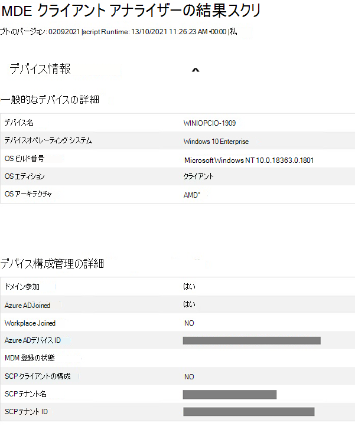
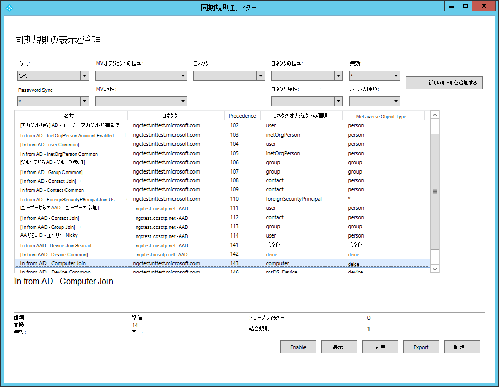
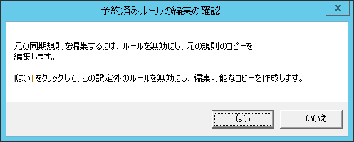
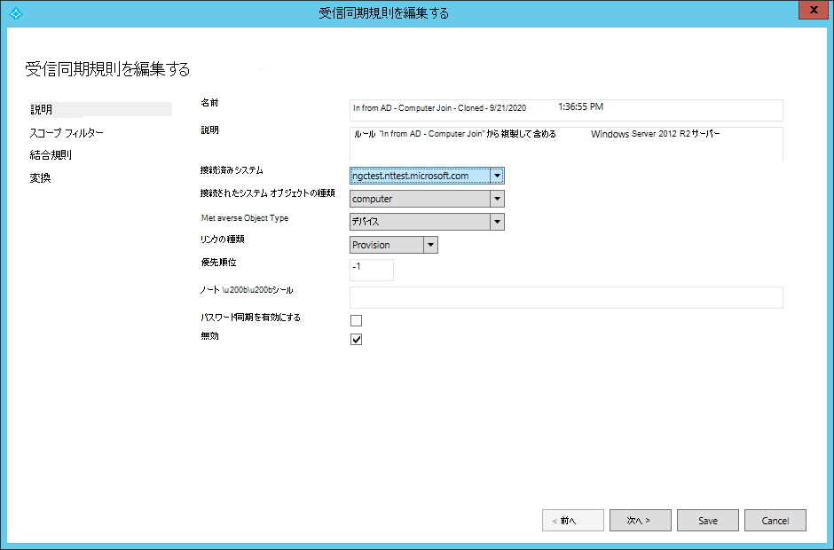
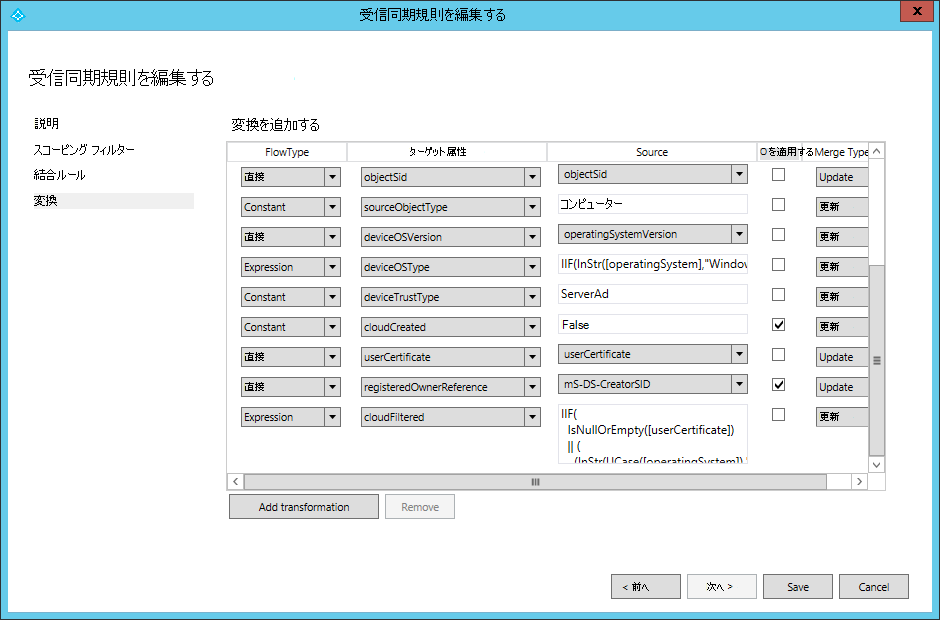

# <a name="troubleshoot-onboarding-issues-related-to-security-management-for-microsoft-defender-for-endpoint"></a>Microsoft Defender for Endpoint のセキュリティ管理に関連するオンボーディングの問題のトラブルシューティング 

[!INCLUDE [Microsoft 365 Defender rebranding](../../includes/microsoft-defender.md)]


**適用対象:**

- [Microsoft Defender for Endpoint on devices on devices with Microsoft エンドポイント マネージャー](/mem/intune/protect/mde-security-integration)
- [Microsoft Defender for Endpoint](https://go.microsoft.com/fwlink/?linkid=2154037)
- [Microsoft 365 Defender](https://go.microsoft.com/fwlink/?linkid=2118804)

Microsoft Defender for Endpoint のセキュリティ管理は、Microsoft エンドポイント マネージャー (Microsoft Intune または Microsoft Endpoint Configuration Manager) によって管理されていないデバイスが Microsoft Defender のセキュリティ構成を直接受信する機能です。からエンドポイント マネージャー。
Microsoft Defender for Endpoint のセキュリティ管理の詳細については、「Manage Microsoft Defender for Endpoint on devices on devices with Microsoft エンドポイント マネージャー」 を[参照してください](/mem/intune/protect/mde-security-integration)。

Microsoft Defender for Endpoint オンボーディング手順のセキュリティ管理については[、「Microsoft Defender for Endpoint Security Configuration Management」を参照してください](security-config-management.md)。

このエンドツーエンドのオンボーディングは、フリクションレスに設計され、ユーザー入力を必要とします。 ただし、オンボーディング中に問題が発生した場合は、Microsoft Defender for Endpoint プラットフォーム内のエラーを表示およびトラブルシューティングできます。


>[!NOTE]
> 新しいデバイスのオンボーディング フローに問題がある場合は [、Microsoft Defender for Endpoint](/mem/intune/protect/mde-security-integration#prerequisites) の前提条件を確認し、オンボーディング手順に従ってください。


クライアント アナライザーの詳細については、「Microsoft Defender for Endpoint Client Analyzer を使用したセンサーの正常性のトラブルシューティング [」を参照してください](/microsoft-365/security/defender-endpoint/overview-client-analyzer)。

## <a name="registering-domain-joined-computers-with-azure-active-directory"></a>ドメインに参加しているコンピューターをドメインに登録Azure Active Directory  
デバイスをデバイスに正常Azure Active Directoryするには、次の情報を確認する必要があります。 

- コンピューターはドメイン コントローラーで認証できます 
- コンピューターは、組織のネットワーク内から次の Microsoft リソースにアクセスできます。
  - https://enterpriseregistration.windows.net
  - https://login.microsoftonline.com
  - https://device.login.microsoftonline.com
- Azure ADは、コンピューター オブジェクトを同期するように構成されています。 既定では、コンピューターの US は同期スコープAzure AD接続できません。 コンピューター オブジェクトが特定の組織単位 (OUs) に属している場合は、その組織単位で同期Azure AD Connect。 コンピューター オブジェクトを使用してコンピューター オブジェクトを同期する方法の詳細については、「組織単位Azure AD Connectフィルター」 [を参照してください](/azure/active-directory/hybrid/how-to-connect-sync-configure-filtering#organizational-unitbased-filtering)。

>[!IMPORTANT]
>Azure ADは R2 コンピューター オブジェクトWindows Server 2012同期しません。 Microsoft Defender for Endpoint のセキュリティ管理用 Azure AD に登録する必要がある場合は、Azure AD 接続同期ルールをカスタマイズして、それらのコンピューター オブジェクトを同期スコープに含める必要があります。 「[コンピューター参加ルールを適用する手順」を参照Azure Active Directory Connect。]()

>[!NOTE]
>オンボード フローを正常に完了し、デバイスのオペレーティング システムとは別に、デバイスの Azure Active Directory 状態は、デバイスの初期状態に基づいて変更できます。<br>
>
>|      デバイスの状態の開始     |      新しいデバイスの状態     |
>|---|---|
>|     既に AADJ または HAADJ    |     そのまま残る    |
>|     AADJ またはハイブリッド Azure Active Directory参加 (HAADJ) + ドメインが参加していない    |     デバイスは HAADJ'd です    |
>|     AADJ または HAADJ ではない + ドメインに参加していない    |     デバイスは AADJ'd です    |
>
>ここで、AADJ は joined のAzure Active Directory HAADJ は、Joined のハイブリッド Azure Active Directoryします。


## <a name="troubleshoot-errors-from-the-microsoft-defender-for-endpoint-portal"></a>Microsoft Defender for Endpoint ポータルからのエラーのトラブルシューティング


Microsoft Defender for Endpoint ポータルを通じて、セキュリティ管理者は Microsoft Defender for Endpoint オンボーディングのセキュリティ管理をトラブルシューティングできます。 


Endpoints **> デバイス インベントリでは**、[ **管理** によって管理] 列が追加され、管理チャネル (MEM など) によってフィルター処理されます。


:::image type="content" alt-text="デバイス インベントリ ページのイメージ" source="./images/device-inventory-mde-error.png":::

Microsoft Defender for Endpoint オンボーディング プロセスのセキュリティ管理に失敗したすべてのデバイスの一覧を表示するには **、MDE-Error** でテーブルをフィルター処理します。

一覧で、特定のデバイスを選択して、サイド パネルにトラブルシューティングの詳細を表示し、エラーの根本原因と対応するドキュメントを示します。


:::image type="content" alt-text="フィルター処理されたデバイス インベントリ ページのイメージ" source="./images/secconfig-mde-error.png":::


## <a name="run-microsoft-defender-for-endpoint-client-analyzer-on-windows"></a>Microsoft Defender for Endpoint Client Analyzer をコンピューターで実行Windows 

Microsoft Defender for Endpoint オンボーディング フローのセキュリティ管理を完了できなかったエンドポイントでクライアント アナライザーを実行する方法を検討してください。 クライアント アナライザーの詳細については、「Microsoft Defender for Endpoint Client Analyzer を使用したセンサーの正常性のトラブルシューティング [」を参照してください](overview-client-analyzer.md)。

クライアント アナライザー出力ファイル (MDE クライアント アナライザー Results.htm) は、次の重要なトラブルシューティング情報を提供できます。

- [全般デバイスの詳細] セクションで、デバイス OS が Microsoft Defender for Endpoint オンボーディング フローのセキュリティ管理のスコープ **内にあるか確認** します。
- [デバイス構成管理の詳細] で、デバイスがAzure Active Directoryに登録 **されたことを確認します。**


    


レポートの **[詳細な結果** ] セクションでは、クライアント アナライザーでも、操作可能なガイダンスを提供します。

>[!TIP]
>レポートの [詳細な結果] セクションに "エラー" が含めず、すべての "警告" メッセージを確認してください。

たとえば、セキュリティ管理オンボーディング フローの一部として、Microsoft Defender for Endpoint Tenant の Azure Active Directory テナント ID が、レポートの [デバイス構成管理の詳細]セクションに表示される SCP テナント ID と一致する必要があります。 関連する場合は、レポート出力でこの検証を実行することをお勧めします。


## <a name="general-troubleshooting"></a>一般的なトラブルシューティング 

AAD または MEM でオンボード デバイスを識別できない場合に、登録中にエラーが表示されない場合は、レジストリ キーを確認すると、追加のトラブルシューティング情報を `Computer\\HKEY\_LOCAL\_MACHINE\\SOFTWARE\\Microsoft\\SenseCM\\EnrollmentStatus` 提供できます。  

:::image type="content" alt-text="登録状態のイメージ。" source="images/enrollment-status.png":::

次の表に、エラーに対処するために何を試す/チェックする方法に関するエラーと指示を示します。 エラーの一覧は完全ではなく、過去に顧客が発生した一般的なエラーまたは一般的なエラーに基づく点に注意してください。 


| エラー コード  |管理者の操作                                                                                                                                                                                                                                                                                                  |
|-----------------|----------------------------------------------------------------------------------------------------------------------------------------------------------------------------------------------------------------------------------------------------------------------------------------------------------------------------|
| ``10``          |このエラーは、OS がハイブリッド参加の実行に失敗したと示します。 OS[レベルのハイブリッド参加Azure Active Directoryトラブルシューティング](/azure/active-directory/devices/troubleshoot-hybrid-join-windows-current)のガイドとして、ハイブリッド デバイスに参加しているデバイスのトラブルシューティングを使用します。                                                            |
| ``13-14``       |Microsoft エンドポイント マネージャー[の](/microsoft-365/security/defender-endpoint/security-config-management#onboard-devices)オンボード Windows デバイスを Microsoft Defender for Endpoint の前提条件を確認して、エンドポイントが完了し、ハイブリッド Azure Active Directory 参加が利用できます。                   |
| ``15``          |MDE テナントAADテナント ID が、ドメインの SCP エントリのテナント ID と一致する必要があります。                                                                                                                                                                                                                     |
| ``16``          |ドキュメントを[Azure Active Directoryします](/azure/active-directory/devices/hybrid-azuread-join-manual#configure-a-service-connection-point)。 組織の ID チームと関わり、HAADJ に必要な構成方法を展開します。                                                                     |
| ``17``          |Active Directory 環境のデバイス登録構成を確認し、DRS または Azure DRS Enterpriseを使用しているかどうかを確認します。                                                                                                                                                                                 |
| ``18``          |[構成Azure AD Connect確認し、管理用に構成されているデバイスが同期の範囲内にあるか確認します。                                                                                                                                                                                              |
| ``25``          |ネットワーク トポロジを確認し、ハイブリッド参加要求を完了するためにドメイン コントローラーを使用できます。                                                                                                                                                                                                                       |
| ``26-32``       |フェデレーション参加を完了するために必要なクレームのドキュメントを確認します。 環境のエンドポイントを手動で検証できます。                                                                                                                                                                                |
| ``36``          |ネットワーク トポロジを確認し、ハイブリッド参加要求を完了するために LDAP API を使用できます。                                                                                                                                                                                                                                  |
| ``37``          |ドメインに参加しているコンピューターの場合、コンピューターがコンピューターの同期のスコープ内にあるAzure AD Connect。                                                                                                                                                                                                                    |
| ``38``          |ワークステーション側の無効な DNS 設定: Active directory では、ドメイン DNS を使用して (ルーターのアドレスではなく) 正しく動作する必要があります。                                                                                                                                                                                |
| ``40``          |エラーが発生したデバイスでクロックが正しく設定/同期されていることを確認します。                                                                                                                          |
| ``41``          |このエラーの一貫性を確認するには、再試行してください。 再試行で問題が解決しない場合は、OS レベル[の](/azure/active-directory/devices/troubleshoot-hybrid-join-windows-current)ハイブリッド参加Azure Active Directoryトラブルシューティングのガイドとして、「ハイブリッド デバイスに参加しているデバイスのトラブルシューティング」を使用します。                                                    |
| ``42``          |このエラーは、OS がハイブリッド参加の実行に失敗したと示します。 OS[レベルのハイブリッド参加Azure Active Directoryトラブルシューティング](/azure/active-directory/devices/troubleshoot-hybrid-join-windows-current)のガイドとして、ハイブリッド デバイスに参加しているデバイスのトラブルシューティングを使用します。                                                            |


## <a name="azure-active-directory-runtime-troubleshooting"></a>Azure Active Directoryランタイムのトラブルシューティング 

### <a name="azure-active-directory-runtime"></a>Azure Active Directoryランタイム  

ランタイム (AADRT) のAzure Active Directoryする主なメカニズムは、デバッグ トレースを収集します。 Azure Active DirectoryWindowsランタイムは **、ID bd67e65c-9cc2-51d8-7399-0bb9899e75c1** を持つ ETW プロバイダーを使用します。 ETW トレースは、エラーの再現と一緒にキャプチャする必要があります (たとえば、結合エラーが発生した場合は、参加を実行するために AADRT API の呼び出しをカバーする期間、トレースを有効にする必要があります)。  

AADRT ログの一般的なエラーと読み方については、以下を参照してください。 


メッセージの情報から、ほとんどの場合、発生したエラー、エラーが返された Win32 API 、使用された URL (該当する場合)、および発生した AAD ランタイム API エラーを理解できます。 
  
 

## <a name="instructions-for-applying-computer-join-rule-in-aad-connect"></a>コンピューターの参加ルールをコンピューターに適用するAAD Connect 

Windows Server 2012 R2 ドメインに参加しているコンピューター上の Microsoft Defender for Endpoint のセキュリティ管理では、Azure AD Connect 同期ルール "in from AD-Computer Join" への更新が必要です。 これは、ルールを複製して変更することで実現できます。これにより、元の "In from AD - Computer Join" ルールが無効にされます。 Azure AD Connect既定では、組み込みのルールを変更する場合にこのエクスペリエンスが提供されます。

>[!NOTE]
>これらの変更は、サーバーが実行されているサーバー AAD Connect必要があります。 複数のインスタンスが展開されているAAD Connect、これらの変更をすべてのインスタンスに適用する必要があります。 

1. スタート メニューから同期ルール エディター アプリケーションを開きます。 ルールの一覧で、[コンピューターの参加] の **[AD] という名前のルールを探します**。 **このルールの [優先順位] 列の値に注意してください。** 

    

2. In from **AD – Computer Join** ルールが強調表示されている場合は、[編集] を **選択します**。 [予約ルール **の確認の編集] ダイアログ ボックスで** 、[はい] を **選択します**。 

   

3. [ **受信同期ルールの編集] ウィンドウ** が表示されます。 このルールを使用して、サーバー 2012R2 Windows同期される点に注意するルールの説明を更新します。 優先順位の値を除き、他のすべてのオプションは変更しないでください。 元のルールの値よりも高い優先順位の値を入力します (ルール一覧に表示されます)。  

   

4.  [次 **へ] を 3** 回選択します。 これにより、ルールの [変換] セクションに移動します。 ルールの 'スコープ フィルター' セクションと 'Join rules' セクションに変更を加えな [変換] セクションが表示されます。 

    

5. 変換の一覧の一番下までスクロールします。 **cloudFiltered 属性の変換を検索** します。 [ソース] 列の **テキスト ボックス** で、すべてのテキスト (Control-A) を選択して削除します。 これで、テキスト ボックスは空になります。 

6. 新しいルールのコンテンツをテキスト ボックスに貼り付けます。 


    ```command
    IIF(
      IsNullOrEmpty([userCertificate])
      || 
      (
        (InStr(UCase([operatingSystem]),"WINDOWS") > 0)
        && 
        (Left([operatingSystemVersion],2) = "6.")
        &&
        (Left([operatingSystemVersion],3) <> "6.3")
      )
      ||
      (
        (Left([operatingSystemVersion],3) = "6.3") 
        &&
        (InStr(UCase([operatingSystem]),"WINDOWS") > 0)
        &&
        With(
          $validCerts,
          Where(
            $c, 
            [userCertificate], 
            IsCert($c) && CertNotAfter($c) > Now() && RegexIsMatch(CertSubject($c), "CN=[{]*" & StringFromGuid([objectGUID]) & "[}]*", "IgnoreCase")),
          Count($validCerts) = 0)
      ),
      True,
      NULL
    )

    ```

7.  [保存 **] を** 選択して新しいルールを保存します。

## <a name="related-topic"></a>関連トピック
- [Microsoft Defender for Endpoint on devices on devices with Microsoft エンドポイント マネージャー](/mem/intune/protect/mde-security-integration)
