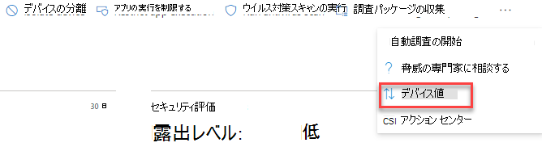

# デバイス値の割り当て - 脅威と脆弱性の管理Assign device value - threat and vulnerability management

[!INCLUDE [Microsoft 365 Defender rebranding](../../includes/microsoft-defender.md)]

**適用対象:****Applies to:**

- [Microsoft Defender for EndpointMicrosoft Defender for Endpoint](https://go.microsoft.com/fwlink/?linkid=2154037)
- [脅威と脆弱性の管理Threat and vulnerability management](next-gen-threat-and-vuln-mgt.md)
- [Microsoft 365 DefenderMicrosoft 365 Defender](https://go.microsoft.com/fwlink/?linkid=2118804)

> Microsoft Defender ATP を試してみたいですか?Want to experience Microsoft Defender for Endpoint? [無料試用版にサインアップしてください。Sign up for a free trial.](https://www.microsoft.com/microsoft-365/windows/microsoft-defender-atp?ocid=docs-wdatp-portaloverview-abovefoldlink)

[!include[Prerelease information](../../includes/prerelease.md)]

デバイスの値を定義すると、資産の優先順位を区別できます。Defining a device’s value helps you differentiate between asset priorities. デバイスの値は、個々の資産のリスクアペタイトを脅威と脆弱性管理の露出スコアの計算に組み込むのに使用されます。The device value is used to incorporate the risk appetite of an individual asset into the threat and vulnerability management exposure score calculation. "高い値" として割り当てられたデバイスは、より多くの重みを受け取る。Devices assigned as “high value” will receive more weight.

デバイス値の設定 [API を使用することもできます](set-device-value.md)。You can also use the [set device value API](set-device-value.md).

デバイス値のオプション:Device value options:

- 低いLow
- 標準 (既定値)Normal (Default)
- 高いHigh

高い値を割り当てる必要があるデバイスの例を次に示します。Examples of devices that should be assigned a high value:

- ドメイン コントローラー、Active DirectoryDomain controllers, Active Directory
- インターネットに接続するデバイスInternet facing devices
- VIP デバイスVIP devices
- 内部/外部の実稼働サービスをホストするデバイスDevices hosting internal/external production services

## デバイスの値を選択するChoose device value

1. 任意のデバイス ページに移動し、最も簡単な場所はデバイス インベントリから行います。Navigate to any device page, the easiest place is from the device inventory.

2. ページ **の上部にある** アクション バーの横にある 3 つのドットから [デバイス値] を選択します。Select **Device value** from three dots next to the actions bar at the top of the page.

    

3. 現在のデバイス値とそれが何を意味するフライアウトが表示されます。A flyout will appear with the current device value and what it means. デバイスの値を確認し、デバイスに最適な値を選択します。Review the value of the device and choose the one that best fits your device.

## デバイスの値が露出スコアに与える影響How device value impacts your exposure score

露出スコアは、すべてのデバイスの加重平均です。The exposure score is a weighted average across all devices. デバイス グループがある場合は、デバイス グループ別にスコアをフィルター処理することもできます。If you have device groups, you can also filter the score by device group.

- 通常のデバイスの重み 1Normal devices have a weight of 1
- 低い値のデバイスの重み 0.75Low value devices have a weight of 0.75
- 高い値のデバイスには、NumberOfAssets / 10 の重みがあります。High value devices have a weight of NumberOfAssets / 10.
    - デバイスが 100 台の場合、各高価値デバイスの重みは 10 (100/10) になります。If you have 100 devices, each high value device will have a weight of 10 (100/10)

## 関連項目Related topics

- [脅威と脆弱性の管理の概要Threat and vulnerability management overview](next-gen-threat-and-vuln-mgt.md)
- [露出スコアExposure Score](tvm-exposure-score.md)
- [APIAPIs](next-gen-threat-and-vuln-mgt.md#apis)