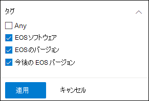
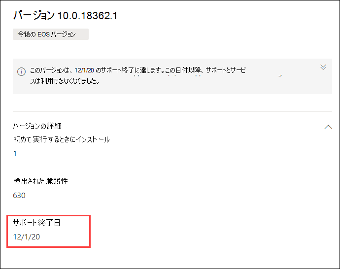

# サポート終了のソフトウェアとソフトウェアのバージョンを計画する場合は、脅威と脆弱性の管理

[!INCLUDE [Microsoft 365 Defender rebranding](../../includes/microsoft-defender.md)]

**適用対象:**

- [Microsoft Defender for Endpoint](https://go.microsoft.com/fwlink/?linkid=2154037)
- [脅威と脆弱性の管理](next-gen-threat-and-vuln-mgt.md)
- [Microsoft 365 Defender](https://go.microsoft.com/fwlink/?linkid=2118804)

> Microsoft Defender ATP を試してみたいですか? [無料試用版にサインアップしてください。](https://signup.microsoft.com/create-account/signup?products=7f379fee-c4f9-4278-b0a1-e4c8c2fcdf7e&ru=https://aka.ms/MDEp2OpenTrial?ocid=docs-wdatp-portaloverview-abovefoldlink)

ソフトウェアバージョンまたはソフトウェア バージョンのサポート終了 (EOL) は、サポートまたはサービスが終了し、セキュリティ更新プログラムを受け取らなくなるという意味です。 サポートが終了したソフトウェアまたはソフトウェア バージョンを使用する場合は、セキュリティの脆弱性、法的リスク、財務上のリスクに組織を公開します。

セキュリティと IT 管理者が一緒に作業し、最適な結果、コンプライアンス、および健全なネットワーク エコシステムのために組織のソフトウェア インベントリが構成されていることを確認することが重要です。 サポートが終了し、サポートされなくなったバージョンを更新したアプリを削除または置き換えるオプションを確認する必要があります。 サポート終了日前に計画を作成して実装するのが最善です。

>[!NOTE]
> 現在、サポート終了機能は、現在、一部の製品Windowsできます。

## サポートされなくなったソフトウェアまたはソフトウェアのバージョンを検索する

1. [セキュリティ] メニュー脅威と脆弱性の管理[セキュリティの推奨事項 [**] に移動します**](tvm-security-recommendation.md)。
2. [フィルター] **パネルに移動** し、[タグ] セクションを探します。 1 つ以上の EOS タグ オプションを選択します。 次に **、適用します**。

    

3. サポートが終了しているソフトウェア、サポート終了のソフトウェア バージョン、またはサポートが終了するバージョンに関連する推奨事項の一覧が表示されます。 これらのタグは、ソフトウェア インベントリ ページ [にも表示](tvm-software-inventory.md) されます。

    

## バージョンと日付の一覧

サポートが終了したバージョンの一覧を表示するには、またはサポートを終了またはすぐにサポートし、それらの日付を表示するには、次の手順を実行します。

1. サポートが終了したバージョンまたはサポートが近日終了するソフトウェアのセキュリティ推奨事項のフライアウトにメッセージが表示されます。

    

2. バージョン配布 **リンクを選択** して、ソフトウェアのドリルダウン ページに移動します。 そこでは、タグがサポートの終了またはサポートの今後の終了として識別される、フィルター処理されたバージョンの一覧を表示できます。

    

3. 開くテーブルのバージョンのいずれかを選択します。 たとえば、バージョン 10.0.18362.1。 サポート終了日のフライアウトが表示されます。

    

サポート終了の状態により脆弱なソフトウェアとソフトウェアのバージョンを特定したら、それらを更新するか、組織から削除するか決定する必要があります。 これにより、組織は脆弱性や高度な永続的な脅威にさらされるリスクを軽減します。

## 関連項目

- [脅威と脆弱性の管理概要](next-gen-threat-and-vuln-mgt.md)
- [セキュリティ上の推奨事項](tvm-security-recommendation.md)
- [ソフトウェア インベントリ](tvm-software-inventory.md)
