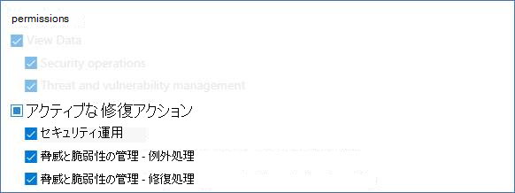
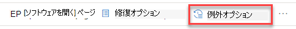
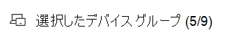
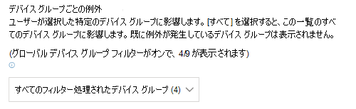
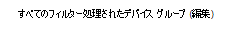
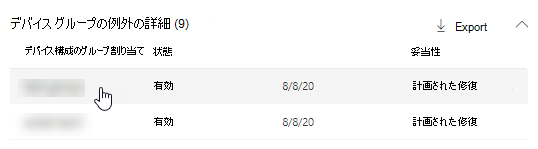
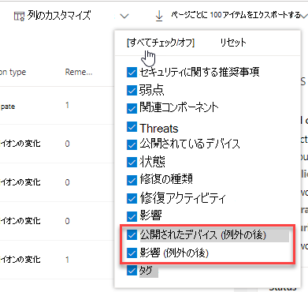
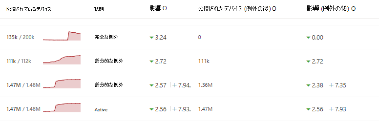

# セキュリティ推奨事項の例外を作成して表示する - 脅威と脆弱性の管理

[!INCLUDE [Microsoft 365 Defender rebranding](../../includes/microsoft-defender.md)]

**適用対象:**

- [Microsoft Defender for Endpoint](https://go.microsoft.com/fwlink/?linkid=2154037)
- [脅威と脆弱性の管理](next-gen-threat-and-vuln-mgt.md)
- [Microsoft 365 Defender](https://go.microsoft.com/fwlink/?linkid=2118804)

> Microsoft Defender ATP を試してみたいですか? [無料試用版にサインアップしてください。](https://signup.microsoft.com/create-account/signup?products=7f379fee-c4f9-4278-b0a1-e4c8c2fcdf7e&ru=https://aka.ms/MDEp2OpenTrial?ocid=docs-wdatp-portaloverview-abovefoldlink)

推奨事項が現時点では関連しない場合の修復要求の代わりに、推奨事項の例外を作成できます。 組織にデバイス グループがある場合は、例外の範囲を特定のデバイス グループに設定できます。 例外は、選択したデバイス グループに対して作成するか、過去と現在のすべてのデバイス グループに対して作成できます。  

推奨事項に対して例外が作成されると、例外期間が終了するまで、推奨事項はアクティブにされません。 推奨事項の状態が [完全な例外] **または [部分的な** 例外] (デバイス **グループ** 別) に変更されます。

## Permissions

"例外処理" 権限を持つユーザーだけが例外を管理できます (作成またはキャンセルを含む)。 [RBAC の役割について詳しくは、次のページを参照してください](user-roles.md)。

## 例外の作成

例外を作成するセキュリティ推奨事項を選択し、[例外オプション] を選択してフォームに入力します。  

### デバイス グループ別の例外

現在のすべてのデバイス グループに例外を適用するか、特定のデバイス グループを選択します。 今後のデバイス グループは例外に含まれません。 既に例外があるデバイス グループは、一覧に表示されません。 特定のデバイス グループのみを選択した場合、推奨事項の状態は "アクティブ" から "部分的な例外" に変わります。 すべてのデバイス グループを選択すると、状態は "完全な例外" に変わります。

#### フィルター処理されたビュー

任意のページでデバイス グループでフィルター処理した脅威と脆弱性の管理、フィルター処理されたデバイス グループだけがオプションとして表示されます。

これは、デバイス グループ別にフィルター処理を行うボタンで、次のページ脅威と脆弱性の管理します。 

フィルター処理されたデバイス グループを含む例外ビュー:

#### デバイス グループの数が多い

組織に 20 を超えるデバイス グループがある場合は、フィルター処理されたデバイス グループ オプションの横にある **[** 編集] を選択します。

含めるデバイス グループを検索して選択できるフライアウトが表示されます。 [検索] の下にあるチェック マーク アイコンを選択して、すべてチェック/オフを解除します。

### グローバル例外

グローバル管理者のアクセス許可がある場合は、グローバル例外を作成およびキャンセルできます。 これは、 **組織内のすべての** 現在および将来のデバイス グループに影響を与え、同様のアクセス許可を持つユーザーだけが変更できます。 推奨事項の状態は、"active" から "完全な例外" に変更されます。

次に注意する必要があります。

- 推奨事項がグローバル例外の下にある場合、新しく作成されたデバイス グループの例外は、グローバル例外の有効期限が切れるか取り消されるまで中断されます。 その後、新しいデバイス グループの例外は有効期限が切れるまで有効になります。
- 推奨事項に特定のデバイス グループの例外が既に存在し、グローバル例外が作成されている場合、デバイス グループの例外は有効期限が切れるか、グローバル例外が期限切れになる前に取り消されるまで中断されます。

### 妥当性

問題のセキュリティ推奨事項を修復する代わりに、ファイルする必要がある例外の正当性を選択します。 位置合わせコンテキストに入力し、例外期間を設定します。

次の一覧では、例外オプションの背後にある理由について説明します。

- **サード パーティ製** のコントロール - サード パーティ製品またはソフトウェアが既にこの推奨事項に対応している - この正当化の種類を選択すると、リスクが軽減され、露出スコアが下がり、セキュリティ スコアが向上します。
- **代替軽減** - 内部ツールは既にこの推奨事項に対応しています - この位置合わせの種類を選択すると、リスクが軽減されたため、露出スコアが下がり、セキュリティスコアが向上します。
- **リスクの受け** 入れ - リスクが低い、または推奨事項を実装するにはコストが高すぎます
- **計画された修復 (猶予期間)** - 既に計画されているが、実行または承認を待っている

## すべての例外を表示する

[修復] **ページの [** 例外] タブ **に移動** します。 位置合わせ、種類、および状態でフィルター処理できます。

 詳細を含むフライアウトを開く場合は、例外を選択します。 デバイス グループごとの例外には、エクスポートできる例外が含むすべてのデバイス グループの一覧が表示されます。 関連する推奨事項を表示したり、例外を取り消したりできます。

![[修復] ページに [例外] タブを表示します。](images/tvm-exception-view.png)

## 例外を取り消す方法

例外を取り消す場合は、[修復] ページ **の [例外** ] タブ **に移動** します。 例外を選択します。

すべてのデバイス グループまたはグローバル例外の例外を取り消す場合は、[すべてのデバイス グループの例外をキャンセル **する] ボタンを選択** します。 アクセス許可を持つデバイス グループの例外のみを取り消す事が可能です。

![[キャンセル] ボタン。](images/tvm-exception-cancel.png)

### 特定のデバイス グループの例外をキャンセルする

特定のデバイス グループを選択して、例外を取り消します。 デバイス グループのフライアウトが表示され、[例外のキャンセル] **を選択できます**。

## 例外が適用された後の影響の表示

[セキュリティの推奨事項] ページで、[列のカスタマイズ] を選択し、(例外の後 **に)** 公開されているデバイスと影響 (例外の後) のチェック ボックス **をオンにします**。

[例外の後に公開されたデバイス] 列には、例外が適用された後も引き続き脆弱性にさらされている残りのデバイスが表示されます。 露出に影響を与える例外の正当性には、'サード パーティコントロール' と '代替軽減' が含まれます。 その他の理由により、デバイスの露出は軽減されません。また、デバイスは引き続き公開されたと見なされます。

影響 (例外の後) は、例外が適用された後の露出スコアまたはセキュリティで保護されたスコアへの影響が残ります。 スコアに影響を与える例外の正当性には、「サード パーティコントロール」と「代替軽減策」が含まれます。 その他の理由は、デバイスの露出を減らすことはないので、露出スコアと安全なスコアは変更されません。

## 関連トピック

- [脅威と脆弱性の管理概要](next-gen-threat-and-vuln-mgt.md)
- [脆弱性を修復する](tvm-remediation.md)
- [セキュリティ上の推奨事項](tvm-security-recommendation.md)
- [暴露スコア](tvm-exposure-score.md)
- [デバイス向けの Microsoft セキュア スコア](tvm-microsoft-secure-score-devices.md)
