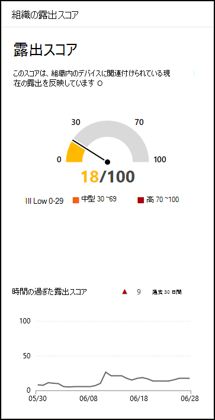

# 露出スコア - 脅威と脆弱性の管理

[!INCLUDE [Microsoft 365 Defender rebranding](../../includes/microsoft-defender.md)]

**適用対象:**

- [Microsoft Defender for Endpoint](https://go.microsoft.com/fwlink/?linkid=2154037)
- [脅威と脆弱性の管理](next-gen-threat-and-vuln-mgt.md)
- [Microsoft 365 Defender](https://go.microsoft.com/fwlink/?linkid=2118804)

> Microsoft Defender ATP を試してみたいですか? [無料試用版にサインアップしてください。](https://signup.microsoft.com/create-account/signup?products=7f379fee-c4f9-4278-b0a1-e4c8c2fcdf7e&ru=https://aka.ms/MDEp2OpenTrial?ocid=docs-wdatp-portaloverview-abovefoldlink)

露出スコアは、ポータルの[[脅威と脆弱性の管理]](tvm-dashboard-insights.md)ダッシュボードにMicrosoft 365 Defenderされます。 これは、組織がサイバーセキュリティの脅威に対してどのように脆弱かを反映しています。 露出スコアが低いということは、デバイスが悪用の影響を受けやすいという意味です。

- 組織のセキュリティの状態に関する高レベルのテイクアウトを迅速に理解し、特定します。
- 現在の状態を改善するために調査またはアクションが必要な領域を検出して対応します。
- セキュリティの取り組みの影響について、ピアや経営陣とコミュニケーションを取る。

このカードは、時間の流れによる露出スコアの傾向を高レベルで表示します。 グラフ内のスパイクは、サイバーセキュリティの脅威に対する高い暴露を視覚的に示し、さらに調査することができます。

## メカニズム

露出スコアは、次のレベルに分割されます。

- 0~29: 低露出スコア
- 30~69: 中程度の露出スコア
- 70~100: 高い露出スコア

優先度の高いセキュリティ推奨事項に基づいて問題を修復し、露出スコアを下ろします。 各ソフトウェアには、推奨事項に変換され、組織のリスクに基づいて優先順位が付けられた弱点があります。

## 脅威と脆弱性の暴露を減らす

セキュリティに関する推奨事項を修正することで、脅威と脆弱性の暴露 [を削減します](tvm-security-recommendation.md)。 最も重要なセキュリティ推奨事項を修復して、露出スコアに最も大きな影響を与えます。これは、脅威と脆弱性の管理[ダッシュボードで確認できます](tvm-dashboard-insights.md)。

## 関連項目

- [脅威と脆弱性の管理概要](next-gen-threat-and-vuln-mgt.md)
- [デバイス向けの Microsoft セキュア スコア](tvm-microsoft-secure-score-devices.md)
- [セキュリティ上の推奨事項](tvm-security-recommendation.md)
- [イベントのタイムライン](threat-and-vuln-mgt-event-timeline.md)
