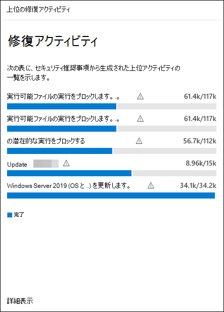

# 脆弱性を修復脅威と脆弱性の管理

[!INCLUDE [Microsoft 365 Defender rebranding](../../includes/microsoft-defender.md)]

**適用対象:**
- [Microsoft Defender for Endpoint](https://go.microsoft.com/fwlink/?linkid=2154037)
- [脅威と脆弱性の管理](next-gen-threat-and-vuln-mgt.md)
- [Microsoft 365 Defender](https://go.microsoft.com/fwlink/?linkid=2118804)

> Microsoft Defender ATP を試してみたいですか? [無料試用版にサインアップしてください。](https://signup.microsoft.com/create-account/signup?products=7f379fee-c4f9-4278-b0a1-e4c8c2fcdf7e&ru=https://aka.ms/MDEp2OpenTrial?ocid=docs-wdatp-portaloverview-abovefoldlink)

## 修復の要求

Microsoft Defender for Endpoint 脅威と脆弱性の管理機能は、修復要求ワークフローを通じてセキュリティ管理者と IT 管理者の間のギャップを埋め合わせています。 IT 管理者に対してセキュリティの推奨事項ページから Intune への脆弱性の修復を要求できるセキュリティ管理者。

### 接続Microsoft Intune有効にする

この機能を使用するには、接続を有効Microsoft Intuneします。 [ポータル] Microsoft 365 Defender、[全般高度な機能 **設定**  >  **に**  >  **移動します**。 下にスクロールして、接続 **Microsoft Intuneします**。 既定では、トグルはオフになっています。 [接続] **Microsoft Intuneをオン****にします**。

**注**: Intune 接続が有効になっている場合は、修復要求を作成するときに Intune セキュリティ タスクを作成するオプションを取得します。 接続が設定されていない場合、このオプションは表示されません。

詳細 [については、「Intune を使用して Microsoft Defender for Endpoint](/intune/atp-manage-vulnerabilities) で特定された脆弱性を修復する」を参照してください。

### 修復要求の手順

1. [セキュリティ] ポータルの **[脅威** と脆弱性管理] ナビゲーション メニューに移動Microsoft 365 Defenderし、[推奨事項のセキュリティに関する推奨事項][**を選択します**](tvm-security-recommendation.md)。

2. 修復を要求するセキュリティ推奨事項を選択し、[修復オプション] **を選択します**。

3. 修復を要求する項目、該当するデバイス グループ、優先度、期限、オプションのメモなど、フォームに入力します。
    1. [注意が必要] 修復オプションを選択した場合、特定のアクションが実行されないので、期日を選択できません。

4. [要求 **の送信] を選択します**。 修復要求を送信すると、脅威と脆弱性の管理内に修復アクティビティ アイテムが作成され、この推奨事項の修復の進行状況を監視するために使用できます。 これにより、修復がトリガーされないか、デバイスに変更が適用されません。

5. IT 管理者に新しい要求について通知し、Intune にログインして要求を承認または拒否し、パッケージの展開を開始します。

6. [修復] [**ページに**](tvm-remediation.md) 移動して、修復要求の状態を表示します。

Intune でチケットがどのように表示されるのか確認する場合は、「Use Intune to [remediate vulnerabilited by Microsoft Defender for Endpoint」](/intune/atp-manage-vulnerabilities) を参照してください。

>[!NOTE]
>要求で 10,000 台を超えるデバイスの修復が必要な場合は、Intune に修復のために 10,000 台のデバイスのみを送信できます。

組織のサイバーセキュリティの弱点が特定され、アクション可能なセキュリティ推奨事項にマップされた後、セキュリティ タスクの作成を開始します。 修復チケットが作成される場所をMicrosoft Intuneを使用してタスクを作成できます。

セキュリティに関する推奨事項を修復することで、組織の脆弱性による露出を低くし、セキュリティ構成を強化します。

## 修復アクティビティの表示

[セキュリティの推奨事項] ページから修復要求を送信すると、修復アクティビティが開始されます。 [修復] ページで追跡できるセキュリティ タスクが脅威と脆弱性の管理、修復チケットが [修復] ページにMicrosoft Intune。

[注意が必要] 修復オプションを選択した場合は、監視できる実際のアクションが行われなかから、進行状況バー、チケットの状態、または期限はありません。

[修復] ページに移動したら、表示する修復アクティビティを選択します。 修復手順を実行したり、進行状況を追跡したり、関連する推奨事項を表示したり、CSV にエクスポートしたり、完了としてマークすることができます。

:::image type="content" source="../../media/remediation-flyouteolswnew.png" lightbox="../../media/remediation-flyouteolswnew.png" alt-text="選択した修復アクティビティを含む修復ページの例、および説明、IT サービスとデバイス管理ツール、デバイス修復を示すアクティビティのフライアウト":::

>[!NOTE]
> 完了した修復アクティビティには 180 日間の保持期間があります。 修復ページのパフォーマンスを最適に維持するために、修復アクティビティは完了から 6 か月後に削除されます。

### 列で完了

[修復] ページの [完了者] 列を使用して、修復アクティビティを閉じたユーザーを追跡します。

- **電子メール アドレス**: タスクを手動で完了したユーザーのメール
- **システム確認**: タスクが自動的に完了しました (すべてのデバイスが修復されました)
- **N/A**: この古いタスクがどのように完了したのか分からないので、情報は利用できません

:::image type="content" alt-text="2 行の列によって作成され、完了します。完了した行の 1 つは電子メールの例を持ち、もう 1 行はシステム確認と言います。" source="images/tvm-completed-by.png":::

### ダッシュボードの上位修復アクティビティ

脅威 **と脆弱性管理ダッシュボード** で上位 [の修復 **アクティビティを表示** します](tvm-dashboard-insights.md)。 [修復] ページに移動するエントリを **選択** します。 IT 管理者チームがタスクを修復した後、修復アクティビティを完了としてマークできます。

## 関連記事

- [脅威と脆弱性の管理概要](next-gen-threat-and-vuln-mgt.md)
- [ダッシュボード](tvm-dashboard-insights.md)
- [セキュリティ上の推奨事項](tvm-security-recommendation.md)