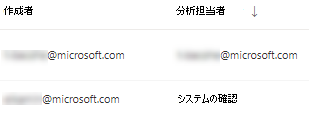

# 脆弱性を修復脅威と脆弱性の管理Remediate vulnerabilities with threat and vulnerability management

[!INCLUDE [Microsoft 365 Defender rebranding](../../includes/microsoft-defender.md)]

**適用対象:****Applies to:**
- [Microsoft Defender for EndpointMicrosoft Defender for Endpoint](https://go.microsoft.com/fwlink/?linkid=2154037)
- [脅威と脆弱性の管理Threat and vulnerability management](next-gen-threat-and-vuln-mgt.md)
- [Microsoft 365 DefenderMicrosoft 365 Defender](https://go.microsoft.com/fwlink/?linkid=2118804)

>Microsoft Defender ATP を試してみたいですか?Want to experience Microsoft Defender for Endpoint? [無料試用版にサインアップしてください。Sign up for a free trial.](https://www.microsoft.com/microsoft-365/windows/microsoft-defender-atp?ocid=docs-wdatp-portaloverview-abovefoldlink)

## 修復の要求Request remediation

Microsoft Defender for Endpoint 脅威と脆弱性の管理機能は、修復要求ワークフローを通じてセキュリティ管理者と IT 管理者の間のギャップを埋め合わせています。The threat and vulnerability management capability in Microsoft Defender for Endpoint bridges the gap between Security and IT administrators through the remediation request workflow. IT 管理者に対してセキュリティの推奨事項ページから Intune への脆弱性の修復を要求できるセキュリティ管理者。Security admins like you can request for the IT Administrator to remediate a vulnerability from the **Security recommendation** pages to Intune.

### 接続Microsoft Intune有効にするEnable Microsoft Intune connection

この機能を使用するには、接続を有効Microsoft Intuneします。To use this capability, enable your Microsoft Intune connections. [一般Microsoft Defender セキュリティ センター] で、[**全般設定**  >  **機能]**  >  **に移動します**。In the Microsoft Defender Security Center, navigate to **Settings** > **General** > **Advanced features**. 下にスクロールして、接続 **Microsoft Intuneします**。Scroll down and look for **Microsoft Intune connection**. 既定では、トグルはオフになっています。By default, the toggle is turned off. [接続] **Microsoft Intuneをオン\*\*\*\*にします**。Turn your **Microsoft Intune connection** toggle **On**.

**注**: Intune 接続が有効になっている場合は、修復要求を作成するときに Intune セキュリティ タスクを作成するオプションを取得します。**Note**: If you have the Intune connection enabled, you get an option to create an Intune security task when creating a remediation request. 接続が設定されていない場合、このオプションは表示されません。This option does not appear if the connection is not set.

詳細 [については、「Intune を使用して Microsoft Defender for Endpoint](/intune/atp-manage-vulnerabilities) で特定された脆弱性を修復する」を参照してください。See [Use Intune to remediate vulnerabilities identified by Microsoft Defender for Endpoint](/intune/atp-manage-vulnerabilities) for details.

### 修復要求の手順Remediation request steps

1. [セキュリティ] ウィンドウ脅威と脆弱性の管理メニューに移動し、[セキュリティMicrosoft Defender セキュリティ センターを [**選択します**](tvm-security-recommendation.md)。Go to the threat and vulnerability management navigation menu in the Microsoft Defender Security Center, and select [**Security recommendations**](tvm-security-recommendation.md).

2. 修復を要求するセキュリティ推奨事項を選択し、[修復オプション] **を選択します**。Select a security recommendation you would like to request remediation for, and then select **Remediation options**.

3. 修復を要求する項目、該当するデバイス グループ、優先度、期限、オプションのメモなど、フォームに入力します。Fill out the form, including what you are requesting remediation for, applicable device groups, priority, due date, and optional notes.
    1. [注意が必要] 修復オプションを選択した場合、特定のアクションが実行されないので、期日を選択できません。If you choose the "attention required" remediation option, selecting a due date will not be available since there is no specific action.

4. [要求 **の送信] を選択します**。Select **Submit request**. 修復要求を送信すると、脅威と脆弱性の管理内に修復アクティビティ アイテムが作成され、この推奨事項の修復の進行状況を監視するために使用できます。Submitting a remediation request creates a remediation activity item within threat and vulnerability management, which can be used for monitoring the remediation progress for this recommendation. これにより、修復がトリガーされないか、デバイスに変更が適用されません。This will not trigger a remediation or apply any changes to devices.

5. IT 管理者に新しい要求について通知し、Intune にログインして要求を承認または拒否し、パッケージの展開を開始します。Notify your IT Administrator about the new request and have them log into Intune to approve or reject the request and start a package deployment.

6. [修復] [**ページに**](tvm-remediation.md) 移動して、修復要求の状態を表示します。Go to the [**Remediation**](tvm-remediation.md) page to view the status of your remediation request.

Intune でチケットがどのように表示されるのか確認する場合は、「Use Intune to [remediate vulnerabilited by Microsoft Defender for Endpoint」](/intune/atp-manage-vulnerabilities) を参照してください。If you want to check how the ticket shows up in Intune, see [Use Intune to remediate vulnerabilities identified by Microsoft Defender for Endpoint](/intune/atp-manage-vulnerabilities) for details.

>[!NOTE]
>要求で 10,000 台を超えるデバイスの修復が必要な場合は、Intune に修復のために 10,000 台のデバイスのみを送信できます。If your request involves remediating more than 10,000 devices, we can only send 10,000 devices for remediation to Intune.

組織のサイバーセキュリティの弱点が特定され、アクション可能なセキュリティ推奨事項にマップされた後、セキュリティ タスクの作成を開始します。After your organization's cybersecurity weaknesses are identified and mapped to actionable [security recommendations](tvm-security-recommendation.md), start creating security tasks. 修復チケットが作成される場所をMicrosoft Intuneを使用してタスクを作成できます。You can create tasks through the integration with Microsoft Intune where remediation tickets are created.

セキュリティに関する推奨事項を修復することで、組織の脆弱性による露出を低くし、セキュリティ構成を強化します。Lower your organization's exposure from vulnerabilities and increase your security configuration by remediating the security recommendations.

## 修復アクティビティの表示View your remediation activities

[セキュリティの推奨事項] ページから修復要求を送信すると、修復アクティビティが開始されます。When you submit a remediation request from the Security recommendations page, it kicks-off a remediation activity. [修復] ページで追跡できるセキュリティ タスクが脅威と脆弱性の管理、修復チケットが [修復] ページにMicrosoft Intune。A security task is created that can be tracked in the threat and vulnerability management **Remediation** page, and a remediation ticket is created in Microsoft Intune.

[注意が必要] 修復オプションを選択した場合は、監視できる実際のアクションが行われなかから、進行状況バー、チケットの状態、または期限はありません。If you chose the "attention required" remediation option, there will be no progress bar, ticket status, or due date since there is no actual action we can monitor.

[修復] ページに移動したら、表示する修復アクティビティを選択します。Once you are in the Remediation page, select the remediation activity that you want to view. 修復手順を実行したり、進行状況を追跡したり、関連する推奨事項を表示したり、CSV にエクスポートしたり、完了としてマークすることができます。You can follow the remediation steps, track progress, view the related recommendation, export to CSV, or mark as complete.
![選択した修復アクティビティを含む [修復] ページの例と、そのアクティビティのフライアウトには、説明、IT サービスとデバイス管理ツール、およびデバイス修復の進行状況が一覧されます。](images/remediation_flyouteolsw.png)

>[!NOTE]
> 完了した修復アクティビティには 180 日間の保持期間があります。There is a 180 day retention period for completed remediation activities. 修復ページのパフォーマンスを最適に維持するために、修復アクティビティは完了から 6 か月後に削除されます。To keep the Remediation page performing optimally, the remediation activity will be removed 6 months after its completion.

### 列で完了Completed by column

[修復] ページの [完了者] 列を使用して、修復アクティビティを閉じたユーザーを追跡します。Track who closed the remediation activity with the "Completed by" column on the Remediation page.

- **電子メール アドレス**: タスクを手動で完了したユーザーのメール**Email address**: The email of the person who manually completed the task
- **システム確認**: タスクが自動的に完了しました (すべてのデバイスが修復されました)**System confirmation**: The task was automatically completed (all devices remediated)
- **N/A**: この古いタスクがどのように完了したのか分からないので、情報は利用できません**N/A**: Information is not available because we don't know how this older task was completed

### ダッシュボードの上位修復アクティビティTop remediation activities in the dashboard

[ダッシュボード **] ダッシュボードで [** 上位修復アクティビティ [脅威と脆弱性の管理表示します](tvm-dashboard-insights.md)。View **Top remediation activities** in the [threat and vulnerability management dashboard](tvm-dashboard-insights.md). [修復] ページに移動するエントリを **選択** します。Select any of the entries to go to the **Remediation** page. IT 管理者チームがタスクを修復した後、修復アクティビティを完了としてマークできます。You can mark the remediation activity as completed after the IT admin team remediates the task.

## 関連資料Related articles

- [脅威と脆弱性の管理概要Threat and vulnerability management overview](next-gen-threat-and-vuln-mgt.md)
- [ダッシュボードDashboard](tvm-dashboard-insights.md)
- [セキュリティ上の推奨事項Security recommendations](tvm-security-recommendation.md)