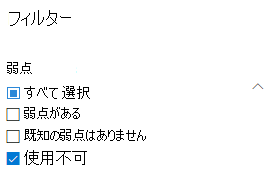
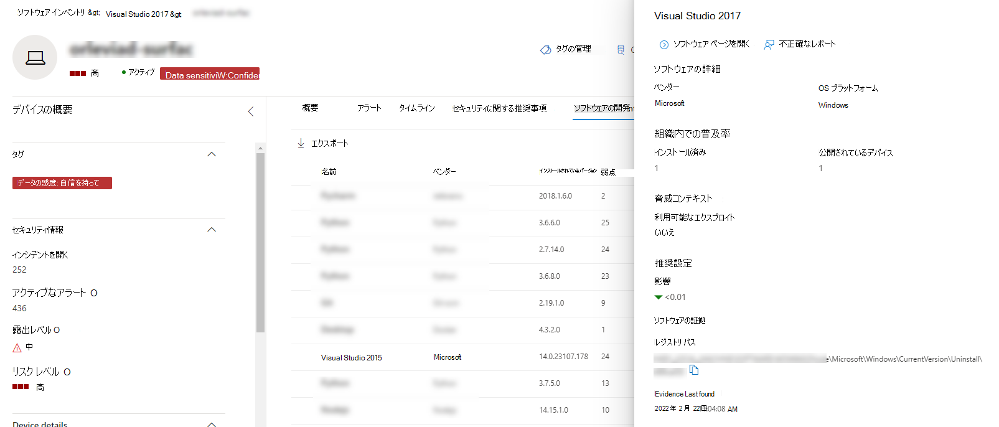
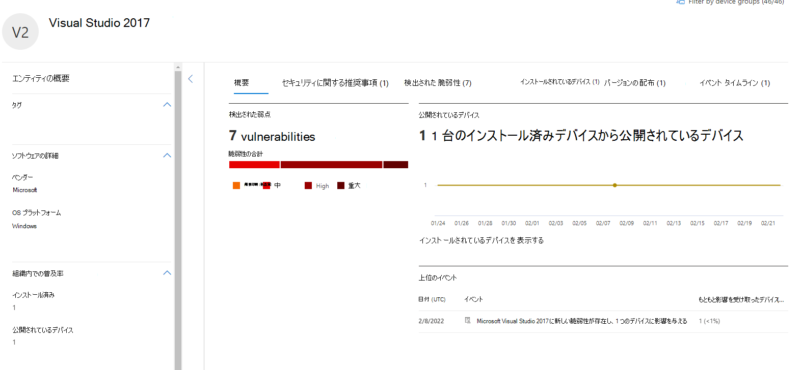

# ソフトウェア インベントリ - 脅威と脆弱性の管理Software inventory - threat and vulnerability management

[!INCLUDE [Microsoft 365 Defender rebranding](../../includes/microsoft-defender.md)]

**適用対象:****Applies to:**
- [Microsoft Defender for EndpointMicrosoft Defender for Endpoint](https://go.microsoft.com/fwlink/?linkid=2154037)
- [脅威と脆弱性の管理Threat and vulnerability management](next-gen-threat-and-vuln-mgt.md)
- [Microsoft 365 DefenderMicrosoft 365 Defender](https://go.microsoft.com/fwlink/?linkid=2118804)

>Defender for Endpoint を体験してみませんか?Want to experience Defender for Endpoint? [無料試用版にサインアップしてください。Sign up for a free trial.](https://www.microsoft.com/microsoft-365/windows/microsoft-defender-atp?ocid=docs-wdatp-portaloverview-abovefoldlink)

脅威と脆弱性管理のソフトウェア インベントリは、公式の共通プラットフォーム列挙 [(CPE)](https://nvd.nist.gov/products/cpe)を持つ組織内の既知のソフトウェアの一覧です。The software inventory in threat and vulnerability management is a list of known software in your organization with official [Common Platform Enumerations (CPE)](https://nvd.nist.gov/products/cpe). 公式 CPE のないソフトウェア製品には、脆弱性が公開されません。Software products without an official CPE don’t have vulnerabilities published. また、ベンダーの名前、弱点の数、脅威、公開されているデバイスの数などの詳細も含まれています。It also includes details such as the name of the vendor, number of weaknesses, threats, and number of exposed devices.

## メカニズムHow it works

検出の分野では [、Microsoft Defender for Endpoint](overview-endpoint-detection-response.md)の検出および応答機能の検出と脆弱性評価を担当するシグナルの同じセットを活用しています。In the field of discovery, we're leveraging the same set of signals that is responsible for detection and vulnerability assessment in [Microsoft Defender for Endpoint detection and response capabilities](overview-endpoint-detection-response.md).

リアルタイムで、数分で、脆弱性情報が発見されるのを見る事が可能です。Since it's real time, in a matter of minutes, you'll see vulnerability information as they get discovered. エンジンは、複数のセキュリティ フィードから情報を自動的に取得します。The engine automatically grabs information from multiple security feeds. 実際には、特定のソフトウェアがライブ脅威キャンペーンに接続されている場合に表示されます。In fact, you'll see if a particular software is connected to a live threat campaign. また、利用可能な脅威分析レポートへのリンクもすぐに提供されます。It also provides a link to a Threat Analytics report soon as it's available.

## [ソフトウェア インベントリ] ページに移動します。Navigate to the Software inventory page

Microsoft Defender セキュリティ センターの[脅威と脆弱性管理] ナビゲーション メニューから [ソフトウェア インベントリ] を選択して、[ソフトウェア インベントリ][ページにアクセスします](portal-overview.md)。Access the Software inventory page by selecting **Software inventory** from the threat and vulnerability management navigation menu in the [Microsoft Defender Security Center](portal-overview.md).

デバイスリストから個々のデバイス ページ内の特定のデバイス上のソフトウェア [を表示します](machines-view-overview.md)。View software on specific devices in the individual devices pages from the [devices list](machines-view-overview.md).

>[!NOTE]
>Microsoft Defender for Endpoint グローバル検索を使用してソフトウェアを検索する場合は、スペースの代わりにアンダースコアを付けなければなりません。If you search for software using the Microsoft Defender for Endpoint global search, make sure to put an underscore instead of a space. たとえば、最適な検索結果については、「Windows 10」ではなく「windows_10」と記述します。For example, for the best search results you'd write "windows_10" instead of "Windows 10".

## ソフトウェア インベントリの概要Software inventory overview

[ **ソフトウェア インベントリ]** ページが開き、ネットワークにインストールされているソフトウェアの一覧 (ベンダー名、見つかった弱点、関連する脅威、公開されたデバイス、露出スコアへの影響、タグなど) が表示されます。The **Software inventory** page opens with a list of software installed in your network, including the vendor name, weaknesses found, threats associated with them, exposed devices, impact to exposure score, and tags.

リスト ビューは、ソフトウェアで見つかった弱点、関連付けられた脅威、およびソフトウェアがサポートの終了に達したかどうかのようなタグに基づいてフィルター処理できます。You can filter the list view based on weaknesses found in the software, threats associated with them, and tags like whether the software has reached end-of-support.

調査するソフトウェアを選択します。Select the software that you want to investigate. フライアウト パネルが開き、ページ上の情報がコンパクトに表示されます。A flyout panel will open with a more compact view of the information on the page. 調査を深く掘り下げ、[ソフトウェアページを開く] を選択するか、[不正確なレポート] を選択して技術的な不整合にフラグ **を設定します**。You can either dive deeper into the investigation and select **Open software page**, or flag any technical inconsistencies by selecting **Report inaccuracy**.

### サポートされていないソフトウェアSoftware that isn't supported

脅威と脆弱性管理で現在サポート&ソフトウェアは、[ソフトウェア インベントリ] ページに表示される可能性があります。Software that isn't currently supported by threat & vulnerability management may be present in the Software inventory page. サポートされていないので、限られたデータしか使用できません。Because it is not supported, only limited data will be available. [弱さ] セクションの [使用できない] オプションを使用して、サポートされていないソフトウェアでフィルター処理します。Filter by unsupported software with the "Not available" option in the "Weakness" section.

以下は、ソフトウェアがサポートされていない状態を示しています。The following indicates that a software is not supported:

- [弱点] フィールドには [使用できません] と表示されます。Weaknesses field shows "Not available"
- [公開されたデバイス] フィールドにダッシュが表示されるExposed devices field shows a dash
- サイド パネルとソフトウェア ページに追加された情報テキストInformational text added in side panel and in software page
- ソフトウェア ページには、セキュリティに関する推奨事項、検出された脆弱性、またはイベント タイムライン セクションが表示されません。The software page won't have the security recommendations, discovered vulnerabilities, or event timeline sections

現在、CPE のない製品は、デバイス レベルのソフトウェア インベントリでのみ、ソフトウェア インベントリ ページに表示されません。Currently, products without a CPE are not shown in the software inventory page, only in the device level software inventory.

## デバイス上のソフトウェア インベントリSoftware inventory on devices

Microsoft Defender Security Center ナビゲーション パネルから、[デバイス] リスト **[に移動します](machines-view-overview.md)**。From the Microsoft Defender Security Center navigation panel, go to the **[Devices list](machines-view-overview.md)**. デバイスページ (Computer1 など) を開くデバイスの名前を選択し、[ソフトウェア インベントリ] タブを選択して、デバイスに存在する既知のすべてのソフトウェアの一覧を表示します。Select the name of a device to open the device page (like Computer1), then select the **Software inventory** tab to see a list of all the known software present on the device. 詳細については、特定のソフトウェア エントリを選択してフライアウトを開きます。Select a specific software entry to open the flyout with more information.

ソフトウェアは、脅威と脆弱性の管理で現在サポートされていない場合でも、デバイス レベルで表示される場合があります。Software may be visible at the device level even if it is currently not supported by threat and vulnerability management. ただし、使用できるデータは制限付きのみです。However, only limited data will be available. ソフトウェアがサポートされていないかどうかは、[弱さ] 列に "使用できません" と表示されます。You'll know if software is unsupported because it will say "Not available" in the "Weakness" column.

CPE がないソフトウェアは、このデバイス固有のソフトウェア インベントリの下に表示することもできます。Software with no CPE can also show up under this device specific software inventory.

### ソフトウェアの証拠Software evidence

レジストリ、ディスク、または両方からデバイス上の特定のソフトウェアが検出された場所の証拠を参照してください。デバイス ソフトウェア インベントリ内の任意のデバイスで検索できます。See evidence of where we detected a specific software on a device from the registry, disk, or both.You can find it on any device in the device software inventory.

ソフトウェア名を選択して、フライアウトを開き、"Software Evidence" というセクションを探します。Select a software name to open the flyout, and look for the section called "Software Evidence."

## ソフトウェア ページSoftware pages

ソフトウェア ページは、次に示すいくつかの方法で表示できます。You can view software pages a few different ways:

- ソフトウェア インベントリ ページ >ソフトウェア名を選択 **>で** [ソフトウェアを開く] ページを選択します。Software inventory page > Select a software name > Select **Open software page** in the flyout
- [[セキュリティに関する推奨事項>](tvm-security-recommendation.md) 選択] **>で** [ソフトウェアを開く] ページを選択します。[Security recommendations page](tvm-security-recommendation.md) > Select a recommendation > Select **Open software page** in the flyout
- [[イベント タイムライン](threat-and-vuln-mgt-event-timeline.md) ] ページ > イベントを選択する > フライアウトの [関連コンポーネント] というセクションで、ハイパーリンクされたソフトウェア名 (Visual Studio 2017 など) を選択します。[Event timeline page](threat-and-vuln-mgt-event-timeline.md) > Select an event > Select the hyperlinked software name (like Visual Studio 2017) in the section called "Related component" in the flyout

 特定のソフトウェアのすべての詳細と次の情報が表示される完全なページ。A full page will appear with all the details of a specific software and the following information:

- ベンダー情報を含むサイド パネル、組織内のソフトウェアの普及率 (インストールされているデバイスの数、パッチが適用されていない公開されたデバイスを含む)、利用可能かどうかと悪用の可否、および露出スコアへの影響。Side panel with vendor information, prevalence of the software in the organization (including number of devices it's installed on, and exposed devices that aren't patched), whether and exploit is available, and impact to your exposure score.
- 脆弱性と構成ミスの数と重大度を示すデータの視覚化。Data visualizations showing the number of, and severity of, vulnerabilities and misconfigurations. また、公開されているデバイスの数を示すグラフも表示されます。Also, graphs with the number of exposed devices.
- 次のような情報を示すタブ。Tabs showing information such as:
    - 特定された弱点と脆弱性に対する対応するセキュリティ推奨事項。Corresponding security recommendations for the weaknesses and vulnerabilities identified.
    - 検出された脆弱性の名前付き CVEs。Named CVEs of discovered vulnerabilities.
    - ソフトウェアがインストールされているデバイス (デバイス名、ドメイン、OS などと共に)。Devices that have the software installed (along with device name, domain, OS, and more).
    - ソフトウェア のバージョン 一覧 (バージョンがインストールされているデバイスの数、検出された脆弱性の数、インストールされているデバイスの名前を含む)。Software version list (including number of devices the version is installed on, the number of discovered vulnerabilities, and the names of the installed devices).

    

## レポートの不正確さReport inaccuracy

あいまいな情報、不正確な情報、または不完全な情報が表示された場合は、誤検知を報告します。Report a false positive when you see any vague, inaccurate, or incomplete information. 既に修復済みのセキュリティ推奨事項について報告できます。You can also report on security recommendations that have already been remediated.

1. [ソフトウェア インベントリ] ページでソフトウェア フライアウトを開きます。Open the software flyout on the Software inventory page.
2. [ **不正確なレポート] を選択します**。Select **Report inaccuracy**.
3. フライアウト ウィンドウで、ドロップダウン メニューから不正確なカテゴリを選択し、電子メール アドレスを入力し、不正確な情報の詳細を入力します。From the flyout pane, select the inaccuracy category from the drop-down menu, fill in your email address, and details about the inaccuracy.
4. [**送信**] を選択します。Select **Submit**. フィードバックは、脅威と脆弱性管理の専門家に直ちに送信されます。Your feedback is immediately sent to the threat and vulnerability management experts.

## 関連記事Related articles

- [脅威と脆弱性の管理の概要Threat and vulnerability management overview](next-gen-threat-and-vuln-mgt.md)
- [セキュリティ上の推奨事項Security recommendations](tvm-security-recommendation.md)
- [イベントのタイムラインEvent timeline](threat-and-vuln-mgt-event-timeline.md)
- [Microsoft Defender for Endpoint Devices リストの表示と整理View and organize the Microsoft Defender for Endpoint Devices list](machines-view-overview.md)
