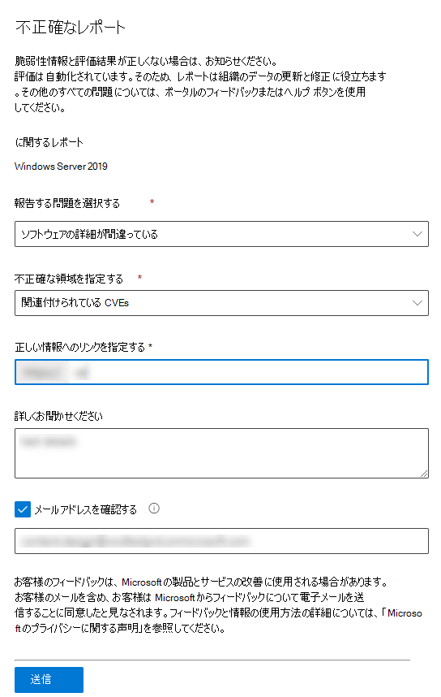

# ソフトウェア インベントリ - 脅威と脆弱性の管理

[!INCLUDE [Microsoft 365 Defender rebranding](../../includes/microsoft-defender.md)]

**適用対象:**

- [Microsoft Defender for Endpoint Plan 2](https://go.microsoft.com/fwlink/?linkid=2154037)
- [脅威と脆弱性の管理](next-gen-threat-and-vuln-mgt.md)
- [Microsoft 365 Defender](https://go.microsoft.com/fwlink/?linkid=2118804)

[!include[Prerelease information](../../includes/prerelease.md)]

> Defender for Endpoint を試す場合は、 [無料試用版にサインアップしてください。](https://signup.microsoft.com/create-account/signup?products=7f379fee-c4f9-4278-b0a1-e4c8c2fcdf7e&ru=https://aka.ms/MDEp2OpenTrial?ocid=docs-wdatp-portaloverview-abovefoldlink)

[ソフトウェア インベントリ] 脅威と脆弱性の管理は、組織内の既知のソフトウェアの一覧です。 ソフトウェア インベントリ ページの既定のフィルターには、公式の共通プラットフォーム列挙 [(CPE) を含むすべてのソフトウェアが表示されます](https://nvd.nist.gov/products/cpe)。 このビューには、ベンダーの名前、弱点の数、脅威、公開されているデバイスの数などの詳細が含まれます。

**CPE** 利用可能フィルターを削除して、組織にインストールされているソフトウェア全体でさらに可視性を高め、検索範囲を拡大できます。 つまり、CPE のないソフトウェアを含むすべてのソフトウェアが、ソフトウェア インベントリ リストに表示されます。

> [!NOTE]
> 脆弱性の管理 がソフトウェアと脆弱性を特定するために使用する CPEs は、CPE のないソフトウェア製品がソフトウェア インベントリ ページに表示される場合でも、脅威と脆弱性の管理 ではサポートされません。また、悪用、公開されたデバイスの数、弱点などの情報は利用できません。

## しくみ

検出の分野では、 [Microsoft Defender for Endpoint](overview-endpoint-detection-response.md) の検出および応答機能の検出と脆弱性評価を担当するシグナルの同じセットを活用しています。

リアルタイムで、数分で、脆弱性情報が発見されるのを見る事が可能です。 エンジンは、複数のセキュリティ フィードから情報を自動的に取得します。 実際には、特定のソフトウェアがライブ脅威キャンペーンに接続されている場合に表示されます。 また、利用可能な脅威分析レポートへのリンクもすぐに提供されます。

## [ソフトウェア インベントリ] ページに移動します。

[ソフトウェア インベントリ] ページにアクセスするには、ポータルの [脅威と脆弱性の管理] ナビゲーション メニューから [ソフトウェア インベントリ[] をMicrosoft 365 Defenderします](portal-overview.md)。

デバイスの一覧から、個々のデバイス ページ内の特定のデバイス上のソフトウェア [を表示します](machines-view-overview.md)。

> [!NOTE]
> Microsoft Defender for Endpoint グローバル検索を使用してソフトウェアを検索する場合は、スペースの代わりにアンダースコアを付けなければなりません。 たとえば、最適な検索結果については、"Windows 10" または "Windows 11" の代わりに "windows_10" または "windows_11" を記述します。

## ソフトウェア インベントリの概要

[ **ソフトウェア インベントリ]** ページが開き、ネットワークにインストールされているソフトウェアの一覧 (ベンダー名、見つかった弱点、関連する脅威、公開されたデバイス、露出スコアへの影響、タグなど) が表示されます。

既定では、ビューは製品コード **(CPE) によってフィルター処理されます。使用可能です**。 また、ソフトウェアで見つかった弱点、関連付けられた脅威、およびソフトウェアがサポート終了に達したかどうかのようなタグに基づいてリスト ビューをフィルター処理することもできます。

:::image type="content" alt-text="ソフトウェア インベントリのランディング ページの例。" source="images/software-inventory-page.png" lightbox="images/tvm-software-inventory.png":::

調査するソフトウェアを選択します。 フライアウト パネルが開き、ページ上の情報がコンパクトに表示されます。 調査の詳細を確認し、[ソフトウェア ページを開く] を選択するか、[不正確なレポート] を選択して技術的な不整合にフラグ **を設定します**。

### サポートされていないソフトウェア

脅威によって現在サポートされていないソフトウェア& 脆弱性の管理インベントリ ページに存在する可能性があります。 サポートされていないので、限られたデータしか使用できません。 [弱さ] セクションの [使用できない] オプションを使用して、サポートされていないソフトウェアでフィルター処理します。

:::image type="content" alt-text="サポートされていないソフトウェア フィルター。" source="images/tvm-unsupported-software-filter.png" lightbox="images/tvm-unsupported-software-filter.png":::

以下は、ソフトウェアがサポートされていない状態を示しています。

- [弱点] フィールドには [使用できません] と表示されます。
- [公開されたデバイス] フィールドにダッシュが表示される
- サイド パネルとソフトウェア ページに追加された情報テキスト
- ソフトウェア ページには、セキュリティに関する推奨事項、検出された脆弱性、またはイベント タイムライン セクションが表示されません。

## デバイス上のソフトウェア インベントリ

ポータル ナビゲーション Microsoft 365 Defenderから、[デバイス インベントリ] **[に移動します](machines-view-overview.md)**。 デバイスページ (Computer1 など) を開くデバイスの名前を選択し、[ソフトウェア インベントリ] タブを選択して、デバイスに存在する既知のすべてのソフトウェアの一覧を表示します。 詳細については、特定のソフトウェア エントリを選択してフライアウトを開きます。

ソフトウェアは、デバイス レベルで現在サポートされていない場合でも、デバイス レベルで表示脅威と脆弱性の管理。 ただし、使用できるデータは制限付きのみです。 ソフトウェアがサポートされていないかどうかは、[弱さ] 列に "使用できません" と表示されます。

CPE を持つソフトウェアは、このデバイス固有のソフトウェア インベントリの下に表示することもできます。

### ソフトウェアの証拠

レジストリ、ディスク、または両方からデバイス上の特定のソフトウェアが検出された場所の証拠を参照してください。 デバイス ソフトウェア インベントリ内の任意のデバイスで検索できます。

ソフトウェア名を選択して、フライアウトを開き、"Software Evidence" というセクションを探します。

:::image type="content" alt-text="デバイスの一覧からWindows 10証拠の例を示し、ソフトウェア証拠レジストリ パスを示します。" source="images/tvm-software-evidence.png" lightbox="images/tvm-software-evidence.png":::

## ソフトウェア ページ

ソフトウェア ページは、次に示すいくつかの方法で表示できます。

- ソフトウェア インベントリ ページ >ソフトウェア名を選択 **>で [** ソフトウェアを開く] ページを選択します。
- [[セキュリティに関する推奨事項>](tvm-security-recommendation.md) 選択] **>で [** ソフトウェアを開く] ページを選択します。
- [イベント タイムライン](threat-and-vuln-mgt-event-timeline.md) ページ > イベントを選択する > フライアウトの [関連コンポーネント] というセクションで、ハイパーリンクされたソフトウェア名 (Visual Studio 2017 など) を選択します。

 特定のソフトウェアのすべての詳細と次の情報が表示される完全なページ。

- ベンダー情報を含むサイド パネル、組織内のソフトウェアの普及率 (インストールされているデバイスの数、パッチが適用されていない公開されたデバイスを含む)、利用可能かどうかと悪用、および露出スコアへの影響。
- 脆弱性と構成ミスの数と重大度を示すデータの視覚化。 また、公開されているデバイスの数を示すグラフも表示されます。
- 次のような情報を示すタブ。
  - 特定された弱点と脆弱性に対する対応するセキュリティ推奨事項。
  - 検出された脆弱性の名前付き CVEs。
  - ソフトウェアがインストールされているデバイス (デバイス名、ドメイン、OS などと共に)。
  - ソフトウェア のバージョン 一覧 (バージョンがインストールされているデバイスの数、検出された脆弱性の数、インストールされているデバイスの名前を含む)。

    :::image type="content" alt-text="ソフトウェアの詳細、Visual Studio、公開されているデバイスなど、2017 年のソフトウェアサンプル ページ。" source="images/tvm-software-page-example.png" lightbox="images/tvm-software-page-example.png":::

## レポートの不正確さ

脆弱性情報と評価結果が正しくない場合は、不正確な情報を報告してください。

1. [ソフトウェア インベントリ] ページでソフトウェア フライアウトを開きます。
2. [ **不正確なレポート] を選択します**。
3. フライアウト ウィンドウで、報告する問題を次から選択します。

    - ソフトウェアの詳細が間違っている
    - 自分の組織のデバイスにソフトウェアがインストールされていない
    - インストール済みまたは公開されているデバイスの数が間違っている

4. 不正確に関する要求された詳細を入力します。 これは、報告する問題によって異なります。

5. **[送信]** を選択します。 フィードバックはすぐに専門家に脅威と脆弱性の管理されます。

## 関連記事

- [脅威と脆弱性の管理概要](next-gen-threat-and-vuln-mgt.md)
- [セキュリティ上の推奨事項](tvm-security-recommendation.md)
- [イベントのタイムライン](threat-and-vuln-mgt-event-timeline.md)
- [Microsoft Defender for Endpoint Devices リストの表示と整理](machines-view-overview.md)
