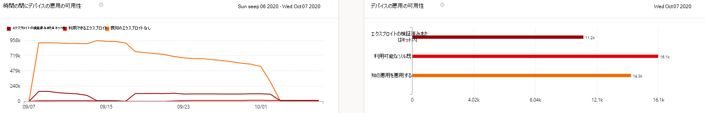
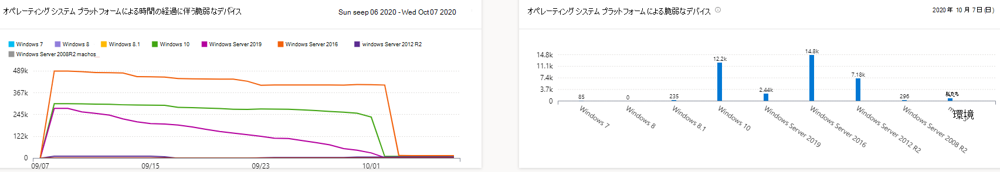
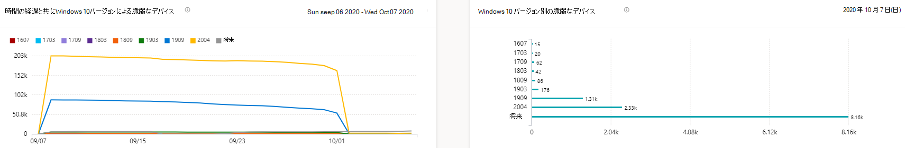

# 脆弱なデバイス レポート - 脅威と脆弱性の管理Vulnerable devices report - threat and vulnerability management

[!INCLUDE [Microsoft 365 Defender rebranding](../../includes/microsoft-defender.md)]

**適用対象:****Applies to:**

- [Microsoft Defender for EndpointMicrosoft Defender for Endpoint](https://go.microsoft.com/fwlink/?linkid=2154037)
- [脅威と脆弱性の管理Threat and vulnerability management](next-gen-threat-and-vuln-mgt.md)
- [Microsoft 365 DefenderMicrosoft 365 Defender](https://go.microsoft.com/fwlink/?linkid=2118804)

>Microsoft Defender ATP を試してみたいですか?Want to experience Microsoft Defender for Endpoint? [無料試用版にサインアップしてください。Sign up for a free trial.](https://www.microsoft.com/microsoft-365/windows/microsoft-defender-atp?ocid=docs-wdatp-portaloverview-abovefoldlink)

レポートには、脆弱なデバイスの傾向と現在の統計を含むグラフと棒グラフが表示されます。The report shows graphs and bar charts with vulnerable device trends and current statistics. 目標は、デバイスの露出の呼吸と範囲を理解する目的です。The goal is for you to understand the breath and scope of your device exposure.

[脆弱なデバイスのレポート] Microsoft Defender セキュリティ センターにアクセスして、>**レポートにアクセスします。**Access the report in the Microsoft Defender Security Center by going to **Reports > Vulnerable devices**

次の 2 つの列があります。There are two columns:

- 傾向 (時間の流れる)。Trends (over time). 過去 30 日間、3 か月、6 か月、またはカスタムの日付範囲を表示できます。Can show the past 30 days, 3 months, 6 months, or a custom date range.
- 今日 (現在の情報)Today (current information)

**フィルター**: 脆弱性の重大度レベル、悪用の可用性、脆弱性の年齢、オペレーティング システム プラットフォーム、Windows 10 バージョン、またはデバイス グループでデータをフィルター処理できます。**Filter**: You can filter the data by vulnerability severity levels, exploit availability, vulnerability age, operating system platform, Windows 10 version, or device group.

**ドリルダウン:** さらに詳しい分析情報がある場合は、関連する棒グラフを選択して、[デバイス インベントリ] ページにフィルター処理されたデバイスの一覧を表示します。**Drill down**: If there is an insight you want to explore further, select the relevant bar chart to view a filtered list of devices in the Device inventory page. そこからリストをエクスポートできます。From there, you can export the list.

## 重大度レベルのグラフSeverity level graphs

各デバイスは、そのデバイスで見つかった最も重大な脆弱性に従って 1 回だけカウントされます。Each device is counted only once according to the most severe vulnerability found on that device.

## 可用性グラフの活用Exploit availability graphs

各デバイスは、既知の悪用の最高レベルに基づいて 1 回だけカウントされます。Each device is counted only once based on the highest level of known exploit.

## 脆弱性の年齢グラフVulnerability age graphs

各デバイスは、最も古い脆弱性公開日の下で 1 回だけカウントされます。Each device is counted only once under the oldest vulnerability publication date. 古い脆弱性は悪用される可能性が高くなります。Older vulnerabilities have a higher chance of being exploited.

## オペレーティング システム プラットフォームグラフによる脆弱なデバイスVulnerable devices by operating system platform graphs

ソフトウェアの脆弱性により公開される各オペレーティング システム上のデバイスの数。The number of devices on each operating system that are exposed due to software vulnerabilities.

## バージョン グラフによるWindows 10デバイスVulnerable devices by Windows 10 version graphs

脆弱なアプリケーションまたは OS Windows 10される各バージョンのデバイスの数。The number of devices on each Windows 10 version that are exposed due to vulnerable applications or OS.

## 関連項目Related topics

- [脅威と脆弱性の管理概要Threat and vulnerability management overview](next-gen-threat-and-vuln-mgt.md)
- [セキュリティ上の推奨事項Security recommendations](tvm-security-recommendation.md)
