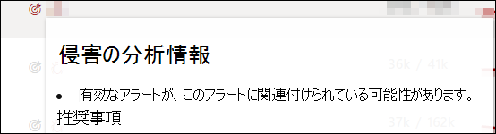
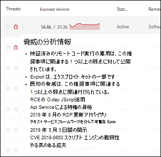
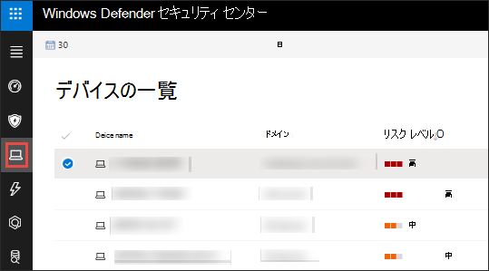

# 組織の脆弱性 - 脅威と脆弱性の管理

[!INCLUDE [Microsoft 365 Defender rebranding](../../includes/microsoft-defender.md)]

**適用対象:**
- [Microsoft Defender for Endpoint](https://go.microsoft.com/fwlink/?linkid=2154037)
- [脅威と脆弱性の管理](next-gen-threat-and-vuln-mgt.md)
- [Microsoft 365 Defender](https://go.microsoft.com/fwlink/?linkid=2118804)

> Microsoft Defender ATP を試してみたいですか? [無料試用版にサインアップしてください。](https://signup.microsoft.com/create-account/signup?products=7f379fee-c4f9-4278-b0a1-e4c8c2fcdf7e&ru=https://aka.ms/MDEp2OpenTrial?ocid=docs-wdatp-portaloverview-abovefoldlink)

脅威と脆弱性の管理は、Defender for Endpoint のエンドポイント保護で同じ信号を使用して、脆弱性をスキャンおよび検出します。

[ **弱点] ページには** 、共通の脆弱性と露出 (CVE) ID を一覧表示して、デバイスが公開されるソフトウェアの脆弱性が一覧表示されます。 重大度、一般的な脆弱性スコアリング システム (CVSS) の評価、組織での普及率、対応する侵害、脅威の分析情報なども表示できます。

> [!NOTE]
> 公式の CVE-ID が脆弱性に割り当てられていない場合、脆弱性名は脆弱性の名前によって割り当脅威と脆弱性の管理。

> [!TIP]
> 新しい脆弱性イベントに関する電子メールを取得するには [、「Configure vulnerability email notifications in Microsoft Defender for Endpoint」を参照してください。](configure-vulnerability-email-notifications.md)

## [弱点] ページに移動します。

[弱点] ページにアクセスするには、次に示すいくつかの方法があります。

- [Microsoft 365 Defender ポータル]の [脆弱性管理] ナビゲーション メニューから [弱点] を選択する (portal-overview.md)
- グローバル検索

### ナビゲーション メニュー

[脆弱性管理] **ナビゲーション メニューに** 移動し、[弱点] を選択 **して** 、CVEs の一覧を開きます。

### グローバル検索の脆弱性

1. グローバル検索ドロップダウン メニューに移動します。
2. [ **脆弱性と** キーイン] を選択し、探している共通の脆弱性と露出 (CVE) ID を選択し、検索アイコンを選択します。 [ **弱点] ページ** が開き、探している CVE 情報が表示されます。

3. CVE を選択して、脆弱性の説明、詳細、脅威の分析情報、公開されたデバイスなど、詳細情報を含むフライアウト パネルを開きます。

[弱点] ページで残りの脆弱性を確認するには、「CVE」と入力し、[検索] を選択します。

## 弱点の概要

公開されているデバイスの脆弱性を修復して、資産と組織のリスクを軽減します。 [ **公開されたデバイス] 列** に 0 が表示されている場合は、危険にさらされません。

### 侵害と脅威に関する分析情報

アイコンが赤に色付けされている場合は、[ **脅威** ] 列に関連する侵害と脅威の分析情報を表示します。

 > [!NOTE]
 > 継続的な脅威に関連付けられている推奨事項の優先順位を常に設定します。 これらの推奨事項には、脅威の分析情報アイコン赤いバグの簡単  と侵害インサイト アイコン 

侵害の分析情報アイコンは、組織に脆弱性が見つかった場合に強調表示されます。

組織で見つかった脆弱性に関連する悪用がある場合は、脅威の分析情報アイコンが強調表示されます。 アイコンにカーソルを合わせると、脅威がエクスプロイト キットの一部かどうか、または特定の高度な永続的なキャンペーンやアクティビティ グループに接続されているかどうかを示します。 利用可能な場合は、ゼロデイの悪用ニュース、開示、または関連するセキュリティ アドバイザリを含む Threat Analytics レポートへのリンクがあります。

### 脆弱性に関する分析情報を取得する

CVE を選択すると、フライアウト パネルが開き、脆弱性の説明、詳細、脅威の分析情報、公開されたデバイスなどの詳細情報が表示されます。

- "OS 機能" カテゴリは、関連するシナリオで表示されます。
- 公開されているデバイスを使用して、すべての CVE の関連するセキュリティ推奨事項に移動できます。

 

### サポートされていないソフトウェア

現在脅威や脅威によってサポートされていないソフトウェアの CVes は& 脆弱性の管理のページに表示されます。 ソフトウェアはサポートされていないので、使用できるデータは限られています。

公開されているデバイス情報は、サポートされていないソフトウェアの CVEs では使用できません。 [公開されたデバイス] セクションで [使用できない] オプションを選択して、サポートされていないソフトウェアでフィルター処理します。

:::image type="content" alt-text="公開されているデバイス フィルター。" source="images/tvm-exposed-devices-filter.png":::

## 他の場所で一般的な脆弱性と露出 (CVE) エントリを表示する

### ダッシュボードの脆弱なソフトウェアの上位

1. ダッシュボードの [[脅威と脆弱性の管理] に移動](tvm-dashboard-insights.md)し、[脆弱なソフトウェアの上位]**ウィジェットまで下にスクロール** します。 各ソフトウェアで見つかった脆弱性の数と、脅威情報、デバイスの露出の詳細なビューが表示されます。

    

2. 調査するソフトウェアを選択してドリルダウン ページに移動します。

3. [検出された **脆弱性] タブを選択** します。

4. 脆弱性の詳細については、調査する脆弱性を選択します。

    

### デバイス ページで脆弱性を検出する

デバイス ページに関連する弱点情報を表示します。

1. ナビゲーション メニュー バー Microsoft 365 Defenderに移動し、デバイス アイコンを選択します。 [ **デバイス インベントリ] ページ** が開きます。

2. [デバイス **インベントリ] ページ** で、調査するデバイス名を選択します。

    

3. [デバイス] ページが開き、調査するデバイスの詳細と応答オプションが表示されます。

4. [検出 **された脆弱性] を選択します**。

   :::image type="content" alt-text="詳細と応答オプションを含むデバイス ページ。" source="images/tvm-discovered-vulnerabilities.png" lightbox="images/tvm-discovered-vulnerabilities.png":::

5. 調査する脆弱性を選択して、CVE の詳細 (脆弱性の説明、脅威の分析情報、検出ロジックなど) を含むフライアウト パネルを開きます。

#### CVE 検出ロジック

ソフトウェアの証拠と同様に、デバイスに適用した検出ロジックが表示され、脆弱性が確認されます。 新しいセクションは "Detection Logic" (デバイス ページで検出された脆弱性) と呼ばれ、検出ロジックとソースを示します。

"OS 機能" カテゴリは、関連するシナリオにも表示されます。 CVE は、特定の OS コンポーネントが有効になっている場合にのみ、脆弱な OS を実行するデバイスに影響します。 たとえば、サーバー 2019 Windows DNS コンポーネントに脆弱性が存在するとします。 この新機能では、この CVE を OS で DNS 機能が有効になっている Windows Server 2019 デバイスにのみ接続します。

:::image type="content" alt-text="デバイスと KB で検出されたソフトウェアを一覧表示する検出ロジックの例。" source="images/tvm-cve-detection-logic.png":::

## レポートの不正確さ

あいまいな情報、不正確な情報、または不完全な情報が表示された場合は、誤検知を報告します。 既に修復済みのセキュリティ推奨事項について報告できます。

1. [弱点] ページで CVE を開きます。
2. [ **不正確なレポート] を選択すると、** フライアウト ウィンドウが開きます。
3. ドロップダウン メニューから不正確なカテゴリを選択し、メール アドレスと不正確な詳細を入力します。
4. **[送信]** を選択します。 フィードバックはすぐに専門家に脅威と脆弱性の管理されます。

## 関連記事

- [脅威と脆弱性の管理概要](next-gen-threat-and-vuln-mgt.md)
- [セキュリティ上の推奨事項](tvm-security-recommendation.md)
- [ソフトウェア インベントリ](tvm-software-inventory.md)
- [ダッシュボード インサイト](tvm-dashboard-insights.md)
- [Microsoft Defender for Endpoint Devices リストの表示と整理](machines-view-overview.md)
