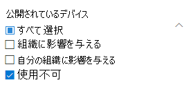
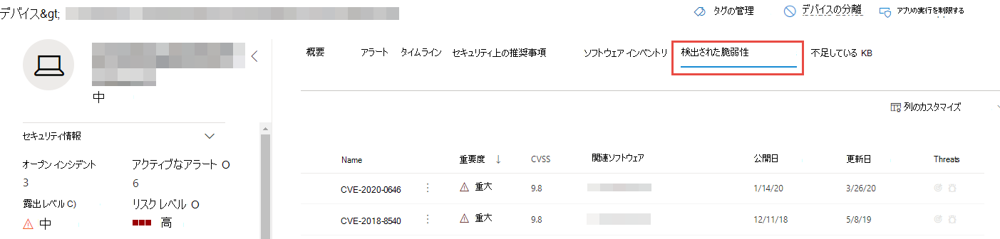
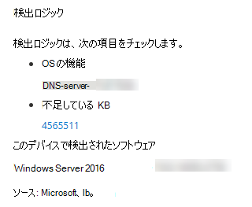

# 組織の脆弱性 - 脅威と脆弱性の管理Vulnerabilities in my organization - threat and vulnerability management

[!INCLUDE [Microsoft 365 Defender rebranding](../../includes/microsoft-defender.md)]

**適用対象:****Applies to:**
- [Microsoft Defender for EndpointMicrosoft Defender for Endpoint](https://go.microsoft.com/fwlink/?linkid=2154037)
- [脅威と脆弱性の管理Threat and vulnerability management](next-gen-threat-and-vuln-mgt.md)
- [Microsoft 365 DefenderMicrosoft 365 Defender](https://go.microsoft.com/fwlink/?linkid=2118804)

>Microsoft Defender for Endpoint を体験してみませんか?Want to experience Microsoft Defender for Endpoint? [無料試用版にサインアップします。Sign up for a free trial.](https://www.microsoft.com/microsoft-365/windows/microsoft-defender-atp?ocid=docs-wdatp-portaloverview-abovefoldlink)

脅威と脆弱性の管理では、Defender for Endpoint のエンドポイント保護で同じシグナルを使用して、脆弱性をスキャンおよび検出します。Threat and vulnerability management uses the same signals in Defender for Endpoint's endpoint protection to scan and detect vulnerabilities.

[ **弱点] ページには** 、共通の脆弱性と露出 (CVE) ID を一覧表示して、デバイスが公開されるソフトウェアの脆弱性が一覧表示されます。The **Weaknesses** page lists the software vulnerabilities your devices are exposed to by listing the Common Vulnerabilities and Exposures (CVE) ID. 重大度、一般的な脆弱性スコアリング システム (CVSS) の評価、組織での普及率、対応する侵害、脅威の分析情報なども表示できます。You can also view the severity, Common Vulnerability Scoring System (CVSS) rating, prevalence in your organization, corresponding breach, threat insights, and more.

>[!NOTE]
>脆弱性に割り当てられた公式の CVE-ID がない場合、脆弱性名は脅威と脆弱性の管理によって割り当てられます。If there is no official CVE-ID assigned to a vulnerability, the vulnerability name is assigned by threat and vulnerability management.

>[!TIP]
>新しい脆弱性イベントに関する電子メールを取得するには [、「Configure vulnerability email notifications in Microsoft Defender for Endpoint」を参照してください。](configure-vulnerability-email-notifications.md)To get emails about new vulnerability events, see [Configure vulnerability email notifications in Microsoft Defender for Endpoint](configure-vulnerability-email-notifications.md)

## [弱点] ページに移動します。Navigate to the Weaknesses page

[弱点] ページにアクセスするには、次に示すいくつかの方法があります。Access the Weaknesses page a few different ways:

- Microsoft Defender **セキュリティ センター** の [脅威と脆弱性管理] ナビゲーション メニューから [ [弱点] を選択する](portal-overview.md)Selecting **Weaknesses** from the threat and vulnerability management navigation menu in the [Microsoft Defender Security Center](portal-overview.md)
- グローバル検索Global search

### ナビゲーション メニューNavigation menu

[脅威と脆弱性の管理] ナビゲーション メニューに移動し、[弱点] を選択 **して** CVEs の一覧を開きます。Go to the threat and vulnerability management navigation menu and select **Weaknesses** to open the list of CVEs.

### グローバル検索の脆弱性Vulnerabilities in global search

1. グローバル検索ドロップダウン メニューに移動します。Go to the global search drop-down menu.
2. [ **脆弱性と** キーイン] を選択し、探している共通の脆弱性と露出 (CVE) ID を選択し、検索アイコンを選択します。Select **Vulnerability** and key-in the Common Vulnerabilities and Exposures (CVE) ID that you're looking for, then select the search icon. [ **弱点] ページ** が開き、探している CVE 情報が表示されます。The **Weaknesses** page opens with the CVE information that you're looking for.

3. CVE を選択して、脆弱性の説明、詳細、脅威の分析情報、公開されたデバイスなど、詳細情報を含むフライアウト パネルを開きます。Select the CVE to open a flyout panel with more information, including the vulnerability description, details, threat insights, and exposed devices.

[弱点] ページで残りの脆弱性を確認するには、「CVE」と入力し、[検索] を選択します。To see the rest of the vulnerabilities in the **Weaknesses** page, type CVE, then select search.

## 弱点の概要Weaknesses overview

公開されているデバイスの脆弱性を修復して、資産と組織のリスクを軽減します。Remediate the vulnerabilities in exposed devices to reduce the risk to your assets and organization. [ **公開されたデバイス] 列** に 0 が表示されている場合は、危険にさらされません。If the **Exposed Devices** column shows 0, that means you aren't at risk.

### 侵害と脅威に関する分析情報Breach and threat insights

アイコンが赤に色付けされている場合は、[ **脅威** ] 列に関連する侵害と脅威の分析情報を表示します。View any related breach and threat insights in the **Threat** column when the icons are colored red.

 >[!NOTE]
 > 継続的な脅威に関連付けられている推奨事項の優先順位を常に設定します。Always prioritize recommendations that are associated with ongoing threats. これらの推奨事項には、脅威の分析情報アイコン赤いバグの簡単 These recommendations are marked with the threat insight icon  と侵害インサイト アイコン and breach insight icon .  

侵害の分析情報アイコンは、組織に脆弱性が見つかった場合に強調表示されます。The breach insights icon is highlighted if there's a vulnerability found in your organization.
This one says "possible active alert is associated with this recommendation.](images/tvm-breach-insights.png)

組織で見つかった脆弱性に関連する悪用がある場合は、脅威の分析情報アイコンが強調表示されます。The threat insights icon is highlighted if there are associated exploits in the vulnerability found in your organization. アイコンにカーソルを合わせると、脅威がエクスプロイト キットの一部かどうか、または特定の高度な永続的なキャンペーンやアクティビティ グループに接続されているかどうかを示します。Hovering over the icon shows whether the threat is a part of an exploit kit, or connected to specific advanced persistent campaigns or activity groups. 利用可能な場合は、ゼロデイの悪用ニュース、開示、または関連するセキュリティ アドバイザリを含む Threat Analytics レポートへのリンクがあります。When available, there's a link to a Threat Analytics report with zero-day exploitation news, disclosures, or related security advisories.  

### 脆弱性に関する分析情報を取得するGain vulnerability insights

CVE を選択すると、フライアウト パネルが開き、脆弱性の説明、詳細、脅威の分析情報、公開されたデバイスなどの詳細情報が表示されます。If you select a CVE, a flyout panel will open with more information such as the vulnerability description, details, threat insights, and exposed devices.

- "OS 機能" カテゴリは、関連するシナリオで表示されます。The "OS Feature" category is shown in relevant scenarios
- 公開されているデバイスを使用して、すべての CVE の関連するセキュリティ推奨事項に移動できます。You can go to the related security recommendation for every CVE with exposed device

 

### サポートされていないソフトウェアSoftware that isn't supported

脆弱性管理の脅威によって現在サポートされていないソフトウェア&の CVEs は、引き続き [弱点] ページに表示されます。CVEs for software that isn't currently supported by threat & vulnerability management is still present in the Weaknesses page. ソフトウェアはサポートされていないので、使用できるデータは限られています。Because the software is not supported, only limited data will be available.

公開されているデバイス情報は、サポートされていないソフトウェアの CVEs では使用できません。Exposed device information will not be available for CVEs with unsupported software. [公開されたデバイス] セクションで [使用できない] オプションを選択して、サポートされていないソフトウェアでフィルター処理します。Filter by unsupported software by selecting the "Not available" option in the "Exposed devices" section.

 

## 他の場所で一般的な脆弱性と露出 (CVE) エントリを表示するView Common Vulnerabilities and Exposures (CVE) entries in other places

### ダッシュボードの脆弱なソフトウェアの上位Top vulnerable software in the dashboard

1. 脅威と脆弱性 [の管理ダッシュボードに移動](tvm-dashboard-insights.md) し、脆弱なソフトウェアのトップ ウィジェット **までスクロール** ダウンします。Go to the [threat and vulnerability management dashboard](tvm-dashboard-insights.md) and scroll down to the **Top vulnerable software** widget. 各ソフトウェアで見つかった脆弱性の数と、脅威情報、デバイスの露出の詳細なビューが表示されます。You will see the number of vulnerabilities found in each software, along with threat information and a high-level view of device exposure over time.

    

2. 調査するソフトウェアを選択してドリルダウン ページに移動します。Select the software you want to investigate to go to a drilldown page.
3. [検出された **脆弱性] タブを選択** します。Select the **Discovered vulnerabilities** tab.
4. 脆弱性の詳細については、調査する脆弱性を選択します。Select the vulnerability you want to investigate for more information on vulnerability details

    

### デバイス ページで脆弱性を検出するDiscover vulnerabilities in the device page

デバイス ページに関連する弱点情報を表示します。View related weaknesses information in the device page.

1. Microsoft Defender Security Center ナビゲーション メニュー バーに移動し、デバイス アイコンを選択します。Go to the Microsoft Defender Security Center navigation menu bar, then select the device icon. [ **デバイス] リスト ページ** が開きます。The **Devices list** page opens.
2. [デバイス **] リスト ページ** で、調査するデバイス名を選択します。In the **Devices list** page, select the device name that you want to investigate.

    

3. [デバイス] ページが開き、調査するデバイスの詳細と応答オプションが表示されます。The device page will open with details and response options for the device you want to investigate.
4. [検出 **された脆弱性] を選択します**。Select **Discovered vulnerabilities**.

    

5. 調査する脆弱性を選択して、CVE の詳細 (脆弱性の説明、脅威の分析情報、検出ロジックなど) を含むフライアウト パネルを開きます。Select the vulnerability that you want to investigate to open up a flyout panel with the CVE details, such as: vulnerability description, threat insights, and detection logic.

#### CVE 検出ロジックCVE Detection logic

ソフトウェアの証拠と同様に、デバイスに適用した検出ロジックが表示され、脆弱性が確認されます。Similar to the software evidence, we now show the detection logic we applied on a device in order to state that it's vulnerable. 新しいセクションは "Detection Logic" (デバイス ページで検出された脆弱性) と呼ばれ、検出ロジックとソースを示します。The new section is called "Detection Logic" (in any discovered vulnerability in the device page) and shows the detection logic and source.

"OS 機能" カテゴリは、関連するシナリオにも表示されます。The "OS Feature" category is also shown in relevant scenarios. CVE は、特定の OS コンポーネントが有効になっている場合にのみ、脆弱な OS を実行するデバイスに影響します。A CVE would affect devices that run a vulnerable OS only if a specific OS component is enabled. たとえば、Windows Server 2019 の DNS コンポーネントに脆弱性が存在するとします。Let's say Windows Server 2019 has vulnerability in its DNS component. この新機能では、この CVE を WINDOWS Server 2019 デバイスにのみ接続し、DNS 機能を OS で有効にします。With this new capability, we’ll only attach this CVE to the Windows Server 2019 devices with the DNS capability enabled in their OS.

## レポートの不正確さReport inaccuracy

あいまいな情報、不正確な情報、または不完全な情報が表示された場合は、誤検知を報告します。Report a false positive when you see any vague, inaccurate, or incomplete information. 既に修復済みのセキュリティ推奨事項について報告できます。You can also report on security recommendations that have already been remediated.

1. [弱点] ページで CVE を開きます。Open the CVE on the Weaknesses page.
2. [ **不正確なレポート] を選択すると、** フライアウト ウィンドウが開きます。Select **Report inaccuracy** and a flyout pane will open.
3. ドロップダウン メニューから不正確なカテゴリを選択し、メール アドレスと不正確な詳細を入力します。Select the inaccuracy category from the drop-down menu and fill in your email address and inaccuracy details.
4. [**送信**] を選択します。Select **Submit**. フィードバックは、脅威と脆弱性管理の専門家に直ちに送信されます。Your feedback is immediately sent to the threat and vulnerability management experts.

## 関連記事Related articles

- [脅威と脆弱性の管理の概要Threat and vulnerability management overview](next-gen-threat-and-vuln-mgt.md)
- [セキュリティ上の推奨事項Security recommendations](tvm-security-recommendation.md)
- [ソフトウェア インベントリSoftware inventory](tvm-software-inventory.md)
- [ダッシュボード インサイトDashboard insights](tvm-dashboard-insights.md)
- [Microsoft Defender for Endpoint Devices リストの表示と整理View and organize the Microsoft Defender for Endpoint Devices list](machines-view-overview.md)
