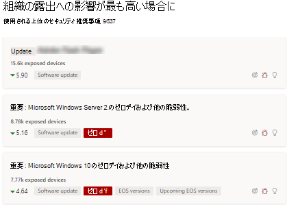
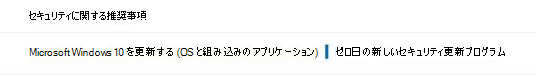

# ゼロデイの脆弱性を軽減する - 脅威と脆弱性の管理

[!INCLUDE [Microsoft 365 Defender rebranding](../../includes/microsoft-defender.md)]

**適用対象:**

- [Microsoft Defender for Endpoint](https://go.microsoft.com/fwlink/?linkid=2154037)
- [脅威と脆弱性の管理](next-gen-threat-and-vuln-mgt.md)
- [Microsoft 365 Defender](https://go.microsoft.com/fwlink/?linkid=2118804)

> Microsoft Defender ATP を試してみたいですか? [無料試用版にサインアップしてください。](https://signup.microsoft.com/create-account/signup?products=7f379fee-c4f9-4278-b0a1-e4c8c2fcdf7e&ru=https://aka.ms/MDEp2OpenTrial?ocid=docs-wdatp-portaloverview-abovefoldlink)

ゼロデイの脆弱性とは、公式のパッチやセキュリティ更新プログラムがリリースされていない一般に公開された脆弱性です。 ゼロデイの脆弱性は、多くの場合、重大度レベルが高く、積極的に悪用されます。

脅威と脆弱性の管理は、情報を持つゼロデイの脆弱性のみを表示します。

## ゼロデイの脆弱性に関する情報を検索する

ゼロデイの脆弱性が見つかったら、このポータルで次のエクスペリエンスを通じて情報Microsoft 365 Defenderされます。

> [!NOTE]
> 現在、0 日間の脆弱性機能は、特定の製品でのみWindowsできます。

### 脅威と脆弱性の管理ダッシュボード

"トップ セキュリティのおすすめ" カードで、0 日のタグを含む推奨事項を探します。

"トップ脆弱なソフトウェア" カードでゼロデイ タグを持つトップ ソフトウェアを見つける。

### [弱点] ページ

名前の付いたゼロデイの脆弱性と説明と詳細を探します。

- この脆弱性に CVE-ID が割り当てられている場合は、CVE 名の横にゼロ日ラベルが表示されます。

- この脆弱性に CVE-ID が割り当てられていない場合は、"TVM-XXXX-XXXX" のような内部の一時的な名前で検索されます。 名前は、公式の CVE-ID が割り当てられた後に更新されますが、以前の内部名はサイド パネルで検索可能で見つかる場合があります。

:::image type="content" alt-text="弱点ページの CVE-2020-17087 のゼロ日の例。" source="images/tvm-zero-day-weakness-name.png" lightbox="images/tvm-zero-day-weakness-name.png":::

### ソフトウェア インベントリ ページ

ゼロデイ タグを持つソフトウェアを探します。 "ゼロ日" タグでフィルター処理して、ゼロデイの脆弱性を持つソフトウェアのみを表示します。

:::image type="content" alt-text="ソフトウェア インベントリ ページWindows Server 2016ゼロ日の例。" source="images/tvm-zero-day-software-inventory.png" lightbox="images/tvm-zero-day-software-inventory.png":::

### [ソフトウェア] ページ

ゼロデイの脆弱性の影響を受けた各ソフトウェアのゼロデイ タグを探します。

:::image type="content" alt-text="ソフトウェア ページの 0 Windows Server 2016例。" source="images/tvm-zero-day-software-page.png" lightbox="images/tvm-zero-day-software-page.png":::

### [セキュリティの推奨事項] ページ

修復と軽減のオプションに関する明確な提案 (存在する場合の回避策を含む) を表示します。 "ゼロ日" タグでフィルター処理して、ゼロデイの脆弱性に対処するセキュリティ推奨事項のみを表示します。

ゼロデイの脆弱性と追加の脆弱性を持つソフトウェアが存在する場合は、すべての脆弱性に関する推奨事項が 1 つ表示されます。

:::image type="content" alt-text="[セキュリティの推奨事項] ページWindows Server 2016 0 日の例を示します。" source="images/tvm-zero-day-security-recommendation.png" lightbox="images/tvm-zero-day-security-recommendation.png":::

## ゼロデイの脆弱性への対処

[セキュリティの推奨事項] ページに移動し、0 日間の推奨事項を選択します。 フライアウトが開き、そのソフトウェアのゼロデイとその他の脆弱性に関する情報が表示されます。

利用可能な場合は、軽減オプションと回避策へのリンクがあります。 回避策は、パッチまたはセキュリティ更新プログラムが展開されるまで、このゼロデイの脆弱性によるリスクを軽減するのに役立ちます。

修復オプションを開き、注意の種類を選択します。 更新プログラムがまだリリースされていないので、ゼロデイの脆弱性に対して"注意が必要な" 修復オプションをお勧めします。 実行する特定のアクションが行えなかから、期日を選択できない。 修復するこのソフトウェアの古い脆弱性がある場合は、[注意が必要] 修復オプションを上書きし、[更新] を選択できます。

## ゼロデイ修復アクティビティの追跡

[修復[脅威と脆弱性の管理] ページに](tvm-remediation.md)移動して、修復アクティビティ アイテムを表示します。 [注意が必要] 修復オプションを選択した場合は、監視できる実際のアクションが行われなかから、進行状況バー、チケットの状態、または期限はありません。 "ソフトウェアの更新" や "注意が必要" などの修復の種類でフィルター処理して、同じカテゴリ内のすべてのアクティビティ アイテムを表示できます。

## ゼロデイの脆弱性へのパッチ適用

0 日間の更新プログラムがリリースされると、推奨事項は "更新" に変更され、その横には "ゼロ日の新しいセキュリティ更新プログラム" という青いラベルが表示されます。 0 日と見なされなくなるので、0 日タグはすべてのページから削除されます。

## 関連記事

- [脅威と脆弱性の管理概要](next-gen-threat-and-vuln-mgt.md)
- [ダッシュボード](tvm-dashboard-insights.md)
- [セキュリティ上の推奨事項](tvm-security-recommendation.md)
- [ソフトウェア インベントリ](tvm-software-inventory.md)
- [組織の脆弱性](tvm-weaknesses.md)
