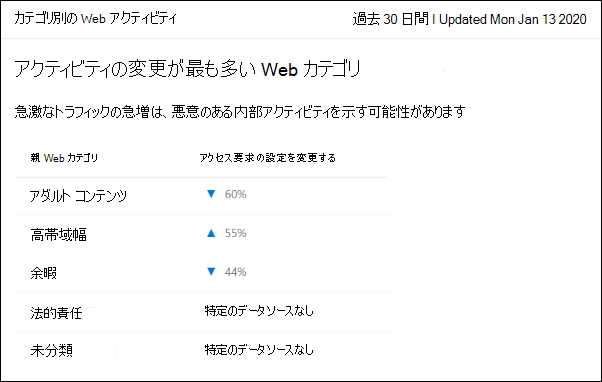

# Web コンテンツ フィルタリング

[!INCLUDE [Microsoft 365 Defender rebranding](../../includes/microsoft-defender.md)]

**適用対象:**
- [Microsoft Defender for Endpoint](https://go.microsoft.com/fwlink/p/?linkid=2154037)
- [Microsoft 365 Defender](https://go.microsoft.com/fwlink/?linkid=2118804)

> [!TIP]
> Microsoft Defender ATP を試してみたいですか? [無料試用版にサインアップしてください。](https://signup.microsoft.com/create-account/signup?products=7f379fee-c4f9-4278-b0a1-e4c8c2fcdf7e&ru=https://aka.ms/MDEp2OpenTrial?ocid=docs-wdatp-main-abovefoldlink&rtc=1)

Web コンテンツ フィルターは、Microsoft [Defender](web-protection-overview.md) for Endpoint の Web 保護機能の一部です。 これにより、組織はコンテンツ カテゴリに基づいて Web サイトへのアクセスを追跡および規制できます。 これらの Web サイトの多くは悪意のあるものではないが、コンプライアンス規制、帯域幅の使用、その他の懸念により問題になる可能性があります。

デバイス グループ全体のポリシーを構成して、特定のカテゴリをブロックします。 カテゴリをブロックすると、指定したデバイス グループ内のユーザーは、そのカテゴリに関連付けられた URL にアクセスできません。 ブロックされていないカテゴリの場合、URL は自動的に監査されます。 ユーザーは中断することなく URL にアクセスできます。また、アクセス統計を収集して、よりカスタム ポリシーの決定を作成できます。 表示しているページ上の要素がブロックされたリソースを呼び出している場合、ユーザーにブロック通知が表示されます。

Web コンテンツ フィルターは主要な Web ブラウザーで利用できます。ブロックは Windows Defender SmartScreen (Microsoft Edge) とネットワーク保護 (Chrome、Firefox、Brave、および Opera) によって実行されます。 ブラウザーのサポートの詳細については、「前提条件」セクションを参照してください。

## Web コンテンツ フィルターの利点

- ユーザーは、オンプレミスまたは離れた場所を閲覧している場合でも、ブロックされたカテゴリの Web サイトにアクセスできます。

- セキュリティ チームは、Microsoft Defender for Endpoint の役割ベースのアクセス制御設定で定義されているデバイス グループを使用して、ユーザーのグループにポリシーを簡単 [に展開できます](/microsoft-365/security/defender-endpoint/rbac)。

- セキュリティ チームは、同じ中央の場所にある Web レポートにアクセスし、実際のブロックと Web 使用状況を可視化できます。

## 前提条件

この機能を試す前に、次の要件を満たしていることを確認してください。

- サブスクリプションには、E5、Windows 10 Enterprise、Microsoft 365 E5、Microsoft 365 E5 Security、Microsoft 365 E3 + Microsoft 365 E5 Security アドオン、または Microsoft Defender for Endpoint スタンドアロン ライセンスを使用します。 

- ポータルにアクセスMicrosoft 365 Defender<a href="https://go.microsoft.com/fwlink/p/?linkid=2077139" target="_blank">できます</a>。

- 組織のデバイスは、Windows 10 Anniversary Update (バージョン 1607) 以降、または最新のウイルス対策/マルウェア対策更新プログラムを使用して Windows 11 を実行[しています](manage-updates-baselines-microsoft-defender-antivirus.md)。

- Windows Defenderデバイスで SmartScreen とネットワーク保護が有効になっています。

## データの処理

データは、Microsoft Defender for Endpoint データ処理設定の一部として選択された領域 [に格納されます](data-storage-privacy.md)。 データは、その地域のデータ センターから離れる必要があります。 また、お客様のデータは、データ プロバイダーを含む第三者と共有されることはありません。

## Web コンテンツ フィルターを有効にする

ポータルの左側のナビゲーションで <a href="https://go.microsoft.com/fwlink/p/?linkid=2077139" target="_blank">、[エンドポイント</a>Microsoft 365 Defender高度な設定 \>  \> **を** \> **選択します**。 Web コンテンツ フィルターのエントリが表示されるまで **下にスクロールします**。 トグルを [オン] と **[保存****] の基本設定に切り替えます**。

### Web コンテンツ フィルター ポリシーの構成

Web コンテンツ フィルター ポリシーは、どのサイト カテゴリがどのデバイス グループでブロックされるのか指定します。 ポリシーを管理するには、[エンドポイント Web コンテンツ フィルター **設定** に移動します \>  \> ([ルール] の下)。

ポリシーを展開して、次の親カテゴリまたは子カテゴリをブロックできます。

アダルト コンテンツ

**Cults**: メンバーが社会的に受け入れられるものとは異なる信念システムに対する情熱を示すグループや動きに関連するサイト。 

**ギャンブル :** オンライン ギャンブルと、ギャンブルのスキルと実践を促進するサイト。

**ヌード**: フルフロントおよびセミヌードの画像またはビデオを提供するサイト(通常は芸術的な形式)であり、そのような資料のダウンロードまたは販売を可能にする可能性があります。

**性的/性的に明示的** な : 画像ベースまたはテキスト形式の性的に明示的なコンテンツを含むサイト。 性的指向の素材の任意の形式もここに記載されています。

**性教育**: 人間の生殖と避妊に関する教育を提供するサイト、性病による感染防止に関するアドバイスを提供するサイト、性的健康に関するアドバイスを提供するサイトなど、情報に基づいた非盗撮的な方法で性とセクシュアリティについて議論するサイト。

**無味**: 学校の子供が見るのに適していないコンテンツ向けのサイトや、雇用主がスタッフのアクセスに不快感を与えるが、必ずしも暴力的または性的ではないサイト。

**暴力 :** 人間や動物に対する暴力に関連するコンテンツを表示または宣伝するサイト。

高帯域幅

**サイトのダウンロード**: ユーザーがコンピューター プログラムなどのメディア コンテンツやプログラムをダウンロードできる主な機能を持つサイト。

**画像共有**: 主に写真を検索または共有するために使用されるサイト (社会的側面を持つサイトを含む)。

**ピアツーピア**: ピアツーピア (P2P) ソフトウェアをホストするサイト、または P2P ソフトウェアを使用してファイルの共有を容易にするサイト。

**ストリーミング メディア &** ダウンロード : ストリーミング メディアの配布が主な機能であるサイト、またはユーザーがストリーミング メディアを検索、視聴、またはリッスンできるサイト。
  

法的責任

**児童虐待画像**: 児童虐待の画像や画像を含むサイト。 

**犯罪行為**: 違法行為に関する指示、助言、またはプロモーションを行うサイト。

**ハッキング**: コンピューター ソフトウェアまたはハードウェアの違法または疑いを持つ使用のためのリソースを提供するサイト (著作権で保護された資料が割れたサイトを配布するサイトを含む)。

**ヘイト &** 不耐症 : 人種、宗教、性別、年齢、国籍、身体障害、経済的状況、性的嗜好、その他のライフスタイルの選択によって識別される可能性がある、人口の任意のセクションに関する積極的、品位低下、または虐待的な意見を促進するサイト。

**違法薬物**: 違法な/規制された物質を販売したり、薬物乱用を促進したり、関連するパラフェルナリアを販売するサイト。

**違法な** ソフトウェア : マルウェア、スパイウェア、ボットネット、フィッシング詐欺、または著作権侵害の使用を含むサイト&サイト。

**学校の不正行為**: 盗作や学校の不正行為に関連するサイト。 

**自傷行為**: ユーザーに対する虐待や脅迫メッセージを含むサイバーいじめサイトを含む、自傷行為を促進するサイト。

**武器**: 武器を販売するサイト、または武器の使用を主張するサイト(銃、ナイフ、弾薬を含むがこれらに限定されない)。

余暇

**チャット**: 主に Web ベースのチャット ルームであるサイト。

**ゲーム**: オンライン サービスのホスティングを通じてゲームを促進するサイトやゲームに関連する情報を含む、ビデオまたはコンピューター ゲームに関連するサイト。

**インスタント メッセージング**: インスタント メッセージング ソフトウェアまたはクライアント ベースのインスタント メッセージングをダウンロードするために使用できるサイト。

**Professional :** プロフェッショナル なネットワーク サービスを提供するサイト。

**ソーシャル ネットワーク**: ソーシャル ネットワーキング サービスを提供するサイト。

**Web ベースのメール**: Web ベースのメール サービスを提供するサイト。
  

未分類

**新しく登録されたドメイン**: 過去 30 日間に新しく登録され、まだ別のカテゴリに移動されていないサイト。

**パークされたドメイン**: コンテンツがないサイト、または後で使用するためにパークされているサイト。
  
**注**: 未分類には、新しく登録されたドメインとパークされたドメインだけが含まれます。また、これらのカテゴリ以外のすべてのサイトは含めではありません。
  

### ポリシーを作成する

新しいポリシーを追加するには、次の手順を実行します。

1. [Web コンテンツ <a href="https://go.microsoft.com/fwlink/p/?linkid=2077139" target="_blank">Microsoft 365 Defender] ポータル</a>で、[Web コンテンツ フィルター **設定**  >  ポリシーの **追加**  >  **] を選択します**。

2. 名前を指定します。

3. ブロックするカテゴリを選択します。 展開アイコンを使用して、各親カテゴリを完全に展開し、特定の Web コンテンツ カテゴリを選択します。

4. ポリシー スコープを指定します。 ポリシーを適用する場所を指定するデバイス グループを選択します。 選択したデバイス グループ内のデバイスだけが、選択したカテゴリの Web サイトにアクセスできません。

5. 概要を確認し、ポリシーを保存します。 ポリシーの更新には、選択したデバイスに適用するために最大 2 時間かかる場合があります。

> [!NOTE]
>
> - デバイス グループでカテゴリを選択せずにポリシーを展開できます。 このアクションは、ブロック ポリシーを作成する前にユーザーの動作を理解するのに役立つ監査専用ポリシーを作成します。
> - ポリシーを削除したり、デバイス グループを同時に変更したりすると、ポリシーの展開が遅れる可能性があります。
> - "未分類" カテゴリをブロックすると、予期しない結果が発生する可能性があります。

## エンドユーザーのエクスペリエンス

サード パーティでサポートされているブラウザーのブロック エクスペリエンスは、ネットワーク保護によって提供されます。これは、ブロックされた接続をユーザーに通知するシステム レベルのメッセージを提供します。 ユーザーフレンドリーでブラウザー内でのエクスペリエンスを向上するには、ユーザーエクスペリエンスの使用Microsoft Edge。

### 特定の Web サイトを許可する

Web コンテンツ フィルターでブロックされたカテゴリを上書きして、カスタム インジケーター ポリシーを作成して 1 つのサイトを許可できます。 カスタム インジケーター ポリシーは、Web コンテンツ フィルター ポリシーが問題のデバイス グループに適用されると、そのポリシーに取って代えられます。

カスタム インジケーターを定義するには、次の手順を実行します。

1. このポータル <a href="https://go.microsoft.com/fwlink/p/?linkid=2077139" target="_blank">Microsoft 365 Defender、[</a>エンドポイントインジケーター URL/**ドメイン設定** アイテム] に \>  \>  \>  \> **移動します**。

2. サイトのドメインを入力します。

3. ポリシー アクションを [許可] に **設定します**。

### 紛争カテゴリ

誤って分類されたドメインが発生した場合は、ポータルから直接カテゴリに異議を申し立てできます。

ドメインのカテゴリに異議を申し立てするには、[レポート Web 保護 Web コンテンツ フィルターの \>  \> **詳細ドメイン**] \> **に移動します**。 Web コンテンツ フィルター レポートの [ドメイン] タブに、各ドメインの横に省略記号が表示されます。 この省略記号にカーソルを合わせると、[争議カテゴリ] **を選択します**。

パネルが開き、優先度を選択し、再分類の推奨カテゴリなどの詳細を追加できます。 フォームが完成したら、[送信] を **選択します**。 チームは 1 営業日以内に要求を確認します。 ブロック解除を直ちに行う場合は、カスタム許可 [インジケーターを作成します](indicator-ip-domain.md)。

### URL カテゴリの参照

Web サイトのカテゴリを確認するには、[エンドポイント検索] の [Microsoft 365 Defender ポータル ( ) で使用できる URL 検索機能 <https://security.microsoft.com> **を使用** \> **できます**。 URL 検索結果では、[URL/ドメインの詳細] の下に Web コンテンツ フィルター **カテゴリが表示されます**。 管理者は、次の図に示すように、このページからドメインのカテゴリに直接異議を申し立てすることもできます。 カテゴリの結果が表示されない場合、URL は現在、既存の Web コンテンツ フィルター カテゴリに割り当てられていない。

## Web コンテンツ フィルター カードと詳細

[ **レポート** \> **Web 保護] を** 選択して、Web コンテンツ フィルターと Web 脅威保護に関する情報を含むカードを表示します。 次のカードは、Web コンテンツ フィルターに関する概要情報を提供します。

### カテゴリ別の Web アクティビティ

このカードには、アクセス試行回数の増加または減少が最も大きい親 Web コンテンツ カテゴリが一覧表示されます。 過去 30 日間、3 か月、または 6 か月の組織の Web アクティビティ パターンの大幅な変化を理解します。 詳細を表示するには、カテゴリ名を選択します。

この機能を使用した最初の 30 日間で、組織にはこの情報を表示するのに十分なデータが含めなかった可能性があります。

### Web コンテンツ フィルターの概要カード

このカードは、異なる親 Web コンテンツ カテゴリに対するブロックされたアクセス試行の分布を表示します。 色付きバーのいずれかを選択して、特定の親 Web カテゴリに関する詳細を表示します。

### Web アクティビティの概要カード

このカードには、すべての URL の Web コンテンツに対する要求の総数が表示されます。

### カードの詳細を表示する

カード内のグラフ **からテーブル** 行または色付きバーを選択すると、各カードのレポートの詳細にアクセスできます。 各カードのレポートの詳細ページには、Web コンテンツ カテゴリ、Web サイト ドメイン、デバイス グループに関する広範な統計データが含まれています。

- **Web カテゴリ**: 組織内でアクセス試行を行った Web コンテンツ カテゴリを一覧表示します。 特定のカテゴリを選択してサマリー フライアウトを開きます。

- **ドメイン**: 組織でアクセスまたはブロックされた Web ドメインを一覧表示します。 特定のドメインを選択して、そのドメインに関する詳細情報を表示します。

- **デバイス グループ**: 組織で Web アクティビティを生成したデバイス グループの一覧を表示します。

ページの左上にある時間範囲フィルターを使用して、期間を選択します。 情報をフィルター処理したり、列をカスタマイズしたりすることもできます。 行を選択して、選択したアイテムに関するさらに詳しい情報を含むフライアウト ウィンドウを開きます。

### 既知の問題と制限事項

デバイスMicrosoft Edgeの OS 構成が Server **(cmd** \> **Systeminfo** \> **OS Configuration)** の場合にのみサポートされます。 ネットワーク保護は、サポートされているサード パーティ製ブラウザー間のトラフィックのセキュリティ保護を担当するサーバー デバイスの検査モードでのみサポートされます。

ネットワーク保護は現在 SSL 検査をサポートしていないので、通常はブロックされる Web コンテンツ フィルターによって一部のサイトが許可される場合があります。 TLS ハンドシェイクが実行された後に暗号化されたトラフィックの可視性が不足し、特定のリダイレクトを解析しきれなかからサイトが許可されます。  これには、Web ベースのメール ログイン ページからメールボックス ページへのリダイレクトが含まれます。 受け入れられる回避策として、ログイン ページのカスタム ブロック インジケーターを作成して、ユーザーがサイトにアクセスできないか確認できます。 これは、同じ Web サイトに関連付けられている他のサービスへのアクセスをブロックする可能性があります。 

## 関連項目

- [Web 保護の概要](web-protection-overview.md)
- [Web の脅威に対する保護](web-threat-protection.md)
- [Web セキュリティの監視](web-protection-monitoring.md)
- [Web の脅威への対応](web-protection-response.md)
- [ネットワーク保護の要件](web-content-filtering.md)
