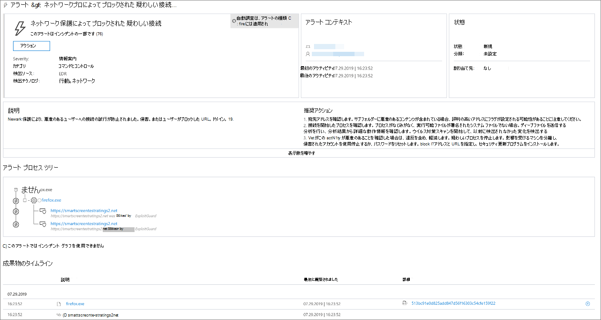
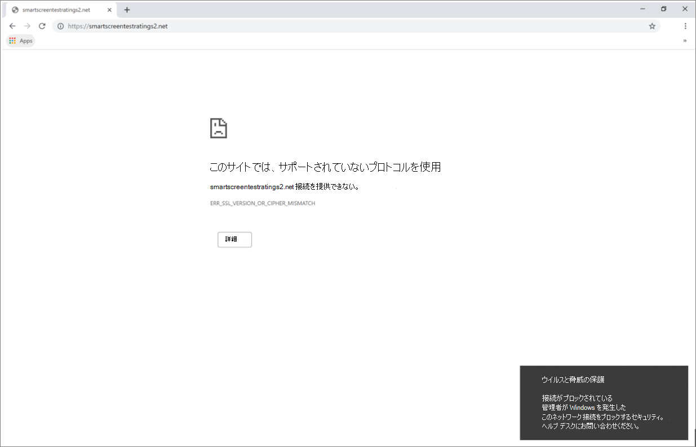

# Web の脅威への対応

[!INCLUDE [Microsoft 365 Defender rebranding](../../includes/microsoft-defender.md)]

**適用対象:**
- [Microsoft Defender for Endpoint](https://go.microsoft.com/fwlink/p/?linkid=2154037)
- [Microsoft 365 Defender](https://go.microsoft.com/fwlink/?linkid=2118804)

> Microsoft Defender ATP を試してみたいですか? [無料試用版にサインアップしてください。](https://signup.microsoft.com/create-account/signup?products=7f379fee-c4f9-4278-b0a1-e4c8c2fcdf7e&ru=https://aka.ms/MDEp2OpenTrial?ocid=docs-wdatp-main-abovefoldlink&rtc=1)

Microsoft Defender for Endpoint の Web 保護を使用すると、カスタム インジケーター リスト内の悪意のある Web サイトや Web サイトに関連するアラートを効率的に調査して対応できます。

## Web 脅威アラートの表示

Microsoft Defender for Endpoint は、悪意のある Web アクティビティまたは疑 [わしい](manage-alerts.md) Web アクティビティに関する次のアラートを生成します。

- **ネットワーク保護によって** ブロックされる疑わしい接続 : このアラートは、悪意のある Web サイトまたはカスタム インジケーター リスト内のWeb サイトへのアクセスがブロック モードでネットワーク保護によって停止された場合 *に生成* されます。
- **ネットワーク保護によって検出** された疑わしい接続 : このアラートは、悪意のある Web サイトまたはカスタム インジケーター リスト内の Web サイトにアクセスしようとした場合に、監査専用モードでネットワーク保護によって検出 *された場合に生成* されます。

各アラートは、次の情報を提供します。

- ブロックされた Web サイトにアクセスしようとしたデバイス
- Web 要求の送信に使用されるアプリケーションまたはプログラム
- カスタム インジケーター リスト内の悪意のある URL または URL
- レスポンダーに推奨されるアクション

> [!NOTE]
> Microsoft Defender for Endpoint は、アラートの量を減らすために、同じデバイス上の同じドメインの Web 脅威検出を毎日 1 つのアラートに統合します。 1 つのアラートだけが生成され [、Web 保護レポートにカウントされます](web-protection-monitoring.md)。

## Web サイトの詳細を検査する

アラートで Web サイトの URL またはドメインを選択すると、より深く掘り下げできます。 これにより、次に示すさまざまな情報を含む特定の URL またはドメインに関するページが開きます。

- Web サイトにアクセスしようとしたデバイス
- Web サイトに関連するインシデントとアラート
- 組織のイベントで Web サイトが表示された頻度

    

[URL またはドメイン エンティティ ページの詳細](investigate-domain.md)

## デバイスを検査する

ブロックされた URL にアクセスしようとしたデバイスを確認することもできます。 アラート ページでデバイスの名前を選択すると、デバイスに関する包括的な情報を含むページが開きます。

[デバイス エンティティ ページの詳細](investigate-machines.md)

## エンド ユーザー向Windows Web ブラウザーと通知

Microsoft Defender for Endpoint の Web 保護を使用すると、エンド ユーザーが悪意のある Web サイトや望ましくない web サイトにアクセスする場合、Microsoft Edgeブラウザーを使用してアクセスできません。 ブロックはネットワーク保護によって実行されます [の](network-protection.md)で、Web ブラウザーから一般的なエラーが表示されます。 また、ユーザーからの通知も表示Windows。

 *Microsoft Edge*

 *Chrome Web ブラウザーの画像*

## 関連項目

- [Web 保護の概要](web-protection-overview.md)
- [Web コンテンツ フィルタリング](web-content-filtering.md)
- [Web の脅威に対する保護](web-threat-protection.md)
- [Web セキュリティの監視](web-protection-monitoring.md)
