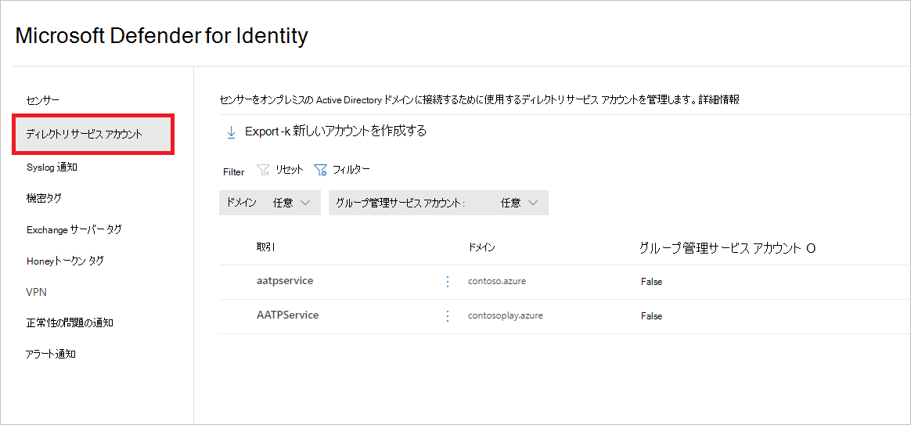
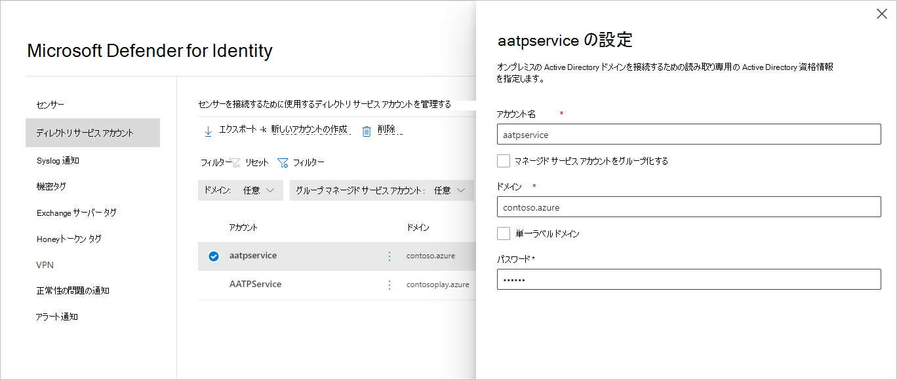
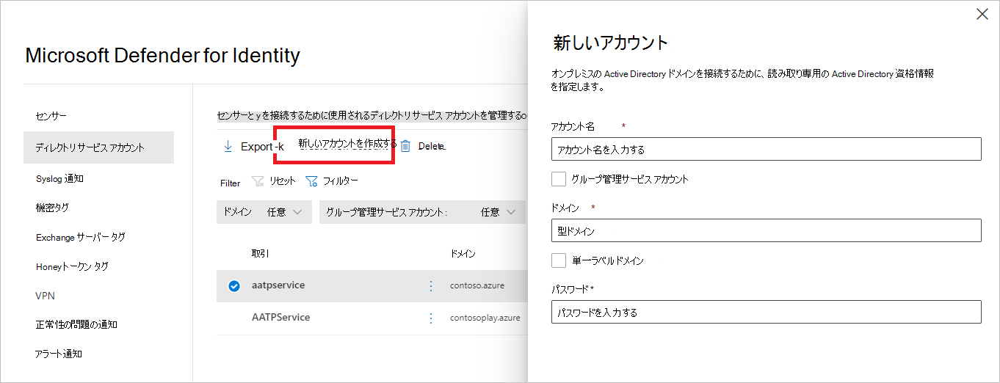

# Microsoft Defender for Identity Directory Services アカウント (Microsoft 365 Defender

**適用対象:**

- Microsoft 365 Defender
- Defender for Identity

この記事では、Microsoft Defender [for Identity](/defender-for-identity) Directory Services アカウントを構成する方法について説明します。Microsoft 365 Defender。 

>[!IMPORTANT]
>Id ポータルの Defender の場所Microsoft 365 Defender一部のオプションと詳細が変更されました。 使い慣れた機能と新機能の両方を見つける場所については、以下の詳細をお読みください。

## ディレクトリ サービス アカウントの構成

センサーを Active Directory [ドメインに](sensor-health.md#add-a-sensor) 接続するには、Directory Services アカウントを構成する必要があります。

1. <a href="https://go.microsoft.com/fwlink/p/?linkid=2077139" target="_blank">[Microsoft 365 Defender]</a>で、[id]**設定** に **移動します**。

    ![[ID] 設定に移動します。](../../media/defender-identity/settings-identities.png)

1. [ **ディレクトリ サービス アカウント] を選択します**。 どのドメインに関連付けられているアカウントが表示されます。

    

1. アカウントを選択すると、そのアカウントの設定でウィンドウが開きます。

    

1. 新しい Directory Services アカウントを追加するには、[新しいアカウントの作成]**を選択し**、[アカウント名] 、[ドメイン]、および [**パスワード**] を **入力します**。 グループ管理サービス アカウント (gMSA) の場合と、単一ラベル ドメインに属している場合も **選択できます**。

    

1. [**保存**] を選択します。

## 関連項目

- [Microsoft Defender for Identity センサーの正常性と設定](sensor-health.md)
