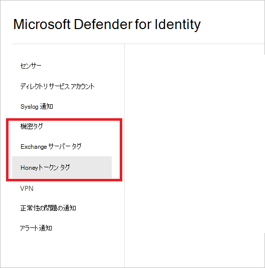
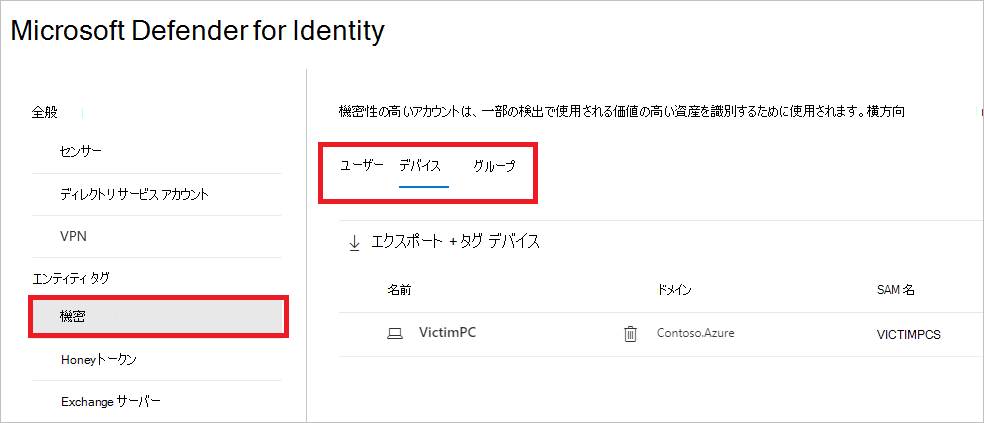
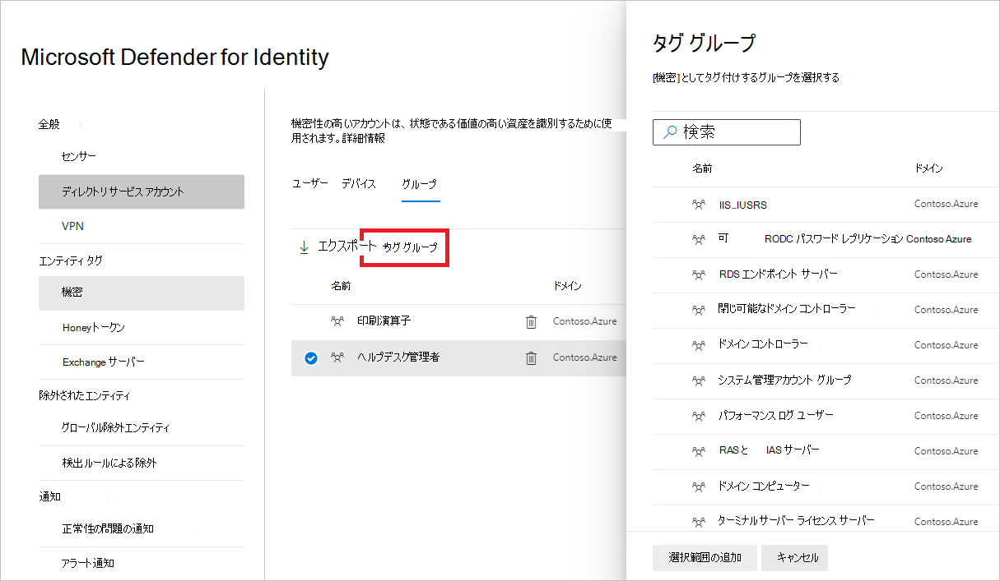
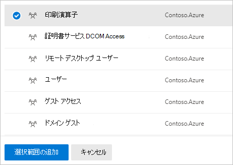
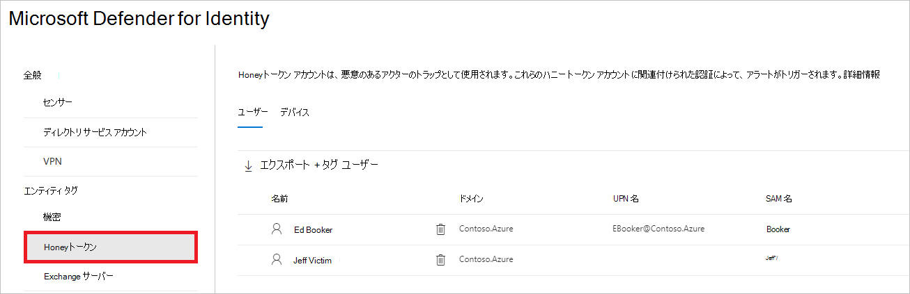
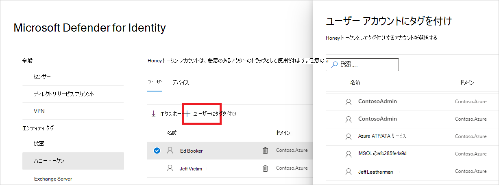
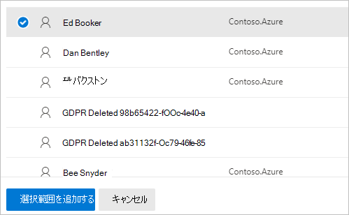
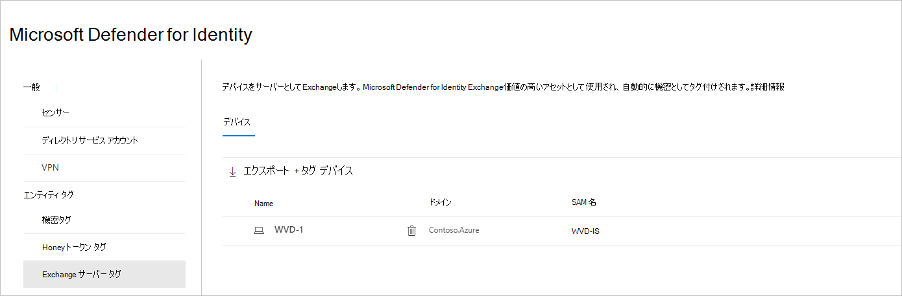
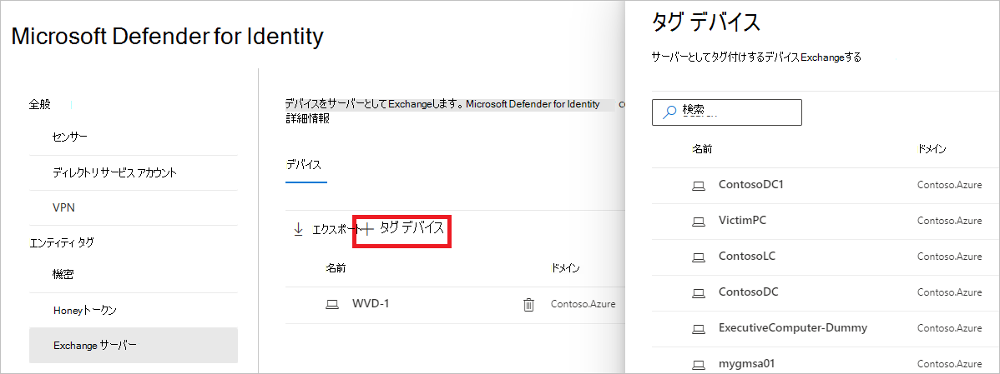
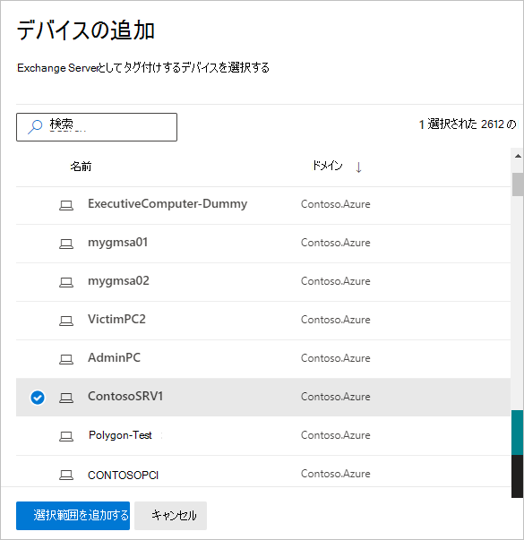

# Defender for Identity entity tags in Microsoft 365 Defender

**適用対象:**

- Microsoft 365 Defender
- Defender for Identity

この記事では、Microsoft [Defender for Identity エンティティ](/defender-for-identity)タグを Id エンティティ タグに適用する方法について説明Microsoft 365 Defender。 

>[!IMPORTANT]
>Id ポータルの Defender の場所Microsoft 365 Defender一部のオプションと詳細が変更されました。 使い慣れた機能と新機能の両方を見つける場所については、以下の詳細をお読みください。

## エンティティ タグ

このMicrosoft 365 Defender、3 種類の Defender for Identity エンティティ タグ(機密タグ **、Honeytoken** タグ、およびサーバー **Exchange) を設定できます**。

これらのタグを設定 [するには、Microsoft 365 Defender](https://security.microsoft.com/)に移動し、[設定 **ID]** **に移動します**。

![[ID] 設定に移動します。](../../media/defender-identity/settings-identities.png)

タグの設定が [タグの設定]**列設定** されます。

タグの各種類を設定するには、以下の手順に従います。

## 機密タグ

機密 **タグは、** 価値の高い資産を識別するために使用されます。 横方向の移動パスは、エンティティの感度の状態にも依存します。 一部のエンティティは、Defender for Identity によって自動的に機密性が高いと見なされます。 これらのアセットの一覧については、「機密エンティティ [」を参照してください](/defender-for-identity/manage-sensitive-honeytoken-accounts#sensitive-entities)。

ユーザー、デバイス、またはグループに機密として手動でタグを付けすることもできます。

1. [機密 **タグ] を選択します**。 その後、既存の機密性の高い **ユーザー、デバイス**、 **および** グループが **表示されます**。

    

1. 各カテゴリで **、[Tag...] を選択して** 、その種類のエンティティにタグを付けします。 たとえば、[グループ] で **[タグ** グループ **] を選択します。** 選択してタグ付けできるグループを含むウィンドウが開きます。 グループを検索するには、検索ボックスにグループ名を入力します。

    

1. グループを選択し、[選択の追加 **] をクリックします。**

    

## Honeytoken のタグ

Honeytoken エンティティは、悪意のあるアクターのトラップとして使用されます。 これらの honeytoken エンティティに関連付けられた認証は、アラートをトリガーします。

ユーザーまたはデバイスに **Honeytoken** タグを付け、機密性の高いアカウントにタグ付けするのと同じ方法でタグ付けできます。

1. **[Honeytoken] タグを選択します**。 次に、既存の honeytoken ユーザーと **デバイスが** 表示 **されます**。

    

1. 各カテゴリで **、[Tag...] を選択して** 、その種類のエンティティにタグを付けします。 たとえば、[ユーザー] で **[ユーザー** のタグ **付け] を選択します。** 選択してタグ付けできるグループを含むウィンドウが開きます。 グループを検索するには、検索ボックスにグループ名を入力します。

    

1. ユーザーを選択し、[選択の追加 **] をクリックします。**

    

## Exchangeサーバー タグ

Defender for Identity は、Exchangeを価値の高いアセットと見なし、自動的に機密としてタグ付 **けします**。 デバイスに手動でタグを付け、Exchangeすることもできます。

1. [サーバー **Exchange] を選択します**。 次に、既存のデバイスにサーバー タグのラベルが付Exchange **表示** されます。

    

1. デバイスをサーバーとしてタグ付けするにはExchangeを **選択します**。  タグ付けするデバイスを選択すると、ウィンドウが開きます。 デバイスを検索するには、検索ボックスにデバイスの名前を入力します。

    

1. デバイスを選択し、[選択の追加 **] をクリックします。**

    

## 関連項目

- [Defender for Identity セキュリティアラートの管理](manage-security-alerts.md)
