# [Id 検出の除外対象として Defender を構成する] Microsoft 365 Defender

**適用対象:**

- Microsoft 365 Defender
- Defender for Identity

この記事では、Microsoft [Defender for Identity 検出](/defender-for-identity)の除外を構成する方法について説明します。Microsoft 365 Defender。 

> [!IMPORTANT]
> Id ポータルの Defender の場所Microsoft 365 Defender一部のオプションと詳細が変更されました。 使い慣れた機能と新機能の両方を見つける場所については、以下の詳細をお読みください。

[!INCLUDE [Product long](includes/product-long.md)] 特定の IP アドレス、コンピューター、ドメイン、またはユーザーを多数の検出から除外できます。

たとえば **、DNS を** スキャン メカニズムとして使用するセキュリティ スキャナーによって DNS 偵察アラートがトリガーされる可能性があります。 除外を作成すると、Defender for Identity はそのようなスキャナーを無視し、誤検知を減らすのに役立ちます。

>[!NOTE]
>開いた DNS アラートに対する疑わしい通信を持つ最も一般的なドメインの中で、お客様が最もアラートから除外したドメインを確認しました。 これらのドメインは既定で除外リストに追加されますが、簡単に削除できます。

## 検出除外を追加する方法

1. [[Microsoft 365 Defender]](https://security.microsoft.com/)で、[id]**設定** に **移動します**。

    ![[ID] 設定に移動します。](../../media/defender-identity/settings-identities.png)

1. 次に、左側の **メニューに [** 除外されたエンティティ] が表示されます。

    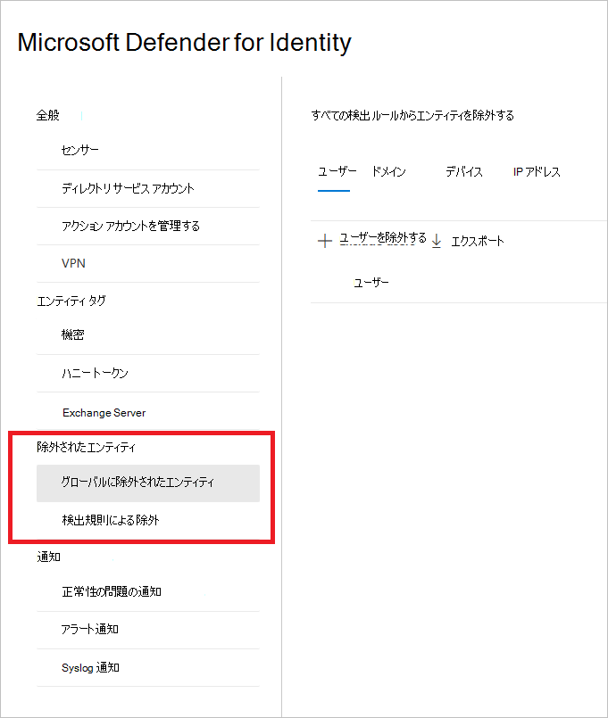

次に、検出ルールによる除外とグローバル除外エンティティの 2 つの方法で除外 **を設定できます**。

## 検出ルールによる除外

1. 左側のメニューで、[検出ルールによる **除外] を選択します**。 検出ルールの一覧が表示されます。

    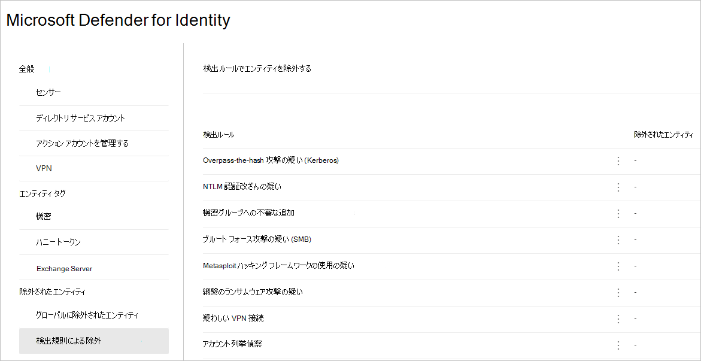

1. 構成する検出ごとに、次の手順を実行します。

    1. ルールを選択します。 検索バーを使用して検出を検索できます。 選択すると、検出ルールの詳細が表示されたウィンドウが開きます。

        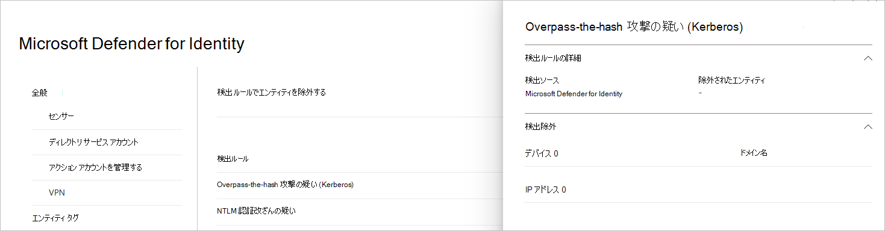

    1. 除外を追加するには、[除外されたエンティティ **] ボタンを選択** し、除外の種類を選択します。 ルールごとに異なる除外エンティティを使用できます。 ユーザー、デバイス、ドメイン、IP アドレスが含まれます。 この例では、[デバイスの除外] と **[IP アドレス** の **除外] の選択肢を選択します**。

        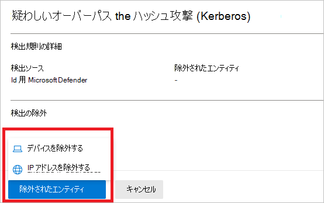

    1. 除外の種類を選択した後、除外を追加できます。 開くウィンドウで、除外を追加 **+** するボタンを選択します。

        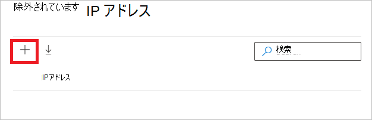

    1. 次に、除外するエンティティを追加します。 [+ **追加] を** 選択して、エンティティをリストに追加します。

        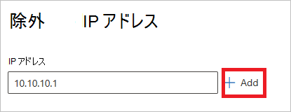

    1. 次に **、[IP アドレスの除外]** (この例では) を選択して除外を完了します。

        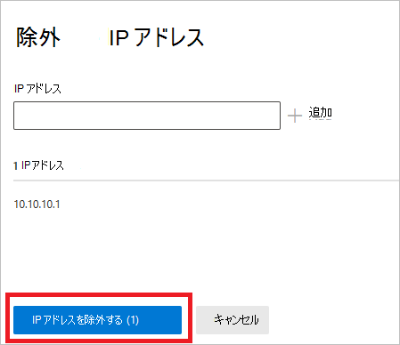

    1. 除外を追加したら、リストをエクスポートするか、[除外されたエンティティ] ボタンに戻って除外 **を削除** できます。 この例では、[デバイスの除外] に **戻っています**。 リストをエクスポートするには、下矢印ボタンを選択します。

        ![[デバイスの除外] に戻る。](../../media/defender-identity/return-to-exclude-devices.png)

    1. 除外を削除するには、除外を選択し、ごみ箱アイコンを選択します。

        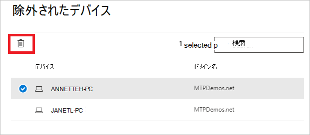

## グローバル除外エンティティ

グローバル除外エンティティで除外 **を構成できます**。 グローバル除外を使用すると、特定のエンティティ (IP アドレス、サブネット、デバイス、またはドメイン) を定義して、Defender for Identity が持つすべての検出で除外できます。 たとえば、デバイスを除外した場合、デバイス ID が検出の一部である検出にのみ適用されます。

1. 左側のメニューで、[グローバル除外 **エンティティ] を選択します**。 除外できるエンティティのカテゴリが表示されます。

    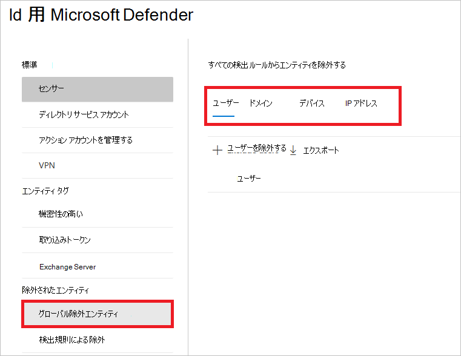

1. 除外の種類を選択します。 この例では、[ドメインの除外 **] を選択しました**。

    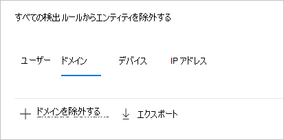

1. 除外するドメインを追加できるウィンドウが開きます。 除外するドメインを追加します。

    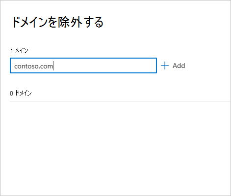

1. ドメインがリストに追加されます。 [ **ドメインの除外] を選択** して除外を完了します。

    ![[除外ドメイン] を選択します。](../../media/defender-identity/select-exclude-domains.png)

1. 次に、すべての検出ルールから除外するエンティティの一覧にドメインが表示されます。 リストをエクスポートするか、エンティティを選択して [削除] **ボタンをクリック** して削除できます。

    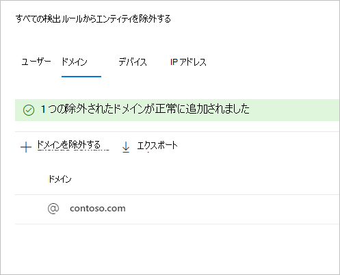

## 関連項目

- [Defender for Identity セキュリティアラートの管理](manage-security-alerts.md)
