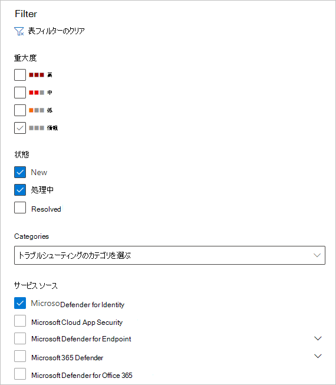
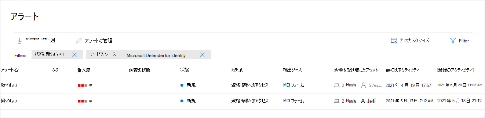
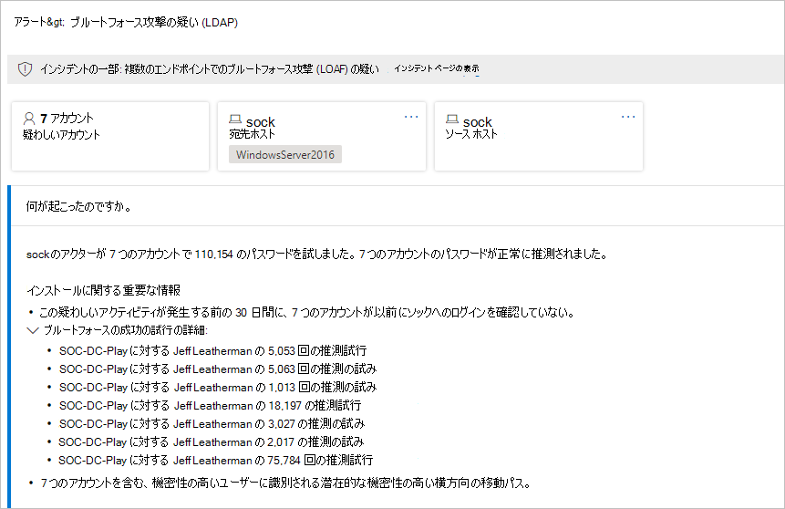
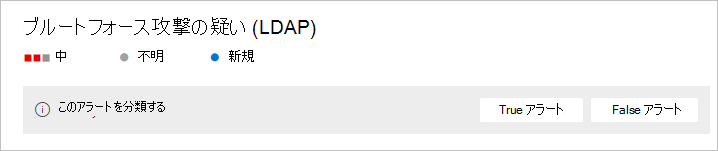
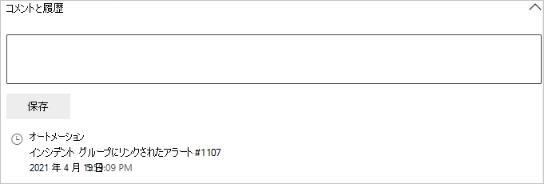
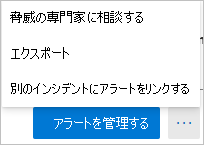

# Defender for Identity security alerts in Microsoft 365 Defender

**適用対象:**

- Microsoft 365 Defender
- Defender for Identity

この記事では、Microsoft [Defender for Identity](/defender-for-identity) のセキュリティ アラートを使用する方法の基本について説明[します。Microsoft 365 Defender](/microsoft-365/security/defender/overview-security-center)。

Defender for Identity アラートは、専用の IDENTITY アラート <a href="https://go.microsoft.com/fwlink/p/?linkid=2077139" target="_blank">ページMicrosoft 365 Defender</a>にネイティブに統合されます。 これは、Microsoft [Defender for Identity](/defender-for-identity/defender-for-identity-in-microsoft-365-defender) エクスペリエンス全体を新しいユーザーエクスペリエンスに導入する最初のステップMicrosoft 365 Defender。

新しい Identity アラート ページでは、Microsoft Defender for Identity のお客様にクロスドメインシグナルエンリッチメントと新しい自動 ID 応答機能を提供します。 これにより、セキュリティを確保し、セキュリティ操作の効率を向上させることができます。

Microsoft 365 Defender を使用してアラートを調査する利点の  1 つは、Microsoft Defender for Identity アラートがスイート内の他の各製品から取得した情報とさらに関連付けられている場合です。 これらの強化されたアラートは、Microsoft Defender for Microsoft 365 Defender[および Microsoft Defender for](/microsoft-365/security/office-365-security) Endpoint から発信される他のOffice 365[と一致しています](/microsoft-365/security/defender-endpoint)。 新しいページでは、ID に関連付けられたアラートを調査するために別の製品ポータルに移動する必要が実質的になくされます。

Defender for Identity から発信されたアラートは、Microsoft 365 Defender の自動調査と応答 [(AIR) 機能を](/microsoft-365/security/defender/m365d-autoir)トリガーできます。アラートの自動修復や、疑わしいアクティビティに寄与する可能性があるツールとプロセスの軽減を含む。

> [!IMPORTANT]
> Id ポータルの Defender Microsoft 365 Defenderの場所から、一部のオプションと詳細が変更されました。 使い慣れた機能と新機能の両方を見つける場所については、以下の詳細をお読みください。

## セキュリティアラートの確認

アラートには、[アラート] ページ、インシデント ページ、個々のデバイスのページ、高度な検索ページなど、複数の **場所からアクセス** できます。 この例では、[アラート] ページを **確認します**。

[<a href="https://go.microsoft.com/fwlink/p/?linkid=2077139" target="_blank">Microsoft 365 Defender</a>] で、[インシデント] **&に移動** し、[アラート] に **移動します**。

![[インシデントと通知] の順に移動し、[アラート] をクリックします。](../../media/defender-identity/incidents-alerts.png)

Defender for Identity からのアラートを表示するには、上部の [フィルター] を選択し、[サービス  ソース] で [**Microsoft Defender for Identity**] を選択し、[適用] を選択 **します**。

アラートは、アラート名、タグ、**重大度**、**調査** 状態、**状態**、カテゴリ、検出ソース、影響を受けたアセット、**最初** のアクティビティ、および最後のアクティビティの情報と一緒に **表示** されます。 

## アラートの管理

アラートの **1 つの [アラート名** ] をクリックすると、アラートの詳細が表示されたページに移動します。 左側のウィンドウに、[発生した操作] の概要 **が表示されます**。

[何が **起こったか]** ボックスの上には、アラートのアカウント、宛先 **ホスト**、および **送信元ホストの** ボタンがあります。 その他のアラートについては、追加のホスト、アカウント、IP アドレス、ドメイン、セキュリティ グループの詳細についてボタンが表示される場合があります。 関係するエンティティの詳細を取得するには、それらを選択します。

右側のウィンドウに、アラートの詳細が **表示されます**。 ここでは、詳細を確認し、いくつかのタスクを実行できます。

- **このアラートを分類** する - ここでは、このアラートを True アラートまたは **False アラート** として **指定できます。**

    

- **アラートの状態** - [ **分類の設定]** で、アラートを **True または False に** 分類 **できます**。 [ **割り当て** 済み] では、自分にアラートを割り当てたり、割り当てを解除することができます。

    

- **アラートの** 詳細 **- [アラート** の詳細] で、特定のアラートに関する詳細情報を確認し、アラートの種類に関するドキュメントへのリンクに従い、アラートが関連付けられているインシデントを確認し、このアラートの種類にリンクされている自動調査を確認し、影響を受けたデバイスとユーザーを確認できます。

    

- **コメント&履歴** - アラートにコメントを追加し、アラートに関連付けられているすべてのアクションの履歴を確認できます。

    

- **警告の** 管理 - [警告の **管理] を** 選択すると、次のウィンドウに移動して、次の情報を編集できます。
  - **[状態**] - [新規]**、[****解決済み]、** または [進行中] **を選択できます**。
  - **分類** - [True アラート] **または [False アラート** ] **を選択できます**。
  - **コメント** - アラートに関するコメントを追加できます。

    [警告の管理] の横にある 3 つのドットを選択した場合は、[脅威の専門家に相談する]、アラートを Excel ファイルにエクスポートする、または別のインシデントに **リンクすることができます**。

    

    > [!NOTE]
    > このファイルExcel、使用可能なリンクが 2 つ用意されています。[**Id の Microsoft Defender** での表示] と [Id の表示 **]** の 2 つMicrosoft 365 Defender。 各リンクを使用すると、関連するポータルにアクセスし、そこにアラートに関する情報を提供します。

## 関連項目

- [Microsoft 365 Defender でアラートを調査する](../defender/investigate-alerts.md)
