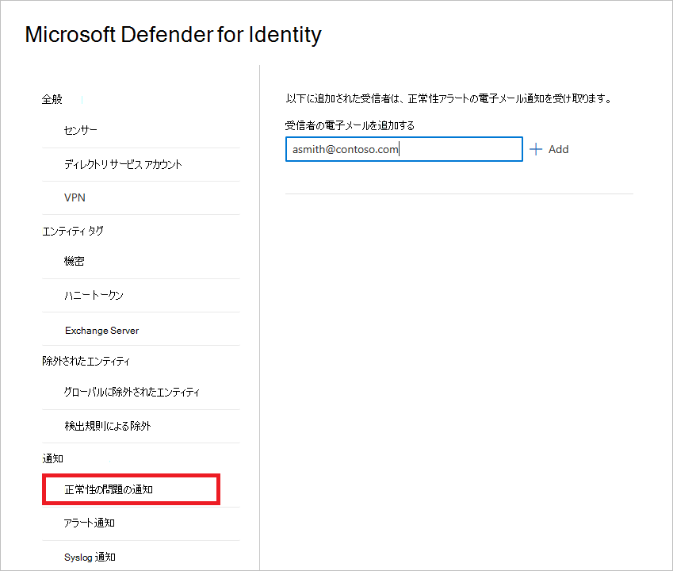
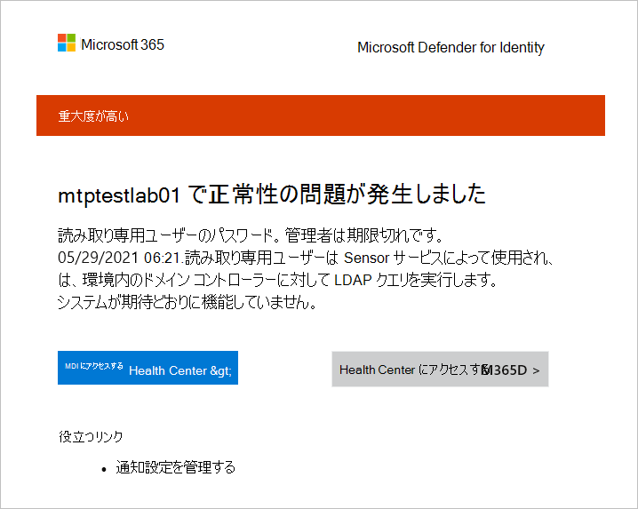
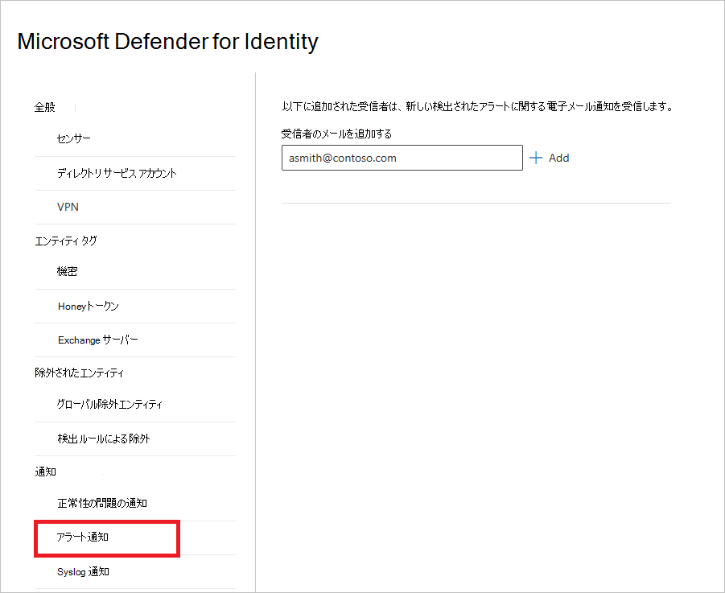
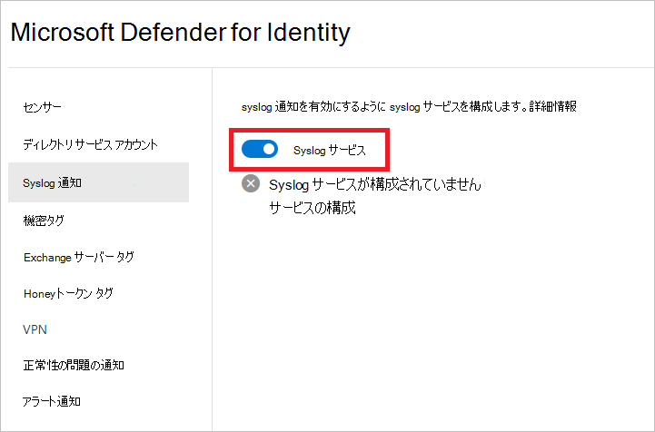
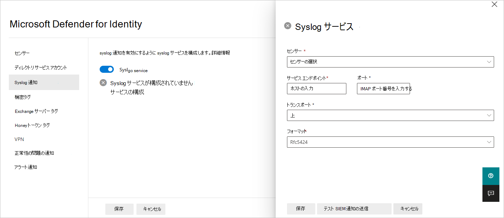
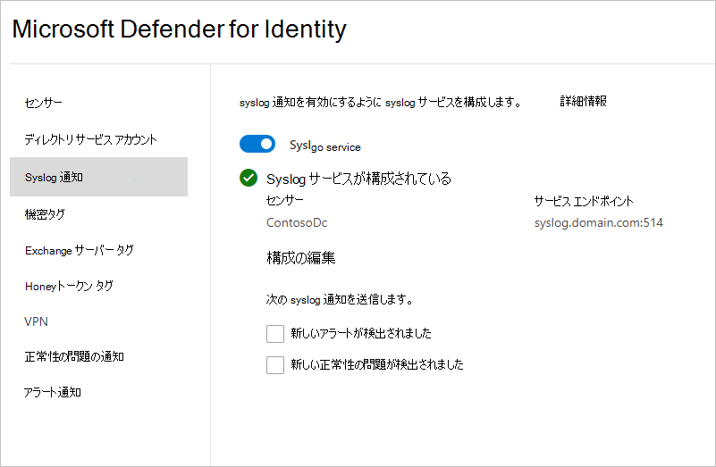

# Defender for Identity notifications in Microsoft 365 Defender

**適用対象:**

- Microsoft 365 Defender
- Defender for Identity

この記事では、Microsoft [Defender for Identity](/defender-for-identity) 通知を使用する方法について説明します。[Microsoft 365 Defender。](/microsoft-365/security/defender/overview-security-center)

> [!IMPORTANT]
> Id ポータルの Defender Microsoft 365 Defenderの場所から、一部のオプションと詳細が変更されました。 使い慣れた機能と新機能の両方を見つける場所については、以下の詳細をお読みください。

## 正常性の問題の通知

このMicrosoft 365 Defender、Defender for Identity で正常性の問題に関する電子メール通知の受信者を追加できます。

1. [<a href="https://go.microsoft.com/fwlink/p/?linkid=2077139" target="_blank">Microsoft 365 Defender</a>] で、[id **] 設定** に **移動します**。

    ![[ID] 設定に移動します。](../../media/defender-identity/settings-identities.png)

1. [正常性 **の問題の通知] を選択します**。

1. 受信者のメール アドレスを入力します。 [**追加**] を選択します。

    

1. Defender for Identity が正常性の問題を検出すると、受信者は詳細を記載した電子メール通知を受信します。

    

    > [!NOTE]
    > このメールには、問題に関する詳細を示す 2 つのリンクが記載されています。 MDI Health Center または **M365D の新しい正常性センターに移動できます**。

## アラート通知

このMicrosoft 365 Defender、検出されたアラートの電子メール通知の受信者を追加できます。

1. [<a href="https://go.microsoft.com/fwlink/p/?linkid=2077139" target="_blank">Microsoft 365 Defender</a>] で、[id **] 設定** に **移動します**。

    ![[ID] 設定に移動します。](../../media/defender-identity/settings-identities.png)

1. [アラート **通知] を選択します**。

1. 受信者のメール アドレスを入力します。 [**追加**] を選択します。

    

## Syslog 通知

Defender for Identity は、指名されたセンサーを介して Syslog サーバーにセキュリティと正常性アラートを送信することで、疑わしいアクティビティを検出した場合に通知できます。

> [!NOTE]
> Defender for Identity と Microsoft Sentinel を統合する方法については、「Microsoft [Sentinel との統合Microsoft 365 Defenderを参照してください](/azure/sentinel/microsoft-365-defender-sentinel-integration)。

1. [<a href="https://go.microsoft.com/fwlink/p/?linkid=2077139" target="_blank">Microsoft 365 Defender</a>] で、[id **] 設定** に **移動します**。

    ![[ID] 設定に移動します。](../../media/defender-identity/settings-identities.png)

1. [ **Syslog 通知] を選択します**。

1. syslog 通知を有効にするには、Syslog サービスの **トグルを** オンの位置に **設定** します。

    

1. [サービス **の構成] を選択します**。 ウィンドウが開き、syslog サービスの詳細を入力できます。

    

1. 次の詳細を入力します。

    - **センサー** - ドロップダウン リストから、アラートを送信するセンサーを選択します。
    - **サービス エンドポイント** と **ポート** - syslog サーバーの IP アドレスまたは完全修飾ドメイン名 (FQDN) を入力し、ポート番号を指定します。 1 つの Syslog エンドポイントのみを構成できます。
    - **トランスポート** - **トランスポート プロトコル (** TCP または UDP) を選択します。
    - **Format** - 形式 (RFC 3164 または RFC 5424) を選択します。

1. [ **テスト SIEM 通知の送信] を** 選択し、メッセージが Syslog インフラストラクチャ ソリューションで受信されるのを確認します。

1. **[保存]** を選択します。

1. Syslog サービスを構成したら、 **Syslog** サーバーに送信する通知の種類 (アラートまたは正常性の問題) を選択できます。

    

## 関連項目

- [Defender for Identity セキュリティアラートの管理](manage-security-alerts.md)
