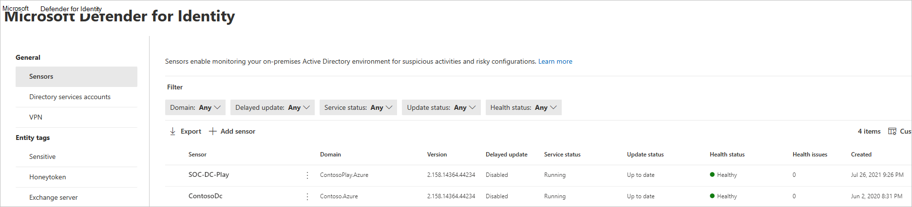
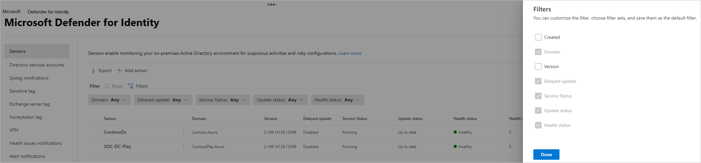
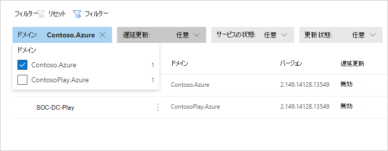
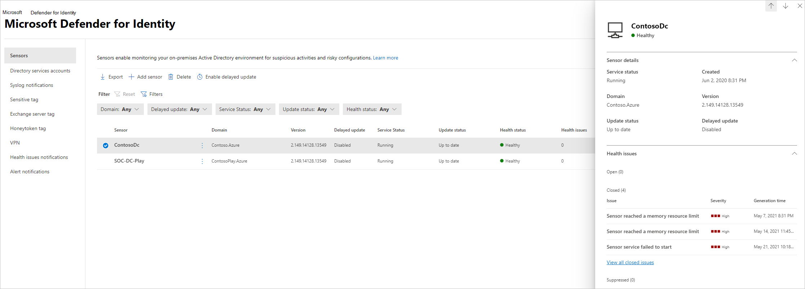
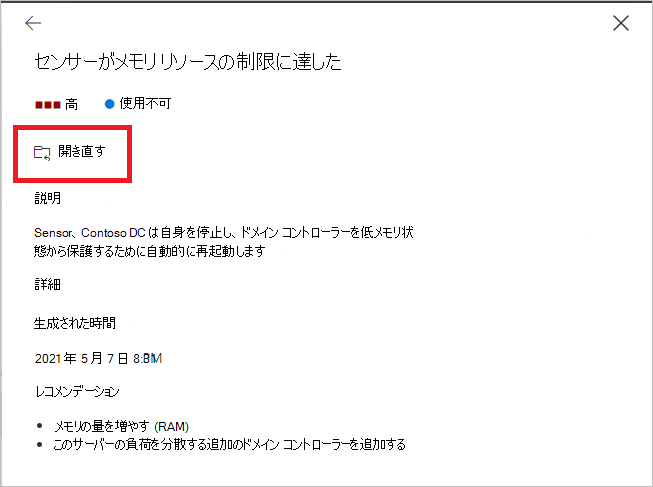
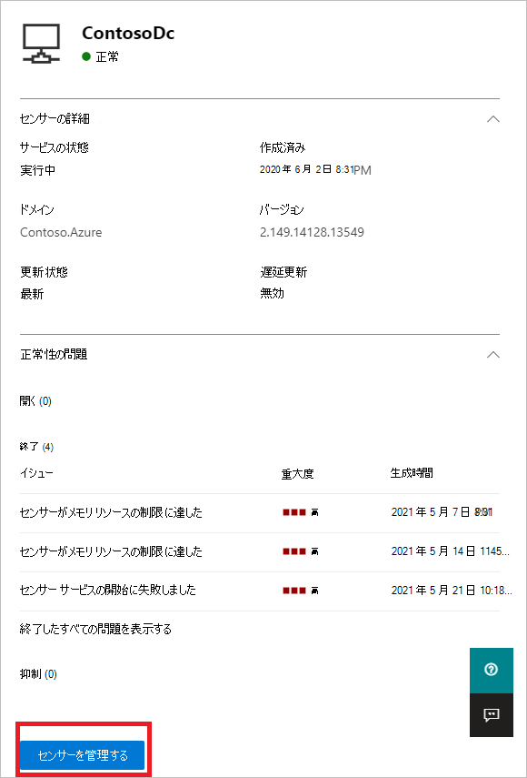
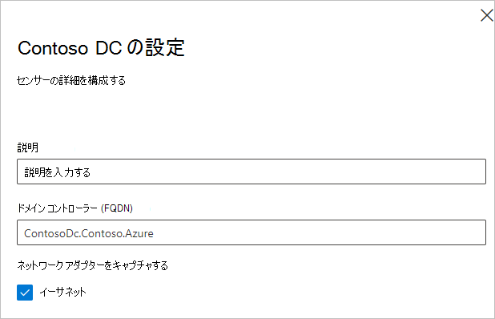
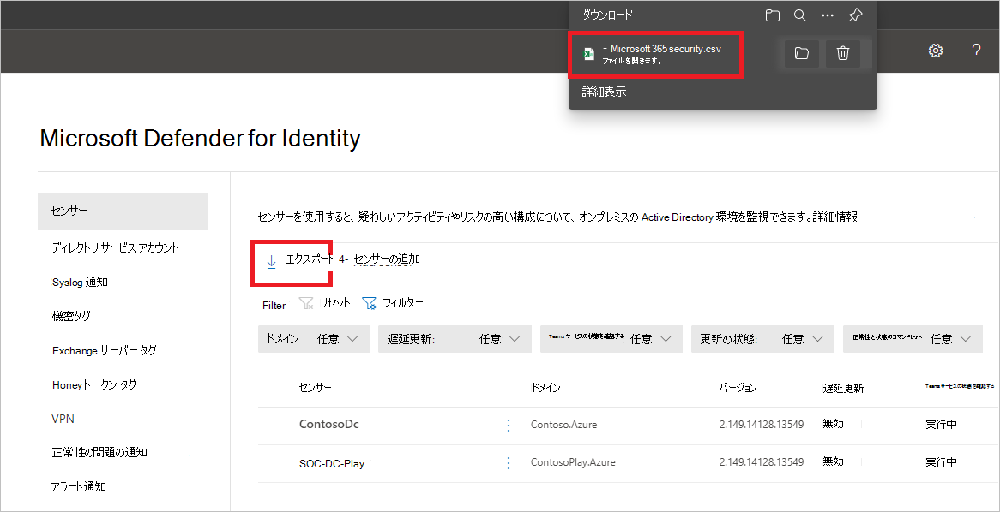
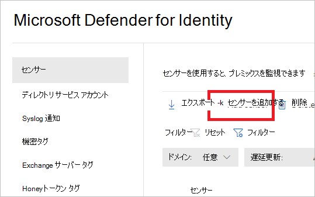
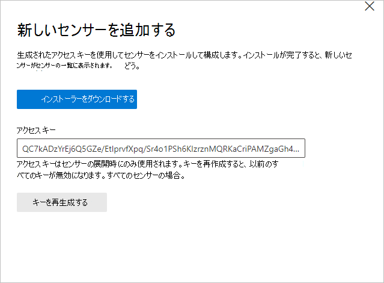

# Microsoft Defender for Identity sensor health and settings in <DICT__Microsoft⚐365⚐Defender>Microsoft 365 Defender</DICT__Microsoft⚐365⚐Defender>

**適用対象:**

- Microsoft 365 Defender
- Defender for Identity

この記事では、Microsoft [Defender for Identity センサー](/defender-for-identity)を構成および監視する方法について説明Microsoft 365 Defender。 

>[!IMPORTANT]
>Id ポータルの Defender の場所Microsoft 365 Defender一部のオプションと詳細が変更されました。 使い慣れた機能と新機能の両方を見つける場所については、以下の詳細をお読みください。

## Id センサーの設定と状態に対する Defender の表示

1. [[Microsoft 365 Defender]](https://security.microsoft.com/)で、[id]**設定** に **移動します**。

    ![[ID] 設定に移動します。](../../media/defender-identity/settings-identities.png)

1. [センサー **] ページを選択** すると、すべての Defender for Identity センサーが表示されます。 センサーごとに、その名前、ドメイン メンバーシップ、バージョン番号、更新プログラムの遅延が必要な場合、サービスの状態、更新状態、正常性状態、正常性の問題の数、センサーの作成時が表示されます。

    

    >[!NOTE]
    >Defender for Identity ポータルでは、センサーの設定と正常性情報が別々の場所に保存されています。 このページMicrosoft 365 Defender同じページに表示されます。

1. [フィルター] を **選択** すると、使用できるフィルターを選択できます。 次に、各フィルターを使用して、表示するセンサーを選択できます。

    

    

1. センサーのいずれかを選択すると、センサーとその正常性状態に関する情報がウィンドウに表示されます。

    

1. 正常性の問題を選択すると、その詳細を示すウィンドウが表示されます。 閉じた問題を選択した場合は、ここから再び開きます。

    

1. [センサーの管理 **] を選択** すると、ウィンドウが開き、センサーの詳細を構成できます。

    

    

1. [センサー **] ページで** 、[エクスポート] を選択して、センサーの一覧を.csvファイルに **エクスポートできます**。

    

## センサーの追加

[センサー **] ページ** から、新しいセンサーを追加できます。

1. [センサー **の追加] を選択します**。

    

1. ウィンドウが開き、センサー インストーラーと生成されたアクセス キーをダウンロードするためのボタンが表示されます。

    

1. [インストーラー **のダウンロード]** を選択して、パッケージをローカルに保存します。 zip ファイルには、次のファイルが含まれます。

    - Defender for Identity センサー インストーラー

    - Defender for Identity クラウド サービスに接続するために必要な情報を含む構成設定ファイル

1. Access キー **をコピーします**。 Defender for Identity センサーが Defender for Identity インスタンスに接続するには、アクセス キーが必要です。 アクセス キーは、センサーを展開する 1 回のパスワードであり、その後、認証と TLS 暗号化の証明書を使用してすべての通信が実行されます。 新しい **アクセス キーを再** 生成する必要がある場合は、[キーの再生成] ボタンを使用します。 以前に展開されたセンサーには影響を与えないので、センサーの初期登録にのみ使用されます。

1. Defender for Identity センサーをインストールする専用サーバーまたはドメイン コントローラーにパッケージをコピーします。

## 関連項目

- [Defender for Identity セキュリティアラートの管理](manage-security-alerts.md)
