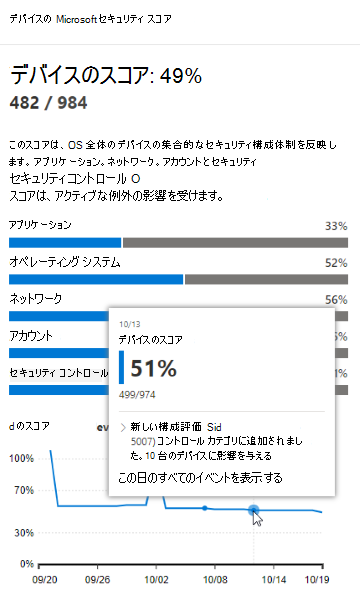
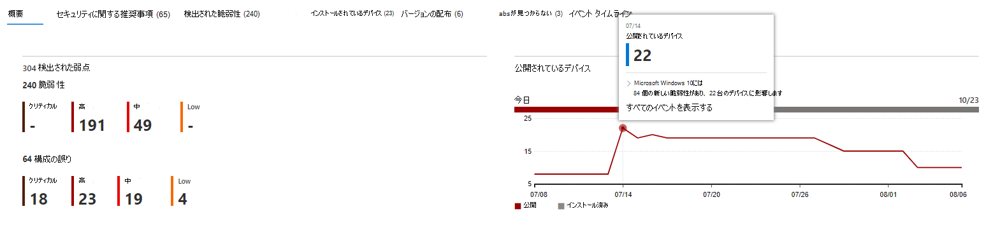

# イベントのタイムライン 

[!INCLUDE [Microsoft 365 Defender rebranding](../../includes/microsoft-defender.md)]

**適用対象:**

- [Microsoft Defender for Endpoint Plan 2](https://go.microsoft.com/fwlink/?linkid=2154037)
- [Microsoft Defender 脆弱性の管理](index.yml)
- [Microsoft 365 Defender](https://go.microsoft.com/fwlink/?linkid=2118804)

[!include[Prerelease information](../../includes/prerelease.md)]

>[!Note]
> Microsoft Defender 脆弱性の管理を体験するには [Microsoft Defender 脆弱性の管理パブリック プレビュー試用版](../defender-vulnerability-management/get-defender-vulnerability-management.md)にサインアップする方法について説明します。

イベント タイムラインは、新しい脆弱性や悪用によって組織にリスクがどのように導入されるかを解釈するのに役立つリスク ニュース フィードです。 組織のリスクに影響を与える可能性のあるイベントを表示できます。 たとえば、導入された新しい脆弱性、悪用可能になった脆弱性、エクスプロイト キットに追加された悪用などを見つけることができます。

イベント タイムラインには、 [露出スコア](tvm-exposure-score.md) と [Microsoft Secure Score for Devices](tvm-microsoft-secure-score-devices.md) のストーリーも示され、大きな変更の原因を特定できます。 イベントは、デバイスまたはデバイスのスコアに影響を与える可能性があります。 優先度の高い [セキュリティ推奨事項](tvm-security-recommendation.md)に基づいて修復する必要がある内容に対処することで、露出を減らします。

> [!TIP]
> 新しい脆弱性イベントに関する電子メールを取得するには、「[Microsoft Defender for Endpointで脆弱性の電子メール通知を構成](../defender-endpoint/configure-email-notifications.md)する」を参照してください。

## [イベント タイムライン] ページに移動する

[Microsoft Defender 脆弱性の管理 ダッシュボード](tvm-dashboard-insights.md)には、次の 3 つのエントリ ポイントもあります。

- **組織の露出スコア カード**: [時間の経過に伴う露出スコア] グラフのイベント ドットにマウス ポインターを合わせ、[この日のすべてのイベントを表示] を選択します。 イベントはソフトウェアの脆弱性を表します。
- **Microsoft Secure Score for Devices**: "時間の経過に伴うデバイスのスコア" グラフのイベント ドットにマウス ポインターを合わせ、[この日のすべてのイベントを表示する] を選択します。 イベントは、新しい構成評価を表します。
- **[上位イベント] カード**: 上部のイベント テーブルの下部にある [さらに表示] を選択します。 カードには、過去 7 日間に最も影響を与えた 3 つのイベントが表示されます。 影響を与えるイベントには、イベントが多数のデバイスに影響を与える場合や、重大な脆弱性である場合などがあります。

### デバイスの露出スコアと Microsoft Secure Score for Devices グラフ

Defender 脆弱性管理ダッシュボードで、公開スコア グラフにマウス ポインターを合わせると、デバイスに影響を与えたその日のソフトウェアの脆弱性の上位イベントが表示されます。 Microsoft Secure Score for Devices グラフにマウス ポインターを合わせると、スコアに影響する新しいセキュリティ構成評価が表示されます。

デバイスまたはデバイスのスコアに影響を与えるイベントがない場合は、何も表示されません。

 

### その日のイベントにドリルダウンする

**[この日のすべてのイベントを表示]** を選択すると、その日のカスタム日付範囲を含む [イベント タイムライン] ページに移動します。

[ **カスタム範囲]** を選択して、日付範囲を別のカスタム範囲または事前設定された時間範囲に変更します。

## イベント タイムラインの概要

[イベント タイムライン] ページでは、イベントに関連するすべての必要な情報を表示できます。

機能: 

- 列のカスタマイズ
- イベントの種類または影響を受けたデバイスの割合でフィルター処理する
- ページあたり 30、50、または 100 個のアイテムを表示する

ページ上部の 2 つの大きな数字は、イベントではなく、新しい脆弱性と悪用可能な脆弱性の数を示しています。 一部のイベントには複数の脆弱性があり、一部の脆弱性には複数のイベントが存在する可能性があります。

### 段組み

- **日付**: 月、日、年
- **イベント**: 影響を受けたデバイスのコンポーネント、種類、数など、影響を受けたイベント
- **関連コンポーネント**: ソフトウェア
- **最初に影響を受けたデバイス**: このイベントが最初に発生したときの影響を受けたデバイスの数と割合。 また、影響を受けたデバイスの合計数のうち、影響を受けたデバイスの割合でフィルター処理することもできます。
- **現在影響を受けるデバイス**: このイベントが現在影響を受けるデバイスの現在の数と割合。 [ **列のカスタマイズ**] を選択すると、このフィールドを見つけることができます。
- **型**: スコアに影響を与えるタイムスタンプ付きイベントを反映します。 フィルター処理できます。
  - エクスプロイト キットに追加されたエクスプロイト
  - エクスプロイトが検証されました
  - 新しいパブリック エクスプロイト
  - 新しい脆弱性
  - 新しい構成評価
- **スコアの傾向**: 露出スコアの傾向

### アイコン

次のアイコンは、イベントの横に表示されます。

-  新しいパブリック エクスプロイト
-  新しい脆弱性が公開されました
-  エクスプロイト キットで見つかったエクスプロイト
-  エクスプロイト検証済み

### 特定のイベントにドリルダウンする

イベントを選択すると、ポップアップが表示され、デバイスに影響を与える詳細と現在の CVE の一覧が表示されます。 その他の CVE を表示したり、関連する推奨事項を表示したりできます。

"スコアの傾向" の下の矢印は、このイベントが組織の露出スコアを引き上げたり下げたりする可能性があるかどうかを判断するのに役立ちます。 露出スコアが高いということは、デバイスが悪用に対して脆弱であることを意味します。

そこから、[ **関連するセキュリティの推奨事項に移動** ] を選択し、セキュリティの推奨事項ページで新しいソフトウェアの脆弱性に対処する [推奨事項](tvm-security-recommendation.md)を表示します。 セキュリティに関する推奨事項の説明と脆弱性の詳細を読んだ後、修復要求を送信し、 [修復ページ](tvm-remediation.md)で要求を追跡できます。

## ソフトウェア ページでイベント タイムラインを表示する

ソフトウェア ページを開くには、ポップアップの [関連コンポーネント] セクションで、ハイパーリンクされたソフトウェア名 (Visual Studio 2017 など) を選択>イベントを選択します。 [ソフトウェア ページの詳細を確認する](tvm-software-inventory.md#software-pages)

特定のソフトウェアのすべての詳細を含む完全なページが表示されます。 グラフの上にマウスポインターを合わせると、その特定のソフトウェアのイベントのタイムラインが表示されます。

[イベント タイムライン] タブに移動し、そのソフトウェアに関連するすべてのイベントを表示します。 セキュリティに関する推奨事項、検出された脆弱性、インストールされているデバイス、バージョンの配布も確認できます。

![[イベント タイムライン] タブがある [ソフトウェア] ページ。](../../media/defender-vulnerability-management/tvm-event-timeline-software-pages.png)

## 関連項目

- [ダッシュボード](tvm-dashboard-insights.md)
- [暴露スコア](tvm-exposure-score.md)
- [セキュリティに関する推奨事項](tvm-security-recommendation.md)
- [脆弱性を修復する](tvm-remediation.md)
- [ソフトウェア インベントリ](tvm-software-inventory.md)
