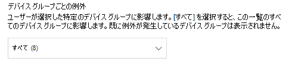
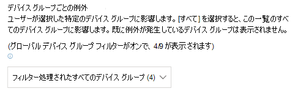
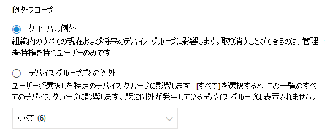
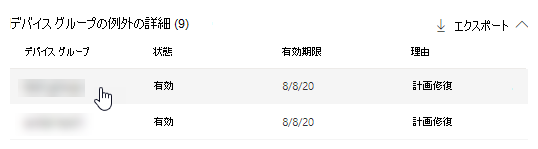

# セキュリティに関する推奨事項の例外を作成して表示する

[!INCLUDE [Microsoft 365 Defender rebranding](../../includes/microsoft-defender.md)]

**適用対象:**

- [Microsoft Defender for Endpoint Plan 2](https://go.microsoft.com/fwlink/?linkid=2154037)
- [Microsoft Defender 脆弱性の管理](index.yml)
- [Microsoft 365 Defender](https://go.microsoft.com/fwlink/?linkid=2118804)

[!include[Prerelease information](../../includes/prerelease.md)]

>[!Note]
> Microsoft Defender 脆弱性の管理を体験しますか? [Microsoft Defender 脆弱性の管理パブリック プレビュー試用版](../defender-vulnerability-management/get-defender-vulnerability-management.md)にサインアップする方法の詳細については、こちらを参照してください。

現時点で推奨事項が関連していない場合の修復要求の代わりに、推奨事項の例外を作成できます。 組織にデバイス グループがある場合は、特定のデバイス グループに対して例外のスコープを設定できます。 例外は、選択したデバイス グループに対して作成することも、過去と現在のすべてのデバイス グループに対して作成することもできます。

推奨事項に対して例外が作成されると、例外期間が終了するまで推奨事項はアクティブになりません。 推奨事項の状態は、 **完全な例外** または **部分例外** (デバイス グループ別) に変更されます。

## アクセス許可

例外を管理できるのは、"例外処理" アクセス許可を持つユーザーのみです (作成または取り消しを含む)。 [RBAC ロールの詳細については、こちらを参照してください](../defender-endpoint/user-roles.md)。

## 例外を作成する

例外を作成するセキュリティに関する推奨事項を選択し、 **例外オプション** を選択してフォームに入力します。

### デバイス グループ別の例外

現在のすべてのデバイス グループに例外を適用するか、特定のデバイス グループを選択します。 今後のデバイス グループは例外に含まれません。 既に例外が発生しているデバイス グループは一覧に表示されません。 特定のデバイス グループのみを選択した場合、推奨事項の状態は "アクティブ" から "部分的な例外" に変わります。 すべてのデバイス グループを選択すると、状態は "完全な例外" に変わります。

#### フィルター処理されたビュー

いずれかの脆弱性管理ページでデバイス グループでフィルター処理した場合は、フィルター処理されたデバイス グループのみがオプションとして表示されます。

これは、いずれかの脆弱性管理ページでデバイス グループでフィルター処理するボタンです。

フィルター処理されたデバイス グループを含む例外ビュー:

#### デバイス グループの数が多い

組織に 20 を超えるデバイス グループがある場合は、フィルター処理されたデバイス グループ オプションの横にある **[編集]** を選択します。

ポップアップが表示され、含めるデバイス グループを検索して選択できます。 [検索] の下にあるチェック マーク アイコンを選択して、すべてオン/オフにします。

### グローバル例外

グローバル管理者のアクセス許可がある場合は、グローバル例外を作成して取り消すことができるようになります。 組織内 **のすべての** 現在および将来のデバイス グループに影響を与え、同様のアクセス許可を持つユーザーのみが変更できます。 推奨事項の状態は"アクティブ" から "完全な例外" に変わります。

次の点に注意してください。

- 推奨事項がグローバル例外の下にある場合、デバイス グループに対して新しく作成された例外は、グローバル例外の有効期限が切れたか取り消されるまで中断されます。 その後、新しいデバイス グループの例外は有効期限が切れるまで有効になります。
- 推奨事項に特定のデバイス グループの例外が既に存在し、グローバル例外が作成されている場合、デバイス グループの例外は期限切れになるか、グローバル例外が期限切れになる前に取り消されるまで中断されます。

### 妥当性

問題のセキュリティに関する推奨事項を修復する代わりに、ファイルする必要がある例外の理由を選択します。 理由コンテキストに入力し、例外期間を設定します。

次の一覧では、例外オプションの背後にある理由について詳しく説明します。

- **サード パーティコントロール** - サード パーティ製品またはソフトウェアがこの推奨事項に既に対処しています。 この理由の種類を選択すると、リスクが減るため、露出スコアが低下し、セキュリティスコアが向上します
- **代替軽減策** - 内部ツールは既にこの推奨事項に対処しています。 この理由の種類を選択すると、リスクが減るため、露出スコアが低下し、セキュリティスコアが向上します。
- **受け入れられたリスク** - リスクが低い、または推奨事項の実装がコストがかかりすぎる
- **計画修復 (猶予期間)** - 既に計画されていますが、実行または承認を待機しています

## すべての例外を表示する

**[修復**] ページの [**例外**] タブに移動します。 理由、種類、状態でフィルター処理できます。

 例外を選択してポップアップを開き、詳細を表示します。 デバイス グループごとの例外には、エクスポートできる例外が含まれるすべてのデバイス グループの一覧が含まれます。 関連する推奨事項を表示したり、例外を取り消したりすることもできます。

![[修復] ページに [例外] タブを表示します。](../../media/defender-vulnerability-management/tvm-exception-view.png)

## 例外を取り消す方法

例外を取り消すには、[**修復**] ページの [**例外**] タブに移動します。 例外を選択します。

すべてのデバイス グループまたはグローバル例外の例外を取り消すには、[ **すべてのデバイス グループの例外のキャンセル] ボタンを** 選択します。 アクセス許可を持つデバイス グループの例外のみを取り消すことができるようになります。

![[キャンセル] ボタン。](../../media/defender-vulnerability-management/tvm-exception-cancel.png)

### 特定のデバイス グループの例外を取り消す

特定のデバイス グループを選択して、その例外を取り消します。 デバイス グループにポップアップが表示され、[ **例外のキャンセル]** を選択できます。

## 例外が適用された後の影響を表示する

[セキュリティに関する推奨事項] ページで、[**列のカスタマイズ**] を選択し、[**公開されたデバイス (例外の後) と影響 (例外の後)]** のチェック ボックスをオンにします。

公開されたデバイス (例外後) 列には、例外が適用された後も脆弱性にさらされている残りのデバイスが表示されます。 公開に影響を与える例外の理由には、"サード パーティコントロール" と "代替軽減策" が含まれます。 その他の理由により、デバイスの露出が減るわけではありません。また、引き続き公開されていると見なされます。

影響 (例外後) は、例外が適用された後の露出スコアまたはセキュリティスコアへの残りの影響を示します。 スコアに影響を与える例外の理由には、"サード パーティコントロール" と "代替軽減策" が含まれます。 その他の理由により、デバイスの露出が減るわけではないため、露出スコアとセキュリティスコアは変わりません。

## 関連項目

- [脆弱性を修復する](tvm-remediation.md)
- [セキュリティに関する推奨事項](tvm-security-recommendation.md)
- [暴露スコア](tvm-exposure-score.md)
- [デバイス向けの Microsoft セキュア スコア](tvm-microsoft-secure-score-devices.md)
