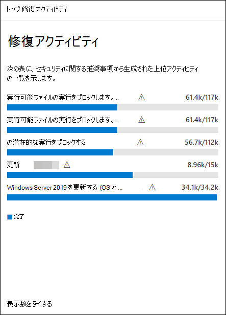

# 脆弱性の修復

[!INCLUDE [Microsoft 365 Defender rebranding](../../includes/microsoft-defender.md)]

**適用対象:**

- [Microsoft Defender for Endpoint Plan 2](https://go.microsoft.com/fwlink/?linkid=2154037)
- [Microsoft Defender 脆弱性の管理](index.yml)
- [Microsoft 365 Defender](https://go.microsoft.com/fwlink/?linkid=2118804)

[!include[Prerelease information](../../includes/prerelease.md)]

>[!Note]
> Microsoft Defender 脆弱性の管理を体験するには [Microsoft Defender 脆弱性の管理パブリック プレビュー試用版](../defender-vulnerability-management/get-defender-vulnerability-management.md)にサインアップする方法について説明します。

この短いビデオでは、Microsoft Defender 脆弱性の管理エンドポイントの脆弱性と構成ミスを検出する方法について説明し、環境内の脅威と脆弱性をすばやく修復するのに役立つ実用的な分析情報を提供します。

> [!VIDEO https://www.microsoft.com/en-us/videoplayer/embed/RE4qLVs]

## 修復を要求する

脆弱性管理機能は、修復要求ワークフローを通じて、セキュリティ管理者と IT 管理者の間のギャップを埋めます。 このようなセキュリティ管理者は、IT 管理者に **対して、推奨事項** ページからIntuneへの脆弱性の修復を要求できます。

### Microsoft Intune接続を有効にする

この機能を使用するには、Microsoft Intune接続を有効にします。 Microsoft 365 Defender ポータルで、[Settings Endpoints General Advanced features **]\(設定****エンドポイントの** \> **一般的** \> **な高度な機能**\\>) に移動します。 下にスクロールして **、Microsoft Intune接続** を探します。 既定では、トグルはオフになっています。 **Microsoft Intune接続** トグルを **オンにします**。

**注**: Intune接続が有効になっている場合は、修復要求を作成するときにIntuneセキュリティ タスクを作成するオプションが表示されます。 接続が設定されていない場合、このオプションは表示されません。

詳細については、「[Intuneを使用して、Microsoft Defender for Endpointによって識別される脆弱性を修復](/intune/atp-manage-vulnerabilities)する」を参照してください。

### 修復要求の手順

1. Microsoft 365 Defender ポータルの **[脆弱性管理**] ナビゲーション メニューに移動し、[[**推奨事項]**](tvm-security-recommendation.md) を選択します。

2. 修復を要求するセキュリティに関する推奨事項を選択し、 **修復オプションを** 選択します。

3. 修復を要求しているもの、該当するデバイス グループ、優先度、期限、オプションのメモなど、フォームに入力します。
    1. "注意が必要" 修復オプションを選択した場合、特定のアクションがないため、期限を選択することはできません。

4. [ **要求の送信]** を選択します。 修復要求を送信すると、脆弱性管理内に修復アクティビティ 項目が作成され、この推奨事項の修復の進行状況を監視するために使用できます。 これにより修復がトリガーされたり、デバイスに変更が適用されたりすることはありません。

5. 新しい要求について IT 管理者に通知し、Intuneにログインして要求を承認または拒否し、パッケージの展開を開始します。

6. 修復ページに移動して、 [**修復**](tvm-remediation.md) 要求の状態を表示します。

チケットがIntuneにどのように表示されるかを確認する場合は、「[Intuneを使用して、Microsoft Defender for Endpointによって識別される脆弱性を修復する](/intune/atp-manage-vulnerabilities)」を参照してください。

> [!NOTE]
> 要求に 10,000 台を超えるデバイスの修復が含まれる場合は、修復用に 10,000 台のデバイスのみをIntuneに送信できます。

組織のサイバーセキュリティの弱点が特定され、実用的な [セキュリティ推奨事項](tvm-security-recommendation.md)にマップされたら、セキュリティ タスクの作成を開始します。 修復チケットが作成されるMicrosoft Intuneとの統合を通じてタスクを作成できます。

セキュリティに関する推奨事項を修復することで、組織の脆弱性の影響を軽減し、セキュリティ構成を強化します。

## 修復アクティビティを表示する

[セキュリティの推奨事項] ページから修復要求を送信すると、修復アクティビティが開始されます。 修復ページで追跡できるセキュリティ タスクが作成され、**修復** チケットがMicrosoft Intuneに作成されます。

"注意が必要" 修復オプションを選択した場合、監視できる実際のアクションがないため、進行状況バー、チケットの状態、期限は表示されません。

[修復] ページに移動したら、表示する修復アクティビティを選択します。 修復手順に従ったり、進行状況を追跡したり、関連する推奨事項を表示したり、CSV にエクスポートしたり、完了としてマークしたりできます。

:::image type="content" source="../../media/remediation-flyouteolswnew.png" lightbox="../../media/remediation-flyouteolswnew.png" alt-text="選択した修復アクティビティを含む [修復] ページの例と、説明、IT サービスとデバイス管理ツール、およびデバイス修復を一覧表示するアクティビティのポップアップ":::

> [!NOTE]
> 完了した修復アクティビティには 180 日間のリテンション期間があります。 修復ページのパフォーマンスを最適に保つため、修復アクティビティは完了から 6 か月後に削除されます。

### 列で完了しました

修復ページの [完了者] 列で修復アクティビティを終了したユーザーを追跡します。

- **Email アドレス**: タスクを手動で完了したユーザーの電子メール
- **システムの確認**: タスクが自動的に完了しました (すべてのデバイスが修復されました)
- **N/A**: この古いタスクがどのように完了したかがわからないため、情報を利用できません

:::image type="content" alt-text="2 つの行を含む列によって作成され、完了されます。完了する 1 つの行には電子メールの例があり、もう 1 つの行にはシステムの確認が記載されています。" source="../../media/defender-vulnerability-management/tvm-completed-by.png":::

### ダッシュボードのトップ修復アクティビティ

[**脆弱性管理** ダッシュボード](tvm-dashboard-insights.md)で **、上位の修復アクティビティ** を表示します。 いずれかのエントリを選択して **、[修復]** ページに移動します。 IT 管理者チームがタスクを修復した後、修復アクティビティを完了としてマークすることができます。

## 関連記事

- [ダッシュボード](tvm-dashboard-insights.md)
- [セキュリティに関する推奨事項](tvm-security-recommendation.md)
