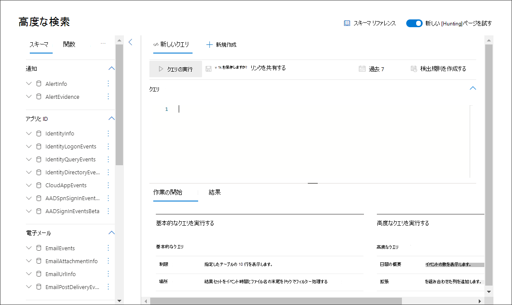
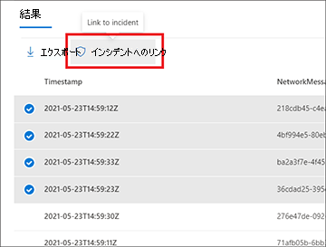
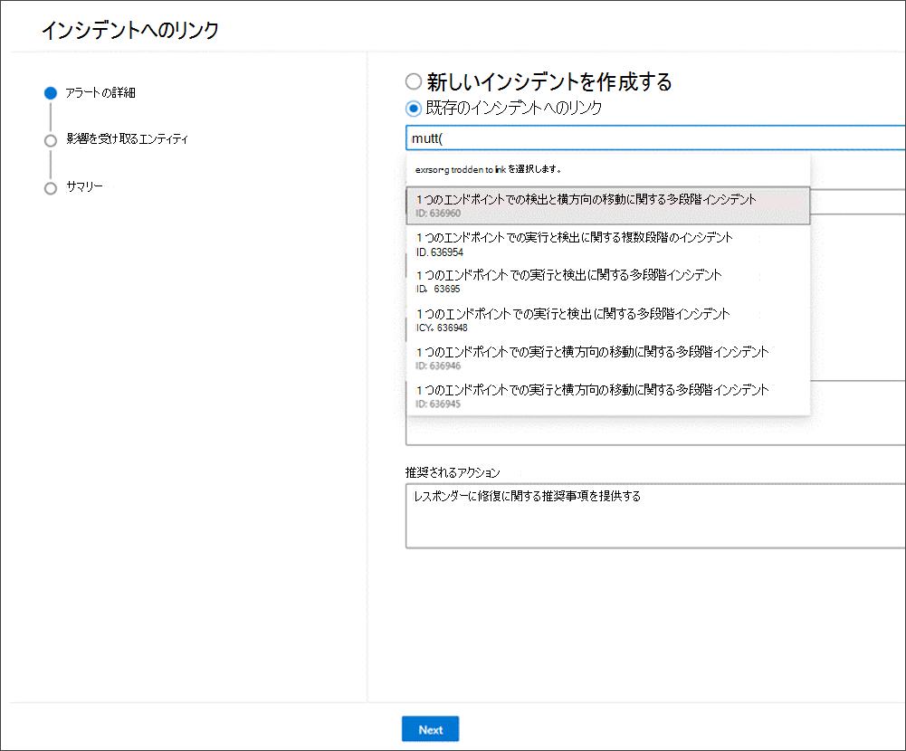
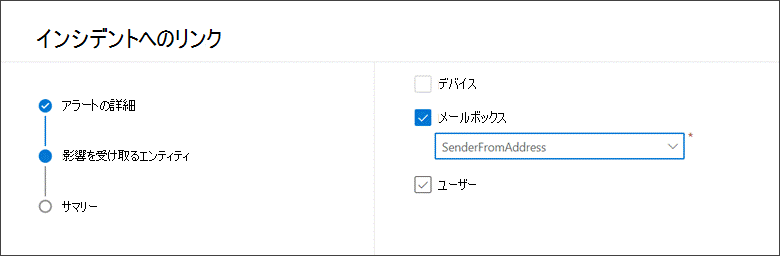
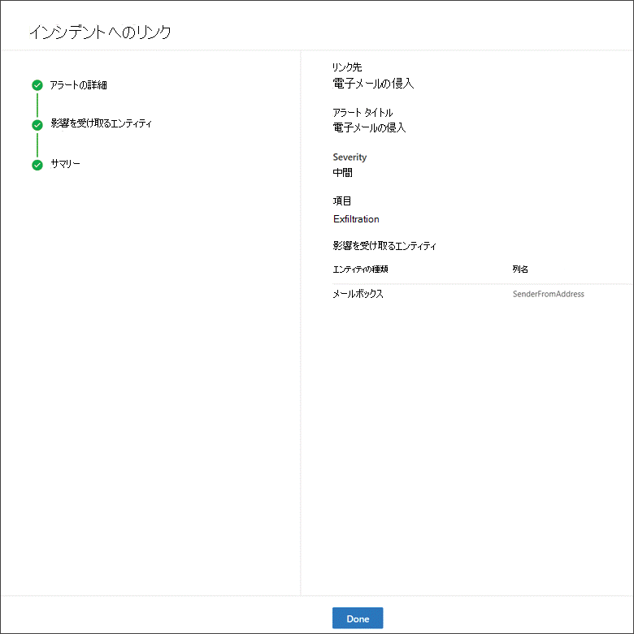
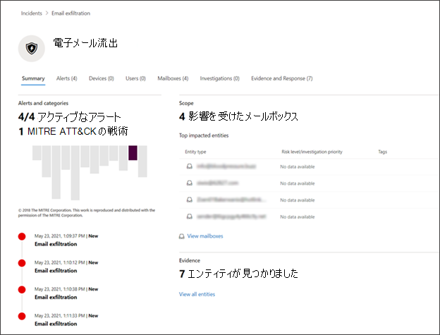
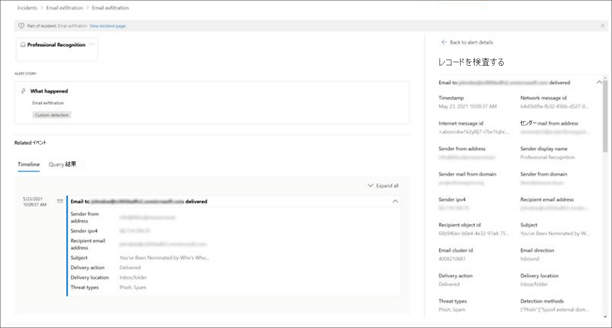
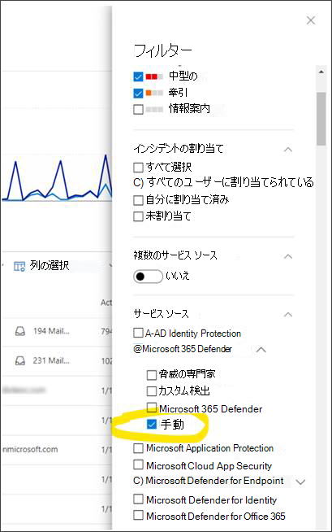

# クエリ結果をインシデントにリンクする

[!INCLUDE [Microsoft 365 Defender rebranding](../includes/microsoft-defender.md)]

**適用対象:**
- Microsoft 365 Defender
- Microsoft Defender for Endpoint

インシデント機能へのリンクを使用すると、調査中の新規または既存のインシデントに高度な検索クエリ結果を追加できます。 この機能を使用すると、高度な狩猟アクティビティからレコードを簡単にキャプチャし、インシデントに関するイベントのより豊富なタイムラインまたはコンテキストを作成できます。 

## 結果を新規または既存のインシデントにリンクする

1. 高度な検索クエリ ページで、まずクエリ フィールドにクエリを入力し、[クエリの実行] を選択して結果を取得します。

    
2. [結果] ページで、作業している新しい調査または現在の調査に関連するイベントまたはレコードを選択し、[インシデントにリンク] **を選択します**。

    
3. [インシデント **へのリンク]** ウィンドウで [アラートの詳細]セクションを見つけ、[新しいインシデントの作成] を選択してイベントをアラートに変換し、新しいインシデントにグループ化します。

 
       
    
    または、[ **既存のインシデントへのリンク] を選択して** 、選択したレコードを既存のインシデントに追加します。 既存のインシデントのドロップダウン リストから関連するインシデントを選択します。 インシデント名または ID の最初の数文字を入力して、既存のインシデントを検索できます。 

    
4. どちらの選択でも、次の詳細を入力し、[次へ] を **選択します**。
      - **アラート タイトル** - インシデントレスポンダーが理解できる結果の説明的なタイトルを提供します。 これは、アラート タイトルになります。
      - **重大度** - アラートのグループに適用される重大度を選択します。
      - **[カテゴリ** ] - アラートの適切な脅威カテゴリを選択します。
      - **説明** - グループ化されたアラートに役立つ説明を提供します。
      - **推奨されるアクション** - 修復アクションを提供します。

5. [影響を **受けるエンティティ] セクション** で、影響を受ける主なエンティティまたは影響を受けるエンティティを選択します。 このセクションには、クエリ結果に基づく適用可能なエンティティだけが表示されます。 この例では、クエリを使用して、可能性がある電子メールのexfiltrationインシデントに関連するイベントを検索しました。したがって、Sender は影響を受けたエンティティです。 たとえば、4 つの異なる送信者がある場合、4 つのアラートが作成され、選択したインシデントにリンクされます。 
        
6. **[次へ]** を選択します。
7. [概要] セクションで指定した詳細 **を確認** します。
      
8. [**完了**] を選択します。

## インシデント内のリンクされたレコードを表示する

インシデント名を選択すると、イベントがリンクされているインシデントを表示できます。
      

この例では、選択した 4 つのイベントを表す 4 つのアラートが、新しいインシデントに正常にリンクされました。 

各アラート ページで、タイムライン ビュー (利用可能な場合) およびクエリ結果ビューでイベントまたはイベントに関する完全な情報を見ることができます。
      

イベントを選択して、[レコードの検査] ウィンドウ **を開** くすることもできます。
 

## 高度な検索を使用して追加されたイベントのフィルター
インシデント キューとアラート キューを手動検出ソースでフィルター処理することで、高度な検索から生成されたアラート **を** 表示できます。

 