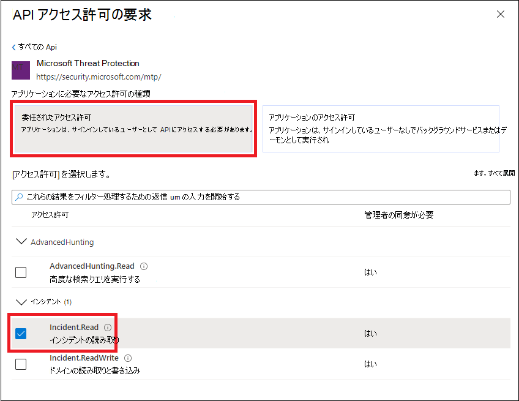

# <a name="create-an-app-to-access-microsoft-365-defender-apis-on-behalf-of-a-user"></a>ユーザーに代わって API にMicrosoft 365 Defenderするアプリを作成する

[!INCLUDE [Microsoft 365 Defender rebranding](../includes/microsoft-defender.md)]

**適用対象:**

- Microsoft 365 Defender

> [!IMPORTANT]
> 一部の情報は、市販される前に大幅に変更される可能性があるプレリリース製品に関するものです。 Microsoft は、ここに記載された情報に関して、明示または黙示を問わず、いかなる保証も行いません。

このページでは、1 人のユーザーに代わってアプリケーションを作成して、Microsoft 365 Defenderにアクセスする方法について説明します。

定義されたユーザーなしで Microsoft 365 Defender にプログラムでアクセスする必要がある場合 (たとえば、バックグラウンド アプリやデーモンを作成する場合)、「ユーザーなしで Microsoft 365 Defender にアクセスするアプリ[を](api-create-app-web.md)作成する」を参照してください。 大規模な組織や顧客グループにサービスを提供する場合など、複数のテナントにアクセス権を提供する必要がある場合は、「Microsoft 365 Defender API へのパートナー アクセスを持つ[アプリを作成する」を参照](api-partner-access.md)してください。必要なアクセスの種類が不明な場合は、「開始する」[を参照してください](api-access.md)。

Microsoft 365 Defender一連のプログラム API を使用して、そのデータとアクションの多くを公開します。 これらの API を使用すると、ワークフローを自動化し、Microsoft 365 Defender機能を利用できます。 この API アクセスには、OAuth2.0 認証が必要です。 詳細については[、「OAuth 2.0 Authorization Code Flow」 を参照してください](/azure/active-directory/develop/active-directory-v2-protocols-oauth-code)。

一般に、これらの API を使用するには、次の手順を実行する必要があります。

- アプリケーション (azure Azure Active Directory) AD作成します。
- このアプリケーションを使用してアクセス トークンを取得します。
- トークンを使用して API にMicrosoft 365 Defenderします。

この記事では、次の方法について説明します。

- Azure AD アプリケーションを作成する
- アクセス トークンを取得してアクセスMicrosoft 365 Defender
- トークンを検証する

> [!NOTE]
> ユーザーに代Microsoft 365 Defender API にアクセスする場合は、適切なアプリケーションのアクセス許可とユーザーのアクセス許可が必要です。

> [!TIP]
> ポータルでアクションを実行するアクセス許可がある場合は、API でアクションを実行するアクセス許可を持つ必要があります。

## <a name="create-an-app"></a>アプリを作成する

1. グローバル管理者ロール [を持](https://portal.azure.com) つユーザーとして Azure **にサインイン** します。

2. [アプリの **登録Azure Active Directory**  >  **新しい登録]**  >  **に移動します**。

   

3. フォームで、アプリケーションの名前を選択し、リダイレクト URI の次の情報を入力し、[登録] を **選択します**。

   ![[アプリケーションの作成] ウィンドウのイメージ。](../../media/nativeapp-create2.PNG)

   - **アプリケーションの種類:** パブリック クライアント
   - **リダイレクト URI:** https://portal.azure.com

4. アプリケーション ページで **、[API アクセス** 許可] [アクセス許可の追加] を選択し、組織で使用するアクセス許可 API > Microsoft Threat Protection と入力し  >    >  **、[Microsoft** Threat **Protection] を選択します**。 これで、アプリはアプリにアクセスMicrosoft 365 Defender。

   > [!TIP]
   > *Microsoft Threat Protection* は、元のMicrosoft 365 Defenderの名前であり、元のリストには表示されません。 テキスト ボックスに名前を書き込み始め、表示を確認する必要があります。

   

   - [ **委任されたアクセス許可] を選択します**。 シナリオに関連するアクセス許可 (インシデント **.読** み取りなど) を選択し、[アクセス許可の追加 **] を選択します**。

   

    > [!NOTE]
    > シナリオに関連するアクセス許可を選択する必要があります。 *すべてのインシデントの読み取り* は、単なる例です。 必要なアクセス許可を決定するには、呼び出す API の **[** アクセス許可] セクションを参照してください。
    >
    > たとえば、高度な [クエリを実行するには、[](api-advanced-hunting.md)高度なクエリの実行] アクセス許可を選択します。デバイス [を分離するには、[](/windows/security/threat-protection/microsoft-defender-atp/isolate-machine)コンピューターの分離] アクセス許可を選択します。

5. [管理者 **の同意を付与する] を選択します**。 アクセス許可を追加する度に、[管理者の同意 **を付与** する] を選択して有効に設定する必要があります。

   

6. アプリケーション ID とテナント ID を安全な場所に記録します。 アプリケーション ページの [概要] **に** 一覧表示されます。

   

## <a name="get-an-access-token"></a>アクセス トークンを取得する

トークンの詳細については、「Azure Azure Active Directoryチュートリアル」[をADしてください](/azure/active-directory/develop/active-directory-v2-protocols-oauth-client-creds)。

### <a name="get-an-access-token-using-powershell"></a>PowerShell を使用してアクセス トークンを取得する

```PowerShell
if(!(Get-Package adal.ps)) { Install-Package -Name adal.ps } # Install the ADAL.PS package in case it's not already present

$tenantId = '' # Paste your directory (tenant) ID here.
$clientId = '' # Paste your application (client) ID here.
$redirectUri = '' # Paste your app's redirection URI

$authority = "https://login.windows.net/$tenantId"
$resourceUrl = 'https://api.security.microsoft.com'

$response = Get-ADALToken -Resource $resourceUrl -ClientId $clientId -RedirectUri $redirectUri -Authority $authority -PromptBehavior:Always
$response.AccessToken | clip

$response.AccessToken
```

## <a name="validate-the-token"></a>トークンを検証する

1. トークンをコピーして JWT に貼 [り付け、](https://jwt.ms) デコードします。
1. デコードされたトークン内 *のロール* クレームに必要なアクセス許可が含まれているか確認します。

次の図では、アプリから取得したデコードトークンと、アクセス許可 ```Incidents.Read.All``` ```Incidents.ReadWrite.All``` を ```AdvancedHunting.Read.All``` 表示できます。


## <a name="use-the-token-to-access-the-microsoft-365-defender-api"></a>トークンを使用して API にアクセスMicrosoft 365 Defenderする

1. 使用する API (インシデント、高度な検索) を選択します。 詳細については[、「Supported Microsoft 365 Defender API」を参照してください](api-supported.md)。
2. 送信する http 要求で、認証ヘッダーを 、承認スキームであるベアラー、検証済みトークンである `"Bearer" <token>` トークンに設定します。 
3. トークンは 1 時間以内に期限切れになります。 同じトークンを使用して、この期間中に複数の要求を送信できます。

次の例は、要求を送信して、イベントを使用してインシデントの一覧を取得する **C#。**

```C#
    var httpClient = new HttpClient();
    var request = new HttpRequestMessage(HttpMethod.Get, "https://api.security.microsoft.com/api/incidents");

    request.Headers.Authorization = new AuthenticationHeaderValue("Bearer", token);

    var response = httpClient.SendAsync(request).GetAwaiter().GetResult();
```

## <a name="related-articles"></a>関連記事

- [Microsoft 365 DefenderAPI の概要](api-overview.md)
- [API にMicrosoft 365 Defenderする](api-access.md)
- ['Hello world' アプリを作成する](api-hello-world.md)
- [ユーザーなしでアプリを作成してMicrosoft 365 Defenderにアクセスする](api-create-app-web.md)
- [複数テナントパートナーによる API へのアクセス権を持つアプリをMicrosoft 365 Defenderする](api-partner-access.md)
- [API の制限とライセンスの詳細](api-terms.md)
- [エラー コードについて](api-error-codes.md)
- [ユーザー サインインと API アクセスの OAuth 2.0 承認](/azure/active-directory/develop/active-directory-v2-protocols-oauth-code)
