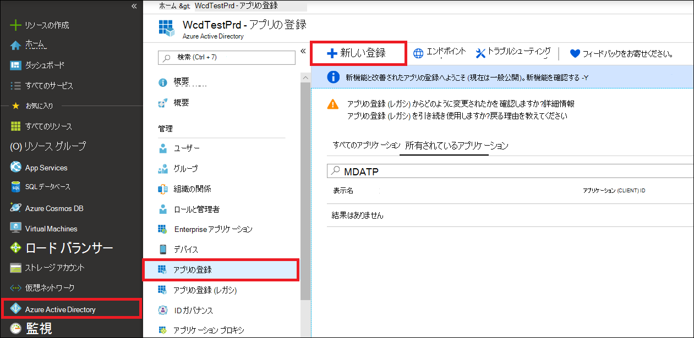
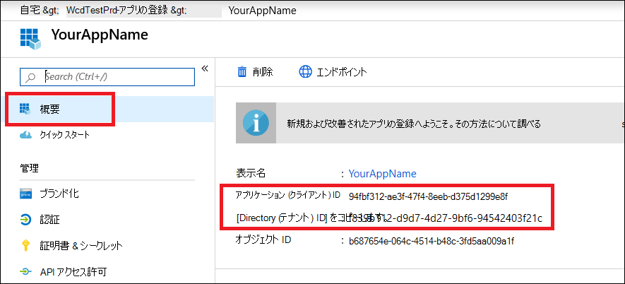
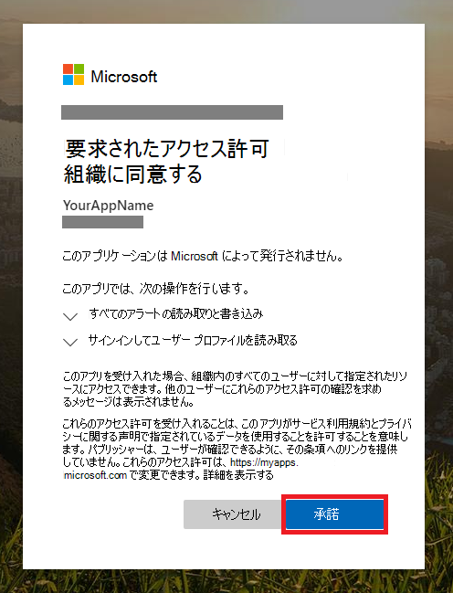

# <a name="create-an-app-with-partner-access-to-microsoft-365-defender-apis"></a>パートナーが API にアクセスできるアプリをMicrosoft 365 Defenderする

[!INCLUDE [Microsoft 365 Defender rebranding](../includes/microsoft-defender.md)]

**適用対象:**

- Microsoft 365 Defender

> [!IMPORTANT]
> 一部の情報は、市販される前に大幅に変更される可能性があるプレリリース製品に関するものです。 Microsoft は、ここに記載された情報に関して、明示または黙示を問わず、いかなる保証も行いません。

このページでは、複数のテナントのユーザーに代わって、Azure Active Directory にプログラムによるアクセス権を持つ Microsoft 365 Defender アプリを作成する方法について説明します。 マルチテナント アプリは、大規模なユーザー グループにサービスを提供する場合に役立ちます。

1 人のユーザーに代わって Microsoft 365 Defender にプログラムによるアクセスが必要な場合は、「アプリを作成して、ユーザーに代わって api Microsoft 365 Defenderアクセスする」を[参照してください](api-create-app-user-context.md)。 ユーザーが明示的に定義されていないアクセスが必要な場合 (たとえば、バックグラウンド アプリやデーモンを作成する場合)、「ユーザーなしでアプリにアクセスMicrosoft 365 Defenderを作成する」を参照[してください](api-create-app-web.md)。 必要なアクセスの種類が不明な場合は、「開始する」 [を参照してください](api-access.md)。

Microsoft 365 Defender一連のプログラム API を使用して、そのデータとアクションの多くを公開します。 これらの API を使用すると、ワークフローを自動化し、Microsoft 365 Defender機能を利用できます。 この API アクセスには、OAuth2.0 認証が必要です。 詳細については[、「OAuth 2.0 Authorization Code Flow」 を参照してください](/azure/active-directory/develop/active-directory-v2-protocols-oauth-code)。

一般に、これらの API を使用するには、次の手順を実行する必要があります。

- アプリケーション (azure Azure Active Directory) AD作成します。
- このアプリケーションを使用してアクセス トークンを取得します。
- トークンを使用して API にMicrosoft 365 Defenderします。

このアプリはマルチテナントですから、ユーザーの代わりに各[](/azure/active-directory/develop/v2-permissions-and-consent#requesting-consent-for-an-entire-tenant)テナントからの管理者の同意も必要になります。

この記事では、次の方法について説明します。

- マルチテナント **Azure AD** アプリケーションの作成
- アプリケーションが必要とするリソースにアクセスするために、ユーザー管理者Microsoft 365 Defender同意を得る。
- アクセス トークンを取得してアクセスMicrosoft 365 Defender
- トークンを検証する

Microsoft 365 Defender一連のプログラム API を使用して、そのデータとアクションの多くを公開します。 これらの API は、ワークフローを自動化し、新しい機能に基づいて革新Microsoft 365 Defender役立ちます。 API アクセスには、OAuth2.0 認証が必要です。 詳細については[、「OAuth 2.0 Authorization Code Flow」 を参照してください](/azure/active-directory/develop/active-directory-v2-protocols-oauth-code)。

一般に、API を使用するには、次の手順を実行する必要があります。

- マルチテナント **Azure AD** 作成します。
- アプリケーションが必要とするリソースにアクセスするために、ユーザー管理者から承認 (同意) Microsoft 365 Defender取得します。
- このアプリケーションを使用してアクセス トークンを取得します。
- トークンを使用して API にMicrosoft 365 Defenderします。

次の手順では、マルチテナント Azure AD アプリケーションを作成し、アクセス トークンを取得してMicrosoft 365 Defender検証します。

## <a name="create-the-multi-tenant-app"></a>マルチテナント アプリの作成

1. グローバル管理者ロール [を持](https://portal.azure.com) つユーザーとして Azure **にサインイン** します。

2. [アプリの **登録Azure Active Directory**  >  **新しい登録]**  >  **に移動します**。

   

3. 登録フォームで次の情報を入力します。

   - アプリケーションの名前を選択します。
   - [ **サポートされているアカウントの種類] で**、[任意の組織ディレクトリのアカウント ] ([任意の Azure AD **ディレクトリ] - [マルチテナント] を選択します**。
   - [リダイレクト URI] **セクションに入力** します。 [Web] **の種類を選択** し、リダイレクト URI をとして指定します **https://portal.azure.com** 。

   フォームへの入力が完了したら、[登録] を **選択します**。

   ![[アプリケーションの登録] フォームのイメージ。](../..//media/atp-api-new-app-partner.png)

4. アプリケーション ページで **、[API アクセス** 許可] [アクセス許可の追加] を選択し、組織で使用するアクセス許可 API > Microsoft Threat Protection と入力し  >    >  **、[Microsoft** Threat **Protection] を選択します**。 これで、アプリはアプリにアクセスMicrosoft 365 Defender。

   > [!TIP]
   > *Microsoft Threat Protection* は、元のMicrosoft 365 Defenderの名前であり、元のリストには表示されません。 テキスト ボックスに名前を書き込み始め、表示を確認する必要があります。

   

5. [アプリケーション **のアクセス許可] を選択します**。 シナリオに関連するアクセス許可 **(Incident.Read.All** など) を選択し、[アクセス許可の追加 **] を選択します**。

   

    > [!NOTE]
    > シナリオに関連するアクセス許可を選択する必要があります。 *すべてのインシデントの読み取り* は、単なる例です。 必要なアクセス許可を決定するには、呼び出す API の **[** アクセス許可] セクションを参照してください。
    >
    > たとえば、高度な [クエリを実行するには、[](api-advanced-hunting.md)高度なクエリの実行] アクセス許可を選択します。デバイス [を分離するには、[](/windows/security/threat-protection/microsoft-defender-atp/isolate-machine)コンピューターの分離] アクセス許可を選択します。

6. [管理者 **の同意を付与する] を選択します**。 アクセス許可を追加する度に、[管理者の同意 **を付与** する] を選択して有効に設定する必要があります。

    

7. アプリケーションにシークレットを追加するには、[証明書] &シークレットに説明を追加し、[追加] を **選択します**。

    > [!TIP]
    > [追加] を **選択した後**、生成 **されたシークレット値をコピーします**。 退出後にシークレット値を取得できない。

    

8. アプリケーション ID とテナント ID を安全な場所に記録します。 アプリケーション ページの [概要] **に** 一覧表示されます。

   

9. アプリケーションをユーザーのテナントに追加します。

   アプリケーションはユーザーに代わってMicrosoft 365 Defender操作を行うので、アプリケーションを使用する予定のすべてのテナントに対して承認される必要があります。

   ユーザー **のテナントの** グローバル管理者は、同意リンクを表示し、アプリケーションを承認する必要があります。

   同意リンクは次の形式です。

   ```HTTP
   https://login.microsoftonline.com/common/oauth2/authorize?prompt=consent&client_id=00000000-0000-0000-0000-000000000000&response_type=code&sso_reload=true
   ```

   数字は `00000000-0000-0000-0000-000000000000` アプリケーション ID に置き換える必要があります。

   同意リンクをクリックした後、ユーザーのテナントのグローバル管理者にサインインし、アプリケーションに同意します。

   

   また、ユーザーにテナント ID の入力を求める必要があります。 テナント ID は、アクセス トークンの取得に使用される識別子の 1 つです。

- **完成です！** アプリケーションの登録に成功しました!
- トークンの取得と検証については、以下の例を参照してください。

## <a name="get-an-access-token"></a>アクセス トークンを取得する

Azure AD トークンの詳細については [、「Azure AD」を参照してください](/azure/active-directory/develop/active-directory-v2-protocols-oauth-client-creds)。

> [!IMPORTANT]
> このセクションの例では、テストの目的でシークレット値を貼り付けるのを推奨しますが、実稼働環境で実行されているアプリケーションにシークレットをハードコードする必要があります。 サード パーティは、シークレットを使用してリソースにアクセスできます。 [Azure Key Vault](/azure/key-vault/general/about-keys-secrets-certificates)を使用すると、アプリのシークレットをセキュリティで保護できます。 アプリを保護する方法の実用的な例については、「Azure Key Vault を使用してサーバー アプリのシークレットを管理する」 [を参照してください](/learn/modules/manage-secrets-with-azure-key-vault/)。

> [!TIP]
> 次の例では、ユーザーのテナント ID を使用して、スクリプトが動作しているのをテストします。

### <a name="get-an-access-token-using-powershell"></a>PowerShell を使用してアクセス トークンを取得する

```PowerShell
# This code gets the application context token and saves it to a file named "Latest-token.txt" under the current directory.

$tenantId = '' # Paste your directory (tenant) ID here
$clientId = '' # Paste your application (client) ID here
$appSecret = '' # Paste your own app secret here to test, then store it in a safe place!

$resourceAppIdUri = 'https://api.security.microsoft.com'
$oAuthUri = "https://login.windows.net/$tenantId/oauth2/token"

$authBody = [Ordered] @{
    resource = $resourceAppIdUri
    client_id = $clientId
    client_secret = $appSecret
    grant_type = 'client_credentials'
}

$authResponse = Invoke-RestMethod -Method Post -Uri $oAuthUri -Body $authBody -ErrorAction Stop
$token = $authResponse.access_token

Out-File -FilePath "./Latest-token.txt" -InputObject $token

return $token
```

### <a name="get-an-access-token-using-c"></a>C を使用してアクセス トークンを取得する\#

> [!NOTE]
> 次のコードは、Nuget Microsoft.IdentityModel.Clients.ActiveDirectory 3.19.8 でテストされました。

1. 新しいコンソール アプリケーションを作成します。
1. [Microsoft.IdentityModel.clients.ActiveDirectory をインストールNuGet Microsoft.IdentityModel.Clients.ActiveDirectory をインストールします](https://www.nuget.org/packages/Microsoft.IdentityModel.Clients.ActiveDirectory/)。
1. 次の行を追加します。

    ```C#
    using Microsoft.IdentityModel.Clients.ActiveDirectory;
    ```

1. 次のコードをコピーしてアプリに貼り付けます (3 つの変数を更新することを忘 `tenantId` れないでください。 `clientId` `appSecret`

    ```C#
    string tenantId = ""; // Paste your directory (tenant) ID here
    string clientId = ""; // Paste your application (client) ID here
    string appSecret = ""; // Paste your own app secret here to test, then store it in a safe place, such as the Azure Key Vault!

    const string authority = "https://login.windows.net";
    const string wdatpResourceId = "https://api.security.microsoft.com";

    AuthenticationContext auth = new AuthenticationContext($"{authority}/{tenantId}/");
    ClientCredential clientCredential = new ClientCredential(clientId, appSecret);
    AuthenticationResult authenticationResult = auth.AcquireTokenAsync(wdatpResourceId, clientCredential).GetAwaiter().GetResult();
    string token = authenticationResult.AccessToken;
    ```

### <a name="get-an-access-token-using-python"></a>Python を使用してアクセス トークンを取得する

```Python
import json
import urllib.request
import urllib.parse

tenantId = '' # Paste your directory (tenant) ID here
clientId = '' # Paste your application (client) ID here
appSecret = '' # Paste your own app secret here to test, then store it in a safe place, such as the Azure Key Vault!

url = "https://login.windows.net/%s/oauth2/token" % (tenantId)

resourceAppIdUri = 'https://api.securitycenter.windows.com'

body = {
    'resource' : resourceAppIdUri,
    'client_id' : clientId,
    'client_secret' : appSecret,
    'grant_type' : 'client_credentials'
}

data = urllib.parse.urlencode(body).encode("utf-8")

req = urllib.request.Request(url, data)
response = urllib.request.urlopen(req)
jsonResponse = json.loads(response.read())
aadToken = jsonResponse["access_token"]
```

### <a name="get-an-access-token-using-curl"></a>curl を使用してアクセス トークンを取得する

> [!NOTE]
> Curl は、バージョン 1803 以降Windows 10に事前インストールされています。 他のバージョンのWindows、公式のカール Web サイトから直接ツール[をダウンロードしてインストールします](https://curl.haxx.se/windows/)。

1. コマンド プロンプトを開き、Azure CLIENT_ID ID に設定します。
1. Azure CLIENT_SECRETシークレットに設定します。
1. アプリTENANT_IDを使用してアクセスするユーザーの Azure テナント ID に設定Microsoft 365 Defender。
1. 次のコマンドを実行します:

```bash
curl -i -X POST -H "Content-Type:application/x-www-form-urlencoded" -d "grant_type=client_credentials" -d "client_id=%CLIENT_ID%" -d "scope=https://securitycenter.onmicrosoft.com/windowsatpservice/.default" -d "client_secret=%CLIENT_SECRET%" "https://login.microsoftonline.com/%TENANT_ID%/oauth2/v2.0/token" -k
```

成功した応答は次のように表示されます。

```bash
{"token_type":"Bearer","expires_in":3599,"ext_expires_in":0,"access_token":"eyJ0eXAiOiJKV1QiLCJhbGciOiJSUzI1NiIsIn <truncated> aWReH7P0s0tjTBX8wGWqJUdDA"}
```

## <a name="validate-the-token"></a>トークンを検証する

1. トークンをコピーして JSON Web トークン検証サイト [JWT](https://jwt.ms) に貼り付け、デコードします。
1. デコードされたトークン内 *のロール* クレームに必要なアクセス許可が含まれているか確認します。

次の図では、アプリから取得したデコードトークンと、アクセス許可 ```Incidents.Read.All``` ```Incidents.ReadWrite.All``` を ```AdvancedHunting.Read.All``` 表示できます。


## <a name="use-the-token-to-access-the-microsoft-365-defender-api"></a>トークンを使用して API にアクセスMicrosoft 365 Defenderする

1. 使用する API (インシデント、高度な検索) を選択します。 詳細については[、「Supported Microsoft 365 Defender API」を参照してください](api-supported.md)。
2. 送信する http 要求で、認証ヘッダーを 、承認スキームであるベアラー、検証済みトークンである `"Bearer" <token>` トークンに設定します。 
3. トークンは 1 時間以内に期限切れになります。 同じトークンを使用して、この期間中に複数の要求を送信できます。

次の例は、要求を送信して、イベントを使用してインシデントの一覧を取得する **C#。**

```C#
   var httpClient = new HttpClient();
   var request = new HttpRequestMessage(HttpMethod.Get, "https://api.security.microsoft.com/api/incidents");

   request.Headers.Authorization = new AuthenticationHeaderValue("Bearer", token);

   var response = httpClient.SendAsync(request).GetAwaiter().GetResult();
```

## <a name="related-articles"></a>関連記事

- [Microsoft 365 DefenderAPI の概要](api-overview.md)
- [API にMicrosoft 365 Defenderする](api-access.md)
- ['Hello world' アプリケーションを作成する](api-hello-world.md)
- [ユーザーなしでアプリを作成してMicrosoft 365 Defenderにアクセスする](api-create-app-web.md)
- [ユーザーに代わって API にMicrosoft 365 Defenderするアプリを作成する](api-create-app-user-context.md)
- [API の制限とライセンスの詳細](api-terms.md)
- [エラー コードについて](api-error-codes.md)
- [Azure Key Vault を使用してサーバー アプリのシークレットを管理する](/learn/modules/manage-secrets-with-azure-key-vault/)
- [ユーザー サインインと API アクセスの OAuth 2.0 承認](/azure/active-directory/develop/active-directory-v2-protocols-oauth-code)