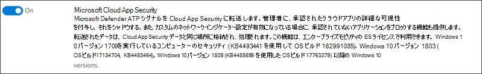

# 試用版Microsoft 365 Defender環境の柱を構成する

[!INCLUDE [Microsoft 365 Defender rebranding](../includes/microsoft-defender.md)]

**適用対象:**
- Microsoft 365 Defender

試用版ラボMicrosoft 365 Defenderを作成して展開するには、次の 3 段階のプロセスを実行します。

| [フェーズ 1: 準備](prepare-m365d-eval.md) | [フェーズ 2: 設定](setup-m365deval.md) | フェーズ 3: オンボード |  [パイロット プレイブックに戻る](m365d-pilot.md) |
|--|--|--|--|
|| |*お前はここにいる!* | |

現在、構成フェーズに入っている。

展開が成功するには、準備が重要です。 この記事では、Microsoft Defender for Endpoint の展開を準備する際に考慮する必要がある点について説明します。

## Microsoft 365 Defender柱
Microsoft 365 Defenderは 4 つの柱で構成されます。 1 つの柱は既にネットワーク組織のセキュリティに価値を提供することができますが、4 つの柱を有効にすると、Microsoft 365 Defenderが最も大きな価値を与える可能性があります。

このセクションでは、次の構成について説明します。

- Microsoft Defender for Office 365
- Microsoft Defender for Identity
- Microsoft Cloud App Security
- Microsoft Defender for Endpoint

## Microsoft Defender for Office 365

> [!NOTE]
> Defender for Office 365 を既に有効にしている場合は、この手順を省略Office 365。

これらの設定の一部を特定するのに役立つ Office 365 Advanced *Threat Protection Recommended Configuration Analyzer (ORCA)* と呼ばれる PowerShell モジュールがあります。 テナントで管理者として実行すると、get-ORCAReport はスパム対策、フィッシング対策、その他のメッセージ衛生設定の評価を生成するのに役立ちます。 このモジュールは、 からダウンロードできます https://www.powershellgallery.com/packages/ORCA/ 。

1. [コンプライアンス センター [Office 365管理&セキュリティ ポリシー](https://protection.office.com/homepage)  >  **] に移動**  >  **します**。

   

2. [ **フィッシング対策] をクリックし**、[ポリシー **名と説明を作成** して入力する] を選択します。 **[次へ]** をクリックします。

   

   > [!NOTE]
   > Microsoft Defender で高度なフィッシング対策ポリシーを編集し、Office 365。 [高度 **なフィッシングのしきい値] を** **2 - アグレッシブ に変更します**。

3. [条件 **の追加] ドロップダウン メニュー** をクリックし、ドメインを受信者ドメインとして選択します。 **[次へ]** をクリックします。

   

4. 設定を確認します。 [この **ポリシーの作成] をクリックして** 確認します。

   ![Image of_Office 365 Security & コンプライアンス センターのフィッシング対策ポリシー ページで、設定を確認し、[このポリシーの作成] ボタンをクリックします。](../../media/mtp-eval-35.png)

5. **[セーフ添付ファイル]** を選択し、[ATP を有効にする] オプション **をSharePoint、OneDrive、Microsoft Teams** します。

   ![Image of_Office 365 セキュリティ & コンプライアンス センター] ページで、ATP を有効にし、SharePoint、OneDrive、およびMicrosoft Teams](../../media/mtp-eval-36.png)

6. [+] アイコンをクリックして新しい安全な添付ファイル ポリシーを作成し、ドメインに受信者ドメインとして適用します。 **[保存]** をクリックします。

   ![Image of_Office 365 セキュリティ & コンプライアンス センター] ページで、新しい安全な添付ファイル ポリシーを作成できます](../../media/mtp-eval-37.png)

7. 次に、[リンク] セーフ **を** 選択し、鉛筆アイコンをクリックして既定のポリシーを編集します。

8. 残りのオプション **が選択** されている間は、[ユーザーが安全なリンクをクリックしても追跡しない] オプションが選択されていないことを確認します。 詳細については[セーフリンクの設定を](/microsoft-365/security/office-365-security/recommended-settings-for-eop-and-office365)参照してください。 **[保存]** をクリックします。

   ![Image of_Office 365 セキュリティ & コンプライアンス センター] ページで、[ユーザーが安全をクリックしても追跡しない] オプションが選択されていないことを示します。](../../media/mtp-eval-38.png)

9. 次に、マルウェア **対策ポリシーを** 選択し、既定を選択し、鉛筆アイコンを選択します。

10. [マルウェア **設定]** をクリックし、[はい] を **選択し**、既定の通知テキストを使用してマルウェア検出応答 **を有効にします**。 [共通の **添付ファイルの種類] フィルターを有効** にする。 **[保存]** をクリックします。

    ![Image of_Office 365 Security & コンプライアンス センター] ページで、マルウェア検出応答が既定の通知でオンになっていて、一般的な添付ファイルの種類フィルターがオンになっていることを示します。](../../media/mtp-eval-39.png)

11. コンプライアンス センター[のOffice 365監査ログ&に](https://protection.office.com/homepage)移動し、[監査  >    >  ] をオンにしてください。

    

12. Microsoft Defender for Office 365 Microsoft Defender for Endpoint に統合します。 [コンプライアンス センター [Office 365セキュリティ&管理](https://protection.office.com/homepage)エクスプローラー] に移動し、画面の右上隅にある [エンドポイント設定  >    >  Microsoft Defender **for Endpoint** 設定] を選択します。 [Defender for Endpoint 接続] ダイアログ ボックスで、[エンドポイント用 Microsoft Defender Connect **を有効にします**。

    ![Image of_Office 365 Security & コンプライアンス センター] ページで、Microsoft Defender for Endpoint 接続をオンにできます](../../media/mtp-eval-41.png)

## Id の Microsoft Defender を構成する

> [!NOTE]
> Microsoft Defender for Identity を既に有効にしている場合は、この手順を省略します。

1. [セキュリティ センター] [Microsoft 365に移動>](https://security.microsoft.com/info) Microsoft Defender for Identity の  >  **その他のリソース] を選択します**。

   ![[of_Microsoft 365 セキュリティ センター] ページで、Microsoft Defender for Identity を開くオプションがあるイメージ](../../media/mtp-eval-42.png)

2. [作成 **] を** クリックして、Microsoft Defender for Identity ウィザードを開始します。

   ![[of_Microsoft作成] ボタンをクリックする必要がある [Defender for Identity ウィザード] ページのイメージ](../../media/mtp-eval-43.png)

3. [ **ユーザー名とパスワードを指定して Active Directory フォレストに接続する] を選択します**。

   ![[Id of_Microsoftのイメージ ページ] [Defender for Identity ようこそ] ページ](../../media/mtp-eval-44.png)

4. Active Directory のオンプレミス資格情報を入力します。 これは、Active Directory への読み取りアクセス権を持つ任意のユーザー アカウントを指定できます。

   ![資格情報of_Microsoftする必要がある [Defender for Identity Directory Services] ページのイメージ](../../media/mtp-eval-45.png)

5. 次に、[ **センサーのセットアップをダウンロードして** ドメイン コントローラーにファイルを転送する] を選択します。

   ![[of_Microsoftセンサーセットアップのダウンロード] を選択できる [Defender for Identity] ページのイメージ](../../media/mtp-eval-46.png)

6. Microsoft Defender for Identity Sensor Setup を実行し、ウィザードの実行を開始します。

   ![[of_Microsoft Defender for Identity] ページで、Microsoft Defender for Identity センサー ウィザードの横をクリックする必要があります。](../../media/mtp-eval-47.png)

7. センサーの **展開の** 種類で [次へ] をクリックします。

   ![[of_Microsoftをクリックして次のページに移動する必要がある [Defender for Identity] ページのイメージ](../../media/mtp-eval-48.png)

8. ウィザードで次にアクセス キーを入力する必要がある場合は、アクセス キーをコピーします。

   

9. アクセス キーをウィザードにコピーし、[インストール] を **クリックします**。

   ![Image of_Microsoft Defender for Identity センサー ウィザード ページで、アクセス キーを指定し、[インストール] ボタンをクリックする必要があります。](../../media/mtp-eval-50.png)

10. おめでとうございます、ドメイン コントローラーで Microsoft Defender for Identity を正常に構成しました。

    ![イメージ of_Microsoft Defender for Identity センサー ウィザードのインストール完了で、[完了] ボタンをクリックする必要があります。](../../media/mtp-eval-51.png)

11. [Microsoft [Defender for Identity の設定](https://go.microsoft.com/fwlink/?linkid=2040449) ] セクションで、[**Microsoft Defender for Endpoint **] を選択し、トグルをオンにします。 **[保存]** をクリックします。

    ![[of_theの設定] ページの [Microsoft Defender for Endpoint] トグルをオンにする必要があるイメージ](../../media/mtp-eval-52.png)

## 構成Microsoft Cloud App Security

> [!NOTE]
> この手順は、既に有効にしている場合はMicrosoft Cloud App Security。

1. [セキュリティ センターの [Microsoft 365リソース]](https://security.microsoft.com/info)  >  **ページに移動**  >  **Microsoft Cloud App Security。**

   ![イメージ of_Microsoft 365 セキュリティ センター ページで、Microsoft Cloud App カードを表示し、[開く] ボタンをクリックする必要があります。](../../media/mtp-eval-53.png)

2. Microsoft Defender for Identity の統合を求める情報プロンプトで、[Id データの統合に Microsoft Defender を有効 **にする] を選択します**。

   ![[of_theを有効にする] を選択する必要がある Microsoft Defender for Identity の統合に関する情報プロンプトの画像](../../media/mtp-eval-54.png)

   > [!NOTE]
   > このプロンプトが表示されていない場合は、Microsoft Defender for Identity データ統合が既に有効になっている可能性があります。 ただし、確認できない場合は、IT 管理者に問い合わせて確認してください。

3. [ユーザー]**設定、Microsoft** **Defender for Identity 統合** トグルをオンにし、[保存] を **クリックします**。

   ![[of_the設定] ページで、Microsoft Defender for Identity 統合トグルをオンにし、[保存] をクリックします。](../../media/mtp-eval-55.png)

   > [!NOTE]
   > 新しい Microsoft Defender for Identity インスタンスの場合、この統合トグルは自動的にオンになります。 次の手順に進む前に、Microsoft Defender for Identity 統合が有効になっているか確認します。

4. [クラウド検出設定] で **、[Microsoft Defender for Endpoint integration] を選択し**、統合を有効にします。 **[保存]** をクリックします。

   ![Image of_the Microsoft Defender for Endpoint ページで、[Microsoft Defender for Endpoint の統合] の下にある [ブロックが許可されていないアプリ] チェック ボックスがオンです。 [保存] をクリックします。](../../media/mtp-eval-56.png)

5. [クラウド検出の設定] で、[**ユーザーのエンリッチメント]** を選択し、次に[クラウド検出] Azure Active Directory。

   ![[ユーザー名を使用して検出されたユーザー識別子を強化する] チェック ボックスがオンAzure Active Directory[ユーザーエンリッチメント] セクションのイメージ](../../media/mtp-eval-57.png)

## エンドポイント用の Microsoft Defender の構成

> [!NOTE]
> Microsoft Defender for Endpoint を既に有効にしている場合は、この手順を省略します。

1. [セキュリティ センターの [Microsoft 365リソース]](https://security.microsoft.com/info)  >  **ページに移動**  >  **Microsoft Defender セキュリティ センター。** [ **開く**] をクリックします。

   ![[of_Microsoft センター] ページの [Defender セキュリティ センター] Microsoft 365オプションのイメージ](../../media/mtp-eval-58.png)

2. Microsoft Defender for Endpoint ウィザードに従います。 **[次へ]** をクリックします。

   

3. 優先するデータ保存場所、データ保持ポリシー、組織のサイズ、プレビュー機能のオプトインに基づいて選択します。

   ![[of_the] ページで、データ ストレージの国、アイテム保持ポリシー、組織のサイズを選択します。 選択が完了したら、[次へ] をクリックします。](../../media/mtp-eval-60.png)

   > [!NOTE]
   > 後で、データストレージの場所など、一部の設定を変更することはできません。

   **[次へ]** をクリックします。

4. [ **続行] を** クリックすると、Microsoft Defender for Endpoint テナントがプロビジョニングされます。

   ![[of_the] ボタンをクリックしてクラウド インスタンスを作成するように求める画像のページ](../../media/mtp-eval-61.png)

5. グループ ポリシー、グループ ポリシー、または Microsoft Defender for Endpoint Microsoft エンドポイント マネージャーローカル スクリプトを実行して、エンドポイントをオンボードします。 わかりやすくするために、このガイドではローカル スクリプトを使用します。

6. [ **パッケージのダウンロード]** をクリックし、オンボーディング スクリプトをエンドポイントにコピーします。

   ![イメージ of_page[パッケージのダウンロード] ボタンをクリックしてオンボーディング スクリプトをエンドポイントまたはエンドポイントにコピーするように求めるメッセージが表示されます。](../../media/mtp-eval-62.png)

7. エンドポイントで、オンボーディング スクリプトを管理者として実行し、[Y] を選択します。

   ![オンボード of_the実行し、[Y] を選択して続行するコマンド ラインのイメージ](../../media/mtp-eval-63.png)

8. おめでとうございます、最初のエンドポイントをオンボードしました。

   

9. 検出テストを Microsoft Defender for Endpoint ウィザードからコピーして貼り付けます。

   ![Image of_the検出テスト ステップを実行し、[コピー] をクリックして、コマンド プロンプトに貼り付ける検出テスト スクリプトをコピーします。](../../media/mtp-eval-65.png)

10. PowerShell スクリプトを管理者特権のコマンド プロンプトにコピーして実行します。

    

11. ウィザードから **[Microsoft Defender for Endpoint の使用を** 開始する] を選択します。

    ![ウィザードof_the確認メッセージが表示されたら、[Microsoft Defender for Endpoint の使用を開始する] をクリックする必要があります。](../../media/mtp-eval-67.png)

12. ページにアクセス[Microsoft Defender セキュリティ センター。](https://securitycenter.windows.com/) [詳細] に **設定** し、[高度な機能]**を選択します**。

    

13. Microsoft Defender for Identity との統合 **を有効にする**。

    

14. 脅威インテリジェンスとの統合を有効Office 365 **します**。

    

15. ユーザーとの統合を **有効Microsoft Cloud App Security。**

    

16. 下にスクロールし、[ **基本設定の保存] をクリックして** 、新しい統合を確認します。

    ![[of_Saveする必要がある画像の設定] ボタン](../../media/mtp-eval-72.png)

## Microsoft 365 Defender サービスを開始する

> [!NOTE]
> 2020 年 6 月 1 日から、Microsoft は対象Microsoft 365 Defender機能を自動的に有効にします。 詳細については[、この Microsoft Tech Communityのライセンスの適格性に関する記事](https://techcommunity.microsoft.com/t5/security-privacy-and-compliance/microsoft-threat-protection-will-automatically-turn-on-for/ba-p/1345426)を参照してください。

[セキュリティ センター [Microsoft 365] に移動します](https://security.microsoft.com/homepage)。 [ファイル] に **設定** し、[次へ] を **Microsoft 365 Defender。**

![[of_Microsoft センター] ページのイメージ Microsoft 365 365 Defender 設定スクリーンショット](../../media/mtp-eval-72b.png)

より包括的なガイダンスについては、「電源を入[Microsoft 365 Defender。](m365d-enable.md)

おめでとうございます! 試用版ラボまたはパイロット環境Microsoft 365 Defender作成しました。 これで、ユーザー インターフェイスのMicrosoft 365 Defender理解できます。 次の対話型ガイドから学習できる情報Microsoft 365 Defender、毎日のセキュリティ操作タスクに各ダッシュボードを使用する方法について説明します。

[対話型のガイドをチェックしてください](https://aka.ms/MTP-Interactive-Guide)

次に、攻撃をシミュレートし、クロス製品機能がエンドポイントに対するファイルレス攻撃を検出、作成、および自動的に応答する方法を確認できます。

## 次の手順

- [テストアラートの生成](generate-test-alert.md)- テストテスト ラボで攻撃シミュレーションMicrosoft 365 Defender実行します。
