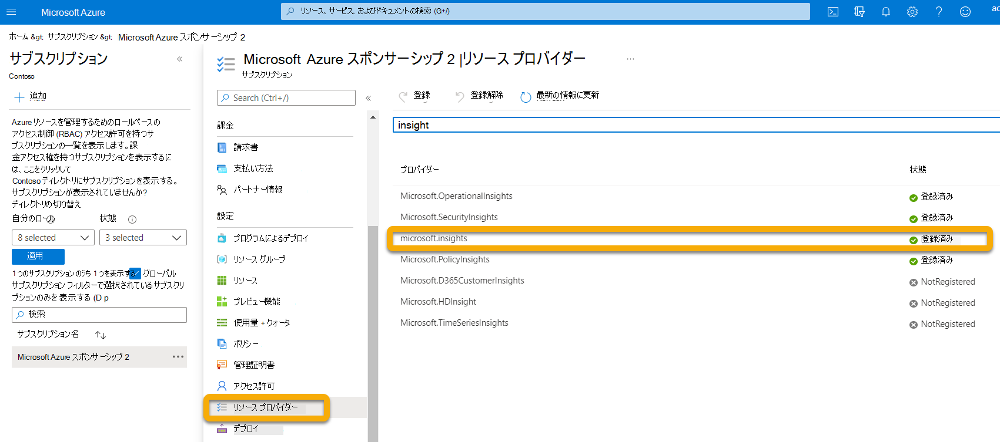
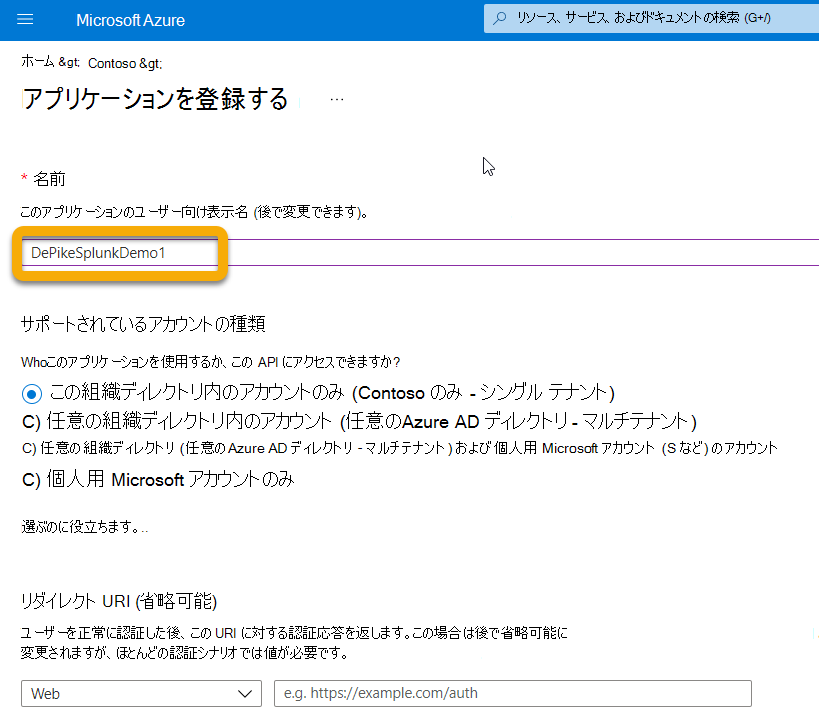
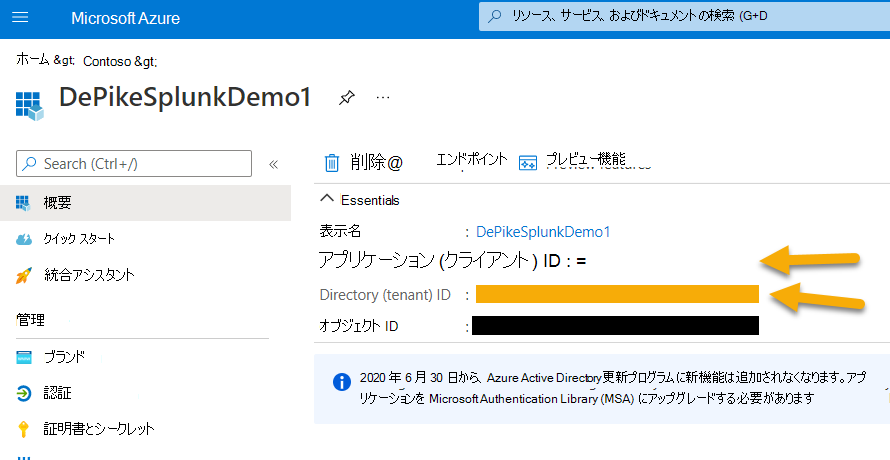
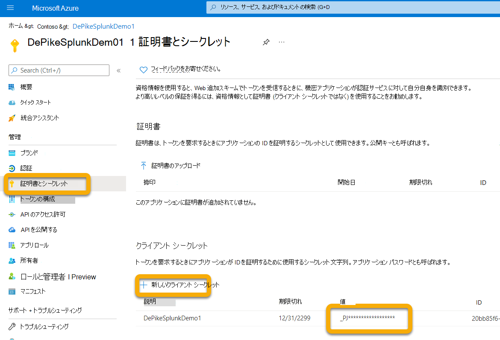
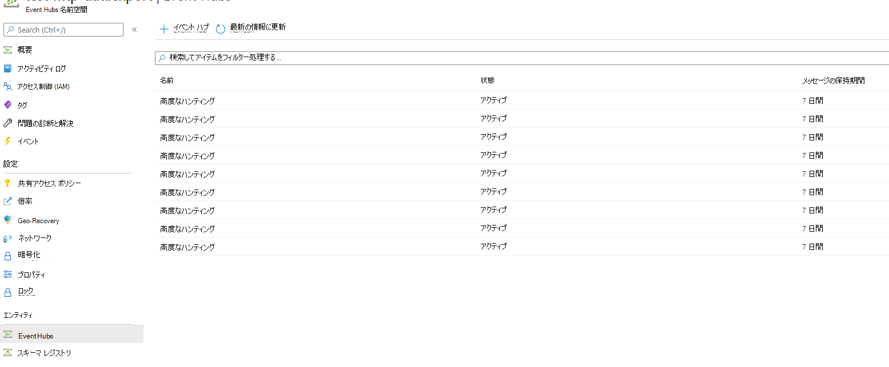
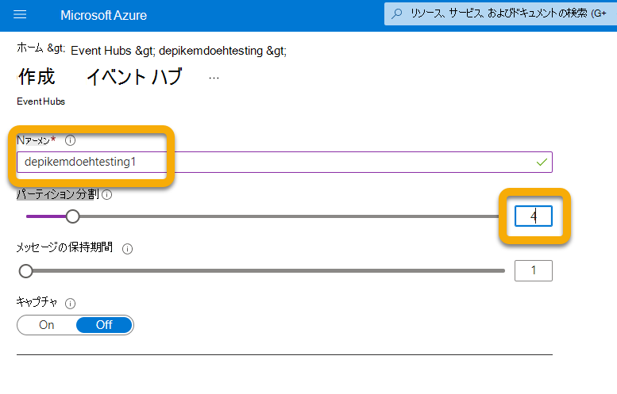
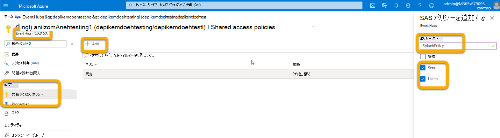
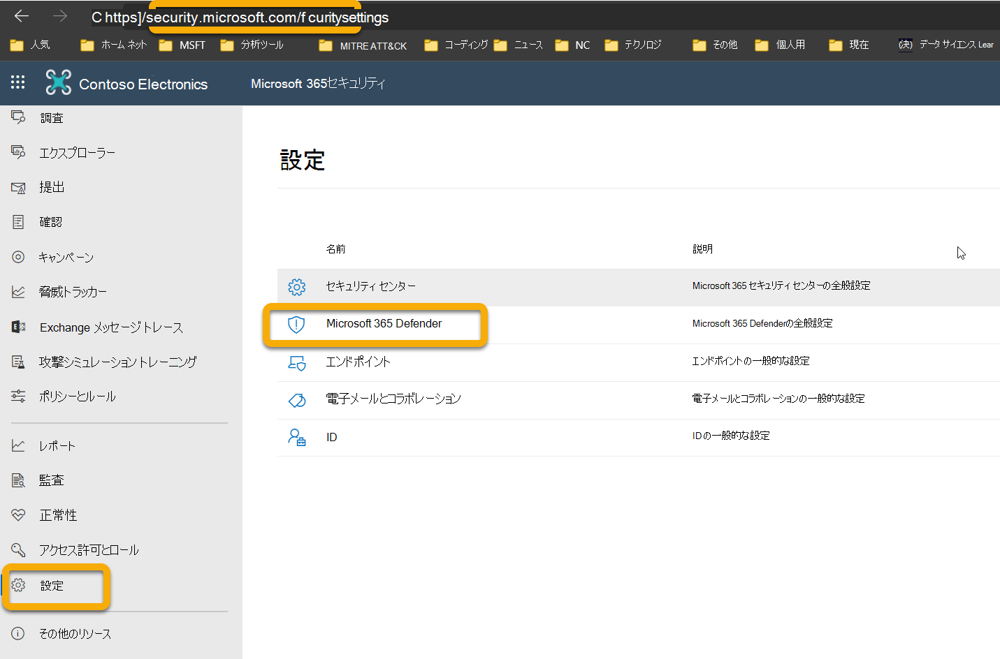
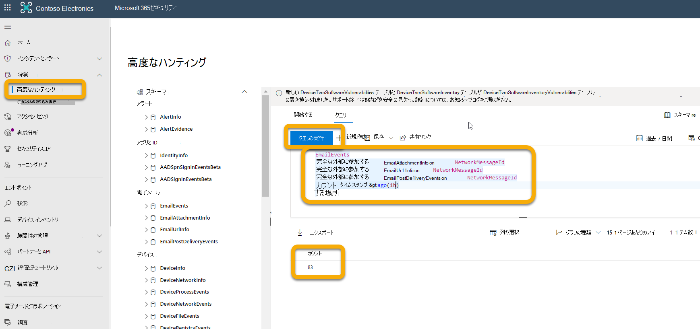

# <a name="configure-your-event-hub"></a>イベント ハブを構成する

[!INCLUDE [Microsoft 365 Defender rebranding](../../includes/microsoft-defender.md)]

**適用対象:**
- [Microsoft 365 Defender](https://go.microsoft.com/fwlink/?linkid=2118804)

イベント ハブがイベントを外部から取り込むMicrosoft 365 Defender。

## <a name="set-up-the-required-resource-provider-in-the-event-hub-subscription"></a>Event Hub サブスクリプションで必要なリソース プロバイダーを設定する

1. [Azure portal](https://portal.azure.com)にサインインします。
1. [**サブスクリプション]** を選択します 。 イベント ハブが } リソース プロバイダーに展開されるサブスクリプション \>  \> **を選択します**。
1. **Microsoft.インサイト プロバイダーが登録** されているを確認します。 それ以外の場合は、登録します。



## <a name="set-up-azure-active-directory-app-registration"></a>アプリ登録Azure Active Directory設定する

> ![メモ]管理者以外のユーザーがアプリを登録Azure Active Directoryするには、管理者ロールまたは管理者以外のユーザー (AAD) を設定する必要があります。 サービス プリンシパルに役割を割り当てるには、所有者またはユーザー アクセス管理者の役割も必要です。 詳細については、「ポータルで Azure AD アプリ & サービス プリンシパルを作成する - Microsoft Docs Microsoft ID プラットフォーム[ \| を参照してください](/azure/active-directory/develop/howto-create-service-principal-portal)。

1. [アプリの登録] [新しい登録] で新しい登録 (本質的 **にサービス プリンシパル** をAzure Active Directory \> **作成** \> **します。**

1. [名前] だけでフォームに入力します (リダイレクト URI は必要ありません)。

    

    

1. [証明書] をクリックしてシークレットを作成 **&新しい** \> **クライアント シークレットを作成します**。

    

> [!WARNING]
> **クライアント シークレットに再度** アクセスできないので、必ず保存してください。

## <a name="set-up-event-hub-namespace"></a>Event Hub 名前空間のセットアップ

1. イベント ハブ名前空間を作成します。

    [Event **Hubs \> Add]** に移動し、予想される負荷に適した価格レベル、スループット 単位、自動インフレート (標準の価格と機能が必要) を選択します。 詳細については[、「Pricing - Event Hubs Microsoft Azure \| ](https://azure.microsoft.com/pricing/details/event-hubs/)

    > [!NOTE]
    > 既存のイベント ハブを使用できますが、スループットとスケーリングは名前空間レベルで設定されます。そのため、イベント ハブは、その名前空間に配置する必要があります。

   

1. また、このイベント ハブ名前空間のリソース ID も必要です。 Azure Event Hubs 名前空間ページの [プロパティ] に移動 \> します。 [リソース ID] の下のテキストをコピーし、以下の [構成] セクションで使用Microsoft 365記録します。

    

1. イベント ハブ名前空間を作成したら、App Registration Service Principal を Reader、Azure Event Hubs Data Receiver、および投稿者として Microsoft 365 Defender にログインするユーザーを追加する必要があります (リソース グループまたはサブスクリプション レベルでも実行できます)。

    この手順は **、Event Hubs 名前空間** \> **アクセス制御 (IAM)** [役割の割り当て] \> **の下** で追加および **確認します**。

    

## <a name="set-up-event-hub"></a>イベント ハブのセットアップ

**オプション 1:**

名前空間内にイベント ハブを作成し、エクスポートするために選択したイベントの種類 (テーブル) はすべて、この 1 つのイベント **ハブに** 書き込まれます。

**オプション 2:**

すべてのイベントの種類 (テーブル) を 1 つのイベント ハブにエクスポートする代わりに、各テーブルをイベント ハブ名前空間内の別のイベント ハブ (イベントの種類ごとに 1 つのイベント ハブ) にエクスポートできます。

このオプションでは、Microsoft 365 Defenderイベント ハブを作成します。

> [!NOTE]
> イベント ハブ クラスターの一部ではないイベントハブ名前空間を使用している場合は、Azure のイベント ハブ名前空間あたり 10 イベント ハブの制限により、定義した各エクスポート 設定 でエクスポートするイベント の種類 (テーブル) を最大 10 つまで選択できます。

次に例を示します。



このオプションを選択した場合は、[電子メール テーブルを送信するMicrosoft 365 Defender[の構成] セクションにスキップ](#configure-microsoft-365-defender-to-send-email-tables)できます。

[イベント ハブ] + [イベントハブ] を選択して、名前空間内に \> **イベント ハブを作成します**。

パーティション数を使用すると、並列処理によるスループットが増えるので、予想される負荷に基づいてこの数を増やしてください。 既定のメッセージの保持とキャプチャの値は 1 とオフをお勧めします。



このイベント ハブ (名前空間ではない) では、送信、リッスンクレームを使用して共有アクセス ポリシーを構成する必要があります。 [イベント **ハブ共有** アクセス ポリシー] + [追加] をクリックし、ポリシー名 (他の場所では使用されません) を指定し、[送信とリッスン \>  \> ]**を****オンにしてください**。



## <a name="configure-microsoft-365-defender-to-send-email-tables"></a>電子メール Microsoft 365 Defender送信する方法を構成する

### <a name="set-up-microsoft-365-defender-send-email-tables-to-splunk-via-event-hub"></a>イベント ハブをMicrosoft 365 Defender Splunk に電子メール テーブルを送信する方法を設定する

1. 次のすべての役割要件Microsoft 365 Defenderを満たすアカウントを使用して、ログイン <https://security.microsoft.com> してアカウントにアクセスします。

    - エクスポートするイベント ハブの Event Hub *名前空間* リソース レベル以上の共同作成者ロール。 このアクセス許可がない場合は、設定を保存しようとするときにエクスポート エラーが発生します。

    - テナントのグローバル管理者またはセキュリティ管理者の役割は、Microsoft 365 Defender Azure に関連付けされます。

    

1. [生データ **のエクスポート] \> + [追加] をクリックします**。

    これで、上記で記録したデータを使用します。

    **名前**: この値はローカルであり、環境で動作する値である必要があります。

    **イベント をイベント ハブに転送する**: このチェック ボックスをオンにします。

    **Event-Hub リソース ID**: この値は、イベント ハブのセットアップ時に記録したイベント ハブ名前空間リソース ID です。

    **イベント ハブ名**: イベント ハブ名前空間内にイベント ハブを作成した場合は、上記で記録したイベント ハブの名前を貼り付けます。

    イベント の種類 (テーブル) Microsoft 365 Defenderイベント ハブを作成する場合は、このフィールドを空のままにします。

    **イベントの種類**: イベント ハブに転送し、カスタム アプリに転送する高度なハンティング テーブルを選択します。 アラート テーブルは Microsoft 365 Defender から、デバイス テーブルは Microsoft Defender for Endpoint (EDR) から、電子メール テーブルは Microsoft Defender から Office 365。 電子メール イベントは、すべての電子メール トランザクションを記録します。 URL (セーフ リンク)、添付ファイル (セーフ 添付ファイル)、および配信後イベント (ZAP) も記録され、[NetworkMessageId] フィールドの [電子メール イベント] に参加できます。

    

1. [送信] をクリック **してください**。

### <a name="verify-that-the-events-are-being-exported-to-the-event-hub"></a>イベントがイベント ハブにエクスポートされるのを確認する

イベントがイベント ハブに送信されるのを確認するには、基本的な高度なハンティング クエリを実行します。 [ハン **ティング** \> **の高度な検索** \> **クエリ] を** 選択し、次のクエリを入力します。

```console
EmailEvents
|joinkind=fullouterEmailAttachmentInfoonNetworkMessageId
|joinkind=fullouterEmailUrlInfoonNetworkMessageId
|joinkind=fullouterEmailPostDeliveryEventsonNetworkMessageId
|whereTimestamp\>ago(1h)
|count
```

これにより、他のすべてのテーブルに参加した過去 1 時間に受信されたメールの数が表示されます。 また、イベント ハブにエクスポートできるイベントが表示される場合も表示されます。 この数に 0 が表示されている場合、イベント ハブにデータが表示されません。



エクスポートするデータが含まれますのを確認したら、イベント ハブを表示して、メッセージが受信されるのを確認できます。 これには最大 1 時間かかる場合があります。

1. Azure で、[イベント ハブ] **[** 名前空間イベント ハブ] [イベント \>  \>  \> ハブ] の [クリック] に **移動します**。
1. [ **概要]** で下にスクロールし、[メッセージ] グラフに [受信メッセージ] が表示されます。 結果が表示されていない場合、カスタム アプリが取り込むメッセージは表示されません。

    ![メッセージを含む [概要] タブのイメージ](../../media/e88060e315d76e74269a3fc866df047f.png)
