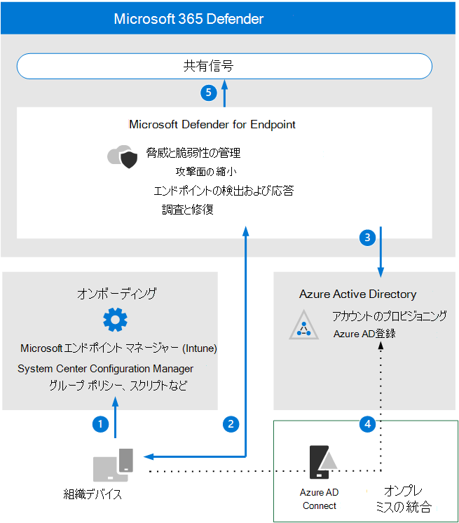

# Microsoft Defender for Endpoint アーキテクチャの要件と主な概念を確認するReview Microsoft Defender for Endpoint architecture requirements and key concepts

**適用対象: Microsoft 365 Defender****Applies to:** Microsoft 365 Defender

この記事では、Microsoft Defender for Endpoint 環境の評価をセットアップするプロセスについて説明します。This article will guide you in the process of setting up the evaluation for Microsoft Defender for Endpoint environment.

このプロセスの詳細については、「概要」の記事を [参照してください](eval-defender-endpoint-overview.md)。For more information about this process, see the [overview article](eval-defender-endpoint-overview.md).

Microsoft Defender for Endpoint を有効にする前に、アーキテクチャを理解し、要件を満たしていることを確認してください。Before enabling Microsoft Defender for Endpoint, be sure you understand the architecture and can meet the requirements.

## アーキテクチャを理解するUnderstand the architecture

次の図は、Microsoft Defender for Endpoint アーキテクチャと統合を示しています。The following diagram illustrates Microsoft Defender for Endpoint architecture and integrations. 

次の表に、図を示します。The following table describes the illustration.

コールアウトCall-out | 説明Description
:---|:---|
11 | デバイスは、サポートされている管理ツールのいずれかを介してオンボードされます。Devices are on-boarded through one of the supported management tools. 
22 | ボード上のデバイスは、Microsoft Defender for Endpoint シグナル データを提供して応答します。On-boarded devices provide and respond to Microsoft Defender for Endpoint signal data.
33 | 管理対象デバイスは、デバイスに参加または登録Azure Active Directory。Managed devices are joined and/or enrolled in Azure Active Directory.
4 4 | ドメインに参加しているWindows 10デバイスは、Azure Active Directoryを使用Azure Active Directory Connect。Domain-joined Windows 10 devices are synchronized to Azure Active Directory using Azure Active Directory Connect.
5 5 | Microsoft Defender for Endpoint のアラート、調査、および応答は、Microsoft 365 Defender。Microsoft Defender for Endpoint alerts, investigations, and responses are managed in Microsoft 365 Defender.

## 主要な概念を理解するUnderstand key concepts

次の表に、Microsoft Defender for Endpoint の評価、構成、展開を行う際に重要な重要な概念を示します。The following table identified key concepts that are important to understand when evaluating, configuring, and deploying Microsoft Defender for Endpoint: 

概念Concept | 説明Description | 詳細情報More information
:---|:---|:---|
管理ポータルAdministration Portal | Microsoft 365 Defender、高度な永続的な脅威アクティビティやデータ侵害の可能性に関するアラートの監視と対応を支援するポータルを提供します。Microsoft 365 Defender portal to monitor and assist in responding to alerts of potential advanced persistent threat activity or data breaches. | [Microsoft Defender for Endpoint ポータルの概要Microsoft Defender for Endpoint portal overview](/defender-endpoint/portal-overview)
攻撃表面の縮小Attack Surface Reduction | 組織がサイバー脅威や攻撃に対して脆弱な場所を最小限に抑えることによって、攻撃の表面を減らすのに役立ちます。Help reduce your attack surfaces by minimizing the places where your organization is vulnerable to cyberthreats and attacks. | [攻撃面の減少の概要Overview of attack surface reduction](/defender-endpoint/overview-attack-surface-reduction)
エンドポイントの検出と応答Endpoint Detection and Response | エンドポイントの検出および応答機能は、ほぼリアルタイムでアクション可能な高度な攻撃検出を提供します。Endpoint detection and response capabilities provide advanced attack detections that are near real-time and actionable. | [エンドポイントの検出および応答機能の概要Overview of endpoint detection and response capabilities](/defender-endpoint/overview-endpoint-detection-response)
動作のブロックと格納Behavioral Blocking and Containment | 動作のブロックと格納機能は、脅威の実行が開始された場合でも、その動作とプロセス ツリーに基づいて、脅威を特定して停止するのに役立ちます。Behavioral blocking and containment capabilities can help identify and stop threats, based on their behaviors and process trees even when the threat has started execution. | [動作ブロックと封じ込めBehavioral blocking and containment](/defender-endpoint/behavioral-blocking-containment)
自動調査と対応Automated Investigation and Response | 自動調査では、セキュリティ アナリストが使用するプロセスに基づいてさまざまな検査アルゴリズムを使用し、アラートを調べ、侵害を解決するために直ちに対応するように設計されています。Automated investigation uses various inspection algorithms based on processes that are used by security analysts and designed to examine alerts and take immediate action to resolve breaches. | [自動調査を使用して脅威を調査および修復するUse automated investigations to investigate and remediate threats](/defender-endpoint/automated-investigations)
高度な追求Advanced Hunting | 高度な検索はクエリベースの脅威ハンティング ツールで、最大 30 日間の生データを調査して、ネットワーク内のイベントを積極的に検査して脅威インジケーターとエンティティを特定できます。Advanced hunting is a query-based threat-hunting tool that lets you explore up to 30 days of raw data so that you can proactively inspect events in your network to locate threat indicators and entities. | [高度な検索の概要Overview of advanced hunting](/defender-endpoint/advanced-hunting-overview)
脅威の分析Threat Analytics | 脅威分析は、最も関連性の高い脅威をカバーする Microsoft の専門家のセキュリティ研究者からの一連のレポートです。Threat analytics is a set of reports from expert Microsoft security researchers covering the most relevant threats. | [新しい脅威を追跡して対応するTrack and respond to emerging threats](/defender-endpoint/threat-analytics)

Microsoft Defender for Endpoint に含まれる機能の詳細については、「What [is Microsoft Defender for Endpoint」を参照してください](/defender-endpoint/microsoft-defender-endpoint)。For more detailed information about the capabilities included with Microsoft Defender for Endpoint, see [What is Microsoft Defender for Endpoint](/defender-endpoint/microsoft-defender-endpoint).

## SIEM 統合SIEM integration

Microsoft Defender for Endpoint と Azure Sentinel を統合して、組織全体のセキュリティ イベントをより包括的に分析し、効果的かつ迅速な対応を行うプレイブックを構築できます。You can integrate Microsoft Defender for Endpoint with Azure Sentinel to more comprehensively analyze security events across your organization and build playbooks for effective and immediate response. 

Microsoft Defender for Endpoint は、他のセキュリティ情報およびイベント管理 (SIEM) ソリューションにも統合できます。Microsoft Defender for Endpoint can also be integrated into other Security Information and Event Management (SIEM) solutions. 詳細については [、「Enable SIEM integration in Microsoft Defender for Endpoint」を参照してください](/defender-endpoint/enable-siem-integration)。For more information, see [Enable SIEM integration in Microsoft Defender for Endpoint](/defender-endpoint/enable-siem-integration).

## 次の手順Next steps
[評価を有効にするEnable the evaluation](eval-defender-endpoint-enable-eval.md)

エンドポイントの Microsoft [Defender の評価の概要に戻る](eval-defender-endpoint-overview.md)Return to the overview for [Evaluate Microsoft Defender for Endpoint](eval-defender-endpoint-overview.md)

[評価とパイロット][の概要に戻Microsoft 365 Defender](eval-overview.md)Return to the overview for [Evaluate and pilot Microsoft 365 Defender](eval-overview.md)