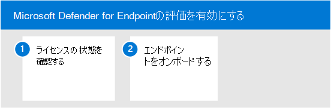

# エンドポイント評価環境で Microsoft Defender を有効にする

この記事では、実稼働デバイスを使用して Microsoft Defender for Endpoint の評価環境をセットアップする手順について説明します。 

>[!TIP]
>Microsoft Defender for Endpoint には、事前に構成されたデバイスを追加し、シミュレーションを実行してプラットフォームの機能を評価できる製品内評価ラボも付属しています。 このラボには、高度な狩猟や脅威分析などの多くの機能に関するガイダンスを含む、Microsoft Defender for Enpdoint の価値をすばやく実証するのに役立つ、簡略化されたセットアップ エクスペリエンスが付属しています。 詳細については、「評価機能 [」を参照してください](/defender-endpoint/evaluation-lab.md)。   この記事で提供されるガイダンスと評価ラボの主な違いは、評価環境が実稼働デバイスを使用するのに対し、評価ラボでは非実稼働デバイスを使用する点です。 

Microsoft Defender for Endpoint の評価を有効にするには、次の手順を使用します。

- [手順 1.ライセンスの状態を確認する](#step-1-check-license-state)
- [手順 2.オンボード エンドポイント](#step-2-onboard-endpoints-using-any-of-the-supported-management-tools)

## 手順 1. ライセンスの状態を確認する

まず、ライセンス状態を確認して、ライセンスが適切にプロビジョニングされていることを確認する必要があります。 これを行うには、管理センターまたはポータルから **Microsoft Azureします**。

1. ライセンスを表示するには、Microsoft Azureポータルに **移動** し、[Microsoft Azure][セクションに移動します](https://portal.azure.com/#blade/Microsoft_AAD_IAM/LicensesMenuBlade/Products)。

   ![[Azure ライセンス] ページのイメージ](../../media/defender/atp-licensing-azure-portal.png)

1. または、管理センターで [課金サブスクリプション]   >  **に移動します**。

    画面に、すべてのプロビジョニング済みライセンスと現在の状態が表示 **されます**。

    

## 手順 2. サポートされている管理ツールを使用したオンボード エンドポイント

ライセンス状態が適切にプロビジョニングされていることを確認した後、サービスへのデバイスのオンボーディングを開始できます。 

Microsoft Defender for Endpoint の評価を行う目的で、評価を行う 2 Windows 10デバイスを選択することをお勧めします。

サポートされている管理ツールを使用することもできますが、Intune は最適な統合を提供します。 詳細については、「Configure [Microsoft Defender for Endpoint in Microsoft Intune](/mem/intune/protect/advanced-threat-protection-configure.md#enable-microsoft-defender-for-endpoint-in-intune)

「 [展開の計画」](../defender-endpoint/deployment-strategy.md) トピックでは、Defender for Endpoint の展開に必要な一般的な手順について説明します。  

オンボーディング プロセスの概要と、使用可能なツールと方法について詳しくは、このビデオをご覧ください。

> [!VIDEO https://www.microsoft.com/videoplayer/embed/RE4bGqr]

### オンボーディング ツールのオプション

次の表に、オンボードする必要があるエンドポイントに基づいて使用可能なツールを示します。

Endpoint | ツール オプション
:---|:---
**Windows** | [ローカル スクリプト (最大 10](../defender-endpoint/configure-endpoints-script.md)台のデバイス) [、](../defender-endpoint/configure-endpoints-gp.md)グループ ポリシー 、 [Microsoft エンドポイント マネージャー/](../defender-endpoint/configure-endpoints-mdm.md)Mobile Device Manager [、](../defender-endpoint/configure-endpoints-sccm.md)Microsoft Endpoint Configuration Manager 、 [VDI スクリプト](../defender-endpoint/configure-endpoints-vdi.md)、 Azure Defender との[統合](../defender-endpoint/configure-server-endpoints.md#integration-with-azure-defender)
**macOS** | [ローカル スクリプト](../defender-endpoint/mac-install-manually.md)、 [Microsoft エンドポイント マネージャー](../defender-endpoint/mac-install-with-intune.md)、 [JAMF Pro](../defender-endpoint/mac-install-with-jamf.md)、[モバイル デバイス管理](../defender-endpoint/mac-install-with-other-mdm.md)
**Linux Server** | [ローカル スクリプト](../defender-endpoint/linux-install-manually.md)、  [Puppet](../defender-endpoint/linux-install-with-puppet.md)、  [Ansible](../defender-endpoint/linux-install-with-ansible.md)
**iOS** | [アプリベース](../defender-endpoint/ios-install.md)
**Android** | [Microsoft エンドポイント マネージャー](../defender-endpoint/android-intune.md)

## 次の手順
[Microsoft Defender for Endpoint のパイロットをセットアップする](eval-defender-endpoint-pilot.md)
 
エンドポイントの Microsoft [Defender の評価の概要に戻る](eval-defender-endpoint-overview.md)

[評価とパイロット][の概要に戻Microsoft 365 Defender](eval-overview.md)