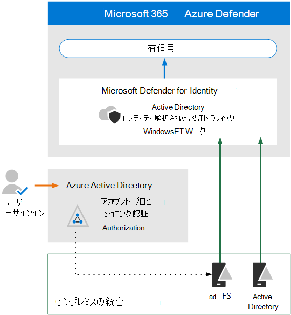

# Microsoft Defender for Identity のアーキテクチャ要件と主な概念を確認する

**適用対象:**
- Microsoft 365 Defender

この記事は、Microsoft Defender for Identity の評価環境をセットアップする手順 [1/3](eval-defender-identity-overview.md) です。 このプロセスの詳細については、「概要」の記事を [参照してください](eval-defender-identity-overview.md)。

Microsoft Defender for Identity を有効にする前に、アーキテクチャを理解し、要件を満たしていることを確認してください。

Microsoft Defender for Identity は、機械学習と行動分析を使用して、クラウド ID に関連するユーザー サインイン リスクの検出と予防に加えて、オンプレミス ネットワーク全体の攻撃を特定します。 詳細については [、「Microsoft Defender for Identity とは」を参照してください。](/defender-for-identity/what-is)

Defender for Identity は、オンプレミスの Active Directory ユーザーおよび/またはユーザーを組織 (Azure Azure Active Directory) にAD。 Azure ユーザーだけが構成する環境を保護するには、「Azure AD Id [Protection」を参照ADしてください](/azure/active-directory/identity-protection/overview-identity-protection)。

## アーキテクチャを理解する

次の図は、Defender for Identity のベースライン アーキテクチャを示しています。 

この図では、次の例を示します。
- ドメイン コントローラーにインストールADは、ログとネットワーク トラフィックを解析し、分析とレポートのために Microsoft Defender for Identity に送信します。
-  Azure AD がフェデレーション認証 (図の点線) を使用するように構成されている場合、センサーは Active Directory フェデレーション サービス (AD FS) を解析できます。 
- Microsoft Defender for Identity は、拡張検出Microsoft 365 Defender応答 (XDR) のシグナルを共有します。

Defender for Identity センサーは、次のサーバーに直接インストールできます。

- ドメイン コントローラー: センサーは、専用サーバーやポート ミラーリングの構成を必要とせずに、ドメイン コントローラーのトラフィックを直接監視します。
- AD FS: センサーはネットワーク トラフィックと認証イベントを直接監視します。

Defender for Identity のアーキテクチャの詳細については、「Microsoft Defender for Identity architecture」を参照Cloud App Securityを[参照してください](/defender-for-identity/architecture)。

## 主要な概念を理解する

次の表では、Microsoft Defender for Identity の評価、構成、展開を行う際に重要な重要な概念を示しています。

|概念  |説明 |詳細情報  |
|---------|---------|---------|
| 監視対象のアクティビティ | Defender for Identity は、組織内から生成されたシグナルを監視して、疑わしいアクティビティや悪意のあるアクティビティを検出し、潜在的な脅威の有効性を判断し、効果的にトリアージして対応できます。  |  [Microsoft Defender for Identity 監視アクティビティ](/defender-for-identity/monitored-activities)       |
| セキュリティの警告    | Defender for Identity セキュリティ アラートは、ネットワーク上のセンサーによって検出された疑わしいアクティビティと、各脅威に関係するアクターとコンピューターについて説明します。   | [Microsoft Defender for Identity Security Alerts](/defender-for-identity/suspicious-activity-guide?tabs=external)    |
| エンティティ プロファイル    | エンティティ プロファイルは、アクセス履歴と共に、ユーザー、コンピューター、デバイス、およびリソースに関する包括的な詳細な調査を提供します。   | [エンティティ プロファイルについて](/defender-for-identity/entity-profiles)  |
| 横方向の移動パス    | MDI セキュリティインサイトの重要なコンポーネントは、攻撃者が機密性の高いアカウントを使用してネットワーク全体の機密性の高いアカウントやコンピューターにアクセスする横方向の移動パスを特定する方法です。  | [Microsoft Defender for Identity Lateral Movement Path (LMP)](/defender-for-identity/use-case-lateral-movement-path)  |
| ネットワーク名の解決    |  ネットワーク名解決 (NNR) は、ネットワーク トラフィック、Windows イベント、ETW などに基づいてアクティビティをキャプチャし、この生データを各アクティビティに関係する関連するコンピューターに関連付ける MDI 機能のコンポーネントです。       | [ネットワーク名の解決とは](/defender-for-identity/nnr-policy)      |
| レポート    | Defender for Identity レポートを使用すると、システムとエンティティの状態情報を提供するレポートをスケジュールまたは即座に生成およびダウンロードできます。  システムの正常性、セキュリティアラート、および環境で検出された潜在的な横方向の移動パスに関するレポートを作成できます。   | [Microsoft Defender for Identity Reports ](/defender-for-identity/reports)       |
| 役割グループ    | Defender for Identity は、管理者、ユーザー、閲覧者を含む組織の特定のセキュリティとコンプライアンスのニーズに応じて、役割ベースのグループと委任されたアクセスを提供します。        |  [Microsoft Defender for Identity の役割グループ](/defender-for-identity/role-groups)       |
| 管理ポータル    |  セキュリティ ポータルにMicrosoft 365 Defender、Defender for Identity ポータル キャブを使用して、疑わしいアクティビティの監視と対応を行います。      | [Microsoft Defender for Identity ポータルとの連携](/defender-for-identity/workspace-portal)        |
| Microsoft Cloud App Security統合   | Microsoft Cloud App Security Microsoft Defender for Identity と統合して、クラウド アプリとオンプレミスの両方のハイブリッド環境全体でユーザー エンティティの動作分析 (UEBA) を提供する   | Id 統合用 Microsoft Defender  |
| | | |

## 前提条件の確認

Defender for Identity では、オンプレミスの ID とネットワーク コンポーネントが最小要件を満たしていることを確認するために、いくつかの前提条件となる作業が必要です。 この記事をチェックリストとして使用して、環境の準備ができていることを確認します [。Microsoft Defender for Identity の前提条件](/defender-for-identity/prerequisites)です。

## 次の手順

手順 2/3: [評価環境 Defender for Identity を有効にする](eval-defender-identity-enable-eval.md)

Id の Microsoft Defender の [評価の概要に戻る](eval-defender-identity-overview.md)

[評価とパイロット][の概要に戻Microsoft 365 Defender](eval-overview.md) 