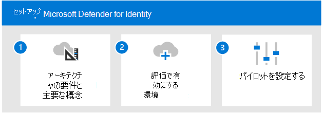

# Microsoft Defender for Identity の概要を評価する

**適用対象:**
- Microsoft 365 Defender

この記事では、Microsoft Defender for Identity を有効にしてパイロットするプロセスの概要を説明します。 このプロセスを開始する前に、評価プロセス全体を確認し、Microsoft 365 Defender評価環境をMicrosoft 365 Defender[してください](eval-create-eval-environment.md)。 
 

次の手順を使用して、Microsoft Defender for Identity を有効にしてパイロットします。

次の表に、図の手順を示します。

| |手順  |説明  |
|---------|---------|---------|
|1|[アーキテクチャ要件と主な概念を確認する](eval-defender-identity-architecture.md)    | Defender for Identity アーキテクチャを理解し、環境がアーキテクチャの前提条件を満たしていることを確認します。       |
|2|[評価環境を有効にする](eval-defender-identity-enable-eval.md)     |   評価環境をセットアップするには、手順に従います。      |
|3|[パイロットのセットアップ](eval-defender-identity-pilot.md)     |   ID 環境のベンチマーク設定について説明し、Defender for Identity のチュートリアルを試してみてください。     |
||||

