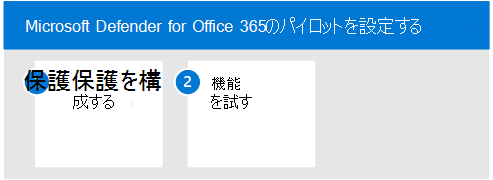

# Id の Microsoft Defender のパイロット

**適用対象:**
- Microsoft 365 Defender

この記事は、Microsoft Defender for Identity の評価環境をセットアップするプロセスの手順 [3/3](eval-defender-identity-overview.md) です。 このプロセスの詳細については、「概要」の記事を [参照してください](eval-defender-identity-overview.md)。

次の手順を使用して、Microsoft Defender のパイロットを ID 用にセットアップして構成します。 推奨事項には、パイロット グループの設定は含めかねない点に注意してください。 ベスト プラクティスは、Active Directory ドメイン サービス (AD DS) および Active Directory フェデレーション サービス (AD FS) を実行しているすべてのサーバーにセンサーをインストールする方法です。

次の表に、図の手順を示します。

- [手順 1: ID 環境のベンチマーク推奨事項を構成する](#step-1-configure-benchmark-recommendations-for-your-identity-environment)
- [手順 2: 機能を試す - さまざまな攻撃の種類を特定して修復するためのチュートリアルを参照してください ](#step-2-try-out-capabilities--walk-through-tutorials-for-identifying-and-remediating-different-attack-types)

## 手順 1. ID 環境のベンチマーク推奨事項を構成する

Microsoft は、Microsoft Cloud サービスを使用しているお客様にセキュリティ ベンチマークの推奨事項を提供します。 [Azure セキュリティ ベンチマーク](/security/benchmark/azure/overview)(ASB) は、Azure 上のワークロード、データ、およびサービスのセキュリティを向上させるのに役立つ、スクリプト的なベスト プラクティスと推奨事項を提供します。

これらのベンチマーク推奨事項には、Microsoft Defender for [Identity の Azure セキュリティ ベースラインが含まれます](/security/benchmark/azure/baselines/defender-for-identity-security-baseline)。 これらの推奨事項を実装すると、計画と実装に時間がかかる場合があります。 これらは ID 環境のセキュリティを大幅に向上しますが、Microsoft Defender for Identity の評価と実装を継続して行うのを防ぐ必要があります。 これらは、お客様の認識のためにここに提供されています。

## 手順 2. 機能を試す - さまざまな攻撃の種類を特定して修復するためのチュートリアルの詳細

Microsoft Defender for Identity のドキュメントには、さまざまな攻撃の種類を特定して修復するプロセスを説明する一連のチュートリアルが含まれています。

Defender for Identity のチュートリアルを試してみてください。
- [偵察アラート](/defender-for-identity/reconnaissance-alerts)
- [資格情報の侵害に関する通知](/defender-for-identity/compromised-credentials-alerts)
- [横方向の移動通知](/defender-for-identity/lateral-movement-alerts)
- [ドメインの支配に関するアラート](/defender-for-identity/domain-dominance-alerts)
- [Exfiltration アラート](/defender-for-identity/exfiltration-alerts)
- [ユーザーを調査する](/defender-for-identity/investigate-a-user)
- [コンピューターを調査する](/defender-for-identity/investigate-a-computer)
- [横方向の移動パスを調査する](/defender-for-identity/investigate-lateral-movement-path)
- [エンティティを調査する](/defender-for-identity/investigate-entity)

## 次の手順

[Microsoft Defender for Office 365 を評価する](eval-defender-office-365-overview.md)

[Microsoft Defender for Office 365 の評価[] の概要に戻Office 365](eval-defender-office-365-overview.md)

[評価とパイロット][の概要に戻Microsoft 365 Defender](eval-overview.md)