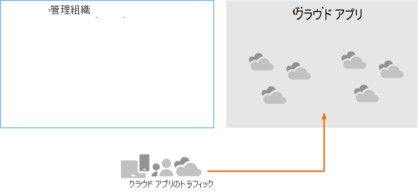
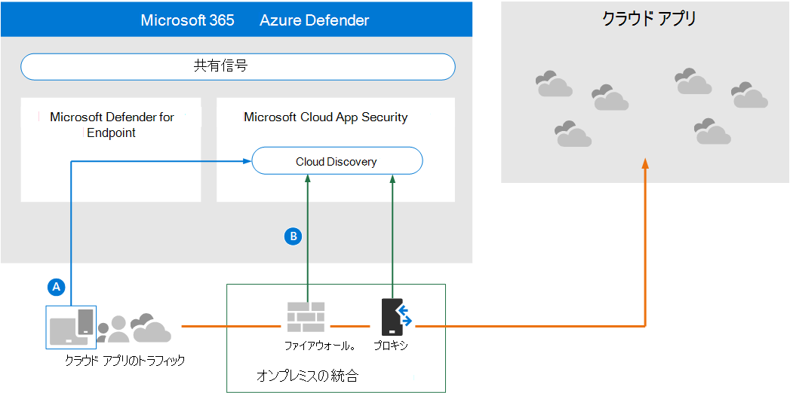
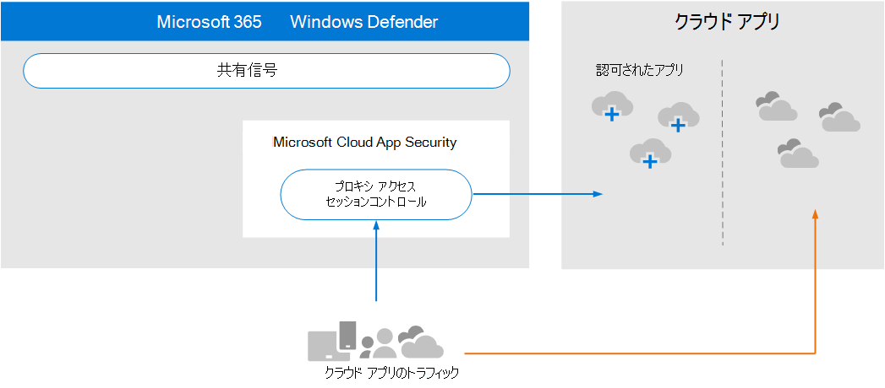

# アーキテクチャの要件と主要な概念を確認Microsoft Cloud App Security

**適用対象:**

- Microsoft 365 Defender

この記事は、ユーザーの評価環境を設定するプロセスの手順[1/3](eval-defender-mcas-overview.md)で、Microsoft Cloud App SecurityとMicrosoft 365 Defender。 このプロセスの詳細については、「概要」の記事を [参照してください](eval-defender-identity-overview.md)。

この機能をMicrosoft Cloud App Security、アーキテクチャを理解し、要件を満たしていることを確認してください。 

## アーキテクチャを理解する

Microsoft Cloud App Securityは、クラウド アクセス セキュリティ ブローカー (CASB) です。 CASB は、エンタープライズ ユーザーと使用するクラウド リソースの間で、ユーザーがどこにいても、使用しているデバイスに関係なく、リアルタイムでアクセスを仲介するゲートキーパーとして機能します。 Microsoft Cloud App Securityは、Microsoft のセキュリティ機能とネイティブに統合されます (Microsoft 365 Defender)。 

このCloud App Security、組織で使用されているクラウド アプリは、図のように管理および保護されません。

この図について:
- 組織によるクラウド アプリの使用は、管理され保護されません。 
- この使用は、管理組織内で達成される保護の外に含まれる。 

#### クラウド アプリの検出

クラウド アプリの使用を管理する最初の手順は、組織で使用されているクラウド アプリを検出する方法です。 次の図は、クラウド検出とクラウド検出の動作をCloud App Security。

この図では、ネットワーク トラフィックを監視し、組織で使用されているクラウド アプリを検出するために使用できる 2 つの方法があります。
- A. クラウド アプリの検出は、Microsoft Defender for Endpoint とネイティブに統合されます。 Defender for Endpoint は、IT 管理デバイスからアクセスされるクラウド アプリとサービスWindows 10します。 
- B. ネットワークに接続されているすべてのデバイスでのカバレッジの場合、Cloud App Securityログ コレクターがファイアウォールや他のプロキシにインストールされ、エンドポイントからデータを収集します。 このデータは、分析のためにCloud App Security送信されます。

#### クラウド アプリの管理

クラウド アプリを検出し、組織でどのように使用されるのかについて分析した後、選択したクラウド アプリの管理を開始できます。 

この図では、次の例を示します。
- 一部のアプリは使用が許可されています。 これは、アプリの管理を開始する簡単な方法です。
- アプリをアプリ コネクタに接続することで、より大きな可視性と制御を有効にできます。 アプリ コネクタは、アプリ プロバイダーの API を使用します。

#### クラウド アプリへのセッション コントロールの適用

Microsoft Cloud App Securityリバース プロキシとして機能し、認可されたクラウド アプリへのプロキシ アクセスを提供します。 これにより、Cloud App Securityセッション コントロールを適用できます。 

この図では、次の例を示します。
- 組織内のユーザーとデバイスから認可されたクラウド アプリへのアクセスは、ユーザーがCloud App Security。
- このプロキシ アクセスでは、セッション コントロールを適用できます。
- 許可されていない、または明示的に認可されていないクラウド アプリは影響を受け取る必要があります。

セッション コントロールを使用すると、組織でのクラウド アプリの使用方法にパラメーターを適用できます。 たとえば、組織が Salesforce を使用している場合は、管理対象デバイスだけが Salesforce で組織のデータにアクセスできるセッション ポリシーを構成できます。 より簡単な例として、管理されていないデバイスからのトラフィックを監視するポリシーを構成して、より厳しいポリシーを適用する前に、このトラフィックのリスクを分析できます。

#### Azure ADと条件付きアクセス アプリ制御の統合

多要素認証や他の条件付きアクセス ポリシーを適用するために、Azure AD テナントに SaaS アプリが既に追加されている可能性があります。 Microsoft Cloud App Security Azure とネイティブに統合AD。 Azure AD で条件付きアクセス アプリ制御を使用するようにポリシーを構成Cloud App Security。 これにより、これらの管理 SaaS アプリのネットワーク トラフィックが Cloud App Security プロキシとしてルーティングされ、Cloud App Securityを監視し、セッションコントロールを適用できます。 

この図では、次の例を示します。
- SaaS アプリは、Azure サービス テナントADされます。 これにより、Azure AD多要素認証を含む条件付きアクセス ポリシーを適用できます。
- SaaS アプリのトラフィックをAzure Active Directoryするポリシーが追加Cloud App Security。 ポリシーは、このポリシーを適用する SaaS アプリを指定します。 したがって、Azure AD がこれらの SaaS アプリに適用される条件付きアクセス ポリシーを適用した後、Azure AD はセッション トラフィックを Cloud App Security 経由で送信 (プロキシ) します。
- Cloud App Securityトラフィックを監視し、管理者が構成したセッション制御ポリシーを適用します。 

Azure Cloud App Security に追加されていないアプリを使用して、クラウド アプリを検出してAD。 これらのクラウド アプリを Azure AD テナントと条件付きアクセス ルールの範囲に追加することで、条件付きアクセス アプリ制御を利用できます。

#### ハッカーから組織を保護する

Cloud App Security独自の強力な保護を提供します。 ただし、Microsoft 365 Defender の他の機能と組み合Cloud App Security共有信号にデータを提供し、一緒に攻撃を停止するのに役立ちます。

この図は、概要からこの評価とパイロット ガイドMicrosoft 365 Defender繰り返す価値があります。 

Microsoft Cloud App Security は、この図の右側に焦点を当て、移動不可能、資格情報アクセス、異常なダウンロード、ファイル共有、メール転送アクティビティのような異常な動作に気付き、セキュリティ チームに報告します。 その結果、Cloud App Securityによる横方向の移動や機密データの侵入を防ぐのに役立ちます。 Microsoft 356 Defender は、すべてのコンポーネントからの信号を関連付け、完全な攻撃ストーリーを提供します。

## 主要な概念を理解する

次の表では、評価、構成、および展開を行う際に重要な重要な概念を示Microsoft Cloud App Security。

|概念  |説明 |詳細情報  |
|---------|---------|---------|
| Cloud App Securityダッシュボード | 組織に関する最も重要な情報の概要を示し、より深い調査へのリンクを提供します。        | [ダッシュボードの操作 ](/cloud-app-security/daily-activities-to-protect-your-cloud-environment)       |
| アプリの条件付きアクセスを制御する    | Id プロバイダー (IdP) と統合するリバース プロキシ アーキテクチャを使用して、Azure ADポリシーを提供し、セッション制御を選択的に適用します。        |  [条件付きアクセス アプリMicrosoft Cloud App Securityアプリを保護する](/cloud-app-security/proxy-intro-aad)       |
|  クラウド アプリ カタログ   | クラウド アプリ カタログを使用すると、80 を超えるリスク要因に基づいてランク付けおよびスコア付けされた 16,000 を超えるクラウド アプリの Microsoft カタログに対する全体像を確認できます。    |  [アプリのリスク スコアの操作](/cloud-app-security/risk-score)       |
| クラウド探索ダッシュボード    | クラウド検出は、トラフィック ログを分析し、組織内でのクラウド アプリの使用方法に関するより多くの洞察を提供し、アラートとリスク レベルを提供するように設計されています。     |  [検出されたアプリの操作   ](/cloud-app-security/discovered-apps)    |
|接続されたアプリ |Cloud App Securityは、Cloud-to-Cloud 統合、API コネクタ、条件付きアプリ アクセス制御を活用したリアルタイム アクセスおよびセッション制御を使用して、接続されたアプリに対するエンドツーエンドの保護を提供します。 |[接続されたアプリの保護](/cloud-app-security/protect-connected-apps) |
| | | |

## アーキテクチャ要件を確認する

### クラウド アプリの検出

環境で使用されているクラウド アプリを検出するには、次の 1 つまたは両方を実行できます。

- Microsoft Defender for Endpoint と統合することで、クラウド探索を迅速に実行できます。 このネイティブ統合により、ネットワークのオンとオフを切り替えて、Windows 10トラフィックのデータ収集をすぐに開始できます。
- ネットワークに接続されているすべてのデバイスがアクセスしているすべてのクラウド アプリを検出するには、ファイアウォールや他のプロキシに Cloud App Security ログ コレクターを展開します。 これにより、エンドポイントからデータが収集され、分析Cloud App Security送信されます。 Cloud App Security機能を強化するために、一部のサード パーティ製プロキシとネイティブに統合できます。

これらのオプションは、手順 [2 に含まれています。評価環境を有効にする](eval-defender-mcas-enable-eval.md)。 

### Azure AD条件付きアクセス ポリシーをクラウド アプリに適用する

条件付きアクセス アプリ制御 (条件付きアクセス ポリシーをクラウド アプリに適用する機能) には、Azure アプリとの統合がAD。 これは、アプリケーションの使用を開始するCloud App Security。 これは、パイロット フェーズ (手順 3) の間に試用[することを推奨する手順です。パイロット Microsoft Cloud App Security](eval-defender-mcas-pilot.md).

## SIEM 統合

一般的な SIEM サーバー Microsoft Cloud App Security Azure Sentinel と統合して、接続されたアプリからのアラートとアクティビティを一元的に監視できます。 

さらに、Azure Sentinel には、Azure Sentinel Microsoft Cloud App Security統合を提供するコネクタが含まれています。 これにより、クラウド アプリを可視化できるだけでなく、高度な分析を利用してサイバー脅威を特定して対処し、データの移動方法を制御できます。

- [一般的な SIEM 統合](/cloud-app-security/siem)
- [MCAS から Azure Sentinel にアラートとクラウド探索ログをストリーミングする](/azure/sentinel/connect-cloud-app-security)

### 次の手順

手順 2/3:[評価環境を有効 Microsoft Cloud App Securityにする](eval-defender-mcas-enable-eval.md)

[評価] の概要[に戻Microsoft Cloud App Security](eval-defender-mcas-overview.md)

[評価とパイロット][の概要に戻Microsoft 365 Defender](eval-overview.md)