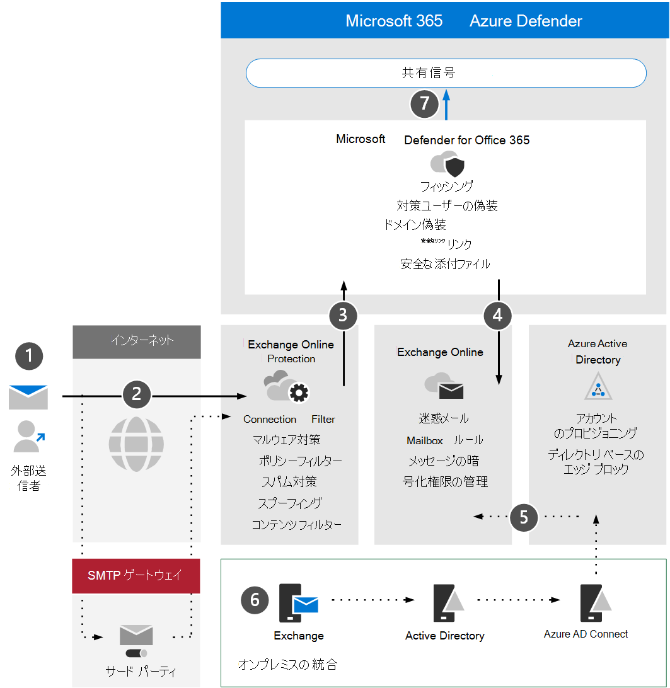

# Microsoft Defender のアーキテクチャ要件Office 365主な概念について確認するReview Microsoft Defender for Office 365 architecture requirements and key concepts

**適用対象:****Applies to:**
- Microsoft 365 DefenderMicrosoft 365 Defender

この記事は、Microsoft Defender for microsoft Defender の評価環境をセットアップするプロセスの手順[1/3](eval-defender-office-365-overview.md) Office 365。This article is [Step 1 of 3](eval-defender-office-365-overview.md) in the process of setting up the evaluation environment for Microsoft Defender for Office 365. このプロセスの詳細については、「概要」の記事を [参照してください](eval-defender-office-365-overview.md)。For more information about this process, see the [overview article](eval-defender-office-365-overview.md).

Defender for Office 365を有効にする前に、アーキテクチャを理解し、要件を満たしていることを確認してください。Before enabling Defender for Office 365, be sure you understand the architecture and can meet the requirements. この記事では、アーキテクチャ、主要な概念、および環境が満たす必要があるExchange Onlineについて説明します。This article describes the architecture, key concepts, and the prerequisites that your Exchange Online environment must meet.

## アーキテクチャを理解するUnderstand the architecture

次の図は、サードパーティの SMTP ゲートウェイまたはオンプレミスの統合を含Office Microsoft Defender for microsoft Defender のベースライン アーキテクチャを示しています。The following diagram illustrates baseline architecture for Microsoft Defender for Office which can include a third-party SMTP gateway or on-premises integration. ハイブリッド共存シナリオ (実稼働メールボックスはオンプレミスとオンラインの両方) では、より複雑な構成が必要であり、この記事や評価ガイダンスでは説明しません。Hybrid coexistence scenarios (i.e. production mailboxes are both on-premise and online) require more complex configurations and are not covered in this article or evaluation guidance.

次の表に、この図を示します。The following table describes this illustration.

|コールアウトCall-out  |説明Description  |
|---------|---------|
|11     | 外部送信者のホスト サーバーは、通常、メッセージを中継するターゲット サーバーを提供する MX レコードのパブリック DNS 参照を実行します。The host server for the external sender typically performs a public DNS lookup for an MX record which provides the target server to relay the message.  この参照は、直接Exchange Online (EXO) または EXO に対して中継するように構成された SMTP ゲートウェイのいずれかです。This referral can either be Exchange Online (EXO) directly or an SMTP gateway that has been configured to relay against EXO.  |
|22     | Exchange Online Protection接続をネゴシエートして検証し、メッセージ ヘッダーとコンテンツを検査して、必要な追加のポリシー、タグ付け、または処理を決定します。Exchange Online Protection negotiates and validates the inbound connection and inspects the message headers and content to determine what additional policies, tagging, or processing is required.  |
|33     | Exchange Online、Microsoft Defender と統合Office 365、より高度な脅威保護、軽減、修復を提供します。Exchange Online integrates with Microsoft Defender for Office 365 to offer more advanced threat protection, mitigation, and remediation. |
|4 4     | 悪意のある、ブロックされている、または検疫されていないメッセージが処理され、迷惑メール、メールボックス ルール、または他の設定に関連するユーザー設定が評価され、トリガーされる EXO で受信者に配信されます。A message that is not malicious, blocked, or quarantined is processed and delivered to the recipient in EXO where user preferences related to junk mail, mailbox rules, or other settings are evaluated and triggered. |
|5 5     | Azure AD Connect を使用すると、オンプレミスの Active Directory との統合を有効にし、メールが有効なオブジェクトとアカウントを Azure Active Directory と最終的にExchange Online。Integration with on-premises Active Directory can be enabled using Azure AD Connect to synchronize and provision mail-enabled objects and accounts to Azure Active Directory and ultimately Exchange Online. |
|6 6     | オンプレミス環境を統合する場合は、メール関連の属性、設定、および構成の管理と管理をサポートするために Exchange サーバーを使用する方が強く推奨されます。When integrating an on-premises environment, it is strongly encouraged to use an Exchange server for supported management and administration of mail related attributes, settings, and configurations |
|7 7     | Microsoft Defender for Office 365拡張検出および応答 (XDR) Microsoft 365 Defender信号を共有します。Microsoft Defender for Office 365 shares signals to Microsoft 365 Defender for extended detection and response (XDR).|

オンプレミスの統合は一般的ですが、オプションです。On-premises integration is common but optional. 環境がクラウド専用の場合は、このガイダンスも機能します。If your environment is cloud-only this guidance will also work for you.

## 主要な概念を理解するUnderstand key concepts

次の表では、MDO の評価、構成、および展開を行う際に理解するために重要な重要な概念を示しています。The following table identified key concepts that are important to understand when evaluating, configuring, and deploying MDO.

|概念Concept  |説明Description |詳細情報More information  |
|---------|---------|---------|
|Exchange Online ProtectionExchange Online Protection      |    Exchange Online Protection (EOP) は、スパムメールやマルウェアメールから組織を保護するのに役立つクラウドベースのフィルタリング サービスです。Exchange Online Protection (EOP) is the cloud-based filtering service that helps protect your organization against spam and malware emails. EOP は、ライセンスを含むすべてのMicrosoft 365ライセンスにExchange Online。EOP is included in all Microsoft 365 licenses which include Exchange Online.     |   [Exchange Online Protection の概要Exchange Online Protection overview](../office-365-security/exchange-online-protection-overview.md)      |
|マルウェア対策保護Anti-malware protection     |    EXO にメールボックスがある組織は、マルウェアから自動的に保護されます。Organizations with mailboxes in EXO are automatically protected against malware.     |  [EOP のマルウェア対策保護Anti-malware protection in EOP](../office-365-security/anti-malware-protection.md)       |
|スパム対策保護Anti-spam protection     |   EXO のメールボックスを持つ組織は、迷惑メールやスパム ポリシーから自動的に保護されます。Organizations with mailboxes in EXO are automatically protected against junk mail and spam policies.      |  [EOP でのスパム対策保護Anti-spam protection in EOP](../office-365-security/anti-spam-protection.md)       |
|フィッシング対策保護Anti-phishing protection |  MDO は、スピア フィッシング、捕鯨、ランサムウェア、その他の悪意のあるアクティビティに関連する、より高度なフィッシング対策保護を提供します。MDO offers more advanced anti-phishing  protection related to spear phishing, whaling, ransomware, and other malicious activities.   | [Microsoft Defender for Office 365 の追加のフィッシング対策保護Additional anti-phishing protection in Microsoft Defender for Office 365](../office-365-security/anti-phishing-protection.md)   |
|スプーフィング対策保護Anti-spoofing protection     |   EOP には、偽装 (偽造) 送信者から組織を保護するための機能が含まれています。EOP includes features to help protect your organization from spoofed (forged) senders.      |   [EOP のスプーフィング対策保護Anti-spoofing protection in EOP](../office-365-security/anti-spoofing-protection.md)      |
|安全な添付ファイルSafe attachments     |   セーフ添付ファイルは、配信される前に、仮想環境を使用して電子メール メッセージ内の添付ファイルをチェックして "削除" することで、保護の層を追加します。Safe Attachments provides an additional layer of protection by using a virtual environment to check and "detonate" attachments in email messages before they are delivered.      |   [セーフMicrosoft Defender の添付ファイル (Office 365Safe Attachments in Microsoft Defender for Office 365](../office-365-security/safe-attachments.md)      |
|セーフ、SharePoint、OneDrive、およびMicrosoft TeamsSafe attachments for SharePoint, OneDrive, and Microsoft Teams     |    さらに、セーフ SharePoint、OneDrive、Microsoft Teams の添付ファイルは、クラウド ストレージ リポジトリにアップロードされたファイルに対する追加の保護層を提供します。In addition, Safe Attachments for SharePoint, OneDrive, and Microsoft Teams offers an additional layer of protection for files that have been uploaded to cloud storage repositories.     |  [SharePoint、OneDrive、Microsoft Teams 用の安全な添付ファイルSafe Attachments for SharePoint, OneDrive, and Microsoft Teams](../office-365-security/mdo-for-spo-odb-and-teams.md)       |
|安全なリンクSafe Links     | セーフリンクは、受信メール メッセージ内で URL のスキャンと書き換えを提供し、配信またはクリックする前にそれらのリンクの検証を提供する機能です。Safe Links is a feature that provides URL scanning and rewriting within inbound email messages and offers verification of those links before they are delivered or clicked.        |   [セーフMicrosoft Defender for Office 365Safe Links in Microsoft Defender for Office 365](../office-365-security/safe-links.md)      |
|    |         |         |

Microsoft Defender for Officeに含まれる機能の詳細については[、「Microsoft Defender for Office 365」を参照してください](/office365/servicedescriptions/office-365-advanced-threat-protection-service-description)。For more detailed information about the capabilities included with Microsoft Defender for Office, see [Microsoft Defender for Office 365 service description](/office365/servicedescriptions/office-365-advanced-threat-protection-service-description).

## アーキテクチャ要件の確認Review architecture requirements
成功した MDO 評価または実稼働パイロットは、次の前提条件を前提とします。A successful MDO evaluation or production pilot assumes the following pre-requisites:
- すべての受信者メールボックスは現在、Exchange Online。All your recipient mailboxes are currently in Exchange Online.
- パブリック MX レコードは EOP またはサード パーティの SMTP ゲートウェイに直接解決し、受信外部メールを EOP に直接中継します。Your public MX record resolves directly to EOP or a third-party SMTP gateway that then relays inbound external email directly to EOP.
- プライマリ 電子メール ドメインは、管理者の *権限* としてExchange Online。Your primary email domain is configured as *authoritative* in Exchange Online.
- 必要に応じて、ディレクトリ ベース *エッジ* ブロック (DBEB) を正常に展開して構成しました。You successfully deployed and configured *Directory Based Edge Blocking* (DBEB) as appropriate. 詳細については、「[ディレクトリ ベースのエッジ ブロックを使用して無効な受信者に送信されたメッセージを拒否する](/exchange/mail-flow-best-practices/use-directory-based-edge-blocking)」を参照してください。For more information, see [Use Directory Based Edge Blocking to reject messages sent to invalid recipients](/exchange/mail-flow-best-practices/use-directory-based-edge-blocking).

> [!IMPORTANT]
> これらの要件が該当しない場合、またはハイブリッド共存シナリオに残っている場合、microsoft Defender for Office 365 評価では、このガイダンスで完全に説明されていない、より複雑な構成または高度な構成が必要になります。If these requirements are not applicable or you are still in a hybrid coexistence scenario, then a Microsoft Defender for Office 365 evaluation can require more complex or advanced configurations which are not fully covered in this guidance.

## SIEM 統合SIEM integration

Microsoft Defender for Office 365 Azure Sentinel を統合して、組織全体のセキュリティ イベントをより包括的に分析し、プレイブックを構築して効果的かつ迅速な対応を行います。You can integrate Microsoft Defender for Office 365 with Azure Sentinel to more comprehensively analyze security events across your organization and build playbooks for effective and immediate response. 詳細については、「Microsoft [Defender Connectアラート」を参照Office 365。](/azure/sentinel/connect-office-365-advanced-threat-protection)For more information, see [Connect alerts from Microsoft Defender for Office 365](/azure/sentinel/connect-office-365-advanced-threat-protection).

Microsoft Defender for Office 365アクティビティ管理 API を使用して、他のセキュリティ情報およびイベント管理 (SIEM) ソリューションOffice 365[統合することもできます](/office/office-365-management-api/office-365-management-activity-api-reference)。Microsoft Defender for Office 365 can also be integrated into other Security Information and Event Management (SIEM) solutions using the [Office 365 Activity Management API](/office/office-365-management-api/office-365-management-activity-api-reference).

## 次の手順Next steps

手順 2/3:[評価環境を有効](eval-defender-office-365-enable-eval.md)にする Microsoft Defender for Office 365Step 2 of 3: [Enable the evaluation environment Microsoft Defender for Office 365](eval-defender-office-365-enable-eval.md)

[Microsoft Defender for Office 365 の評価[] の概要に戻Office 365](eval-defender-office-365-overview.md)Return to the overview for [Evaluate Microsoft Defender for Office 365](eval-defender-office-365-overview.md)

[評価とパイロット][の概要に戻Microsoft 365 Defender](eval-overview.md)Return to the overview for [Evaluate and pilot Microsoft 365 Defender](eval-overview.md) 

