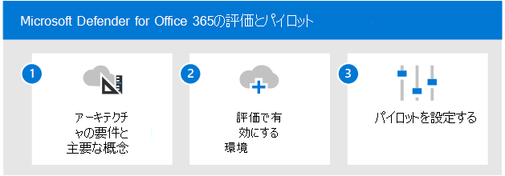

# Microsoft Defender for Office 365Enable and pilot Microsoft Defender for Office 365

**適用対象:****Applies to:**
- Microsoft 365 DefenderMicrosoft 365 Defender

この記事では、Microsoft Defender を有効にしてパイロットするプロセスの概要を説明Office 365。This article outlines the process to enable and pilot Microsoft Defender for Office 365. このプロセスを開始する前に、評価プロセス全体を確認し、Microsoft 365 Defender評価環境をMicrosoft 365 Defender[してください](eval-create-eval-environment.md)。Before starting this process, be sure you've reviewed the overall process for [evaluating Microsoft 365 Defender](eval-overview.md) and you have [created the Microsoft 365 Defender evaluation environment](eval-create-eval-environment.md). 
 

次の手順を使用して、Microsoft Defender を有効にしてパイロットOffice 365。Use the following steps to enable and pilot Microsoft Defender for Office 365.

次の表に、図の手順を示します。The following table describes the steps in the illustration.

| |手順Step  |説明Description  |
|---------|---------|---------|
|11|[アーキテクチャ要件と主な概念を確認するReview architecture requirements and key concepts](eval-defender-office-365-architecture.md)    | Defender for Officeを理解し、Exchange Online環境がアーキテクチャの前提条件を満たしていることを確認します。Understand the Defender for Office architecture and be sure your Exchange Online environment meets the architecture prerequisites.       |
|22|[評価環境を有効にするEnable the evaluation environment](eval-defender-office-365-enable-eval.md)     |   手順に従って、評価環境をセットアップします。Follow the steps to setup the evaluation environment.      |
|33|[パイロットのセットアップ Set up the pilot ](eval-defender-office-365-pilot.md)    |    パイロット グループを作成し、保護を構成し、主要な機能とダッシュボードに慣れ親しんでください。Create pilot groups, configure protection, and become familiar with key features and dashboards.     |
||||

