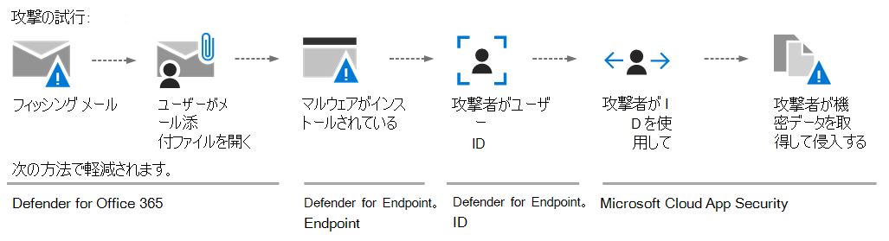
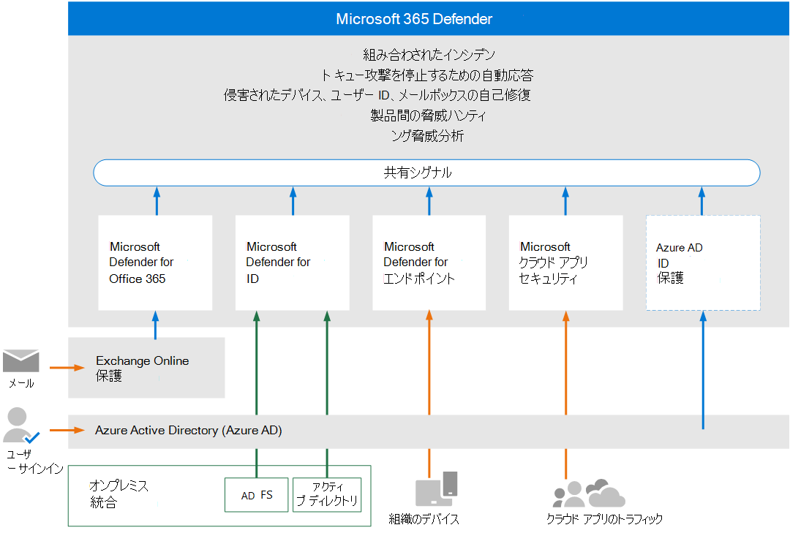
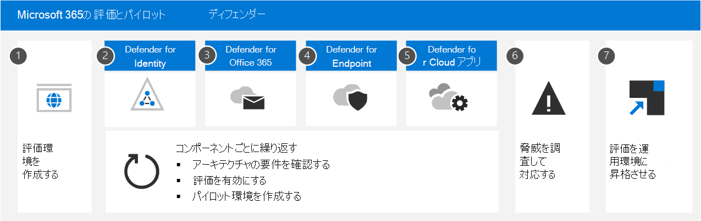

# Microsoft 365 Defender の評価とパイロット

**適用対象:**

- Microsoft 365 Defender

## この記事シリーズの動作

この一連の記事は、テスト用の XDR 環境をエンドツーエンドでセットアップするプロセス全体をステップ実行するように設計されています。そのため、Microsoft 365 Defender の機能を評価し、準備ができたら評価環境を直接実稼働環境に昇格できます。

XDR について初めから考える場合は、これらの 7 つのリンクされた記事をスキャンして、ソリューションの包括的な状況を確認できます。

- [環境を作成する方法](eval-create-eval-environment.md)
- この Microsoft XDR の各テクノロジをセットアップまたは学習する
  - [Microsoft Defender for Identity](eval-defender-identity-overview.md)
  - [Microsoft Defender for Office](eval-defender-office-365-overview.md)
  - [Microsoft Defender for Endpoint](eval-defender-endpoint-overview.md)
  - [Microsoft Defender for Cloud Apps](eval-defender-mcas-overview.md)
- [この XDR を使用して調査および応答する方法](eval-defender-investigate-respond.md)
- [試用版環境を実稼働環境に昇格する](eval-defender-promote-to-production.md)

## Microsoft 365 Defender Microsoft XDR サイバーセキュリティ ソリューション

Microsoft 365 Defender は、エンドポイント、電子メール、アプリケーション、ID など、Microsoft 365 環境全体から信号、脅威、およびアラート データを自動的に収集、関連付け、分析する  **eXtended 検出および応答 (XDR)** ソリューションです。 人工知能 (AI) とオートメーションを活用して、攻撃を自動的に停止し、影響を受ける資産を安全な状態に修復します。

XDR をセキュリティの次のステップと考え、エンドポイント (エンドポイントの検出と応答または EDR)、電子メール、アプリ、ID セキュリティを 1 か所で統一します。

## Microsoft の評価に関する推奨事項Microsoft 365 Defender

Microsoft では、既存の製品版サブスクリプションで評価を作成Office 365。 これにより、すぐに実際の分析情報を取得し、環境内の現在の脅威に対して動作する設定を調整できます。 経験を積み、プラットフォームに快適に対応した後は、各コンポーネントを一度に 1 つ、実稼働環境に昇格します。

## サイバーセキュリティ攻撃の構造

Microsoft 365 Defenderは、クラウドベースの統合された、侵害前および侵害後のエンタープライズ防御スイートです。 エンドポイント、ID *、* アプリ、電子メール、共同作業アプリケーション、およびすべてのデータ間で防止、検出、調査、応答を調整します。 

この図では、攻撃が進行中です。 フィッシングメールは、組織内の従業員の受信トレイに届き、知らず知らずのうちにメールの添付ファイルを開きます。 これによりマルウェアがインストールされ、機密データの盗難で終わる可能性のある一部のイベントが発生します。 ただし、この場合、Defender for Office 365操作中です。

この図について:

- **Exchange Online Protection** Microsoft Defender for Office 365の一部である場合、フィッシング メールを検出し、メール フロー ルールを使用して受信トレイに届かなかったことを確認できます。
- **セキュリティOffice 365** 添付ファイルの Defender は添付ファイルをテストし、有害と判断します。そのため、受信したメールはユーザーが操作できないか、ポリシーによってメールが全く届かないのでします。
- **Defender for Endpoint は** 、企業ネットワークに接続し、悪用される可能性のあるデバイスとネットワークの脆弱性を検出するデバイスを管理します。
- **Defender for Identity は** 、特権エスカレーションやリスクの高い横方向の移動など、アカウントの突然の変更に注意します。 また、セキュリティ チームによる修正のために、拘束されていない Kerberos 委任など、簡単に悪用された ID の問題について報告します。
- **Microsoft Defender for Cloud Apps** は、不可能な移動、資格情報へのアクセス、異常なダウンロード、ファイル共有、メール転送アクティビティのような異常な動作に気付き、セキュリティ チームに報告します。

### Microsoft 365 Defenderデバイス、ID、データ、およびアプリケーションを保護するコンポーネント

Microsoft 365 Defenderは、これらのセキュリティ テクノロジで構成されています。タンデムで動作します。 XDR とアプリケーションの機能を活用するために、これらのコンポーネントのすべてが必要Microsoft 365 Defender。 1 つまたは 2 つを使用して、利益と効率を実現します。

|コンポーネント|説明|参考資料|
|---|---|---|
|Microsoft Defender for Identity|Microsoft Defender for Identity は、Active Directory シグナルを使用して、組織に向けられた高度な脅威、侵害された ID、悪意のあるインサイダーアクションを特定、検出、および調査します。|[Microsoft Defender for Identity とは?](/defender-for-identity/what-is)|
|Exchange Online Protection|Exchange Online Protectionは、スパムやマルウェアから組織を保護するのに役立つネイティブのクラウドベースの SMTP リレーおよびフィルター サービスです。|[Exchange Online Protection (EOP) の概要 - Office 365](../office-365-security/overview.md)|
|Microsoft Defender for Office 365|Microsoft Defender for Office 365メール メッセージ、リンク (URL)、およびコラボレーション ツールによって組織が悪意のある脅威から保護します。|[Microsoft Defender for Office 365 - Office 365](../office-365-security/overview.md)|
|Microsoft Defender for Endpoint|Microsoft Defender for Endpoint は、デバイス保護、侵害後の検出、自動調査、推奨される対応のための統合プラットフォームです。|[Microsoft Defender for Endpoint - Windows セキュリティ](../defender-endpoint/microsoft-defender-endpoint.md)|
|Microsoft Defender for Cloud Apps|Microsoft Defender for Cloud Apps は、クラウド アプリに深い可視性、強力なデータ制御、強化された脅威保護をもたらす包括的なクロス SaaS ソリューションです。|[Defender for Cloud Apps とは](/cloud-app-security/what-is-cloud-app-security)|
|Azure AD Identity Protection|Azure AD Id Protection は、何十億回ものサインイン試行からのリスク データを評価し、このデータを使用して各サインインが環境に対するリスクを評価します。 このデータは、条件付Azure AD構成方法に応じて、アカウント アクセスを許可または防止するために、ユーザーが使用します。 Azure AD Id Protection は、ユーザーのライセンスとは別にMicrosoft 365 Defender。 このファイルは、Azure Active Directory Premium P2。|[Identity Protection とは](/azure/active-directory/identity-protection/overview-identity-protection)|
||||

## Microsoft 365 Defenderアーキテクチャ

次の図は、主要なコンポーネントと統合Microsoft 365 Defenderアーキテクチャを示しています。 *各 Defender* コンポーネントの詳細なアーキテクチャ、および使用例のシナリオについては、この一連の記事で説明します。

この図について:

- Microsoft 365 Defenderすべての Defender コンポーネントからの信号を組み合わせ、ドメイン間で拡張検出と応答 (XDR) を提供します。 これには、統合インシデント キュー、攻撃の停止に対する自動応答、自己修復 (侵害されたデバイス、ユーザー ID、メールボックスの場合)、クロス脅威検出、および脅威分析が含まれます。
- Microsoft Defender for Office 365 は、電子メール メッセージ、リンク (URL) や共同作業ツールによって生じる悪意のある脅威から組織を保護します。 これらのアクティビティに起因するシグナルを、Microsoft 365 Defender。 Exchange Online Protection (EOP) は、受信メールと添付ファイルに対するエンドツーエンドの保護を提供するために統合されています。
- Microsoft Defender for Identity は、Active Directory フェデレーション サービス (AD FS) およびオンプレミスの Active Directory ドメイン サービス (AD DS) を実行しているサーバーからの信号を収集します。 これらのシグナルを使用して、侵害されたアカウントを使用してオンプレミス環境のワークステーション間を横方向に移動するハッカーからの保護など、ハイブリッド ID 環境を保護します。
- Microsoft Defender for Endpoint は、組織で使用されているデバイスからの信号を収集し、保護します。
- Microsoft Defender for Cloud Apps は、組織によるクラウド アプリの使用からのシグナルを収集し、環境とこれらのアプリの間で流れるデータ (認可されたクラウド アプリと認可されていないクラウド アプリの両方を含む) を保護します。
- Azure AD Id Protection は、何十億回ものサインイン試行からのリスク データを評価し、このデータを使用して各サインインが環境に対するリスクを評価します。 このデータは、条件付Azure AD構成方法に応じて、アカウント アクセスを許可または防止するために、ユーザーが使用します。 Azure AD Id Protection は、ユーザーのライセンスとは別にMicrosoft 365 Defender。 このファイルは、Azure Active Directory Premium P2。

## Microsoft SIEM と SOAR は、ユーザーのデータを使用Microsoft 365 Defender

この図に含まれていないその他のオプションのアーキテクチャ コンポーネント:

- すべての Microsoft 365 Defender コンポーネントの詳細な信号データを **Microsoft Sentinel** に統合し、他のログ ソースと組み合わせて SIEM と SOAR の機能と洞察を提供できます。
- Microsoft 365 Defender を XDR として使用する **Azure SIEM である Microsoft Sentinel** の使用の詳細については、この概要記事と Microsoft Sentinel  と Microsoft 365 Defender 統合手順を [参照](/azure/sentinel/connect-microsoft-365-defender?tabs=MDE)してください。
- Microsoft Sentinel の SOAR (Microsoft Sentinel GitHub リポジトリのプレイブックへのリンクを含む) の詳細については、この記事を[参照してください](/azure/sentinel/automate-responses-with-playbooks)。

## サイバーセキュリティの評価Microsoft 365 Defenderプロセス

次に示す順序で、Microsoft 365コンポーネントを有効にしてください。

次の表に、この図を示します。

|手順|リンク|説明|
|---|---|---|
|1|[評価環境の作成](eval-create-eval-environment.md)|この手順では、ライセンスの試用版ライセンスをMicrosoft 365 Defender。|
|2|[Id の Defender を有効にする](eval-defender-identity-overview.md)|アーキテクチャ要件を確認し、評価を有効にし、さまざまな攻撃の種類を特定して修復するためのチュートリアルを説明します。|
|3|[[Defender for Office 365](eval-defender-office-365-overview.md)|アーキテクチャ要件を満たしていることを確認し、評価を有効にしてから、パイロット環境を作成します。 このコンポーネントにはExchange Online Protectionが含まれるので、実際に両方をここで *評価* します。|
|4|[エンドポイントの Defender を有効にする](eval-defender-endpoint-overview.md)|アーキテクチャ要件を満たしていることを確認し、評価を有効にしてから、パイロット環境を作成します。|
|5|[クラウド アプリの Microsoft Defender を有効にする](eval-defender-mcas-overview.md)|アーキテクチャ要件を満たしていることを確認し、評価を有効にしてから、パイロット環境を作成します。|
|6 |[脅威の調査と対応](eval-defender-investigate-respond.md)|攻撃をシミュレートし、インシデント対応機能の使用を開始します。|
|7 |[試用版を製品版に昇格する](eval-defender-promote-to-production.md)|1 Microsoft 365コンポーネントを 1 つ 1 つ生産に昇格します。|
||||

これは、通常、機能の展開と構成に必要な労力に基づいて、機能の価値を迅速に活用するように設計された一般的に推奨される順序です。 たとえば、Defender for Office 365デバイスを Defender for Endpoint に登録するよりも少ない時間で構成できます。 もちろん、ビジネス ニーズを満たすためにコンポーネントに優先順位を付け、これらを別の順序で有効にする必要があります。

## 次の手順に移動する

[評価環境の詳細および/または作成Microsoft 365 Defenderする](eval-create-eval-environment.md)
